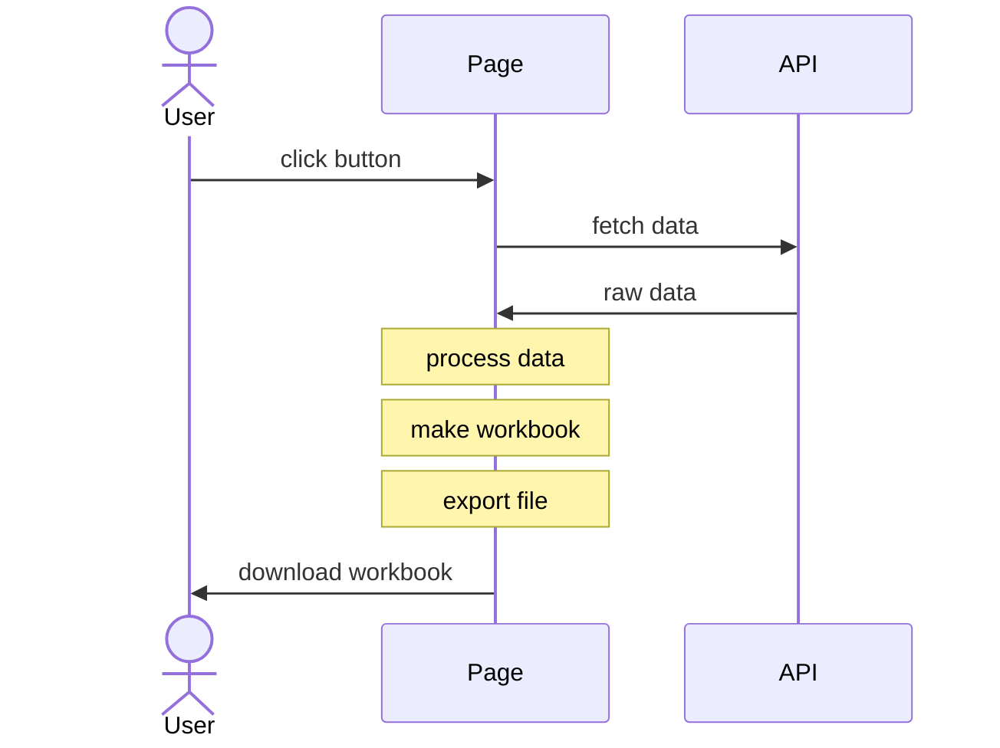

import current from '/version.js';
import Tabs from '@theme/Tabs';
import TabItem from '@theme/TabItem';
import CodeBlock from '@theme/CodeBlock';

Many modern data sources provide an API to download data in JSON format. Many
users prefer to work in spreadsheet software. SheetJS libraries help bridge the
gap by translating programmer-friendly JSON to user-friendly workbooks.

The goal of this example is to generate a XLSX workbook of US President names
and birthdates. We will download and wrangle a JSON dataset using standard
JavaScript functions. Once we have a simple list of names and birthdates, we
will use SheetJS API functions to build a workbook object and export to XLSX.

The ["Live Demo"](#live-demo) section includes a working demo in this page!
["Run the Demo Locally"](#run-the-demo-locally) shows how to run the workflow in
iOS / Android apps, desktop apps, NodeJS scripts and other environments.

The following sequence diagram shows the process:




## Acquire Data

The raw data is available in JSON form[^1]. It has been mirrored at
https://docs.sheetjs.com/executive.json

### Raw Data

Acquiring the data is straightforward with `fetch`:

```js
const url = "https://docs.sheetjs.com/executive.json";
const raw_data = await (await fetch(url)).json();
```

<details>
  <summary><b>Code Explanation</b> (click to show)</summary>

`fetch` is a low-level API for downloading data from an endpoint. It separates
the network step from the response parsing step.

**Network Step**

`fetch(url)` returns a `Promise` representing the network request. The browser
will attempt to download data from the URL. If the network request succeeded,
the `Promise` will "return" with a `Response` object.

Using modern syntax, inside an `async` function, code should `await` the fetch:

```js
const response = await fetch(url);
```

**Checking Status Code**

If the file is not available, the `fetch` will still succeed.

The status code, stored in the `status` property of the `Response` object, is a
standard HTTP status code number. Code should check the result.

Typically servers will return status `404` "File not Found" if the file is not
available. A successful request should have status `200` "OK".

**Extracting Data**

`Response#json` will try to parse the data using `JSON.parse`. Like `fetch`, the
`json` method returns a `Promise` that must be `await`-ed:

```js
const raw_data = await response.json();
```

:::note pass

The `Response` object has other useful methods. `Response#arrayBuffer` will
return the raw data as an `ArrayBuffer`, suitable for parsing workbook files.

:::

**Production Use**

Functions can test each part independently and report different errors:

```js
async function get_data_from_endpoint(url) {
  /* perform network request */
  let response;
  try {
    response = await fetch(url);
  } catch(e) {
    /* network error */
    throw new Error(`Network Error: ${e.message}`);
  }

  /* check status code */
  if(response.status == 404) {
    /* server 404 error -- file not found */
    throw new Error("File not found");
  }
  if(response.status != 200) {
    /* for most servers, a successful response will have status 200 */
    throw new Error(`Server status ${response.status}: ${response.statusText}`);
  }

  /* parse JSON */
  let data;
  try {
     data = await response.json();
  } catch(e) {
    /* parsing error */
    throw new Error(`Parsing Error: ${e.message}`);
  }

  return data;
}
```

</details>

The raw data is an Array of objects[^2]. For this discussion, the relevant data
for John Adams is shown below:

```js
{
  "name": {
    "first": "John",          // <-- first name
    "last": "Adams"           // <-- last name
  },
  "bio": {
    "birthday": "1735-10-19", // <-- birthday
  },
  "terms": [                  // <-- array of presidential terms
    { "type": "viceprez", "start": "1789-04-21", },
    { "type": "viceprez", "start": "1793-03-04", },
    { "type": "prez",     "start": "1797-03-04", } // <-- presidential term
  ]
}
```

### Filtering for Presidents

The dataset includes Aaron Burr, a Vice President who was never President!

The `terms` field of each object is an array of terms. A term is a Presidential
term if the `type` property is `"prez"`. We are interested in Presidents that
served at least one term. The following line creates an array of Presidents:

```js
const prez = raw_data.filter(row => row.terms.some(term => term.type === "prez"));
```

:::caution pass

JavaScript code can be extremely concise. The "Code Explanation" blocks explain
the code in more detail.

:::

<details>
  <summary><b>Code Explanation</b> (click to show)</summary>

**Verifying if a person was a US President**

`Array#some` takes a function and calls it on each element of an array in order.
If the function ever returns `true`, `Array#some` returns `true`. If each call
returns `false`, `Array#some` returns `false`.

The following function tests if a term is presidential:

```js
const term_is_presidential = term => term.type == "prez";
```

To test if a person was a President, that function should be tested against
every term in the `terms` array:

```js
const person_was_president = person => person.terms.some(term => term.type == "prez");
```

**Creating a list of US Presidents**

`Array#filter` takes a function and returns an array. The function is called on
each element in order. If the function returns `true`, the element is added to
the final array. If the function returns false, the element is not added.

Using the previous function, this line filters the dataset for Presidents:

```js
const prez = raw_data.filter(row => person_was_president(row));
```

Placing the `person_was_president` function in-line, the final code is:

```js
const prez = raw_data.filter(row => row.terms.some(term => term.type == "prez"));
```

</details>

### Sorting by First Term

The dataset is sorted in chronological order by the first presidential or vice
presidential term. The Vice President and President in a given term are sorted
alphabetically.

Barack Obama became President and Joseph Biden became Vice President in 2009.
Since "Biden" is alphabetically before "Obama", Biden's data appears first.

The goal is to sort the presidents in order of their initial presidential term.

The first step is adding the first presidential term start date to the dataset.
The following code looks at each president and creates a `start` property that
represents the start of the first presidential term.

```js
prez.forEach(row => row.start = row.terms.find(term => term.type === "prez").start);
```

<details>
  <summary><b>Code Explanation</b> (click to show)</summary>

**Finding the first presidential term**

`Array#find` will find the first value in an array that matches a criterion.
The first presidential term can be found with the following function:

```js
const first_prez_term = prez => prez.terms.find(term => term.type === "prez");
```

:::note pass

If no element in the array matches the criterion, `Array#find` does not return
a value. In this case, since `prez` was created by filtering for people that
served at least one presidential term, the code assumes a term exists.

:::

The start of a President's first Presidential term is therefore

```js
const first_prez_term_start = prez => first_prez_term(prez).start;
```

**Adding the first start date to one row**

The following function creates the desired `start` property:

```js
const prez_add_start = prez => prez.start = first_prez_term_start(prez);
```

**Adding the first start date to each row**

`Array#forEach` takes a function and calls it for every element in the array.
Any modifications to objects affect the objects in the original array.

The previous function can be used directly:

```js
prez.forEach(row => prez_add_start(row));
```

Working in reverse, each partial function can be inserted in place. These lines
of code are equivalent:

```js
/* start */
prez.forEach(row => prez_add_start(row));

/* put `prez_add_start` definition into the line */
prez.forEach(row => row.start = first_prez_term_start(row));

/* put `first_prez_term_start` definition into the line */
prez.forEach(row => row.start = first_prez_term(row).start);

/* put `first_prez_term` definition into the line */
prez.forEach(row => row.start = row.terms.find(term => term.type === "prez").start);
```

</details>

At this point, each row in the `prez` array has a `start` property. Since the
`start` properties are strings, the following line sorts the array:

```js
prez.sort((l,r) => l.start.localeCompare(r.start));
```

<details>
  <summary><b>Code Explanation</b> (click to show)</summary>

**Comparator Functions and Relative Ordering in JavaScript**

A comparator takes two arguments and returns a number that represents the
relative ordering. `comparator(a,b)` should return a negative number if `a`
should be placed before `b`. If `b` should be placed before `a`, the comparator
should return a positive number.

If the `start` properties were numbers, the following comparator would suffice:

```js
const comparator_numbers = (a,b) => a - b;
```

For strings, JavaScript comparison operators can work:

```js
const comparator_string_simple = (a,b) => a == b ? 0 : a < b ? -1 : 1;
```

However, that comparator does not handle diacritics. For example, `"z" < "é"`.
It is strongly recommended to use `String#localeCompare` to compare strings:

```js
const comparator_string = (a,b) => a.localeCompare(b);
```

**Comparing two Presidents**

The `start` properties of the Presidents should be compared:

```js
const compare_prez = (a,b) => (a.start).localeCompare(b.start);
```

**Sorting the Array**

`Array#sort` takes a comparator function and sorts the array in place. Using
the Presidential comparator:

```js
prez.sort((l,r) => compare_prez(l,r));
```

Placing the `compare_prez` function in the body:

```js
prez.sort((l,r) => l.start.localeCompare(r.start));
```

</details>

### Reshaping the Array

For this example, the name will be the first name combined with the last name
(`row.name.first + " " + row.name.last`) and the birthday will be available at
`row.bio.birthday`.  Using `Array#map`, the dataset can be massaged in one call:

```js
const rows = prez.map(row => ({
  name: row.name.first + " " + row.name.last,
  birthday: row.bio.birthday
}));
```

<details>
  <summary><b>Code Explanation</b> (click to show)</summary>

**Wrangling One Data Row**

The key fields for John Adams are shown below:

```js
{
  "name": {
    "first": "John",          // <-- first name
    "last": "Adams"           // <-- last name
  },
  "bio": {
    "birthday": "1735-10-19", // <-- birthday
  }
}
```

If `row` is the object, then
- `row.name.first` is the first name ("John")
- `row.name.last` is the last name ("Adams")
- `row.bio.birthday` is the birthday ("1735-10-19")

The desired object has a `name` and `birthday` field:

```js
function get_data(row) {
  var name = row.name.first + " " + row.name.last;
  var birthday = row.bio.birthday;
  return ({
    name: name,
    birthday: birthday
  });
}
```

This can be shortened by adding the fields to the object directly:

```js
function get_data(row) {
  return ({
    name: row.name.first + " " + row.name.last,
    birthday: row.bio.birthday
  });
}
```

When writing an arrow function that returns an object, parentheses are required:

```js
//  open paren required --V
  const get_data = row => ({
    name: row.name.first + " " + row.name.last,
    birthday: row.bio.birthday
  });
// ^-- close paren required
```

**Wrangling the entire dataset**

`Array#map` calls a function on each element of an array and returns a new array
with the return values of each function.

Using the previous method:

```js
const rows = prez.map(row => get_data(row));
```

The `get_data` function can be added in place:

```js
const rows = prez.map(row => ({
  name: row.name.first + " " + row.name.last,
  birthday: row.bio.birthday
}));
```

</details>

The result is an array of "simple" objects with no nesting:

```js
[
  { name: "George Washington", birthday: "1732-02-22" },
  { name: "John Adams", birthday: "1735-10-19" },
  // ... one row per President
]
```

## Create a Workbook

With the cleaned dataset, `XLSX.utils.json_to_sheet`[^3] generates a worksheet:

```js
const worksheet = XLSX.utils.json_to_sheet(rows);
```

`XLSX.utils.book_new`[^4] creates a new workbook and `XLSX.utils.book_append_sheet`[^5]
appends a worksheet to the workbook. The new worksheet will be called "Dates":

```js
const workbook = XLSX.utils.book_new();
XLSX.utils.book_append_sheet(workbook, worksheet, "Dates");
```

## Clean up Workbook

The data is in the workbook and can be exported.


There are multiple opportunities for improvement: the headers can be renamed and
the column widths can be adjusted.

:::tip pass

[SheetJS Pro](https://sheetjs.com/pro) offers additional styling options like
cell styling and frozen rows.

:::

<details>
  <summary><b>Changing Header Names</b> (click to show)</summary>

By default, `json_to_sheet` creates a worksheet with a header row. In this case,
the headers come from the JS object keys: "name" and "birthday".

The headers are in cells `A1` and `B1`.  `XLSX.utils.sheet_add_aoa`[^6] can write
text values to the existing worksheet starting at cell `A1`:

```js
XLSX.utils.sheet_add_aoa(worksheet, [["Name", "Birthday"]], { origin: "A1" });
```

</details>

<details>
  <summary><b>Changing Column Widths</b> (click to show)</summary>

Some of the names are longer than the default column width.  Column widths are
set by setting the `"!cols"` worksheet property.[^7]

The following line sets the width of column A to approximately 10 characters:

```js
worksheet["!cols"] = [ { wch: 10 } ]; // set column A width to 10 characters
```

One `Array#reduce` call over `rows` can calculate the maximum width:

```js
const max_width = rows.reduce((w, r) => Math.max(w, r.name.length), 10);
worksheet["!cols"] = [ { wch: max_width } ];
```

</details>

After cleanup, the generated workbook looks like the screenshot below:


## Export a File

`XLSX.writeFile`[^8] creates a spreadsheet file and tries to write it to the
system. In the browser, it will try to prompt the user to download the file. In
NodeJS, it will write to the local directory.

```js
XLSX.writeFile(workbook, "Presidents.xlsx", { compression: true });
```

## Live Demo

This demo runs in the web browser!  Click "Click to Generate File!" and the
browser should try to create `Presidents.xlsx`

```jsx live
function Presidents() { return ( <button onClick={async () => {
  /* fetch JSON data and parse */
  const url = "https://docs.sheetjs.com/executive.json";
  const raw_data = await (await fetch(url)).json();

  /* filter for the Presidents */
  const prez = raw_data.filter(row => row.terms.some(term => term.type === "prez"));

  /* sort by first presidential term */
  prez.forEach(row => row.start = row.terms.find(term => term.type === "prez").start);
  prez.sort((l,r) => l.start.localeCompare(r.start));

  /* flatten objects */
  const rows = prez.map(row => ({
    name: row.name.first + " " + row.name.last,
    birthday: row.bio.birthday
  }));

  /* generate worksheet and workbook */
  const worksheet = XLSX.utils.json_to_sheet(rows);
  const workbook = XLSX.utils.book_new();
  XLSX.utils.book_append_sheet(workbook, worksheet, "Dates");

  /* fix headers */
  XLSX.utils.sheet_add_aoa(worksheet, [["Name", "Birthday"]], { origin: "A1" });

  /* calculate column width */
  const max_width = rows.reduce((w, r) => Math.max(w, r.name.length), 10);
  worksheet["!cols"] = [ { wch: max_width } ];

  /* create an XLSX file and try to save to Presidents.xlsx */
  XLSX.writeFile(workbook, "Presidents.xlsx", { compression: true });
}}><b>Click to Generate file!</b></button> ); }
```

https://sheetjs.com/pres.html is a hosted version of this demo.

## Run the Demo Locally

<Tabs>
  <TabItem value="browser" label="Web Browser">

Save the following script to `SheetJSStandaloneDemo.html`:

<CodeBlock language="html" title="SheetJSStandaloneDemo.html">{`\
<body>
<script src="https://cdn.sheetjs.com/xlsx-${current}/package/dist/xlsx.full.min.js"></script>
<script>
(async() => {
  /* fetch JSON data and parse */
  const url = "https://docs.sheetjs.com/executive.json";
  const raw_data = await (await fetch(url)).json();
\n\
  /* filter for the Presidents */
  const prez = raw_data.filter(row => row.terms.some(term => term.type === "prez"));
\n\
  /* sort by first presidential term */
  prez.forEach(row => row.start = row.terms.find(term => term.type === "prez").start);
  prez.sort((l,r) => l.start.localeCompare(r.start));
\n\
  /* flatten objects */
  const rows = prez.map(row => ({
    name: row.name.first + " " + row.name.last,
    birthday: row.bio.birthday
  }));
\n\
  /* generate worksheet and workbook */
  const worksheet = XLSX.utils.json_to_sheet(rows);
  const workbook = XLSX.utils.book_new();
  XLSX.utils.book_append_sheet(workbook, worksheet, "Dates");
\n\
  /* fix headers */
  XLSX.utils.sheet_add_aoa(worksheet, [["Name", "Birthday"]], { origin: "A1" });
\n\
  /* calculate column width */
  const max_width = rows.reduce((w, r) => Math.max(w, r.name.length), 10);
  worksheet["!cols"] = [ { wch: max_width } ];
\n\
  /* create an XLSX file and try to save to Presidents.xlsx */
  XLSX.writeFile(workbook, "Presidents.xlsx", { compression: true });
})();
</script>
</body>`}
</CodeBlock>

After saving the file, run a local web server in the folder with the HTML file.
For example, if NodeJS is installed:

```bash
npx http-server .
```

The server process will display a URL (typically `http://127.0.0.1:8080`). Open
`http://127.0.0.1:8080/SheetJSStandaloneDemo.html` in your browser.

  </TabItem>
  <TabItem value="nodejs" label="Command-Line (NodeJS)">

Install the dependencies:

<Tabs groupId="ssplat">
  <TabItem value="nodejs" label="NodeJS">

<CodeBlock language="bash">{`\
npm i --save https://cdn.sheetjs.com/xlsx-${current}/xlsx-${current}.tgz`}
</CodeBlock>

  </TabItem>
  <TabItem value="bun" label="Bun">

<CodeBlock language="bash">{`\
bun install https://cdn.sheetjs.com/xlsx-${current}/xlsx-${current}.tgz`}
</CodeBlock>

  </TabItem>
</Tabs>

Save the following script to `SheetJSNodeJS.js`:

```js title="SheetJSNodeJS.js"
const XLSX = require("xlsx");

(async() => {
  /* fetch JSON data and parse */
  const url = "https://docs.sheetjs.com/executive.json";
  const raw_data = await (await fetch(url)).json();

  /* filter for the Presidents */
  const prez = raw_data.filter(row => row.terms.some(term => term.type === "prez"));

  /* sort by first presidential term */
  prez.forEach(row => row.start = row.terms.find(term => term.type === "prez").start);
  prez.sort((l,r) => l.start.localeCompare(r.start));

  /* flatten objects */
  const rows = prez.map(row => ({
    name: row.name.first + " " + row.name.last,
    birthday: row.bio.birthday
  }));

  /* generate worksheet and workbook */
  const worksheet = XLSX.utils.json_to_sheet(rows);
  const workbook = XLSX.utils.book_new();
  XLSX.utils.book_append_sheet(workbook, worksheet, "Dates");

  /* fix headers */
  XLSX.utils.sheet_add_aoa(worksheet, [["Name", "Birthday"]], { origin: "A1" });

  /* calculate column width */
  const max_width = rows.reduce((w, r) => Math.max(w, r.name.length), 10);
  worksheet["!cols"] = [ { wch: max_width } ];

  /* create an XLSX file and try to save to Presidents.xlsx */
  XLSX.writeFile(workbook, "Presidents.xlsx", { compression: true });
})();
```

After saving the script, run the script:

<Tabs groupId="ssplat">
  <TabItem value="nodejs" label="NodeJS">

```bash
node SheetJSNodeJS.js
```

  </TabItem>
  <TabItem value="bun" label="Bun">

```bash
bun run SheetJSNodeJS.js
```

  </TabItem>
</Tabs>

This script will write a new file `Presidents.xlsx` in the same folder.

:::caution pass

Native `fetch` support was added in NodeJS 18.  For older versions of NodeJS,
the script will throw an error `fetch is not defined`.  A third-party library
like `axios` presents a similar API for fetching data:

<details>
  <summary><b>Example using axios</b> (click to show)</summary>

Install the dependencies:

<CodeBlock language="bash">{`\
npm i --save https://cdn.sheetjs.com/xlsx-${current}/xlsx-${current}.tgz axios`}
</CodeBlock>

Save the following script to `SheetJSAxios.js` (differences are highlighted):

```js title="SheetJSAxios.js"
const XLSX = require("xlsx");
// highlight-next-line
const axios = require("axios");

(async() => {
  /* fetch JSON data and parse */
  const url = "https://docs.sheetjs.com/executive.json";
  // highlight-next-line
  const raw_data = (await axios(url, {responseType: "json"})).data;

  /* filter for the Presidents */
  const prez = raw_data.filter(row => row.terms.some(term => term.type === "prez"));

  /* sort by first presidential term */
  prez.forEach(row => row.start = row.terms.find(term => term.type === "prez").start);
  prez.sort((l,r) => l.start.localeCompare(r.start));

  /* flatten objects */
  const rows = prez.map(row => ({
    name: row.name.first + " " + row.name.last,
    birthday: row.bio.birthday
  }));

  /* generate worksheet and workbook */
  const worksheet = XLSX.utils.json_to_sheet(rows);
  const workbook = XLSX.utils.book_new();
  XLSX.utils.book_append_sheet(workbook, worksheet, "Dates");

  /* fix headers */
  XLSX.utils.sheet_add_aoa(worksheet, [["Name", "Birthday"]], { origin: "A1" });

  /* calculate column width */
  const max_width = rows.reduce((w, r) => Math.max(w, r.name.length), 10);
  worksheet["!cols"] = [ { wch: max_width } ];

  /* create an XLSX file and try to save to Presidents.xlsx */
  XLSX.writeFile(workbook, "Presidents.xlsx", { compression: true });
})();
```

After saving the script, run the script:

```bash
node SheetJSAxios.js
```

This script will write a new file `Presidents.xlsx` in the same folder.

</details>

:::

<details>
  <summary><b>Other Server-Side Platforms</b> (click to show)</summary>

<Tabs>
  <TabItem value="deno" label="Deno">

Save the following script to `SheetJSDeno.ts`:

<CodeBlock language="ts" title="SheetJSDeno.ts">{`\
// @deno-types="https://cdn.sheetjs.com/xlsx-${current}/package/types/index.d.ts"
import * as XLSX from 'https://cdn.sheetjs.com/xlsx-${current}/package/xlsx.mjs';
\n\
/* fetch JSON data and parse */
const url = "https://docs.sheetjs.com/executive.json";
const raw_data = await (await fetch(url)).json();
\n\
/* filter for the Presidents */
const prez = raw_data.filter((row: any) => row.terms.some((term: any) => term.type === "prez"));
\n\
/* sort by first presidential term */
prez.forEach(row => row.start = row.terms.find(term => term.type === "prez").start);
prez.sort((l,r) => l.start.localeCompare(r.start));
\n\
/* flatten objects */
const rows = prez.map((row: any) => ({
  name: row.name.first + " " + row.name.last,
  birthday: row.bio.birthday
}));
\n\
/* generate worksheet and workbook */
const worksheet = XLSX.utils.json_to_sheet(rows);
const workbook = XLSX.utils.book_new();
XLSX.utils.book_append_sheet(workbook, worksheet, "Dates");
\n\
/* fix headers */
XLSX.utils.sheet_add_aoa(worksheet, [["Name", "Birthday"]], { origin: "A1" });
\n\
/* calculate column width */
const max_width = rows.reduce((w: number, r: any) => Math.max(w, r.name.length), 10);
worksheet["!cols"] = [ { wch: max_width } ];
\n\
/* create an XLSX file and try to save to Presidents.xlsx */
XLSX.writeFile(workbook, "Presidents.xlsx", { compression: true });`}
</CodeBlock>

After saving the script, run the script:

```bash
deno run -A SheetJSDeno.ts
```

This script will write a new file `Presidents.xlsx` in the same folder.

  </TabItem>
</Tabs>

</details>

  </TabItem>

  <TabItem value="desktop" label="Desktop App">

Save the following script to `SheetJSNW.html`:

<CodeBlock language="html" title="SheetJSNW.html">{`\
<body>
<script src="https://cdn.sheetjs.com/xlsx-${current}/package/dist/xlsx.full.min.js"></script>
<script>
(async() => {
  /* fetch JSON data and parse */
  const url = "https://docs.sheetjs.com/executive.json";
  const raw_data = await (await fetch(url)).json();
\n\
  /* filter for the Presidents */
  const prez = raw_data.filter(row => row.terms.some(term => term.type === "prez"));
\n\
  /* sort by first presidential term */
  prez.forEach(row => row.start = row.terms.find(term => term.type === "prez").start);
  prez.sort((l,r) => l.start.localeCompare(r.start));
\n\
  /* flatten objects */
  const rows = prez.map(row => ({
    name: row.name.first + " " + row.name.last,
    birthday: row.bio.birthday
  }));
\n\
  /* generate worksheet and workbook */
  const worksheet = XLSX.utils.json_to_sheet(rows);
  const workbook = XLSX.utils.book_new();
  XLSX.utils.book_append_sheet(workbook, worksheet, "Dates");
\n\
  /* fix headers */
  XLSX.utils.sheet_add_aoa(worksheet, [["Name", "Birthday"]], { origin: "A1" });
\n\
  /* calculate column width */
  const max_width = rows.reduce((w, r) => Math.max(w, r.name.length), 10);
  worksheet["!cols"] = [ { wch: max_width } ];
\n\
  /* create an XLSX file and try to save to Presidents.xlsx */
  XLSX.writeFile(workbook, "Presidents.xlsx", { compression: true });
})();
</script>
</body>`}
</CodeBlock>

Save the following to `package.json`:

<CodeBlock language="json" title="package.json">{`\
{
  "name": "sheetjs-nwjs",
  "author": "sheetjs",
  "version": "0.0.0",
  "main": "SheetJSNW.html",
  "dependencies": {
    "nw": "0.77.0",
    "xlsx": "https://cdn.sheetjs.com/xlsx-${current}/xlsx-${current}.tgz"
  }
}`}
</CodeBlock>

Install dependencies and run:

```bash
npm i
npx nw .
```

The app will show a save dialog. After selecting a path, it will write the file.

  </TabItem>
  <TabItem value="mobile" label="Mobile App">

:::note Initial Setup

Follow the [Environment Setup](https://reactnative.dev/docs/environment-setup)
of the React Native documentation before testing the demo.

:::

:::caution pass

For Android testing, React Native requires Java 11. It will not work with
current Java releases.

:::

:::danger pass

There are a number of potential pitfalls.

The [React Native demo](/docs/demos/mobile/reactnative) lists some issues
encountered in previous test runs and potential resolutions.

**Please reach out to [the SheetJS chat](https://sheetjs.com/chat) if there are
any issues not mentioned in the demo page.**

:::

Create a new project by running the following commands in the Terminal:

<CodeBlock language="bash">{`\
npx -y react-native@0.73.6 init SheetJSPres --version="0.73.6"
cd SheetJSPres
\n\
npm i -S https://cdn.sheetjs.com/xlsx-${current}/xlsx-${current}.tgz react-native-blob-util@0.19.8`}
</CodeBlock>

Save the following to `App.tsx` in the project:

```js title="App.tsx"
import React from 'react';
import { Alert, Button, SafeAreaView, Text, View } from 'react-native';
import { utils, version, write } from 'xlsx';
import RNBU from 'react-native-blob-util';

const make_workbook = async() => {
  /* fetch JSON data and parse */
  const url = "https://docs.sheetjs.com/executive.json";
  const raw_data = await (await fetch(url)).json();

  /* filter for the Presidents */
  const prez = raw_data.filter(row => row.terms.some(term => term.type === "prez"));

  /* sort by first presidential term */
  prez.forEach(row => row.start = row.terms.find(term => term.type === "prez").start);
  prez.sort((l,r) => l.start.localeCompare(r.start));

  /* flatten objects */
  const rows = prez.map(row => ({
    name: row.name.first + " " + row.name.last,
    birthday: row.bio.birthday
  }));

  /* generate worksheet and workbook */
  const worksheet = utils.json_to_sheet(rows);
  const workbook = utils.book_new();
  utils.book_append_sheet(workbook, worksheet, "Dates");

  /* fix headers */
  utils.sheet_add_aoa(worksheet, [["Name", "Birthday"]], { origin: "A1" });

  /* calculate column width */
  const max_width = rows.reduce((w, r) => Math.max(w, r.name.length), 10);
  worksheet["!cols"] = [ { wch: max_width } ];

  /* React Native does not support `writeFile`. This is a low-level write ! */

  /* write workbook to buffer */
  const buf = write(workbook, {type:'buffer', bookType:"xlsx"});

  /* write buffer to file */
  const filename = RNBU.fs.dirs.DocumentDir + "/Presidents.xlsx";
  await RNBU.fs.writeFile(filename, Array.from(buf), 'ascii');

  /* Copy to downloads directory (android) */
  try { await RNBU.MediaCollection.copyToMediaStore({
    parentFolder: "",
    mimeType: "application/vnd.openxmlformats-officedocument.spreadsheetml.sheet",
    name: "Presidents.xlsx"
  }, "Download", filename); } catch(e) {}

  return filename;
};

const App = () => ( <SafeAreaView><View style={{ marginTop: 32, padding: 24 }}>
  <Text style={{ fontSize: 24, fontWeight: 'bold' }}>SheetJS {version} Export Demo</Text>
  <Button title='Press to Export' onPress={async() => {
    try {
      const filename = await make_workbook();
      Alert.alert("Export Finished", `Exported to ${filename}`);
    } catch(err) {
      Alert.alert("Export Error", `Error ${err.message||err}`);
    }
  }}/>
</View></SafeAreaView> );

export default App;
```

<Tabs>
  <TabItem value="asim" label="Android">

:::note pass

The Android demo has been tested in Windows, Arch Linux (Steam Deck) and macOS.

:::

Test the app in the Android simulator:

```bash
npx react-native start
```

Once Metro is ready, it will display the commands:

```
r - reload the app
d - open developer menu
i - run on iOS
a - run on Android
```

Press `a` to run on Android. The app will launch in the emulator.

After clicking "Press to Export", the app will show an alert with the location
to the generated file (`/data/user/0/com.sheetjspres/files/Presidents.xlsx`)

In the Android simulator, pulling the file requires additional steps:

```bash
adb root
adb pull /data/user/0/com.sheetjspres/files/Presidents.xlsx Presidents.xlsx
```

This command generates `Presidents.xlsx` which can be opened.

:::info Device Testing

["Running on Device"](https://reactnative.dev/docs/running-on-device) in the
React Native docs covers device configuration. To summarize:

1) Enable USB debugging on the Android device.

2) Connect the Android device to the computer with a USB cable.

3) Close any running Android and iOS emulators.

4) Run `npx react-native run-android`

`Presidents.xlsx` will be copied to the `Downloads` folder. The file is visible
in the Files app and can be opened with the Google Sheets app.

:::

:::caution pass

**This demo worked on multiple local Android devices in local tests.** It is not
guaranteed to run on every Android device or Android version.

The [React Native demo](/docs/demos/mobile/reactnative) lists some issues
encountered in previous test runs and potential resolutions.

Please reach out to [the SheetJS chat](https://sheetjs.com/chat) if there are
any issues not mentioned in the demo page.

:::

  </TabItem>
  <TabItem value="ios" label="iOS">

:::caution pass

This demo runs in iOS and requires a Macintosh computer with Xcode installed.

:::

The native component must be linked:

```bash
cd ios; pod install; cd ..
```

Test the app in the iOS simulator:

```bash
npm run ios
```

After clicking "Press to Export", the app will show an alert with the location
to the generated file.

:::info Device Testing

["Running on Device"](https://reactnative.dev/docs/running-on-device) in the
React Native docs covers device configuration.

The `UIFileSharingEnabled` and `LSSupportsOpeningDocumentsInPlace` entitlements
are required for iOS to show the generated files in the "Files" app.

The highlighted lines should be added to the iOS project `Info.plist` just
before the last `</dict>` tag:

```xml title="ios/SheetJSPres/Info.plist"
  <key>UIViewControllerBasedStatusBarAppearance</key>
  <false/>
<!-- highlight-start -->
  <key>UIFileSharingEnabled</key>
  <true/>
  <key>LSSupportsOpeningDocumentsInPlace</key>
  <true/>
<!-- highlight-end -->
</dict>
</plist>
```

After adding the settings and rebuilding the app, the file will be visible in
the "Files" app.  Under "On My iPhone", there will be a folder `SheetJSPres`.
Within the folder there will be a file named `Presidents`. Touch the file to
see a preview of the data.  The Numbers app can open the file.

:::

  </TabItem>
</Tabs>

  </TabItem>
</Tabs>

[^1]: https://theunitedstates.io/congress-legislators/executive.json is the
      original location of the example dataset. The contributors to the dataset
      dedicated the content to the public domain.
[^2]: See ["The Executive Branch"](https://github.com/unitedstates/congress-legislators#the-executive-branch)
      in the dataset documentation.
[^3]: See [`json_to_sheet` in "Utilities"](/docs/api/utilities/array#array-of-objects-input)
[^4]: See [`book_new` in "Utilities"](/docs/api/utilities/wb)
[^5]: See [`book_append_sheet` in "Utilities"](/docs/api/utilities/wb)
[^6]: See [`sheet_add_aoa` in "Utilities"](/docs/api/utilities/array#array-of-arrays-input)
[^7]: See ["Column Properties"](/docs/csf/features/colprops)
[^8]: See [`writeFile` in "Writing Files"](/docs/api/write-options)