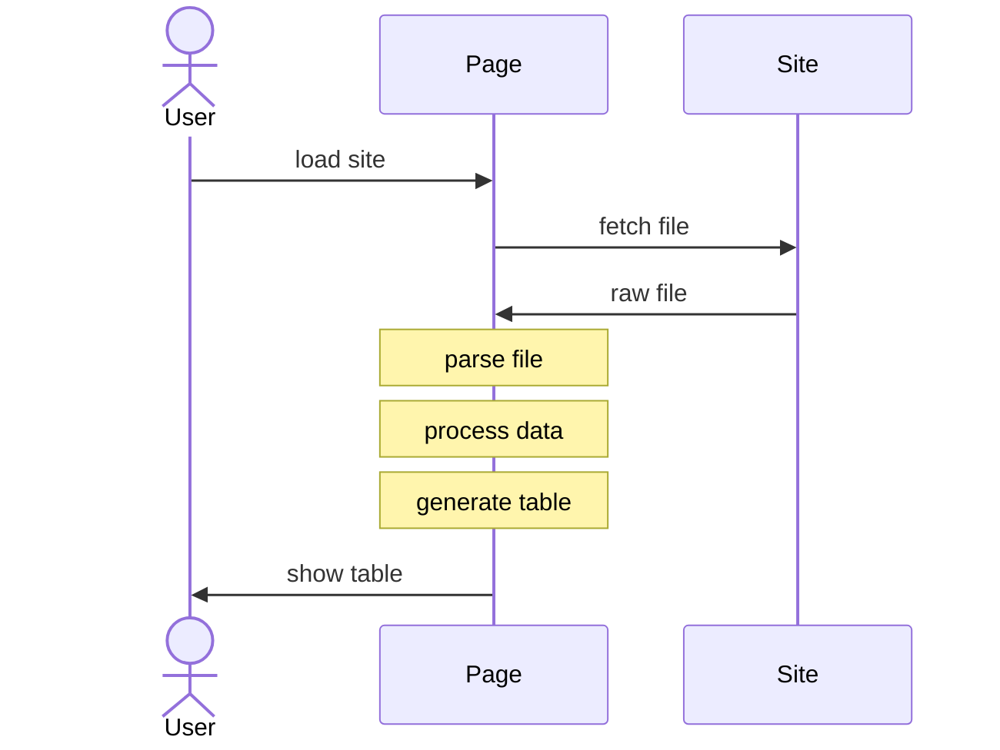

import current from '/version.js';
import Tabs from '@theme/Tabs';
import TabItem from '@theme/TabItem';
import CodeBlock from '@theme/CodeBlock';

Many government agencies distribute official data and statistics in workbooks.
SheetJS libraries help translate these files to useful information.

The goal of this example is to process Federal Student Aid Portfolio data from
a XLS worksheet. We will download and parse a workbook from the US Department of
Education. Once the raw data is parsed, we will extract the total outstanding
dollar amount and display the data in a table.

The ["Live Demo"](#live-demo) section includes a working demo in this page!
["Run the Demo Locally"](#run-the-demo-locally) shows how to run the workflow in
iOS / Android apps, desktop apps, NodeJS scripts and other environments.

The following sequence diagram shows the process:



## Download File

The raw data is available in a XLS workbook[^1]. It has been mirrored at
https://docs.sheetjs.com/PortfolioSummary.xls

:::info pass

This official dataset is distributed in XLS workbooks.

SheetJS supports a number of legacy and modern formats, ensuring that historical
data is not lost in the sands of time.

:::

Downloading the file is straightforward with `fetch`:

```js
const url = "https://docs.sheetjs.com/PortfolioSummary.xls";
const file = await (await fetch(url)).arrayBuffer();
```

<details>
  <summary><b>Code Explanation</b> (click to show)</summary>

`fetch` is a low-level API for downloading data from an endpoint. It separates
the network step from the response parsing step.

**Network Step**

`fetch(url)` returns a `Promise` representing the network request. The browser
will attempt to download data from the URL. If the network request succeeded,
the `Promise` will "return" with a `Response` object.

Using modern syntax, inside an `async` function, code should `await` the fetch:

```js
const response = await fetch(url);
```

**Checking Status Code**

If the file is not available, the `fetch` will still succeed.

The status code, stored in the `status` property of the `Response` object, is a
standard HTTP status code number. Code should check the result.

Typically servers will return status `404` "File not Found" if the file is not
available. A successful request should have status `200` "OK".

**Extracting Data**

`Response#arrayBuffer` will pull the raw bytes into an `ArrayBuffer`, an object
which can represent the file data. Like `fetch`, the `arrayBuffer` method
returns a `Promise` that must be `await`-ed:

```js
const file = await response.arrayBuffer();
```

:::note pass

The `Response` object has other useful methods. `Response#json` will parse the
data with `JSON.parse`, suitable for data from an API endpoint.

:::

**Production Use**

Functions can test each part independently and report different errors:

```js
async function get_file_from_endpoint(url) {
  /* perform network request */
  let response;
  try {
    response = await fetch(url);
  } catch(e) {
    /* network error */
    throw new Error(`Network Error: ${e.message}`);
  }

  /* check status code */
  if(response.status == 404) {
    /* server 404 error -- file not found */
    throw new Error("File not found");
  }
  if(response.status != 200) {
    /* for most servers, a successful response will have status 200 */
    throw new Error(`Server status ${response.status}: ${response.statusText}`);
  }

  /* get data */
  let ab;
  try {
     ab = await response.arrayBuffer();
  } catch(e) {
    /* data error */
    throw new Error(`Data Error: ${e.message}`);
  }

  return ab;
}
```

</details>

The file data is stored in an `ArrayBuffer`.

## Parse File

With the file data in hand, `XLSX.read`[^2] parses the workbook:

```js
const workbook = XLSX.read(file);
```

The `workbook` object follows the "Common Spreadsheet Format"[^3], an in-memory
format for representing workbooks, worksheets, cells, and spreadsheet features.


## Explore Dataset

:::caution pass

Spreadsheets in the wild use many different inconsistent conventions.

To determine how to process the data, it is best to inspect the file first.

:::

### List Sheet Names

As explained in the "Workbook Object"[^4] section, the `SheetNames` property is
a ordered list of the sheet names in the workbook.

The following live code block displays an ordered list of the sheet names:

```jsx live
function SheetJSheetNames() {
  const [names, setNames] = React.useState([]);
  React.useEffect(() => { (async() =>{
    /* parse workbook */
    const url = "https://docs.sheetjs.com/PortfolioSummary.xls";
    const file = await (await fetch(url)).arrayBuffer();
    const workbook = XLSX.read(file);
    /* display sheet names */
    setNames(workbook.SheetNames);
  })(); }, []);
  return ( <>
    <b>Sheet Names</b><br/>
    <ol start={0}>{names.map(n => (<li>{n}</li>))}</ol>
  </> )
}
```

### Inspect Worksheet Data

The `Sheets` property of the workbook object[^5] is an object whose keys are
sheet names and whose values are sheet objects. For example, the first worksheet
is pulled by indexing `SheetNames` and using the name to index `Sheets`:

```js
var first_sheet = workbook.Sheets[workbook.SheetNames[0]];
```

The actual worksheet object can be inspected directly[^6], but it is strongly
recommended to use utility functions to present JS-friendly data structures.

### Preview HTML

The `sheet_to_html` utility function[^7] generates an HTML table from worksheet
objects. The following live example shows the first 20 rows of data in a table:

<details>
  <summary><b>Live example</b> (click to show)</summary>

:::info pass

SheetJS CE primarily focuses on data processing.

[SheetJS Pro](https://sheetjs.com/pro) supports reading cell styles from files
and generating styled HTML tables with colors, fonts, alignment and rich text.

:::

```jsx live
function SheetJSHTMLView() {
  const [__html, setHTML] = React.useState("");
  React.useEffect(() => { (async() =>{
    /* parse workbook, limiting to 20 rows */
    const url = "https://docs.sheetjs.com/PortfolioSummary.xls";
    const workbook = XLSX.read(await (await fetch(url)).arrayBuffer(), {sheetRows:20});
    /* get first worksheet */
    const worksheet = workbook.Sheets[workbook.SheetNames[0]];
    /* generate and display HTML */
    const table = XLSX.utils.sheet_to_html(worksheet);
    setHTML(table);
  })(); }, []);
  return ( <div dangerouslySetInnerHTML={{__html}}/> );
}
```

</details>

The key points from looking at the table are:

- The data starts on row 7
- Rows 5 and 6 are the header rows, with merged cells for common titles
- For yearly data (2007-2012), columns A and B are merged
- For quarterly data (2013Q1 and later), column A stores the year. Cells may be
  merged vertically to span 4 quarters

## Extract Data

### Extract Raw Data

`XLSX.utils.sheet_to_json`[^8] generates arrays of data from worksheet objects.

For a complex layout like this, it is easiest to generate an "array of arrays"
where each row is an array of cell values. The screenshot shows rows 5-8:


In the array of arrays, row 5 has a number of gaps corresponding to empty cells
and cells that are covered in the merge ranges:

```js
// Row 5 -- the gaps correspond to cells with no content
[ , , "Direct Loans", , "Federal Family Education Loans (FFEL)", , "Perkins Loans", , "Total1" ]
```

Row 7 includes the data for FY2007:

```js
// Row 7 -- column B is covered by the merge
[ 2007, , 106.8, 7, 401.9, 22.6, 8.2, 2.8, 516, 28.3 ]
```

`XLSX.utils.sheet_to_json` will generate an array of arrays if the option
`header: 1` is specified[^9]:

```js
const worksheet = workbook.Sheets[workbook.SheetNames[0]];
const raw_data = XLSX.utils.sheet_to_json(worksheet, {header: 1});
```

### Fill Merged Blocks

Cells `A13:A16` are merged:


The merged data only applies to the top-left cell (`A13`). The array of arrays
will have holes in cells `A14:A16` (written as `null`):

```js
// Row 13
[2013, "Q1", 508.7, 23.4, 444.9, 22.1, 8.2, 3,    961.9, 38.7]

// Row 14
[null, "Q2", 553,   24.1, 437,   21.6, 8.3, 3,    998.6, 38.9]

// Row 15
[null, "Q3", 569.2, 24.3, 429.5, 21.2, 8.2, 2.9, 1006.8, 38.7]

// Row 16
[null, "Q4", 609.1, 25.6, 423,   20.9, 8.1, 2.9, 1040.2, 39.6]
```

<details>
  <summary><b>Live example</b> (click to show)</summary>

```jsx live
function SheetJSAoAHoles() {
  const [rows, setRows] = React.useState([]);
  React.useEffect(() => { (async() =>{
    /* parse workbook */
    const url = "https://docs.sheetjs.com/PortfolioSummary.xls";
    const workbook = XLSX.read(await (await fetch(url)).arrayBuffer());
    /* get first worksheet */
    const worksheet = workbook.Sheets[workbook.SheetNames[0]];
    const raw_data = XLSX.utils.sheet_to_json(worksheet, {header:1});

    /* pull Excel rows 13:16 (SheetJS 12:15) */
    const rows_13_16 = raw_data.slice(12,16);
    /* display data */
    setRows(rows_13_16);
  })(); }, []);
  return ( <pre>Rows 13:16{rows.map(r => "\n"+JSON.stringify(r))}</pre> );
}
```

</details>

The worksheet `!merges` property[^10] includes every merge range in the sheet.
It is possible to loop through every merge block and fill cells, but in this
case it is easier to post-process the raw data:

```js
let last_year = 0;
raw_data.forEach(r => last_year = r[0] = (r[0] != null ? r[0] : last_year));
```

:::caution pass

JavaScript code can be extremely concise. The "Code Explanation" blocks explain
the code in more detail.

:::

<details>
  <summary><b>Code Explanation</b> (click to show)</summary>

**Analyzing every row in the dataset**

`Array#forEach` takes a function and calls it for every element in the array.
Any modifications to objects affect the objects in the original array.

For example, this loop will print out the first column in the arrays:

```js
raw_data.forEach(r => {
  console.log(r);
});
```

**Tracking the last value seen in a column**

When looping over the array, `Array#forEach` can modify variables outside of the
function body.  For example, the following loop keeps track of the last value:

```js
let last_value = null;
raw_data.forEach(r => {
  if(r[0] != null) last_value = r[0];
});
```

**Filling in data**

`Array#forEach` can mutate objects. The following code will assign the last
value to the first column if it is not specified:

```js
let last_value = null;
raw_data.forEach(r => {
  if(r[0] != null) last_value = r[0];
  // highlight-next-line
  else if(r[0] == null && last_value != null) r[0] = last_value;
});
```

**Simplifying the code**

When `r[0] == null` and `last_value == null`, assigning `r[0] = last_value` will
not affect the result in the actual data rows:

```js
let last_value = null;
raw_data.forEach(r => {
  if(r[0] != null) last_value = r[0];
  // highlight-next-line
  else if(r[0] == null) r[0] = last_value;
});
```

For simple data rows, either `r[0] == null` or `r[0] != null`, so the `if` block
can be rewritten as a ternary expression:

```js
let last_value = null;
raw_data.forEach(r => {
  (r[0] != null) ? (last_value = r[0]) : (r[0] = last_value);
});
```

Observing that `r[0]` must equal `last_value`, the inner statement can be
rewritten to compute the final value and assign to both variables:

```js
let last_value = null;
raw_data.forEach(r => {
  last_value = r[0] = (r[0] != null ? r[0] : last_value);
});
```

:::caution pass

It is tempting to take advantage of implicit logical rules:

```js
let last_value = null;
raw_data.forEach(r => {
  last_value = r[0] = (r[0] || last_value);
});
```

This is strongly discouraged since the value `0` is false. The explicit `null`
test distinguishes `null` and `undefined` from `0`

:::

</details>

After post-processing, the rows now have proper year fields:

```js
// Row 13
[2013, "Q1", 508.7, 23.4, 444.9, 22.1, 8.2, 3,    961.9, 38.7]

// Row 14
[2013, "Q2", 553,   24.1, 437,   21.6, 8.3, 3,    998.6, 38.9]

// Row 15
[2013, "Q3", 569.2, 24.3, 429.5, 21.2, 8.2, 2.9, 1006.8, 38.7]

// Row 16
[2013, "Q4", 609.1, 25.6, 423,   20.9, 8.1, 2.9, 1040.2, 39.6]
```

<details>
  <summary><b>Live example</b> (click to show)</summary>

```jsx live
function SheetJSAoAFilled() {
  const [rows, setRows] = React.useState([]);
  React.useEffect(() => { (async() =>{
    /* parse workbook */
    const url = "https://docs.sheetjs.com/PortfolioSummary.xls";
    const workbook = XLSX.read(await (await fetch(url)).arrayBuffer());
    /* get first worksheet */
    const worksheet = workbook.Sheets[workbook.SheetNames[0]];
    const raw_data = XLSX.utils.sheet_to_json(worksheet, {header:1});
    /* fill years */
    var last_year = 0;
    raw_data.forEach(r => last_year = r[0] = (r[0] != null ? r[0] : last_year));

    /* pull Excel rows 13:16 (SheetJS 12:15) */
    const rows_13_16 = raw_data.slice(12,16);
    /* display data */
    setRows(rows_13_16);
  })(); }, []);
  return ( <pre>Rows 13:16{rows.map(r => "\n"+JSON.stringify(r))}</pre> );
}
```

</details>

### Select Data Rows

At this point, each data row will have the year in column `A` and dollar value
in column `C`. The year will be between 2007 and 2024 and the value will be
positive. The following function tests a data row:

```js
const is_valid_row = r =>
  r[0] >= 2007 && r[0] <= 2024 // year (column A) is between 2007 and 2024
  && r[2] > 0; // dollar value (column C) is positive
```

`Array#filter`, using the previous test, can select the matching rows:

```js
const rows = raw_data.filter(r => r[0] >= 2007 && r[0] <= 2024 && r[2] > 0);
```

<details>
  <summary><b>Live example</b> (click to show)</summary>

```jsx live
function SheetJSAoAFiltered() {
  const [rows, setRows] = React.useState([]);
  React.useEffect(() => { (async() =>{
    /* parse workbook */
    const url = "https://docs.sheetjs.com/PortfolioSummary.xls";
    const workbook = XLSX.read(await (await fetch(url)).arrayBuffer());
    /* get first worksheet */
    const worksheet = workbook.Sheets[workbook.SheetNames[0]];
    const raw_data = XLSX.utils.sheet_to_json(worksheet, {header:1});
    /* fill years */
    var last_year = 0;
    raw_data.forEach(r => last_year = r[0] = (r[0] != null ? r[0] : last_year));
    /* select data rows */
    const rows = raw_data.filter(r => r[0] >= 2007 && r[0] <= 2024 && r[2] > 0);
    /* display data */
    setRows(rows);
  })(); }, []);
  return ( <pre>{rows.map(r => JSON.stringify(r)+"\n")}</pre> );
}
```

</details>

### Generate Row Objects

Looking at the headers:


The desired data is in column `I`. The column index can be calculated using
`XLSX.utils.decode_col`[^11].

<details>
  <summary><b>Column Index calculation</b> (click to show)</summary>

```jsx live
function SheetJSDecodeCol() {
  const cols = ["A", "B", "I"];

  return ( <table><thead><tr><th>Label</th><th>Index</th></tr></thead>
    <tbody>{cols.map(col => ( <tr>
      <td>{col}</td>
      <td>{XLSX.utils.decode_col(col)}</td>
    </tr> ))}</tbody>
  </table> );
}
```

</details>

The desired columns are:

| Column | Description                    | Property in Object |
|:-------|:-------------------------------|:-------------------|
| A / 0  | Fiscal Year                    | `FY`               |
| B / 1  | Fiscal Quarter (if applicable) | `FQ`               |
| I / 8  | Total Dollars Outstanding      | `total`            |

An `Array#map` over the data can generate the desired row objects:

```js
const objects = rows.map(r => ({FY: r[0], FQ: r[1], total: r[8]}));
```

This will generate an array of row objects. Each row object will look like the
following row:

```js
// 2016 Q1 - $1220.3 (billion)
{ "FY": 2016, "FQ": "Q1", "total": 1220.3 }
```

<details>
  <summary><b>Live example</b> (click to show)</summary>

```jsx live
function SheetJSObjects() {
  const [rows, setRows] = React.useState([]);
  React.useEffect(() => { (async() =>{
    /* parse workbook */
    const url = "https://docs.sheetjs.com/PortfolioSummary.xls";
    const workbook = XLSX.read(await (await fetch(url)).arrayBuffer());
    /* get first worksheet */
    const worksheet = workbook.Sheets[workbook.SheetNames[0]];
    const raw_data = XLSX.utils.sheet_to_json(worksheet, {header:1});
    /* fill years */
    var last_year = 0;
    raw_data.forEach(r => last_year = r[0] = (r[0] != null ? r[0] : last_year));
    /* select data rows */
    const rows = raw_data.filter(r => r[0] >= 2007 && r[0] <= 2024 && r[2] > 0);
    /* generate row objects */
    const objects = rows.map(r => ({FY: r[0], FQ: r[1], total: r[8]}));
    /* display data */
    setRows(objects);
  })(); }, []);
  return ( <pre>{rows.map(r => JSON.stringify(r)+"\n")}</pre> );
}
```

</details>

## Present Data

At this point, `objects` is an array of objects.

### ReactJS

The live demos in this example use ReactJS. In ReactJS, arrays of objects are
best presented in simple HTML tables[^12]:

```jsx
<table>
  <thead><tr><th>Fiscal Year</th><th>Quarter</th><th>Total (in $B)</th></tr></thead>
  <tbody>
    {objects.map((o,R) => ( <tr key={R}>
      <td>{o.FY}</td>
      <td>{o.FQ}</td>
      <td>{o.total}</td>
    </tr>))}
  </tbody>
</table>
```

### Vanilla JS

https://sheetjs.com/sl.html is a hosted version of this demo.

Without a framework, HTML table row elements can be programmatically created
with `document.createElement` and added to the table body element. For example,
if the page has a stub table:

```html
<table>
  <thead><tr><th>Fiscal Year</th><th>Quarter</th><th>Total (in $B)</th></tr></thead>
  <tbody id="tbody"></tbody>
</table>
```

`TR` elements can be added to the table body using `appendChild`:

```js
/* add rows to table body */
objects.forEach(o => {
  const row = document.createElement("TR");
  row.innerHTML = `<td>${o.FY}</td><td>${o.FQ||""}</td><td>${o.total}</td>`;
  tbody.appendChild(row);
});
```

### Command-Line Tools

In the command line, there are ways to display data in a table:

```
 FY    FQ    Total
 --    --    -----
2007         516
2013   Q1    961.9
```

For data pipelines, tab-separated rows are strongly recommended:

```js
  /* print header row*/
  console.log(`FY\tFQ\tTotal`);
  /* print tab-separated values */
  objects.forEach(o => {
    console.log(`${o.FY}\t${o.FQ||""}\t${o.total}`);
  });
```


## Live Demo

This demo runs in the web browser! It should automatically fetch the data file
and display a table.

This example includes a row count that can be increased or decreased

```jsx live
function StudentAidTotal() {
  const [rows, setRows] = React.useState([]);
  const [num, setNum] = React.useState(5);
  React.useEffect(() => { (async() =>{
    /* parse workbook */
    const url = "https://docs.sheetjs.com/PortfolioSummary.xls";
    const workbook = XLSX.read(await (await fetch(url)).arrayBuffer());

    /* get first worksheet */
    const worksheet = workbook.Sheets[workbook.SheetNames[0]];
    const raw_data = XLSX.utils.sheet_to_json(worksheet, {header:1});

    /* fill years */
    var last_year = 0;
    raw_data.forEach(r => last_year = r[0] = (r[0] != null ? r[0] : last_year));

    /* select data rows */
    const rows = raw_data.filter(r => r[0] >= 2007 && r[0] <= 2024 && r[2] > 0);

    /* generate row objects */
    const objects = rows.map(r => ({FY: r[0], FQ: r[1], total: r[8]}));

    /* display data */
    setRows(objects);
  })(); }, []);
  return ( <>
    <a onClick={()=>{setNum(Math.max(num-5,0))}}>Show Less </a>
    <b>Showing {num} rows </b>
    <a onClick={()=>{setNum(num+5)}}>Show More</a>
    <table>
      <thead><tr><th>Fiscal Year</th><th>Quarter</th><th>Total (in $B)</th></tr></thead>
      <tbody>
        {rows.slice(0, num).map((o,R) => ( <tr key={R}>
          <td>{o.FY}</td>
          <td>{o.FQ}</td>
          <td>{o.total}</td>
        </tr>))}
      </tbody>
    </table>
  </> );
}
```

## Run the Demo Locally

<Tabs>
  <TabItem value="browser" label="Web Browser">

Save the following script to `SheetJSStandaloneDemo.html`:

<CodeBlock language="html" title="SheetJSStandaloneDemo.html">{`\
<body>
<table>
  <thead><tr><th>Fiscal Year</th><th>Quarter</th><th>Total (in $B)</th></tr></thead>
  <tbody id="tbody"></tbody>
</table>
<script src="https://cdn.sheetjs.com/xlsx-${current}/package/dist/xlsx.full.min.js"></script>
<script>
(async() => {
  /* parse workbook */
  const url = "https://docs.sheetjs.com/PortfolioSummary.xls";
  const workbook = XLSX.read(await (await fetch(url)).arrayBuffer());
\n\
  /* get first worksheet */
  const worksheet = workbook.Sheets[workbook.SheetNames[0]];
  const raw_data = XLSX.utils.sheet_to_json(worksheet, {header:1});
\n\
  /* fill years */
  var last_year = 0;
  raw_data.forEach(r => last_year = r[0] = (r[0] != null ? r[0] : last_year));
\n\
  /* select data rows */
  const rows = raw_data.filter(r => r[0] >= 2007 && r[0] <= 2024 && r[2] > 0);
\n\
  /* generate row objects */
  const objects = rows.map(r => ({FY: r[0], FQ: r[1], total: r[8]}));
\n\
  /* add rows to table body */
  objects.forEach(o => {
    const row = document.createElement("TR");
    row.innerHTML = \`<td>\${o.FY}</td><td>\${o.FQ||""}</td><td>\${o.total}</td>\`;
    tbody.appendChild(row);
  });
})();
</script>
</body>`}
</CodeBlock>

After saving the file, run a local web server in the folder with the HTML file.
For example, if NodeJS is installed:

```bash
npx http-server .
```

The server process will display a URL (typically `http://127.0.0.1:8080`). Open
`http://127.0.0.1:8080/SheetJSStandaloneDemo.html` in your browser.

  </TabItem>
  <TabItem value="nodejs" label="Command-Line (NodeJS)">

Install the dependencies:

<Tabs groupId="ssplat">
  <TabItem value="nodejs" label="NodeJS">

<CodeBlock language="bash">{`\
npm i --save https://cdn.sheetjs.com/xlsx-${current}/xlsx-${current}.tgz`}
</CodeBlock>

  </TabItem>
  <TabItem value="bun" label="Bun">

<CodeBlock language="bash">{`\
bun install https://cdn.sheetjs.com/xlsx-${current}/xlsx-${current}.tgz`}
</CodeBlock>

  </TabItem>
</Tabs>

Save the following script to `SheetJSNodeJS.js`:

```js title="SheetJSNodeJS.js"
const XLSX = require("xlsx");
(async() => {
  /* parse workbook */
  const url = "https://docs.sheetjs.com/PortfolioSummary.xls";
  const workbook = XLSX.read(await (await fetch(url)).arrayBuffer());

  /* get first worksheet */
  const worksheet = workbook.Sheets[workbook.SheetNames[0]];
  const raw_data = XLSX.utils.sheet_to_json(worksheet, {header:1});

  /* fill years */
  var last_year = 0;
  raw_data.forEach(r => last_year = r[0] = (r[0] != null ? r[0] : last_year));

  /* select data rows */
  const rows = raw_data.filter(r => r[0] >= 2007 && r[0] <= 2024 && r[2] > 0);

  /* generate row objects */
  const objects = rows.map(r => ({FY: r[0], FQ: r[1], total: r[8]}));

  /* print header row*/
  console.log(`FY\tQ\tTotal`);
  /* print tab-separated values */
  objects.forEach(o => {
    console.log(`${o.FY}\t${o.FQ||""}\t${o.total}`);
  });
})();
```

After saving the script, run the script:

<Tabs groupId="ssplat">
  <TabItem value="nodejs" label="NodeJS">

```bash
node SheetJSNodeJS.js
```

  </TabItem>
  <TabItem value="bun" label="Bun">

```bash
bun run SheetJSNodeJS.js
```

  </TabItem>
</Tabs>

This script will print the rows in tab-separated values (TSV) format:

```
FY      Q       Total
2007            516
2008            577
...
2013    Q1      961.9
2013    Q2      998.6
2013    Q3      1006.8
...
```

  </TabItem>
  <TabItem value="desktop" label="Desktop App">

Save the following script to `SheetJSNW.html`:

<CodeBlock language="html" title="SheetJSNW.html">{`\
<body>
<table>
  <thead><tr><th>Fiscal Year</th><th>Quarter</th><th>Total (in $B)</th></tr></thead>
  <tbody id="tbody"></tbody>
</table>
<script src="https://cdn.sheetjs.com/xlsx-${current}/package/dist/xlsx.full.min.js"></script>
<script>
(async() => {
  /* parse workbook */
  const url = "https://docs.sheetjs.com/PortfolioSummary.xls";
  const workbook = XLSX.read(await (await fetch(url)).arrayBuffer());
\n\
  /* get first worksheet */
  const worksheet = workbook.Sheets[workbook.SheetNames[0]];
  const raw_data = XLSX.utils.sheet_to_json(worksheet, {header:1});
\n\
  /* fill years */
  var last_year = 0;
  raw_data.forEach(r => last_year = r[0] = (r[0] != null ? r[0] : last_year));
\n\
  /* select data rows */
  const rows = raw_data.filter(r => r[0] >= 2007 && r[0] <= 2024 && r[2] > 0);
\n\
  /* generate row objects */
  const objects = rows.map(r => ({FY: r[0], FQ: r[1], total: r[8]}));
\n\
  /* add rows to table body */
  objects.forEach(o => {
    const row = document.createElement("TR");
    row.innerHTML = \`<td>\${o.FY}</td><td>\${o.FQ||""}</td><td>\${o.total}</td>\`;
    tbody.appendChild(row);
  });
})();
</script>
</body>`}
</CodeBlock>

Save the following to `package.json`:

<CodeBlock language="json" title="package.json">{`\
{
  "name": "sheetjs-nwjs",
  "author": "sheetjs",
  "version": "0.0.0",
  "main": "SheetJSNW.html",
  "dependencies": {
    "nw": "0.77.0",
    "xlsx": "https://cdn.sheetjs.com/xlsx-${current}/xlsx-${current}.tgz"
  }
}`}
</CodeBlock>

Install dependencies and run:

```bash
npm i
npx nw .
```

The app will show the data in a table.

  </TabItem>
  <TabItem value="mobile" label="Mobile App">

:::note Initial Setup

Follow the [Environment Setup](https://reactnative.dev/docs/environment-setup)
of the React Native documentation before testing the demo.

:::

:::caution pass

For Android testing, React Native requires Java 11. It will not work with
current Java releases.

:::

:::info pass

In React Native, there are a number of ways to display rows of data. This demo
uses the native `FlatList` component.

:::

Create a new project by running the following commands in the Terminal:

<CodeBlock language="bash">{`\
npx react-native@0.72.4 init SheetJSSL --version="0.72.4"
cd SheetJSSL
npm i -S https://cdn.sheetjs.com/xlsx-${current}/xlsx-${current}.tgz`}
</CodeBlock>

Save the following to `App.tsx` in the project:

```js title="App.tsx"
import React, { useState } from 'react';
import { Alert, Button, SafeAreaView, Text, View, FlatList } from 'react-native';
import { utils, version, read } from 'xlsx';

const Item = ({FY, FQ, total}) => (
  <View style={{borderColor: "#000000", borderWidth: 1}}>
    <Text style={{fontSize: 12}}>{String(FY)} {String(FQ||"")} : ${String(total)} B</Text>
  </View>
);

const App = () => {
  const [rows, setRows] = React.useState([]);
  React.useEffect(() => { (async() =>{
    /* parse workbook */
    const url = "https://docs.sheetjs.com/PortfolioSummary.xls";
    const workbook = read(await (await fetch(url)).arrayBuffer());

    /* get first worksheet */
    const worksheet = workbook.Sheets[workbook.SheetNames[0]];
    const raw_data = utils.sheet_to_json(worksheet, {header:1});

    /* fill years */
    var last_year = 0;
    raw_data.forEach(r => last_year = r[0] = (r[0] != null ? r[0] : last_year));

    /* select data rows */
    const rows = raw_data.filter(r => r[0] >= 2007 && r[0] <= 2024 && r[2] > 0);

    /* generate row objects */
    const objects = rows.map(r => ({FY: r[0], FQ: r[1], total: r[8]}));

    /* display data */
    setRows(objects);
  })(); }, []);

  return ( <SafeAreaView>
    <View style={{ marginTop: 32, padding: 24 }}>
      <Text style={{ fontSize: 24, fontWeight: 'bold' }}>SheetJS {version} Import Demo</Text>
      <FlatList
        data={rows}
        renderItem={({item}) => <Item FQ={item.FQ} FY={item.FY} total={item.total} />}
        keyExtractor={item => String(item.FY) + (item.FQ||"")}
      />
    </View>
  </SafeAreaView> );
}

export default App;
```

<Tabs>
  <TabItem value="asim" label="Android">

:::note pass

The Android demo has been tested in Windows 10 and in macOS.

:::

Test the app in the Android simulator:

```bash
npx react-native start
```

Once Metro is ready, it will display the commands:

```
r - reload the app
d - open developer menu
i - run on iOS
a - run on Android
```

Press `a` to run on Android.

:::info Device Testing

The demo also runs on real Android devices! After enabling USB debugging[^13],
the Android device can be connected to the computer with a USB cable.

:::

  </TabItem>
  <TabItem value="ios" label="iOS">

:::caution pass

This demo runs in iOS and requires a Macintosh computer with Xcode installed.

:::

Test the app in the iOS simulator:

```bash
npm run ios
```

  </TabItem>
</Tabs>

When the app is loaded, the data will be displayed in rows.

  </TabItem>
</Tabs>

[^1]: The dataset URL has changed many times over the years. The current location for the CC0-licensed dataset can be found by [searching for "National Student Loan Data System" on `data.gov`](https://catalog.data.gov/dataset/?q=national+student+loan+data+system&publisher=Office+of+Federal+Student+Aid+%28FSA%29&organization=ed-gov). `PortfolioSummary.xls` is the file name within the dataset.
[^2]: See [`read` in "Reading Files"](/docs/api/parse-options)
[^3]: See ["SheetJS Data Model"](/docs/csf/)
[^4]: See ["Workbook Object"](/docs/csf/book)
[^5]: See ["Workbook Object"](/docs/csf/book)
[^6]: See ["Sheet Objects"](/docs/csf/sheet)
[^7]: See [`sheet_to_html` in "Utilities"](/docs/api/utilities/html#html-table-output)
[^8]: See [`sheet_to_json` in "Utilities"](/docs/api/utilities/array#array-output)
[^9]: See [`sheet_to_json` in "Utilities"](/docs/api/utilities/array#array-output)
[^10]: See ["Merged Cells" in "SheetJS Data Model"](/docs/csf/features/merges)
[^11]: See ["Column Names" in "Addresses and Ranges"](/docs/csf/general#column-names)
[^12]: See ["Array of Objects" in "ReactJS"](/docs/demos/frontend/react#array-of-objects)
[^13]: See ["Running on Device"](https://reactnative.dev/docs/running-on-device) in the React Native documentation for more details.