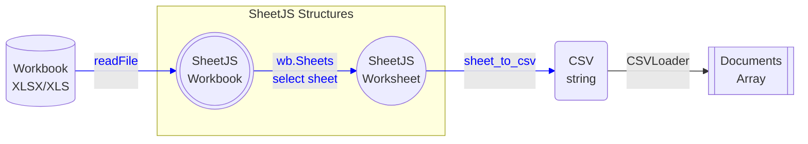
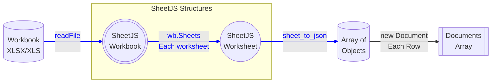

import current from '/version.js';
import Tabs from '@theme/Tabs';
import TabItem from '@theme/TabItem';
import CodeBlock from '@theme/CodeBlock';

Many existing systems and platforms include support for loading data from CSV
files. Many users prefer to work in spreadsheet software and multi-sheet file
formats including XLSX. SheetJS libraries help bridge the gap by translating
complex workbooks to simple CSV data.

The goal of this example is to load spreadsheet data into a vector store and use
a large language model to generate queries based on English language input. The
existing tooling supports CSV but does not support real spreadsheets.

In ["SheetJS Conversion"](#sheetjs-conversion), we will use SheetJS libraries to
generate CSV files for the LangChain CSV loader. These conversions can be run in
a preprocessing step without disrupting existing CSV workflows.

In ["SheetJS Loader"](#sheetjs-loader), we will use SheetJS libraries in a
custom `LoadOfSheet` data loader to directly generate documents and metadata.

["SheetJS Loader Demo"](#sheetjs-loader-demo) is a complete demo that uses the
SheetJS Loader to answer questions based on data from a XLS workbook.

:::note Tested Deployments

This demo was tested in the following configurations:

| Date       | Platform                                                      |
|:-----------|:--------------------------------------------------------------|
| 2024-08-09 | NVIDIA RTX 4090 (24 GB VRAM) + i9-10910 (128 GB RAM)          |
| 2024-08-09 | NVIDIA RTX 4080 SUPER (16 GB VRAM) + i9-10910 (128 GB RAM)    |
| 2024-07-15 | Apple M2 Max 12-Core CPU + 30-Core GPU (32 GB unified memory) |

SheetJS users have verified this demo in other configurations:

<details>
  <summary><b>Other tested configurations</b> (click to show)</summary>

| Demo        | Platform                                                     |
|:------------|:-------------------------------------------------------------|
| LangChainJS | NVIDIA RTX 4070 Ti (12 GB VRAM) + Ryzen 7 5800x (64 GB RAM)  |
| LangChainJS | NVIDIA RTX 4060 (8 GB VRAM) + Ryzen 7 5700g (32 GB RAM)      |
| LangChainJS | NVIDIA RTX 3090 (24 GB VRAM) + Ryzen 9 3900XT (128 GB RAM)   |
| LangChainJS | NVIDIA RTX 3080 (12 GB VRAM) + Ryzen 7 5800X (32 GB RAM)     |
| LangChainJS | NVIDIA RTX 3070 (8 GB VRAM) + Ryzen Z1 Extreme (16 GB RAM)   |
| LangChainJS | NVIDIA RTX 3060 (12 GB VRAM) + i5-11400 (32 GB RAM)          |
| LangChainJS | NVIDIA RTX 2080 (12 GB VRAM) + i7-9700K (16 GB RAM)          |
| LangChainJS | NVIDIA RTX 2060 (6 GB VRAM) + Ryzen 5 3600 (32 GB RAM)       |
| LangChainJS | NVIDIA GTX 1080 (8 GB VRAM) + Ryzen 7 5800x (64 GB RAM)      |
| LangChainJS | NVIDIA GTX 1070 (8 GB VRAM) + Ryzen 7 7700x (32 GB RAM)      |

</details>

Special thanks to:

- [Rasmus Tengstedt](https://tengstedt.dev/)
- [Triston Armstrong](https://tristonarmstrong.com/)
- [Ben Halverson](https://benhalverson.dev/)
- [Navid Nami](https://github.com/CaseoJKL)
- [`@Smor`](https://smor.dev/)
- [`@timbr`](https://timbr.dev/)
- [`@n3bs`](https://github.com/0xn3bs)

:::

## CSV Loader

:::note pass

This explanation was verified against LangChain 0.2.

:::

Document loaders generate data objects ("documents") and associated metadata
from data sources.

LangChain offers a `CSVLoader`[^1] component for loading CSV data from a file:

```js title="Generating Documents from a CSV file"
import { CSVLoader } from "@langchain/community/document_loaders/fs/csv";

const loader = new CSVLoader("pres.csv");
const docs = await loader.load();

console.log(docs);
```

The CSV loader uses the first row to determine column headers and generates one
document per data row. For example, the following CSV holds Presidential data:

```csv
Name,Index
Bill Clinton,42
GeorgeW Bush,43
Barack Obama,44
Donald Trump,45
Joseph Biden,46
```

Each data row is translated to a document whose content is a list of attributes
and values. For example, the third data row is shown below:

<table>
  <thead><tr><th>CSV Row</th><th>Document Content</th></tr></thead>
  <tbody><tr><td>

```
Name,Index
Barack Obama,44
```

  </td><td>

```
Name: Barack Obama
Index: 44
```

  </td></tr></tbody>
</table>

The LangChain CSV loader will include source metadata in the document:

```js title="Document generated by the CSV loader"
Document {
  pageContent: 'Name: Barack Obama\nIndex: 44',
  metadata: { source: 'pres.csv', line: 3 }
}
```

## SheetJS Conversion

The [SheetJS NodeJS module](/docs/getting-started/installation/nodejs) can be
imported in NodeJS scripts that use LangChain and other JavaScript libraries.

A simple pre-processing step can convert workbooks to CSV files that can be
processed by the existing CSV tooling:



**Parsing files from the filesystem**

The SheetJS `readFile` method[^2] can read workbook files. The method accepts a
path and returns a workbook object that conforms to the SheetJS data model[^3].

```js
/* Load SheetJS Libraries */
import { readFile, set_fs } from 'xlsx';

/* Load 'fs' for readFile support */
import * as fs from 'fs';
set_fs(fs);

/* Parse `pres.xlsx` */
// highlight-next-line
const wb = readFile("pres.xlsx");
```

**Inspecting SheetJS workbook and worksheet objects**

Workbook objects represent multi-sheet workbook files. They store individual
worksheet objects and other metadata.

Relevant to this discussion, the workbook object uses the following keys[^7]:
- `SheetNames` is an array of worksheet names
- `Sheets` is an object whose keys are sheet names and whose values are sheet objects.

`SheetNames[0]` is the first worksheet name, so the following snippet will pull
the first worksheet from the workbook:

```js
const first_ws = wb.Sheets[wb.SheetNames[0]];
```

**Exporting SheetJS worksheets to CSV**

Each worksheet in the workbook can be written to CSV text using the SheetJS
`sheet_to_csv`[^4] method. The method accepts a SheetJS worksheet object and
returns a string.

```js
const csv = utils.sheet_to_csv(first_ws);
```

**Complete Script**

For example, the following NodeJS script reads `pres.xlsx` and displays CSV rows
from the first worksheet:

```js title="Print CSV data from the first worksheet"
/* Load SheetJS Libraries */
import { readFile, set_fs, utils } from 'xlsx';

/* Load 'fs' for readFile support */
import * as fs from 'fs';
set_fs(fs);

/* Parse `pres.xlsx` */
const wb = readFile("pres.xlsx");

/* Print CSV rows from first worksheet */
const first_ws = wb.Sheets[wb.SheetNames[0]];
const csv = utils.sheet_to_csv(first_ws);
console.log(csv);
```

:::note pass

A number of demos cover spiritually similar workflows:

- [Stata](/docs/demos/extensions/stata), [MATLAB](/docs/demos/extensions/matlab)
and [Maple](/docs/demos/extensions/maple/) support XLSX data import. The SheetJS
integrations generate clean XLSX workbooks from user-supplied spreadsheets.

- [TensorFlow.js](/docs/demos/math/tensorflow), [Pandas](/docs/demos/math/pandas)
and [Mathematica](/docs/demos/extensions/mathematica) support CSV data import.
The SheetJS integrations generate clean CSVs and use built-in CSV processors.

- The ["Command-Line Tools"](/docs/demos/cli/) demo covers techniques for making
standalone command-line tools for file conversion.

:::

### Single Worksheet

For a single worksheet, a SheetJS pre-processing step can write the CSV rows to
file and the `CSVLoader` can load the newly written file.

<details open>
  <summary><b>Code example</b> (click to hide)</summary>

```js title="Pulling data from the first worksheet of a workbook"
import { CSVLoader } from "@langchain/community/document_loaders/fs/csv";
import { readFile, set_fs, utils } from 'xlsx';

/* Load 'fs' for readFile support */
import * as fs from 'fs';
set_fs(fs);

/* Parse `pres.xlsx`` */
const wb = readFile("pres.xlsx");

/* Generate CSV and write to `pres.xlsx.csv` */
const first_ws = wb.Sheets[wb.SheetNames[0]];
const csv = utils.sheet_to_csv(first_ws);
fs.writeFileSync("pres.xlsx.csv", csv);

/* Create documents with CSVLoader */
const loader = new CSVLoader("pres.xlsx.csv");
const docs = await loader.load();

console.log(docs);
// ...
```

</details>

### Workbook

A workbook is a collection of worksheets. Each worksheet can be exported to a
separate CSV. If the CSVs are written to a subfolder, a `DirectoryLoader`[^5]
can process the files in one step.

<details open>
  <summary><b>Code example</b> (click to hide)</summary>

In this example, the script creates a subfolder named `csv`. Each worksheet in
the workbook will be processed and the generated CSV will be stored to numbered
files. The first worksheet will be stored to `csv/0.csv`.

```js title="Pulling data from the each worksheet of a workbook"
import { CSVLoader } from "@langchain/community/document_loaders/fs/csv";
import { DirectoryLoader } from "langchain/document_loaders/fs/directory";
import { readFile, set_fs, utils } from 'xlsx';

/* Load 'fs' for readFile support */
import * as fs from 'fs';
set_fs(fs);

/* Parse `pres.xlsx`` */
const wb = readFile("pres.xlsx");

/* Create a folder `csv` */
try { fs.mkdirSync("csv"); } catch(e) {}

/* Generate CSV data for each worksheet */
wb.SheetNames.forEach((name, idx) => {
  const ws = wb.Sheets[name];
  const csv = utils.sheet_to_csv(ws);
  fs.writeFileSync(`csv/${idx}.csv`, csv);
});

/* Create documents with DirectoryLoader */
const loader = new DirectoryLoader("csv", {
  ".csv": (path) => new CSVLoader(path)
});
const docs = await loader.load();

console.log(docs);
// ...
```

</details>

## SheetJS Loader

The `CSVLoader` that ships with LangChain does not add any Document metadata and
does not generate any attributes. A custom loader can work around limitations in
the CSV tooling and potentially include metadata that has no CSV equivalent.



The demo [`LoadOfSheet` loader](pathname:///loadofsheet/loadofsheet.mjs) will
generate one Document per data row across all worksheets. It will also attempt
to build metadata and attributes for use in self-querying retrievers.

```js title="Sample usage"
/* read and parse `data.xlsb` */
const loader = new LoadOfSheet("./data.xlsb");

/* generate documents */
const docs = await loader.load();

/* synthesized attributes for the SelfQueryRetriever */
const attributes = loader.attributes;
```

<details>
  <summary><b>Sample SheetJS Loader</b> (click to show)</summary>

This example loader pulls data from each worksheet. It assumes each worksheet
includes one header row and a number of data rows.

```js title="loadofsheet.mjs"
import { Document } from "@langchain/core/documents";
import { BufferLoader } from "langchain/document_loaders/fs/buffer";
import { read, utils } from "xlsx";

/**
 * Document loader that uses SheetJS to load documents.
 *
 * Each worksheet is parsed into an array of row objects using the SheetJS
 * `sheet_to_json` method and projected to a `Document`. Metadata includes
 * original sheet name, row data, and row index
 */
export default class LoadOfSheet extends BufferLoader {
  /** @type {import("langchain/chains/query_constructor").AttributeInfo[]}  */
  attributes = [];

  /**
   * Document loader that uses SheetJS to load documents.
   *
   * @param {string|Blob} filePathOrBlob Source Data
   */
  constructor(filePathOrBlob) {
    super(filePathOrBlob);
    this.attributes = [];
  }

  /**
   * Parse document
   *
   * NOTE: column labels in multiple sheets are not disambiguated!
   *
   * @param {Buffer} raw Raw data Buffer
   * @param {Document["metadata"]} metadata Document metadata
   * @returns {Promise<Document[]>} Array of Documents
   */
  async parse(raw, metadata) {
    /** @type {Document[]} */
    const result = [];

    this.attributes = [
      { name: "worksheet", description: "Sheet or Worksheet Name", type: "string" },
      { name: "rowNum", description: "Row index", type: "number" }
    ];

    const wb = read(raw, {type: "buffer", WTF:1});
    for(let name of wb.SheetNames) {
      const fields = {};
      const ws = wb.Sheets[name];
      if(!ws) return;

      const aoo = utils.sheet_to_json(ws);
      aoo.forEach((row, idx) => {
        result.push({
          pageContent: "Row " + (idx + 1) + " has the following content: \n" + Object.entries(row).map(kv => `- ${kv[0]}: ${kv[1]}`).join("\n") + "\n",
          metadata: {
            worksheet: name,
            rowNum: row["__rowNum__"],
            ...metadata,
            ...row
          }
        });
        Object.entries(row).forEach(([k,v]) => { if(v != null) (fields[k] || (fields[k] = {}))[v instanceof Date ? "date" : typeof v] = true } );
      });
      Object.entries(fields).forEach(([k,v]) => this.attributes.push({
        name: k, description: k, type: Object.keys(v).join(" or ")
      }));
    }

    return result;
  }
};
```

</details>

### From Text to Binary

Many libraries and platforms offer generic "text" loaders that process files
assuming the UTF8 encoding. This corrupts many spreadsheet formats including
XLSX, XLSB, XLSM and XLS.

:::note pass

This issue affects many JavaScript tools. Various demos cover workarounds:

- [ViteJS plugins](/docs/demos/static/vitejs#plugins) receive the relative path
to the workbook file and can read the file directly.

- [Webpack plugins](/docs/demos/static/webpack#sheetjs-loader) support a special
`raw` option that instructs the bundler to pass raw binary data.

- [NuxtJS parsers and transformers](/docs/demos/static/nuxtjs) can deduce the
path to the workbook file from internal identifiers.

:::

The `CSVLoader` extends a special `TextLoader` that forces UTF8 text parsing.

There is a separate `BufferLoader` class, used by the PDF loader, that passes
the raw data using NodeJS `Buffer` objects.

<table>
  <thead><tr><th>Binary</th><th>Text</th></tr></thead>
  <tbody><tr><td>

```ts title="pdf.ts (structure)"
export class PDFLoader extends BufferLoader {
  // ...
  public async parse(
    raw: Buffer,
    metadata: Document["metadata"]
  ): Promise<Document[]> {
    // ...
  }
  // ...
}
```

  </td><td>

```ts title="csv.ts (structure)"
export class CSVLoader extends TextLoader {
  // ...
  protected async parse(
    raw: string

  ): Promise<string[]> {
    // ...
  }
  // ...
}
```

  </td></tr></tbody>
</table>

### NodeJS Buffers

The SheetJS `read` method supports NodeJS Buffer objects directly[^6]:

```js title="Parsing a workbook in a BufferLoader"
import { BufferLoader } from "langchain/document_loaders/fs/buffer";
import { read, utils } from "xlsx";

export default class LoadOfSheet extends BufferLoader {
  // ...
  async parse(raw, metadata) {
    // highlight-next-line
    const wb = read(raw, {type: "buffer"});
    // At this point, `wb` is a SheetJS workbook object
    // ...
  }
}
```

The `read` method returns a SheetJS workbook object[^7].

### Generating Content

The SheetJS `sheet_to_json` method[^8] returns an array of data objects whose
keys are drawn from the first row of the worksheet.

<table>
  <thead><tr><th>Spreadsheet</th><th>Array of Objects</th></tr></thead>
  <tbody><tr><td>


</td><td>

```js
[
  { Name: "Bill Clinton", Index: 42 },
  { Name: "GeorgeW Bush", Index: 43 },
  { Name: "Barack Obama", Index: 44 },
  { Name: "Donald Trump", Index: 45 },
  { Name: "Joseph Biden", Index: 46 }
]
```

</td></tr></tbody></table>

The original `CSVLoader` wrote one row for each key-value pair. This text can be
generated by looping over the keys and values of the data row object. The
`Object.entries` helper function simplifies the conversion:

```js
function make_csvloader_doc_from_row_object(row) {
  return Object.entries(row).map(([k,v]) => `${k}: ${v}`).join("\n");
}
```

### Generating Documents

The loader must generate row objects for each worksheet in the workbook.

In the SheetJS data model, the workbook object has two relevant fields:

- `SheetNames` is an array of sheet names
- `Sheets` is an object whose keys are sheet names and values are sheet objects.

A `for..of` loop can iterate across the worksheets:

```js title="Looping over a workbook (skeleton)"
    const wb = read(raw, {type: "buffer", WTF:1});
    for(let name of wb.SheetNames) {
      const ws = wb.Sheets[name];
      const aoa = utils.sheet_to_json(ws);
      // at this point, `aoa` is an array of objects
    }
```

This simplified `parse` function uses the snippet from the previous section:

```js title="BufferLoader parse function (skeleton)"
  async parse(raw, metadata) {
    /* array to hold generated documents */
    const result = [];

    /* read workbook */
    const wb = read(raw, {type: "buffer", WTF:1});

    /* loop over worksheets */
    for(let name of wb.SheetNames) {
      const ws = wb.Sheets[name];
      const aoa = utils.sheet_to_json(ws);

      /* loop over data rows */
      aoa.forEach((row, idx) => {
        /* generate a new document and add to the result array */
        result.push({
          pageContent: Object.entries(row).map(([k,v]) => `${k}: ${v}`).join("\n")
        });
      });
    }

    return result;
  }
```

### Metadata and Attributes

It is strongly recommended to generate additional metadata and attributes for
self-query retrieval applications.

<details>
  <summary><b>Implementation Details</b> (click to show)</summary>

**Metadata**

Metadata is attached to each document object. The following example appends the
raw row data to the document metadata:

```js title="Document with metadata (snippet)"
        /* generate a new document and add to the result array */
        result.push({
          pageContent: Object.entries(row).map(([k,v]) => `${k}: ${v}`).join("\n"),
          metadata: {
            worksheet: name, // name of the worksheet
            rowNum: idx, // data row index
            ...row // raw row data
          }
        });
```

**Attributes**

Each attribute object specifies three properties:

- `name` corresponds to the field in the document metadata
- `description` is a description of the field
- `type` is a description of the data type.

While looping through data rows, a simple type check can keep track of the data
type for each column:

```js title="Tracking column types (sketch)"
    for(let name of wb.SheetNames) {
      /* track column types */
      const fields = {};
      // ...

      aoo.forEach((row, idx) => {
        result.push({/* ... */});
        /* Check each property */
        Object.entries(row).forEach(([k,v]) => {
          /* Update fields entry to reflect the new data point */
          if(v != null) (fields[k] || (fields[k] = {}))[v instanceof Date ? "date" : typeof v] = true
        });
      });
      // ...
    }
```

Attributes can be generated after writing the worksheet data. Storing attributes
in a loader property will make it accessible to scripts that use the loader.

```js title="Adding Attributes to a Loader (sketch)"
export default class LoadOfSheet extends BufferLoader {
  // highlight-next-line
  attributes = [];
  // ...

  async parse(raw, metadata) {
    // Add the worksheet name and row index attributes
    // highlight-start
    this.attributes = [
      { name: "worksheet", description: "Sheet or Worksheet Name", type: "string" },
      { name: "rowNum", description: "Row index", type: "number" }
    ];
    // highlight-end
    const wb = read(raw, {type: "buffer", WTF:1});
    for(let name of wb.SheetNames) {
      // highlight-next-line
      const fields = {};
      // ...
      const aoo = utils.sheet_to_json(ws);
      aoo.forEach((row, idx) => {
        result.push({/* ... */});
        /* Check each property */
        Object.entries(row).forEach(([k,v]) => {
          /* Update fields entry to reflect the new data point */
          if(v != null) (fields[k] || (fields[k] = {}))[v instanceof Date ? "date" : typeof v] = true
        });
      });
      /* Add one attribute per metadata field */
      // highlight-start
      Object.entries(fields).forEach(([k,v]) => this.attributes.push({
        name: k, description: k,
        /* { number: true, string: true } -> "number or string" */
        type: Object.keys(v).join(" or ")
      }));
      // highlight-end
    }
    // ...
  }
```

</details>

## SheetJS Loader Demo

The demo performs the query "Which rows have over 40 miles per gallon?" against
a [sample cars dataset](pathname:///cd.xls) and displays the results.

:::note pass

SheetJS team members have tested this demo on Windows 10 and Windows 11 using
PowerShell and Ollama for Windows.

SheetJS users have also tested this demo within Windows Subsystem for Linux.

:::

:::caution pass

This demo was tested using the ChatQA-1.5 model[^9] in Ollama.

The tested model used up to 9.2GB VRAM. It is strongly recommended to run the
demo on a newer Apple Silicon Mac or a PC with an Nvidia GPU with at least 12GB
VRAM. SheetJS users have tested the demo on systems with as little as 6GB VRAM.

:::

0) Install pre-requisites:

- [NodeJS LTS (version 20+)](https://nodejs.org/)
- [Ollama](https://ollama.com/download)

:::note pass

Ollama should be installed on the same platform as NodeJS. If NodeJS is run
within WSL, Ollama should also be installed within WSL.

:::

After installing dependencies, start a new terminal session.

1) Create a new project:

```bash
mkdir sheetjs-loader
cd sheetjs-loader
npm init -y
```

2) Download the demo scripts:

- [`loadofsheet.mjs`](pathname:///loadofsheet/loadofsheet.mjs)
- [`query.mjs`](pathname:///loadofsheet/query.mjs)

```bash
curl -LO https://docs.sheetjs.com/loadofsheet/query.mjs
curl -LO https://docs.sheetjs.com/loadofsheet/loadofsheet.mjs
```

:::note pass

In PowerShell, the command may fail with a parameter error:

```
Invoke-WebRequest : A parameter cannot be found that matches parameter name 'LO'.
```

`curl.exe` must be invoked directly:

```bash
curl.exe -LO https://docs.sheetjs.com/loadofsheet/query.mjs
curl.exe -LO https://docs.sheetjs.com/loadofsheet/loadofsheet.mjs
```

:::

3) Install the SheetJS NodeJS module:

<CodeBlock language="bash">{`\
npm i --save https://sheet.lol/balls/xlsx-${current}.tgz`}
</CodeBlock>

4) Install dependencies:

```bash
npm i --save @langchain/community@0.2.18 @langchain/core@0.2.15 langchain@0.2.9 peggy@4.0.3 --force
```

:::note pass

When this demo was last tested, there were error messages relating to dependency
and peer dependency versions. The `--force` flag was required.

:::

5) Download the [cars dataset](pathname:///cd.xls):

```bash
curl -LO https://docs.sheetjs.com/cd.xls
```

:::note pass

In PowerShell, the command may fail with a parameter error:

```
Invoke-WebRequest : A parameter cannot be found that matches parameter name 'LO'.
```

`curl.exe` must be invoked directly:

```bash
curl.exe -LO https://docs.sheetjs.com/cd.xls
```

:::

6) Install the `llama3-chatqa:8b-v1.5-q8_0` model using Ollama:

```bash
ollama pull llama3-chatqa:8b-v1.5-q8_0
```

7) Run the demo script

```bash
node query.mjs
```

The demo performs the query "Which rows have over 40 miles per gallon?". It will
print the following nine results:

```js title="Expected output (order of lines may differ)"
{ Name: 'volkswagen rabbit custom diesel', MPG: 43.1 }
{ Name: 'vw rabbit c (diesel)', MPG: 44.3 }
{ Name: 'renault lecar deluxe', MPG: 40.9 }
{ Name: 'honda civic 1500 gl', MPG: 44.6 }
{ Name: 'datsun 210', MPG: 40.8 }
{ Name: 'vw pickup', MPG: 44 }
{ Name: 'mazda glc', MPG: 46.6 }
{ Name: 'vw dasher (diesel)', MPG: 43.4 }
{ Name: 'vw rabbit', MPG: 41.5 }
```

:::caution pass

Some SheetJS users with older GPUs have reported errors.

If the command fails, please try running the script a second time.

:::

To find the expected results:

- Open the `cd.xls` spreadsheet in Excel
- Select Home > Sort &amp; Filter > Filter in the Ribbon
- Select the filter option for column B (`Miles_per_Gallon`)
- In the popup, select "Greater Than" in the Filter dropdown and type 40

The filtered results should match the following screenshot:


:::tip pass

The [SheetJS model](/docs/csf) exposes [formulae](/docs/csf/features/formulae)
and other features.

[SheetJS Pro](https://sheetjs.com/pro) builds expose cell styling, images,
charts, tables, and other features.

:::

[^1]: See ["How to load CSV data"](https://js.langchain.com/v0.2/docs/how_to/document_loader_csv) in the LangChain documentation
[^2]: See [`readFile` in "Reading Files"](/docs/api/parse-options)
[^3]: See ["SheetJS Data Model"](/docs/csf/)
[^4]: See [`sheet_to_csv` in "CSV and Text"](/docs/api/utilities/csv#delimiter-separated-output)
[^5]: See ["Folders with multiple files"](https://js.langchain.com/v0.2/docs/integrations/document_loaders/file_loaders/directory/) in the LangChain documentation
[^6]: See ["Supported Output Formats" type in "Writing Files"](/docs/api/write-options#supported-output-formats)
[^7]: See ["Workbook Object"](/docs/csf/book)
[^8]: See [`sheet_to_json` in "Utilities"](/docs/api/utilities/array#array-output)
[^9]: See [the official ChatQA website](https://chatqa-project.github.io/) for the ChatQA paper and other model details.
