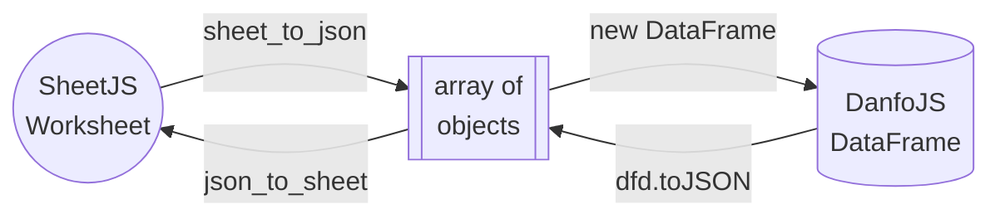

<head>
  <script src="https://cdn.jsdelivr.net/npm/danfojs@1.1.2/lib/bundle.min.js"></script>
</head>

[SheetJS](https://sheetjs.com) is a JavaScript library for reading and writing
data from spreadsheets.

[DanfoJS](https://danfo.jsdata.org/) is a library for processing structured
data. It uses SheetJS under the hood for reading and writing spreadsheets.

This demo covers details elided in the official DanfoJS documentation.

:::note Tested Deployments

This example was last tested on 2024 April 25 against DanfoJS 1.1.2.

:::

:::info Browser integration

The live demos on this page include the DanfoJS browser bundle:

```html
  <script src="https://cdn.jsdelivr.net/npm/danfojs@1.1.2/lib/bundle.min.js"></script>
```

There are known issues with the documentation generator. If a demo explicitly
prints "RELOAD THIS PAGE", please reload or refresh the page.

:::

## DataFrames and Worksheets

The DanfoJS `DataFrame`[^1] represents two-dimensional tabular data. It is the
starting point for most DanfoJS data processing tasks. A `DataFrame` typically
corresponds to one SheetJS worksheet[^2].

<table>
  <thead><tr><th>Spreadsheet</th><th>DanfoJS DataFrame</th></tr></thead>
  <tbody><tr><td>


</td><td>

```
╔════╤═══════════════╤═══════╗
║    │ Name          │ Index ║
╟────┼───────────────┼───────╢
║ 0  │ Bill Clinton  │ 42    ║
╟────┼───────────────┼───────╢
║ 1  │ GeorgeW Bush  │ 43    ║
╟────┼───────────────┼───────╢
║ 2  │ Barack Obama  │ 44    ║
╟────┼───────────────┼───────╢
║ 3  │ Donald Trump  │ 45    ║
╟────┼───────────────┼───────╢
║ 4  │ Joseph Biden  │ 46    ║
╚════╧═══════════════╧═══════╝
```

</td></tr></tbody></table>

## DanfoJS SheetJS Integration

:::note pass

The official documentation inconsistently names the library object `danfo` and
`dfd`. Since `dfd` is the browser global, the demos use the name `dfd`.

:::

Methods to read and write spreadsheets are attached to the main `dfd` object.

### Importing DataFrames

`readExcel`[^3] accepts two arguments: source data and options.

The source data must be a `string` or `File` object. Strings are interpreted as
URLs while `File` objects are treated as data.

_Selecting a Worksheet_

DanfoJS will generate a dataframe from one worksheet. The parser normally uses
the first worksheet. The `sheet` property of the options object controls the
selected worksheet. It is expected to be a zero-indexed number:

```js
const first_sheet  = await dfd.readExcel(url, {sheet: 0});
const second_sheet = await dfd.readExcel(url, {sheet: 1});
```

_More Parsing Options_

The `parsingOptions` property of the options argument is passed directly to the
SheetJS `read` method[^4].

For example, the `sheetRows` property controls how many rows are extracted from
larger worksheets. To pull 3 data rows, `sheetRows` must be set to 4:

```js
const first_three_rows = await dfd.readExcel(url, { parsingOptions: {
  // see https://docs.sheetjs.com/docs/api/parse-options for details
  sheetRows: 4
} });
```

#### URL source

The following example fetches a [test file](https://docs.sheetjs.com/pres.xlsx),
parses with SheetJS and generates a DanfoJS dataframe.

```jsx live
function DanfoReadExcelURL() {
  const [text, setText] = React.useState("");
  React.useEffect(() => { (async() => {
    if(typeof dfd === "undefined") return setText("RELOAD THIS PAGE!");
    const df = await dfd.readExcel("https://docs.sheetjs.com/pres.xlsx");
    setText("" + df.head());
  })(); }, []);
  return (<pre>{text}</pre>);
}
```

#### File source

The following example uses a file input element. The "File API"[^5] section of
the "Local File Access" demo covers the browser API in more detail.

```jsx live
function DanfoReadExcelFile() {
  const [text, setText] = React.useState("Select a spreadsheet");

  return (<><pre>{text}</pre><input type="file" onChange={async(e) => {
    if(typeof dfd === "undefined") return setText("RELOAD THIS PAGE!");

    /* get first file */
    const file = e.target.files[0];

    /* create dataframe and pretty-print the first 10 rows */
    const df = await dfd.readExcel(file);
    setText("" + df.head());
  }}/></>);
}
```

### Exporting DataFrames

`toExcel`[^6] accepts two arguments: dataframe and options. Under the hood, it
uses the SheetJS `writeFile` method[^7].

_Exported File Name_

The relevant property for the file name depends on the platform:

| Platform | Property   |
|:---------|:-----------|
| NodeJS   | `filePath` |
| Browser  | `fileName` |

The exporter will deduce the desired file format from the file extension.

_Worksheet Name_

The `sheetName` property specifies the name of the worksheet in the workbook:

```js
dfd.toExcel(df, {
  fileName: "test.xlsx", // generate `test.xlsx`
  // highlight-next-line
  sheetName: "Export"    // The name of the worksheet will be "Export"
});
```

:::caution pass

The DanfoJS integration forces the `.xlsx` file extension. Exporting to other
file formats will require [low-level operations](#generating-files).

:::

_More Writing Options_

The `writingOptions` property of the options argument is passed directly to the
SheetJS `writeFile` method[^8].

For example, the `compression` property enables ZIP compression for XLSX and
other formats:

```js
dfd.toExcel(df, {fileName: "export.xlsx", writingOptions: {
  // see https://docs.sheetjs.com/docs/api/write-options for details
  compression: true
}});
```

#### Export to File

The following example exports a sample dataframe to a XLSX spreadsheet.

```jsx live
function DanfoToExcel() {
  if(typeof dfd === "undefined") return (<b>RELOAD THIS PAGE</b>);
  /* sample dataframe */
  const df = new dfd.DataFrame([{Sheet:1,JS:2},{Sheet:3,JS:4}]);
  return ( <><button onClick={async() => {
    /* dfd.toExcel calls the SheetJS `writeFile` method */
    dfd.toExcel(df, {fileName: "SheetJSDanfoJS.xlsx", writingOptions: {
      compression: true
    }});
  }}>Click to Export</button><pre>{"Data:\n"+df.head()}</pre></> );
}
```

## Low-Level Operations

DanfoJS and SheetJS provide methods for processing arrays of objects.



### Creating DataFrames

The `DataFrame` constructor[^9] creates `DataFrame` objects from arrays of
objects. Given a SheetJS worksheet object, the `sheet_to_json` method[^10]
generates compatible arrays of objects:

```js
function ws_to_df(ws) {
  const aoo = XLSX.utils.sheet_to_json(ws);
  return new dfd.DataFrame(aoo);
}
```

### Generating Files

`toJSON`[^11] accepts two arguments: dataframe and options.

The `format` key of the `options` argument dictates the result layout. The
`column` layout generates an array of objects in row-major order. The SheetJS
`json_to_sheet`[^12] method can generate a worksheet object from the result:

```js
function df_to_ws(df) {
  const aoo = dfd.toJSON(df, { format: "column" });
  return XLSX.utils.json_to_sheet(aoo);
}
```

The SheetJS `book_new` method creates a workbook object from the worksheet[^13]
and the `writeFile` method[^14] will generate the file:

```js
const ws = df_to_ws(df);
const wb = XLSX.utils.book_new(ws, "Export");
XLSX.writeFile(wb, "SheetJSDanfoJS.xlsb", { compression: true });
```

The following demo exports a sample dataframe to XLSB. This operation is not
supported by the DanfoJS `toExcel` method since that method enforces XLSX.

```jsx live
function DanfoToXLS() {
  if(typeof dfd === "undefined") return (<b>RELOAD THIS PAGE</b>);
  /* sample dataframe */
  const df = new dfd.DataFrame([{Sheet:1,JS:2},{Sheet:3,JS:4}]);
  return ( <><button onClick={async() => {
    /* generate worksheet */
    const aoo = dfd.toJSON(df, { format: "column" });
    const ws = XLSX.utils.json_to_sheet(aoo);

    /* generate workbook */
    const wb = XLSX.utils.book_new(ws, "Export");

    /* write to XLS */
    XLSX.writeFile(wb, "SheetJSDanfoJS.xlsb", { compression: true });
  }}>Click to Export</button><pre>{"Data:\n"+df.head()}</pre></> );
}
```

[^1]: See ["Dataframe"](https://danfo.jsdata.org/api-reference/dataframe) in the DanfoJS documentation
[^2]: See ["Sheet Objects"](/docs/csf/sheet)
[^3]: See ["danfo.readExcel"](https://danfo.jsdata.org/api-reference/input-output/danfo.read_excel) in the DanfoJS documentation.
[^4]: See ["Reading Files"](/docs/api/parse-options#parsing-options) for the full list of parsing options.
[^5]: See ["File API" in "Local File Access"](/docs/demos/local/file#file-api) for more details.
[^6]: See ["danfo.toExcel"](https://danfo.jsdata.org/api-reference/input-output/danfo.to_excel) in the DanfoJS documentation.
[^7]: See [`writeFile` in "Writing Files"](/docs/api/write-options)
[^8]: See ["Writing Files"](/docs/api/write-options#writing-options) for the full list of writing options.
[^9]: See ["Creating a DataFrame"](https://danfo.jsdata.org/api-reference/dataframe/creating-a-dataframe) in the DanfoJS documentation.
[^10]: See [`sheet_to_json` in "Utilities"](/docs/api/utilities/array#array-output)
[^11]: See ["danfo.toJSON"](https://danfo.jsdata.org/api-reference/input-output/danfo.to_json) in the DanfoJS documentation.
[^12]: See [`json_to_sheet` in "Utilities"](/docs/api/utilities/array#array-of-objects-input)
[^13]: See [`book_new` in "Utilities"](/docs/api/utilities/wb)
[^14]: See [`writeFile` in "Writing Files"](/docs/api/write-options)