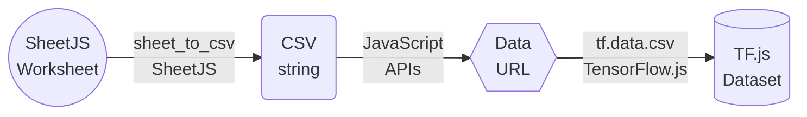
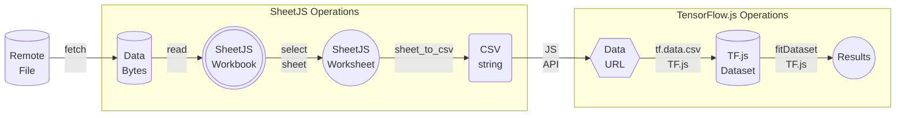

import current from '/version.js';
import Tabs from '@theme/Tabs';
import TabItem from '@theme/TabItem';
import CodeBlock from '@theme/CodeBlock';

<head>
  <script src="https://docs.sheetjs.com/tfjs/tf.min.js"></script>
</head>

[TensorFlow.js](https://www.tensorflow.org/js) (shortened to TF.js) is a library
for machine learning in JavaScript.

[SheetJS](https://sheetjs.com) is a JavaScript library for reading and writing
data from spreadsheets.

This demo uses TensorFlow.js and SheetJS to process data in spreadsheets. We'll
explore how to load spreadsheet data into TF.js datasets and how to export
results back to spreadsheets.

- ["CSV Data Interchange"](#csv-data-interchange) uses SheetJS to process sheets
  and generate CSV data that TF.js can import.

- ["JS Array Interchange"](#js-array-interchange) uses SheetJS to process sheets
  and generate rows of objects that can be post-processed.

:::note Tested Deployments

Each browser demo was tested in the following environments:

| Browser     | TF.js version | Date       |
|:------------|:--------------|:-----------|
| Chrome 127  | `4.20.0`      | 2024-08-16 |
| Safari 17.4 | `4.20.0`      | 2024-08-16 |

The NodeJS demo was tested in the following environments:

| NodeJS   | TF.js version                 | Date       |
|:---------|:------------------------------|:-----------|
| `22.3.0` | `4.20.0` (`@tensorflow/tfjs`) | 2024-08-16 |

The Kaioken demo was tested in the following environments:

| Kaioken   | TF.js version | Date       |
|:----------|:--------------|:-----------|
| `0.25.3`  | `4.20.0`      | 2024-08-16 |

:::

## Installation

#### Standalone Browser Scripts

Live code blocks in this page use the TF.js `4.20.0` standalone build.

Standalone scripts are available on various CDNs including UNPKG. The latest
version can be loaded with the following `SCRIPT` tag.

The [SheetJS Standalone scripts](/docs/getting-started/installation/standalone)
can be loaded after the TF.js standalone script.

<CodeBlock language="html">{`\
<!-- latest version of TF.js -->
<script src="https://unpkg.com/@tensorflow/tfjs@latest/dist/tf.min.js"></script>
<!-- use version ${current} -->
<script lang="javascript" src="https://cdn.sheetjs.com/xlsx-${current}/package/dist/xlsx.full.min.js"></script>`}
</CodeBlock>

#### Frameworks and Bundlers

[The "Frameworks" section](/docs/getting-started/installation/frameworks) covers
installation with Yarn and other package managers.

`@tensorflow/tfjs` and SheetJS modules should be installed using a package manager:

<Tabs groupId="pm">
  <TabItem value="npm" label="npm">
<CodeBlock language="bash">{`\
npm i --save https://cdn.sheetjs.com/xlsx-${current}/xlsx-${current}.tgz @tensorflow/tfjs`}
</CodeBlock>
  </TabItem>
  <TabItem value="pnpm" label="pnpm">
<CodeBlock language="bash">{`\
pnpm install --save https://cdn.sheetjs.com/xlsx-${current}/xlsx-${current}.tgz @tensorflow/tfjs`}
</CodeBlock>
  </TabItem>
  <TabItem value="yarn" label="Yarn" default>
<CodeBlock language="bash">{`\
yarn add https://cdn.sheetjs.com/xlsx-${current}/xlsx-${current}.tgz @tensorflow/tfjs`}
</CodeBlock>

:::caution pass

Newer releases of Yarn may throw an error:

```
Usage Error: It seems you are trying to add a package using a https:... url; we now require package names to be explicitly specified.
Try running the command again with the package name prefixed: yarn add my-package@https:...
```

The workaround is to prepend the URL with `xlsx@`:

<CodeBlock language="bash">{`\
yarn add xlsx@https://cdn.sheetjs.com/xlsx-${current}/xlsx-${current}.tgz @tensorflow/tfjs`}
</CodeBlock>

:::

  </TabItem>
</Tabs>

#### NodeJS

The [SheetJS NodeJS module](/docs/getting-started/installation/nodejs) can be
imported in NodeJS scripts that use TF.js.

There are two options for NodeJS:

- the pure JavaScript bindings module is `@tensorflow/tfjs`
- the native bindings module is `@tensorflow/tfjs-node`

:::danger pass

When this demo was last tested, there were issues with the native binding:

```
Error: The specified module could not be found.
\\?\C:\Users\SheetJS\node_modules\@tensorflow\tfjs-node\lib\napi-v8\tfjs_binding.node
```

For general compatibility, the demos use the pure `@tensorflow/tfjs` binding.

:::


<Tabs groupId="pm">
  <TabItem value="npm" label="npm">
<CodeBlock language="bash">{`\
npm i --save https://cdn.sheetjs.com/xlsx-${current}/xlsx-${current}.tgz @tensorflow/tfjs @tensorflow/tfjs-node`}
</CodeBlock>
  </TabItem>
  <TabItem value="pnpm" label="pnpm">
<CodeBlock language="bash">{`\
pnpm install --save https://cdn.sheetjs.com/xlsx-${current}/xlsx-${current}.tgz @tensorflow/tfjs @tensorflow/tfjs-node`}
</CodeBlock>
  </TabItem>
  <TabItem value="yarn" label="Yarn" default>
<CodeBlock language="bash">{`\
yarn add https://cdn.sheetjs.com/xlsx-${current}/xlsx-${current}.tgz @tensorflow/tfjs @tensorflow/tfjs-node`}
</CodeBlock>

:::caution pass

Newer releases of Yarn may throw an error:

```
Usage Error: It seems you are trying to add a package using a https:... url; we now require package names to be explicitly specified.
Try running the command again with the package name prefixed: yarn add my-package@https:...
```

The workaround is to prepend the URL with `xlsx@`:

<CodeBlock language="bash">{`\
yarn add xlsx@https://cdn.sheetjs.com/xlsx-${current}/xlsx-${current}.tgz @tensorflow/tfjs @tensorflow/tfjs-node`}
</CodeBlock>

:::

  </TabItem>
</Tabs>

## CSV Data Interchange

`tf.data.csv`[^1] generates a Dataset from CSV data. The function expects a URL.

:::note pass

When this demo was last tested, there was no direct method to pass a CSV string
to the underlying parser.

:::

Fortunately blob URLs are supported.



The SheetJS `sheet_to_csv` method[^2] generates a CSV string from a worksheet
object. Using standard JavaScript techniques, a blob URL can be constructed:

```js
function worksheet_to_csv_url(worksheet) {
  /* generate CSV */
  const csv = XLSX.utils.sheet_to_csv(worksheet);

  /* CSV -> Uint8Array -> Blob */
  const u8 = new TextEncoder().encode(csv);
  const blob = new Blob([u8], { type: "text/csv" });

  /* generate a blob URL */
  return URL.createObjectURL(blob);
}
```

### CSV Demo

This demo shows a simple model fitting using the "cars" dataset from TensorFlow.
The [sample XLS file](https://docs.sheetjs.com/cd.xls) contains the data. The
data processing mirrors the official "Making Predictions from 2D Data" demo[^3].



The demo builds a model for predicting MPG from Horsepower data. It:

- fetches https://docs.sheetjs.com/cd.xls
- parses the data with the SheetJS `read`[^4] method
- selects the first worksheet[^5] and converts to CSV using `sheet_to_csv`[^6]
- generates a blob URL from the CSV text
- generates a TF.js dataset with `tf.data.csv`[^7] and selects data columns
- builds a model and trains with `fitDataset`[^8]
- predicts MPG from a set of sample inputs and displays results in a table

#### Live Demo

<details>
  <summary><b>Live Demo</b> (click to show)</summary>

:::caution pass

In some test runs, the results did not make sense given the underlying data.
The dependent and independent variables are expected to be anti-correlated.

**This is a known issue in TF.js and affects the official demos**

:::

:::caution pass

If the live demo shows a message

```
ReferenceError: tf is not defined
```

please refresh the page.  This is a known bug in the documentation generator.

:::

```jsx live
function SheetJSToTFJSCSV() {
  const [output, setOutput] = React.useState("");
  const [results, setResults] = React.useState([]);
  const [disabled, setDisabled] = React.useState(false);

  function worksheet_to_csv_url(worksheet) {
    /* generate CSV */
    const csv = XLSX.utils.sheet_to_csv(worksheet);

    /* CSV -> Uint8Array -> Blob */
    const u8 = new TextEncoder().encode(csv);
    const blob = new Blob([u8], { type: "text/csv" });

    /* generate a blob URL */
    return URL.createObjectURL(blob);
  }

  const doit = React.useCallback(async () => {
    setResults([]); setOutput(""); setDisabled(true);
    try {
    /* fetch file */
    const f = await fetch("https://docs.sheetjs.com/cd.xls");
    const ab = await f.arrayBuffer();
    /* parse file and get first worksheet */
    const wb = XLSX.read(ab);
    const ws = wb.Sheets[wb.SheetNames[0]];

    /* generate blob URL */
    const url = worksheet_to_csv_url(ws);

    /* feed to tf.js */
    const dataset = tf.data.csv(url, {
      hasHeader: true,
      configuredColumnsOnly: true,
      columnConfigs:{
        "Horsepower": { required: false, default: 0},
        "Miles_per_Gallon": { required: false, default: 0, isLabel: true }
      }
    });

    /* pre-process data */
    let flat = dataset
      .map(({xs,ys}) =>({xs: Object.values(xs), ys: Object.values(ys)}))
      .filter(({xs,ys}) => [...xs,...ys].every(v => v>0));

    /* normalize manually :( */
    let minX = Infinity, maxX = -Infinity, minY = Infinity, maxY = -Infinity;
    await flat.forEachAsync(({xs, ys}) => {
      minX = Math.min(minX, xs[0]); maxX = Math.max(maxX, xs[0]);
      minY = Math.min(minY, ys[0]); maxY = Math.max(maxY, ys[0]);
    });
    flat = flat.map(({xs, ys}) => ({xs:xs.map(v => (v-minX)/(maxX - minX)),ys:ys.map(v => (v-minY)/(maxY-minY))}));
    flat = flat.batch(32);

    /* build and train model */
    const model = tf.sequential();
    model.add(tf.layers.dense({inputShape: [1], units: 1}));
    model.compile({ optimizer: tf.train.sgd(0.000001), loss: 'meanSquaredError' });
    await model.fitDataset(flat, { epochs: 100, callbacks: { onEpochEnd: async (epoch, logs) => {
      setOutput(`${epoch}:${logs.loss}`);
    }}});

    /* predict values */
    const inp = tf.linspace(0, 1, 9);
    const pred = model.predict(inp);
    const xs = await inp.dataSync(), ys = await pred.dataSync();
    setResults(Array.from(xs).map((x, i) => [ x * (maxX - minX) + minX, ys[i] * (maxY - minY) + minY ]));
    setOutput("");

    } catch(e) { setOutput(`ERROR: ${String(e)}`); } finally { setDisabled(false);}
  });
  return ( <>
    <button onClick={doit} disabled={disabled}>Click to run</button><br/>
    {output && <pre>{output}</pre> || <></>}
    {results.length && <table><thead><tr><th>Horsepower</th><th>MPG</th></tr></thead><tbody>
    {results.map((r,i) => <tr key={i}><td>{r[0]}</td><td>{r[1].toFixed(2)}</td></tr>)}
    </tbody></table> || <></>}
  </> );
}
```

</details>

#### NodeJS Demo

<details>
  <summary><b>Demo Steps</b> (click to show)</summary>

0) Create a new project:

```bash
mkdir sheetjs-tfjs-csv
cd sheetjs-tfjs-csv
npm init -y
```

1) Download [`SheetJSTF.js`](pathname:///tfjs/SheetJSTF.js):

```bash
curl -LO https://docs.sheetjs.com/tfjs/SheetJSTF.js
```

2) Install SheetJS and TF.js dependencies:

<CodeBlock language="bash">{`\
npm i --save https://cdn.sheetjs.com/xlsx-${current}/xlsx-${current}.tgz @tensorflow/tfjs @tensorflow/tfjs-node`}
</CodeBlock>

3) Run the script:

```bash
node SheetJSTF.js
```

</details>

#### Kaioken Demo

:::tip pass

[Kaioken](/docs/demos/frontend/kaioken) is a popular front-end framework that
uses patterns that will be familiar to ReactJS developers.

The SheetJS team strongly recommends using Kaioken in projects using TF.js.

:::

<details>
  <summary><b>Demo Steps</b> (click to show)</summary>

1) Create a new site.

```bash
npm create vite sheetjs-tfjs-kaioken -- --template vanilla-ts
cd sheetjs-tfjs-kaioken
npm add --save kaioken
npm add --save vite-plugin-kaioken -D
```

2) Create a new file `vite.config.ts` with the following content:

```ts title="vite.config.ts (create new file)"
import { defineConfig } from "vite"
import kaioken from "vite-plugin-kaioken"

export default defineConfig({
  plugins: [kaioken()],
})
```

3) Edit `tsconfig.json` and add `"jsx": "preserve"` within `compilerOptions`:

```js title="tsconfig.json (add highlighted line)"
{
  "compilerOptions": {
// highlight-next-line
    "jsx": "preserve",
```

4) Replace `src/main.ts` with the following codeblock:

```js title="src/main.ts"
import { mount } from "kaioken";
import App from "./SheetJSTF";

const root = document.getElementById("app");
mount(App, root!);
```

5) Download [`SheetJSTF.tsx`](pathname:///tfjs/SheetJSTF.tsx) to the `src` directory:

```bash
curl -L -o src/SheetJSTF.tsx https://docs.sheetjs.com/tfjs/SheetJSTF.tsx
```

6) Install SheetJS and TF.js dependencies:

<CodeBlock language="bash">{`\
npm i --save https://cdn.sheetjs.com/xlsx-${current}/xlsx-${current}.tgz @tensorflow/tfjs`}
</CodeBlock>

7) Start the development server:

```bash
npm run dev
```

The process will display a URL:

```
  ➜  Local:   http://localhost:5173/
```

Open the displayed URL (`http://localhost:5173/` in this example) with a web
browser. Click the "Click to Run" button to see the results.

</details>

## JS Array Interchange

[The official Linear Regression tutorial](https://www.tensorflow.org/js/tutorials/training/linear_regression)
loads data from a JSON file:

```json
[
  {
    "Name": "chevrolet chevelle malibu",
    "Miles_per_Gallon": 18,
    "Cylinders": 8,
    "Displacement": 307,
    "Horsepower": 130,
    "Weight_in_lbs": 3504,
    "Acceleration": 12,
    "Year": "1970-01-01",
    "Origin": "USA"
  },
  // ...
]
```

In real use cases, data is stored in [spreadsheets](https://docs.sheetjs.com/cd.xls)


Following the tutorial, the data fetching method can be adapted to handle arrays
of objects, such as those generated by the SheetJS `sheet_to_json` method[^9].

Differences from the official example are highlighted below:

```js
/**
 * Get the car data reduced to just the variables we are interested
 * and cleaned of missing data.
 */
async function getData() {
  // highlight-start
  /* fetch file and pull data into an ArrayBuffer */
  const carsDataResponse = await fetch('https://docs.sheetjs.com/cd.xls');
  const carsDataAB = await carsDataResponse.arrayBuffer();

  /* parse */
  const carsDataWB = XLSX.read(carsDataAB);

  /* get first worksheet */
  const carsDataWS = carsDataWB.Sheets[carsDataWB.SheetNames[0]];
  /* generate array of JS objects */
  const carsData = XLSX.utils.sheet_to_json(carsDataWS);
  // highlight-end

  const cleaned = carsData.map(car => ({
    mpg: car.Miles_per_Gallon,
    horsepower: car.Horsepower,
  }))
  .filter(car => (car.mpg != null && car.horsepower != null));

  return cleaned;
}
```

## Low-Level Operations

### Data Transposition

A typical dataset in a spreadsheet will start with one header row and represent
each data record in its own row. For example, the Iris dataset might look like


The SheetJS `sheet_to_json` method[^10] will translate worksheet objects into an
array of row objects:

```js
const aoo = [
  {"sepal length": 5.1, "sepal width": 3.5, ...},
  {"sepal length": 4.9, "sepal width":   3, ...},
  ...
];
```

TF.js and other libraries tend to operate on individual columns, equivalent to:

```js
const sepal_lengths = [5.1, 4.9, ...];
const sepal_widths = [3.5, 3, ...];
```

When a `tensor2d` can be exported, it will look different from the spreadsheet:

```js
const data_set_2d = [
  [5.1, 4.9, /*...*/],
  [3.5, 3, /*...*/],
  // ...
];
```

This is the transpose of how people use spreadsheets!

### Exporting Datasets to a Worksheet

The `aoa_to_sheet` method[^11] can generate a worksheet from an array of arrays.
ML libraries typically provide APIs to pull an array of arrays, but it will be
transposed. The following function transposes arrays of normal and typed arrays:

```js title="Transpose array of arrays"
/* `data` is an array of (typed or normal) arrays */
function transpose_array_of_arrays(data) {
  const aoa = [];
  for(let i = 0; i < data.length; ++i) {
    for(let j = 0; j < data[i].length; ++j) {
      if(!aoa[j]) aoa[j] = [];
      aoa[j][i] = data[i][j];
    }
  }
  return aoa;
}
```

It is recommended to create a new worksheet from the header row and add the
transposed data using the `sheet_add_aoa` method. The option `origin: -1`[^12]
ensures that the data is written after the headers:

```js
const headers = [ "sepal length", "sepal width"];
const data_set_2d = [
  [5.1, 4.9, /*...*/],
  [3.5, 3, /*...*/],
  // ...
];

// highlight-start
/* transpose data */
const transposed_data = transpose_array_of_arrays(data_set_2d);
// highlight-end

/* create worksheet from headers */
const ws = XLSX.utils.aoa_to_sheet([ headers ])

/* add the transposed data starting on row 2 */
XLSX.utils.sheet_add_aoa(ws, transposed_data, { origin: 1 });
```

### Importing Data from a Spreadsheet

`sheet_to_json` with the option `header: 1`[^13] will generate a row-major array
of arrays that can be transposed. However, it is more efficient to walk the
sheet manually. The following function accepts a number of header rows to skip:

```js title="Worksheet to transposed array of typed arrays"
function sheet_to_array_of_f32(ws, header_row_count) {
  const out = [];

  /* find worksheet range */
  const range = XLSX.utils.decode_range(ws['!ref']);

  /* skip specified number of headers */
  range.s.r += (header_row_count | 0);

  /* walk the columns */
  for(let C = range.s.c; C <= range.e.c; ++C) {
    /* create the typed array */
    const ta = new Float32Array(range.e.r - range.s.r + 1);

    /* walk the rows */
    for(let R = range.s.r; R <= range.e.r; ++R) {
      /* find the cell, skip it if the cell isn't numeric or boolean */
      const cell = ws["!data"] ? (ws["!data"][R]||[])[C] : ws[XLSX.utils.encode_cell({r:R, c:C})];
      if(!cell || cell.t != 'n' && cell.t != 'b') continue;

      /* assign to the typed array */
      ta[R - range.s.r] = cell.v;
    }

    /* add typed array to output */
    out.push(ta);
  }

  return out;
}
```

### TF.js Tensors

A single `Array#map` can pull individual named fields from the result, which
can be used to construct TensorFlow.js tensor objects:

```js
const aoo = XLSX.utils.sheet_to_json(worksheet);
const lengths = aoo.map(row => row["sepal length"]);
const tensor = tf.tensor1d(lengths);
```

`tf.Tensor` objects can be directly transposed using `transpose`:

```js
const aoo = XLSX.utils.sheet_to_json(worksheet);
// "x" and "y" are the fields we want to pull from the data
con st data = aoo.map(row => ([row["x"], row["y"]]));

// create a tensor representing two column datasets
const tensor = tf.tensor2d(data).transpose();

// individual columns can be accessed
const col1 = tensor.slice([0,0], [1,tensor.shape[1]]).flatten();
const col2 = tensor.slice([1,0], [1,tensor.shape[1]]).flatten();
```

For exporting, `stack` can be used to collapse the columns into a linear array:

```js
/* pull data into a Float32Array */
const result = tf.stack([col1, col2]).transpose();
const shape = tensor.shape;
const f32 = tensor.dataSync();

/* construct an array of arrays of the data in spreadsheet order */
const aoa = [];
for(let j = 0; j < shape[0]; ++j) {
  aoa[j] = [];
  for(let i = 0; i < shape[1]; ++i) aoa[j][i] = f32[j * shape[1] + i];
}

/* add headers to the top */
aoa.unshift(["x", "y"]);

/* generate worksheet */
const worksheet = XLSX.utils.aoa_to_sheet(aoa);
```

[^1]: See [`tf.data.csv`](https://js.tensorflow.org/api/latest/#data.csv) in the TensorFlow.js documentation
[^2]: See [`sheet_to_csv` in "CSV and Text"](/docs/api/utilities/csv#delimiter-separated-output)
[^3]: The ["Making Predictions from 2D Data" example](https://codelabs.developers.google.com/codelabs/tfjs-training-regression/) uses a hosted JSON file. The [sample XLS file](https://docs.sheetjs.com/cd.xls) includes the same data.
[^4]: See [`read` in "Reading Files"](/docs/api/parse-options)
[^5]: See ["Workbook Object"](/docs/csf/book)
[^6]: See [`sheet_to_csv` in "CSV and Text"](/docs/api/utilities/csv#delimiter-separated-output)
[^7]: See [`tf.data.csv`](https://js.tensorflow.org/api/latest/#data.csv) in the TensorFlow.js documentation
[^8]: See [`tf.LayersModel.fitDataset`](https://js.tensorflow.org/api/latest/#tf.LayersModel.fitDataset) in the TensorFlow.js documentation
[^9]: See [`sheet_to_json` in "Utilities"](/docs/api/utilities/array#array-output)
[^10]: See [`sheet_to_json` in "Utilities"](/docs/api/utilities/array#array-output)
[^11]: See [`aoa_to_sheet` in "Utilities"](/docs/api/utilities/array#array-of-arrays-input)
[^12]: See [the `origin` option of `sheet_add_aoa` in "Utilities"](/docs/api/utilities/array#array-of-arrays-input)
[^13]: See [`sheet_to_json` in "Utilities"](/docs/api/utilities/array#array-output)
