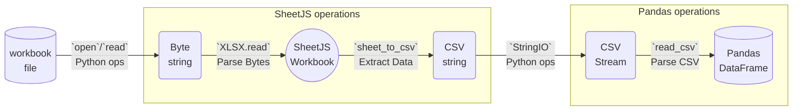
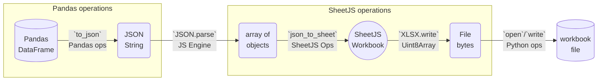

import current from '/version.js';
import Tabs from '@theme/Tabs';
import TabItem from '@theme/TabItem';
import CodeBlock from '@theme/CodeBlock';

[Pandas](https://pandas.pydata.org/) is a Python library for data analysis.

[SheetJS](https://sheetjs.com) is a JavaScript library for reading and writing
data from spreadsheets.

This demo uses SheetJS to process data from a spreadsheet and translate to the
Pandas DataFrame format. We'll explore how to load SheetJS from Python scripts,
generate DataFrames from workbooks, and write DataFrames back to workbooks.

The ["Complete Example"](#complete-example) includes a wrapper library that
simplifies importing and exporting spreadsheets.

:::info pass

Pandas includes limited support for reading spreadsheets (`pandas.from_excel`)
and writing XLSX spreadsheets (`pandas.DataFrame.to_excel`).

**SheetJS supports many common spreadsheet formats that Pandas cannot process.**

SheetJS operations also offer more flexibility in processing complex worksheets.

:::

:::note Tested Environments

This demo was tested in the following deployments:

| Architecture | JS Engine       | Pandas | Python | Date       |
|:-------------|:----------------|:-------|:-------|:-----------|
| `darwin-x64` | Duktape `2.7.0` | 2.2.1  | 3.12.2 | 2024-03-15 |
| `darwin-arm` | Duktape `2.7.0` | 2.2.2  | 3.12.3 | 2024-06-30 |
| `win10-x64`  | Duktape `2.7.0` | 2.2.1  | 3.12.2 | 2024-03-25 |
| `win11-arm`  | Duktape `2.7.0` | 2.2.2  | 3.11.5 | 2024-06-20 |
| `linux-x64`  | Duktape `2.7.0` | 1.5.3  | 3.11.3 | 2024-03-21 |
| `linux-arm`  | Duktape `2.7.0` | 1.5.3  | 3.11.2 | 2024-06-20 |

:::

## Integration Details

[`sheetjs.py`](pathname:///pandas/sheetjs.py) is a wrapper script that provides
helper methods for reading and writing spreadsheets. Installation notes are
included in the ["Complete Example"](#complete-example) section.

### JS in Python

JS code cannot be directly evaluated in Python implementations.

To run JS code from Python, JavaScript engines[^1] can be embedded in Python
modules or dynamically loaded using the `ctypes` foreign function library[^2].
This demo uses `ctypes` with the [Duktape engine](/docs/demos/engines/duktape).

### Wrapper

The script exports a class named `SheetJSWrapper`. It is a context manager that
initializes the Duktape engine and executes SheetJS scripts on entrance. All
work should be performed in the context:

```python title="Complete Example"
#!/usr/bin/env python3
from sheetjs import SheetJSWrapper

with SheetJSWrapper() as sheetjs:

  # Parse file
  wb = sheetjs.read_file("pres.numbers")
  print("Loaded file pres.numbers")

  # Get first worksheet name
  first_ws_name = wb.get_sheet_names()[0]
  print(f"Reading from sheet {first_ws_name}")

  # Generate DataFrame from first worksheet
  df = wb.get_df(first_ws_name)
  print(df.info())

  # Export DataFrame to XLSB
  sheetjs.write_df(df, "SheetJSPandas.xlsb", sheet_name="DataFrame")
```

### Reading Files

`sheetjs.read_file` accepts a path to a spreadsheet file. It will parse the file
and return an object representing the workbook.

The `get_sheet_names` method of the workbook returns a list of sheet names.

The `get_df` method of the workbook generates a DataFrame from the workbook. The
specific sheet can be selected by passing the name.

For example, the following code reads `pres.numbers` and generates a DataFrame
from the second worksheet:

```python title="Generating a DataFrame from the second worksheet"
with SheetJSWrapper() as sheetjs:
  # Parse file
  wb = sheetjs.read_file(path)

  # Generate DataFrame from second worksheet
  ws_name = wb.get_sheet_names()[1]
  df = wb.get_df(ws_name)

  # Print metadata
  print(df.info())
```

Under the hood, `sheetjs.py` performs the following steps:



1) Pure Python operations read the spreadsheet file and generate a byte string.

2) SheetJS libraries parse the string and generate a clean CSV.

- The `read` method[^3] parses file bytes into a SheetJS workbook object[^4]
- After selecting a worksheet, `sheet_to_csv`[^5] generates a CSV string

3) Python operations convert the CSV string to a stream object.[^6]

4) The Pandas `read_csv` method[^7] ingests the stream and generate a DataFrame.

### Writing Files

`sheetjs.write_df` accepts a DataFrame and a path. It will attempt to export
the data to a spreadsheet file.

For example, the following code exports a DataFrame to `SheetJSPandas.xlsb`:

```python title="Exporting a DataFrame to XLSB"
with SheetJSWrapper() as sheetjs:
  # Export DataFrame to XLSB
  sheetjs.write_df(df, "SheetJSPandas.xlsb", sheet_name="DataFrame")
```

Under the hood, `sheetjs.py` performs the following steps:



1) The Pandas DataFrame `to_json` method[^8] generates a JSON string.

2) JS engine operations translate the JSON string to an array of objects.

3) SheetJS libraries process the data array and generate file bytes.

- The `json_to_sheet` method[^9] creates a SheetJS sheet object from the data.
- The `book_new` method[^10] creates a SheetJS workbook that includes the sheet.
- The `write` method[^11] generates the spreadsheet file bytes.

4) Pure Python operations write the bytes to file.

## Complete Example

This example will extract data from an Apple Numbers spreadsheet and generate a
DataFrame. The DataFrame will be exported to the binary XLSB spreadsheet format.

:::note pass

The Windows build requires Visual Studio with "Desktop development with C++".
Commands must be run in a "Native Tools Command Prompt" session.

:::

0) Install Pandas:

```bash
python3 -m pip install pandas
```

:::info pass

On macOS and Linux, the install command may require root access:

```bash
sudo python3 -m pip install pandas
```

:::

:::note pass

When `pip` is not installed, the command will fail:

```bash
/usr/bin/python3: No module named pip
```

`pip` must be installed. On Arch Linux-based platforms including the Steam Deck,
`python-pip` can be installed through the package manager:

```bash
sudo pacman -Syu python-pip
```

:::

:::caution pass

In some local tests, the install failed with the following error:

```
error: externally-managed-environment
```

Pandas must be installed through the package manager:

- Debian and Ubuntu distributions:

```bash
sudo apt-get install python3-pandas
```

- Arch Linux-based platforms including the Steam Deck:

```bash
sudo pacman -Syu python-pandas
```

- macOS systems with a Python version from Homebrew:

```bash
sudo python3 -m pip install pandas --break-system-packages
```

:::

1) Build the Duktape shared library:

<Tabs groupId="triple">
  <TabItem value="darwin-x64" label="MacOS">

```bash
curl -LO https://duktape.org/duktape-2.7.0.tar.xz
tar -xJf duktape-2.7.0.tar.xz
cd duktape-2.7.0
make -f Makefile.sharedlibrary
cd ..
```

  </TabItem>
  <TabItem value="linux-x64" label="Linux">

```bash
curl -LO https://duktape.org/duktape-2.7.0.tar.xz
tar -xJf duktape-2.7.0.tar.xz
cd duktape-2.7.0
make -f Makefile.sharedlibrary
cd ..
```

  </TabItem>
  <TabItem value="win10-x64" label="Windows">

- Download and extract the source tarball. Commands must be run in WSL `bash`:

```bash
curl -LO https://duktape.org/duktape-2.7.0.tar.xz
tar -xJf duktape-2.7.0.tar.xz
```

(Run `bash`, then run the aforementioned commands, then run `exit` to exit WSL)

- Enter the source folder:

```bash
cd duktape-2.7.0
```

- Edit `src\duk_config.h` and add the highlighted lines to the end of the file:

```c title="src\duk_config.h (add highlighted lines)"
#endif  /* DUK_CONFIG_H_INCLUDED */

// highlight-start
#define DUK_EXTERNAL_DECL  extern __declspec(dllexport)
#define DUK_EXTERNAL       __declspec(dllexport)
// highlight-end
```

- Build the Duktape DLL:

```cmd
cl /O2 /W3 /Isrc /LD /DDUK_SINGLE_FILE /DDUK_F_DLL_BUILD /DDUK_F_WINDOWS /DDUK_COMPILING_DUKTAPE src\\duktape.c
```

- Move up to the parent directory:

```bash
cd ..
```

  </TabItem>
</Tabs>

2) Copy the shared library to the current folder. When the demo was last tested,
the shared library file name differed by platform:

| OS      | name                      |
|:--------|:--------------------------|
| macOS   | `libduktape.207.20700.so` |
| Linux   | `libduktape.so.207.20700` |
| Windows | `duktape.dll`             |

<Tabs groupId="triple">
  <TabItem value="darwin-x64" label="MacOS">

```bash
cp duktape-*/libduktape.* .
```

  </TabItem>
  <TabItem value="linux-x64" label="Linux">

```bash
cp duktape-*/libduktape.* .
```

  </TabItem>
  <TabItem value="win10-x64" label="Windows">

```cmd
copy duktape-2.7.0\duktape.dll .
```

  </TabItem>
</Tabs>


3) Download the SheetJS Standalone script and move to the project directory:

<ul>
<li><a href={`https://cdn.sheetjs.com/xlsx-${current}/package/dist/shim.min.js`}>shim.min.js</a></li>
<li><a href={`https://cdn.sheetjs.com/xlsx-${current}/package/dist/xlsx.full.min.js`}>xlsx.full.min.js</a></li>
</ul>

<CodeBlock language="bash">{`\
curl -LO https://cdn.sheetjs.com/xlsx-${current}/package/dist/shim.min.js
curl -LO https://cdn.sheetjs.com/xlsx-${current}/package/dist/xlsx.full.min.js`}
</CodeBlock>

4) Download the following test scripts and files:

- [`pres.numbers` test file](https://docs.sheetjs.com/pres.numbers)
- [`sheetjs.py` script](pathname:///pandas/sheetjs.py)
- [`SheetJSPandas.py` script](pathname:///pandas/SheetJSPandas.py)

```bash
curl -LO https://docs.sheetjs.com/pres.numbers
curl -LO https://docs.sheetjs.com/pandas/sheetjs.py
curl -LO https://docs.sheetjs.com/pandas/SheetJSPandas.py
```

5) Edit the `sheetjs.py` script.

The `lib` variable declares the path to the library:

```python title="sheetjs.py (edit highlighted line)"
# highlight-next-line
lib = "libduktape.207.20700.so"
```

<Tabs groupId="triple">
  <TabItem value="darwin-x64" label="MacOS">

The name of the library is `libduktape.207.20700.so`:

```python title="sheetjs.py (change highlighted line)"
# highlight-next-line
lib = "libduktape.207.20700.so"
```

  </TabItem>
  <TabItem value="linux-x64" label="Linux">

The name of the library is `libduktape.so.207.20700`:

```python title="sheetjs.py (change highlighted line)"
# highlight-next-line
lib = "./libduktape.so.207.20700"
```

  </TabItem>
  <TabItem value="win10-x64" label="Windows">

The name of the library is `duktape.dll`:

```python title="sheetjs.py (change highlighted line)"
# highlight-next-line
lib = ".\\duktape.dll"
```

In addition, the following changes must be made:

- `str_to_c` must be defined as follows:

```python title="sheetjs.py (replace str_to_c function)"
def str_to_c(s):
  b = s
  if type(b) == str: b = s.encode("latin1")
  return [c_char_p(b), len(b)]
```

- `eval_file` must `open` with mode `rb`:

```python title="sheetjs.py (edit highlighted line)"
def eval_file(ctx, path):
  # highlight-next-line
  with open(path, "rb") as f:
    code = f.read()
```

  </TabItem>
</Tabs>

6) Run the script:

```bash
python3 SheetJSPandas.py pres.numbers
```

If successful, the script will display DataFrame metadata:

```
RangeIndex: 5 entries, 0 to 4
Data columns (total 2 columns):
 #   Column  Non-Null Count  Dtype
---  ------  --------------  -----
 0   Name    5 non-null      object
 1   Index   5 non-null      int64
dtypes: int64(1), object(1)
```

It will also export the DataFrame to `SheetJSPandas.xlsb`. The file can be
inspected with a spreadsheet editor that supports XLSB files.

## Other Libraries

Other Python DataFrame libraries mirror the Pandas DataFrame API.

### Polars

[Polars](https://pola.rs/) is a similar DataFrame library that offers many
features from Pandas DataFrames.

:::info pass

Polars includes limited support for reading and writing spreadsheets by wrapping
third-party libraries. In practice, Polars communicates with the third-party
libraries using intermediate CSV files.[^12]

**SheetJS supports many common spreadsheet formats that Polars cannot process.**

SheetJS operations also offer more flexibility in processing complex worksheets.

:::

The Pandas example requires a few slight changes to work with Polars:

- Polars DataFrames expose `write_json` instead of `to_json`:

```diff
-  json = df.to_json(orient="records")
+  json = df.write_json(row_oriented=True)
```

- Polars DataFrames do not expose `info`

#### Polars Demo

:::note Tested Environments

This demo was tested in the following deployments:

| Architecture | JS Engine       | Polars  | Python | Date       |
|:-------------|:----------------|:--------|:-------|:-----------|
| `darwin-x64` | Duktape `2.7.0` | 0.20.15 | 3.12.2 | 2024-03-15 |
| `darwin-arm` | Duktape `2.7.0` | 0.20.31 | 3.12.3 | 2024-06-30 |
| `win10-x64`  | Duktape `2.7.0` | 0.20.16 | 3.12.2 | 2024-03-25 |
| `win10-arm`  | Duktape `2.7.0` | 0.20.31 | 3.11.5 | 2024-06-20 |
| `linux-x64`  | Duktape `2.7.0` | 0.20.16 | 3.11.3 | 2024-03-21 |
| `linux-arm`  | Duktape `2.7.0` | 0.20.31 | 3.11.2 | 2024-06-20 |

:::

0) Follow the [Pandas "Complete Example"](#complete-example) through the end.

1) Edit `sheetjs.py`.

- Near the top of the script, change the import from `pandas` to `polars`:

```python title="sheetjs.py (edit highlighted line)"
from io import StringIO
# highlight-next-line
from polars import read_csv

duk = CDLL(lib)
```

- Within the `export_df_to_wb` function, change the `df.to_json` line:

```python title="sheetjs.py (edit highlighted line)"
def export_df_to_wb(ctx, df, path, sheet_name="Sheet1", book_type=None):
  # highlight-next-line
  json = df.write_json(row_oriented=True)
```

2) Edit `SheetJSPandas.py`.

- In the `process` function, change `df.info()` to `df`:

```python title="SheetJSPandas.py (edit highlighted line)"
    # Generate DataFrame from first worksheet
    df = wb.get_df()
    # highlight-next-line
    print(df)
```

Change the export filename from `SheetJSPandas.xlsb` to `SheetJSPolars.xlsb`:

```python title="SheetJSPandas.py (edit highlighted line)"
    # Export DataFrame to XLSB
    # highlight-next-line
    sheetjs.write_df(df, "SheetJSPolars.xlsb", sheet_name="DataFrame")
```

3) Install Polars:

```bash
python3 -m pip install polars
```

:::info pass

On macOS and Linux, the install command may require root access:

```bash
sudo python3 -m pip install pandas
```

:::

:::info pass

On Windows, the `C++ Clang Compiler for Windows` component must be installed
through the Visual Studio installer.

:::

:::caution pass

On Arch Linux-based platforms including the Steam Deck, the install may fail:

```
error: externally-managed-environment
```

It is recommended to use a virtual environment for Polars.

`venv` must be installed through the system package manager:

- Debian and Ubuntu distributions:

```bash
sudo apt-get install python3.11-venv
```

- `venv` is included in the `python` package in Arch Linux-based platforms.

- macOS systems with a Python version from Homebrew:

```bash
brew install pyenv-virtualenv
```

After installing `venv`, the following commands set up the virtual environment:

```bash
mkdir sheetjs-polars
cd sheetjs-polars
python3 -m venv .
./bin/pip install polars
cp ../libduktape.* ../SheetJSPandas.py ../sheetjs.py ../*.js ../*.numbers .
```

:::

4) Run the script:

```bash
python3 SheetJSPandas.py pres.numbers
```

:::note pass

If the virtual environment was configured in the previous step, run:

```bash
./bin/python3 SheetJSPandas.py pres.numbers
```

:::

If successful, the script will display DataFrame data:

```
shape: (5, 2)
┌──────────────┬───────┐
│ Name         ┆ Index │
│ ---          ┆ ---   │
│ str          ┆ i64   │
╞══════════════╪═══════╡
│ Bill Clinton ┆ 42    │
│ GeorgeW Bush ┆ 43    │
│ Barack Obama ┆ 44    │
│ Donald Trump ┆ 45    │
│ Joseph Biden ┆ 46    │
└──────────────┴───────┘
```

It will also export the DataFrame to `SheetJSPolars.xlsb`. The file can be
inspected with a spreadsheet editor that supports XLSB files.

[^1]: See ["Other Languages"](/docs/demos/engines/) for more examples.
[^2]: See [`ctypes`](https://docs.python.org/3/library/ctypes.html) in the Python documentation.
[^3]: See [`read` in "Reading Files"](/docs/api/parse-options)
[^4]: See ["Workbook Object"](/docs/csf/book)
[^5]: See [`sheet_to_csv` in "Utilities"](/docs/api/utilities/csv#delimiter-separated-output)
[^6]: See [the examples in "IO tools"](https://pandas.pydata.org/pandas-docs/stable/user_guide/io.html) in the Pandas documentation.
[^7]: See [`pandas.read_csv`](https://pandas.pydata.org/docs/reference/api/pandas.read_csv.html) in the Pandas documentation.
[^8]: See [`pandas.DataFrame.to_json`](https://pandas.pydata.org/docs/reference/api/pandas.DataFrame.to_json.html) in the Pandas documentation.
[^9]: See [`json_to_sheet` in "Utilities"](/docs/api/utilities/array#array-of-objects-input)
[^10]: See [`book_new` in "Utilities"](/docs/api/utilities/wb)
[^11]: See [`write` in "Writing Files"](/docs/api/write-options)
[^12]: As explained [in the Polars documentation](https://docs.pola.rs/py-polars/html/reference/api/polars.read_excel.html), "... the target Excel sheet is first converted to CSV ... and then parsed with Polars’ `read_csv()` function."
