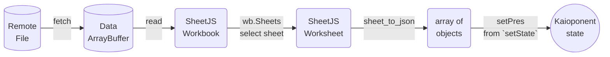
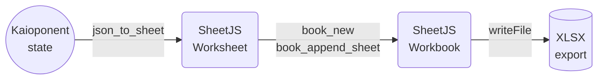

import current from '/version.js';
import Tabs from '@theme/Tabs';
import TabItem from '@theme/TabItem';
import CodeBlock from '@theme/CodeBlock';

[Kaioken](https://kaioken.dev/) is a JavaScript library for building user
interfaces.

[SheetJS](https://sheetjs.com) is a JavaScript library for reading and writing
data from spreadsheets.

This demo uses Kaioken and SheetJS to process and generate spreadsheets. We'll
explore how to load SheetJS in "Kaioponents" (Kaioken components) and compare
common state models and data flow strategies.

:::note pass

This demo focuses on Kaioken concepts. Other demos cover general deployments:

- [Desktop application powered by Tauri](/docs/demos/desktop/tauri)

:::

:::caution Kaioken support is considered experimental.

Great open source software grows with user tests and reports. Any issues should
be reported to the Kaioken project for further diagnosis.

:::

## Installation

[The "Frameworks" section](/docs/getting-started/installation/frameworks) covers
installation with Yarn and other package managers.

The library can be imported directly from JS or JSX code with:

```js
import { read, utils, writeFile } from 'xlsx';
```


## Internal State

The various SheetJS APIs work with various data shapes.  The preferred state
depends on the application.

### Array of Objects

Typically, some users will create a spreadsheet with source data that should be
loaded into the site.  This sheet will have known columns.

#### State

The example [presidents sheet](https://docs.sheetjs.com/pres.xlsx) has one
header row with "Name" and "Index" columns. The natural JS representation is an
object for each row, using the values in the first rows as keys:

<table>
  <thead><tr><th>Spreadsheet</th><th>State</th></tr></thead>
  <tbody><tr><td>


</td><td>

```js
[
  { Name: "Bill Clinton", Index: 42 },
  { Name: "GeorgeW Bush", Index: 43 },
  { Name: "Barack Obama", Index: 44 },
  { Name: "Donald Trump", Index: 45 },
  { Name: "Joseph Biden", Index: 46 }
]
```

</td></tr></tbody></table>

The Kaioken `useState`[^1] hook can configure the state:

<Tabs groupId="lang">
  <TabItem name="JS" value="JavaScript">

```ts
import { useState } from 'kaioken';

/* the kaioponent state is an array of objects */
const [pres, setPres] = useState([]);
```

  </TabItem>
  <TabItem name="TS" value="TypeScript" default>

```ts
import { useState } from 'kaioken';

/* the kaioponent state is an array of objects */
const [pres, setPres] = useState<any[]>([]);
```

When the spreadsheet header row is known ahead of time, row typing is possible:

```ts
import { useState } from 'kaioken';

interface President {
  Name: string;
  Index: number;
}

/* the kaioponent state is an array of presidents */
const [pres, setPres] = useState<President[]>([]);
```

:::caution pass

The types are informative. They do not enforce that worksheets include the named
columns. A runtime data validation library should be used to verify the dataset.

When the file header is not known in advance, `any` should be used.

:::

  </TabItem>
</Tabs>

#### Updating State

The SheetJS [`read`](/docs/api/parse-options) and [`sheet_to_json`](/docs/api/utilities/array#array-output)
functions simplify state updates. They are best used in the function bodies of
`useAsync`[^2], `useEffect`[^3] and `useCallback`[^4] hooks.

A `useEffect` hook can download and update state when a person loads the site:



<Tabs groupId="lang">
  <TabItem name="JS" value="JavaScript">

```js
import { useEffect } from 'kaioken';
import { read, utils } from 'xlsx';

/* Fetch and update the state once */
useEffect(() => { (async() => {
  /* Download from https://docs.sheetjs.com/pres.numbers */
  const f = await fetch("https://docs.sheetjs.com/pres.numbers");
  const ab = await f.arrayBuffer();

  // highlight-start
  /* parse */
  const wb = read(ab);

  /* generate array of objects from first worksheet */
  const ws = wb.Sheets[wb.SheetNames[0]]; // get the first worksheet
  const data = utils.sheet_to_json(ws); // generate objects

  /* update state */
  setPres(data); // update state
  // highlight-end
})(); }, []);
```

  </TabItem>
  <TabItem name="TS" value="TypeScript" default>

```ts
import { useEffect } from 'kaioken';
import { read, utils } from 'xlsx';

/* Fetch and update the state once */
useEffect(() => { (async() => {
  /* Download from https://docs.sheetjs.com/pres.numbers */
  const f = await fetch("https://docs.sheetjs.com/pres.numbers");
  const ab = await f.arrayBuffer();

  // highlight-start
  /* parse */
  const wb = read(ab);

  /* generate array of presidents from the first worksheet */
  const ws = wb.Sheets[wb.SheetNames[0]]; // get the first worksheet
  const data: President[] = utils.sheet_to_json<President>(ws); // generate objects

  /* update state */
  setPres(data); // update state
  // highlight-end
})(); }, []);
```

  </TabItem>
</Tabs>

:::info pass

For this particular use case (fetching a file once when the page loads), it is
strongly recommended to use the `useAsync` hook:

```ts
import { useAsync } from 'kaioken';
import { read, utils } from 'xlsx';

/* Fetch and parse the file */
// highlight-next-line
const { data: pres, loading, error } = useAsync<President[]>(async() => {
  /* Download from https://docs.sheetjs.com/pres.numbers */
  const f = await fetch("https://docs.sheetjs.com/pres.numbers");
  const ab = await f.arrayBuffer();

  /* parse */
  const wb = read(ab);

  /* generate array of presidents from the first worksheet */
  const ws = wb.Sheets[wb.SheetNames[0]]; // get the first worksheet
  const data: President[] = utils.sheet_to_json<President>(ws); // generate objects

  // highlight-start
  /* return data -- essentially setting state */
  return data;
  // highlight-end
}, []);
```

SheetJS users reported that it is easier to reason about data fetching using the
`useAsync` pattern compared to the traditional `useEffect` jujutsu.

:::

#### Rendering Data

Kaioponents typically render HTML tables from arrays of objects. The `TR` table
row elements are typically generated by mapping over the state array, as shown
in the example JSX code:

```jsx title="Example JSX for displaying arrays of objects"
<table>
  {/* The `thead` section includes the table header row */}
  <thead><tr><th>Name</th><th>Index</th></tr></thead>
  {/* The `tbody` section includes the data rows */}
  <tbody>
    {/* generate row (TR) for each president */}
// highlight-start
    {pres.map(row => (
      <tr>
        {/* Generate cell (TD) for name / index */}
        <td>{row.Name}</td>
        <td>{row.Index}</td>
      </tr>
    ))}
// highlight-end
  </tbody>
</table>
```

#### Exporting Data

The [`writeFile`](/docs/api/write-options) and [`json_to_sheet`](/docs/api/utilities/array#array-of-objects-input)
functions simplify exporting data. They are best used in the function bodies of
`useCallback`[^5] hooks attached to button or other elements.

A callback can generate a local file when a user clicks a button:



```ts
import { useCallback } from 'kaioken';
import { utils, writeFile } from 'xlsx';

/* get state data and export to XLSX */
const exportFile = useCallback(() => {
  /* generate worksheet from state */
  // highlight-next-line
  const ws = utils.json_to_sheet(pres);
  /* create workbook and append worksheet */
  const wb = utils.book_new();
  utils.book_append_sheet(wb, ws, "Data");
  /* export to XLSX */
  writeFile(wb, "SheetJSKaiokenAoO.xlsx");
}, [pres]);
```

#### Complete Kaioponent

This complete Kaioponent example fetches a test file and displays the data in a
HTML table. When the export button is clicked, a callback will export a file.

Examples using `useAsync` and `useEffect` with `useState` are shown below:

<Tabs groupId="hook">
  <TabItem name="async" value="useAsync">

```tsx title="src/SheetJSKaiokenAoO.tsx"
import { useAsync, useCallback } from "kaioken";
import { read, utils, writeFileXLSX } from 'xlsx';

interface President {
  Name: string;
  Index: number;
}

export default function SheetJSKaiokenAoO() {
  /* Fetch and parse the file */
  const { data: pres, loading, error } = useAsync<President[]>(async() => {
    const f = await (await fetch("https://docs.sheetjs.com/pres.xlsx")).arrayBuffer();
    const wb = read(f); // parse the array buffer
    const ws = wb.Sheets[wb.SheetNames[0]]; // get the first worksheet
    const data = utils.sheet_to_json<President>(ws); // generate objects
    return data;
  }, []);

  /* get state data and export to XLSX */
  const exportFile = useCallback(() => {
    const ws = utils.json_to_sheet(pres!);
    const wb = utils.book_new();
    utils.book_append_sheet(wb, ws, "Data");
    writeFileXLSX(wb, "SheetJSKaiokenAoO.xlsx");
  }, [pres]);

  return (<table><thead><tr><th>Name</th><th>Index</th></tr></thead><tbody>
    { /* generate row for each president */
      pres && pres.map(pres => (<tr>
        <td>{pres.Name}</td>
        <td>{pres.Index}</td>
      </tr>))
    }
    { /* loading message */
      !pres && loading && ( <tr><td colSpan="2">Loading ...</td></tr> )
    }
    { /* error message */
      !pres && !loading && ( <tr><td colSpan="2">{error.message}</td></tr> )
    }
  </tbody><tfoot><td colSpan={2}>
    <button onclick={exportFile}>Export XLSX</button>
  </td></tfoot></table>);
}
```

:::note pass

Typically the JSX structure uses ternary expressions for testing status:

```jsx
const { data, loading, error } = useAsync(async() => { /* ... */ });

return ( <>
  { data ? (
      <b>Data is loaded</b>
    ) : loading ? (
      <b>Loading ...</b>
    ) : (
      <b>{error.message}</b>
    )
  }
</> );
```

For clarity, the loading and error messages are separated.

:::

  </TabItem>
  <TabItem name="effect" value="useEffect + useState">

```tsx title="src/SheetJSKaiokenAoO.tsx"
import { useCallback, useEffect, useState } from "kaioken";
import { read, utils, writeFileXLSX } from 'xlsx';

interface President {
  Name: string;
  Index: number;
}

export default function SheetJSKaiokenAoO() {
  /* the kaioponent state is an array of presidents */
  const [pres, setPres] = useState<President[]>([]);

  /* Fetch and update the state once */
  useEffect(() => { (async() => {
    const f = await (await fetch("https://docs.sheetjs.com/pres.xlsx")).arrayBuffer();
    const wb = read(f); // parse the array buffer
    const ws = wb.Sheets[wb.SheetNames[0]]; // get the first worksheet
    const data = utils.sheet_to_json<President>(ws); // generate objects
    setPres(data); // update state
  })(); }, []);

  /* get state data and export to XLSX */
  const exportFile = useCallback(() => {
    const ws = utils.json_to_sheet(pres);
    const wb = utils.book_new();
    utils.book_append_sheet(wb, ws, "Data");
    writeFileXLSX(wb, "SheetJSKaiokenAoO.xlsx");
  }, [pres]);

  return (<table><thead><tr><th>Name</th><th>Index</th></tr></thead><tbody>
    { /* generate row for each president */
      pres.map(pres => (<tr>
        <td>{pres.Name}</td>
        <td>{pres.Index}</td>
      </tr>))
    }
  </tbody><tfoot><td colSpan={2}>
    <button onclick={exportFile}>Export XLSX</button>
  </td></tfoot></table>);
}
```

  </TabItem>
</Tabs>

<details open>
  <summary><b>How to run the example</b> (click to hide)</summary>

<Tabs groupId="starter">
  <TabItem name="vite" value="ViteJS">

:::note Tested Deployments

This demo was tested in the following environments:

| Kaioken  | ViteJS   | Date       |
|:---------|:---------|:-----------|
| `0.17.0` | `5.2.11` | 2024-05-21 |

:::

1) Create a new site.

```bash
npm create vite@latest sheetjs-kaioken -- --template vanilla-ts
cd sheetjs-kaioken
npm add --save kaioken
npm add --save vite-plugin-kaioken -D
```

2) Create a new file `vite.config.ts` with the following content:

```ts title="vite.config.ts (create new file)"
import { defineConfig } from "vite"
import kaioken from "vite-plugin-kaioken"

export default defineConfig({
  plugins: [kaioken()],
})
```

3) Edit `tsconfig.json` and add `"jsx": "preserve"` within `compilerOptions`:

```js title="tsconfig.json (add highlighted line)"
{
  "compilerOptions": {
// highlight-next-line
    "jsx": "preserve",
```

4) Replace `src/main.ts` with the following codeblock:

```ts title="src/main.ts (replace contents)"
import { mount } from "kaioken";
import App from "./SheetJSKaiokenAoO";

const root = document.getElementById("app");
mount(App, root!);
```

5) Create a new file `src/SheetJSKaiokenAoO.tsx` using the original code example.

6) Install the SheetJS dependency and start the dev server:

<CodeBlock language="bash">{`\
npm i --save https://cdn.sheetjs.com/xlsx-${current}/xlsx-${current}.tgz
npm run dev`}
</CodeBlock>

7) Open a web browser and access the displayed URL (`http://localhost:5173`)

The page will refresh and show a table with an Export button.  Click the button
and the page will attempt to download `SheetJSKaiokenAoO.xlsx`.

8) Build the site:

```bash
npm run build
```

The generated site will be placed in the `dist` folder.

9) Start a local web server:

```bash
npx http-server dist
```

Access the displayed URL (typically `http://localhost:8080`) with a web browser
and test the page.

  </TabItem>
</Tabs>

When the page loads, the app will fetch https://docs.sheetjs.com/pres.xlsx and
display the data from the first worksheet in a TABLE. The "Export XLSX" button
will generate a workbook that can be opened in a spreadsheet editor.

</details>

### HTML

The main disadvantage of the Array of Objects approach is the specific nature
of the columns.  For more general use, passing around an Array of Arrays works.
However, this does not handle merge cells[^6] well!

The [`sheet_to_html`](/docs/api/utilities/html#html-table-output) function
generates HTML that is aware of merges and other worksheet features. To add the
table to the page, the current recommendation involves setting the `innerHTML`
attribute of a `ref`.

In this example, the kaioponent attaches a `ref` to the `DIV` container. During
export, the first `TABLE` child element can be parsed with [`table_to_book`](/docs/api/utilities/html#html-table-input) to
generate a workbook object.

```tsx title="src/SheetJSKaiokenHTML.tsx"
import { useCallback, useEffect, useRef } from "kaioken";
import { read, utils, writeFileXLSX } from 'xlsx';

export default function SheetJSKaiokenHTML() {
  /* the ref is used in export */
  const tbl = useRef<Element>(null);

  /* Fetch and update the state once */
  useEffect(() => { (async() => {
    const f = await (await fetch("https://docs.sheetjs.com/pres.xlsx")).arrayBuffer();
    const wb = read(f); // parse the array buffer
    const ws = wb.Sheets[wb.SheetNames[0]]; // get the first worksheet
    // highlight-start
    const data = utils.sheet_to_html(ws); // generate HTML
    if(tbl.current == null) return;
    tbl.current.innerHTML = data;
    // highlight-end
  })(); }, []);

  /* get live table and export to XLSX */
  const exportFile = useCallback(() => {
    // highlight-start
    const elt = tbl.current!.getElementsByTagName("TABLE")[0];
    const wb = utils.table_to_book(elt);
    // highlight-end
    writeFileXLSX(wb, "SheetJSKaiokenHTML.xlsx");
  }, [tbl]);

  return ( <>
    <button onclick={exportFile}>Export XLSX</button>
  // highlight-next-line
    <div ref={tbl}/>
  </> );
}
```

<details open>
  <summary><b>How to run the example</b> (click to hide)</summary>

<Tabs groupId="starter">
  <TabItem name="vite" value="ViteJS">

:::note Tested Deployments

This demo was tested in the following environments:

| Kaioken  | ViteJS   | Date       |
|:---------|:---------|:-----------|
| `0.17.0` | `5.2.11` | 2024-05-21 |

:::

1) Create a new site.

```bash
npm create vite@latest sheetjs-kaioken -- --template vanilla-ts
cd sheetjs-kaioken
npm add --save kaioken
npm add --save vite-plugin-kaioken -D
```

2) Create a new file `vite.config.ts` with the following content:

```ts title="vite.config.ts (create new file)"
import { defineConfig } from "vite"
import kaioken from "vite-plugin-kaioken"

export default defineConfig({
  plugins: [kaioken()],
})
```

3) Edit `tsconfig.json` and add `"jsx": "preserve"` within `compilerOptions`:

```js title="tsconfig.json (add highlighted line)"
{
  "compilerOptions": {
// highlight-next-line
    "jsx": "preserve",
```

4) Replace `src/main.ts` with the following codeblock:

```ts title="src/main.ts (replace contents)"
import { mount } from "kaioken";
import App from "./SheetJSKaiokenHTML";

const root = document.getElementById("app");
mount(App, root!);
```

5) Create a new file `src/SheetJSKaiokenHTML.tsx` using the original code example.

6) Install the SheetJS dependency and start the dev server:

<CodeBlock language="bash">{`\
npm i --save https://cdn.sheetjs.com/xlsx-${current}/xlsx-${current}.tgz
npm run dev`}
</CodeBlock>

7) Open a web browser and access the displayed URL (`http://localhost:5173`)

The page will refresh and show a table with an Export button.  Click the button
and the page will attempt to download `SheetJSKaiokenHTML.xlsx`.

8) Build the site:

```bash
npm run build
```

The generated site will be placed in the `dist` folder.

9) Start a local web server:

```bash
npx http-server dist
```

Access the displayed URL (typically `http://localhost:8080`) with a web browser
and test the page.

  </TabItem>
</Tabs>

When the page loads, the app will fetch https://docs.sheetjs.com/pres.xlsx and
display the data from the first worksheet in a TABLE. The "Export XLSX" button
will generate a workbook that can be opened in a spreadsheet editor.

</details>

[^1]: See [`useState`](https://kaioken.dev/docs/hooks/useState) in the Kaioken documentation.
[^2]: See [`useAsync`](https://kaioken.dev/docs/hooks/useAsync) in the Kaioken documentation.
[^3]: See [`useEffect`](https://kaioken.dev/docs/hooks/useEffect) in the Kaioken documentation.
[^4]: See [`useCallback`](https://kaioken.dev/docs/hooks/useCallback) in the Kaioken documentation.
[^5]: See [`useCallback`](https://kaioken.dev/docs/hooks/useCallback) in the Kaioken documentation.
[^6]: See ["Merged Cells" in "SheetJS Data Model"](/docs/csf/features/merges) for more details.
