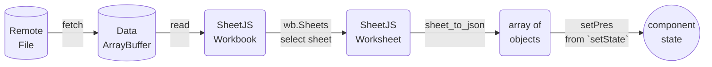
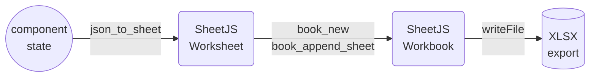

import current from '/version.js';
import Tabs from '@theme/Tabs';
import TabItem from '@theme/TabItem';
import CodeBlock from '@theme/CodeBlock';

[ReactJS](https://react.dev/) is a JavaScript library for building user interfaces.

[SheetJS](https://sheetjs.com) is a JavaScript library for reading and writing
data from spreadsheets.

This demo uses ReactJS and SheetJS to process and generate spreadsheets. We'll
explore how to load SheetJS in a ReactJS site and compare common state models
and data flow strategies.

:::note pass

This demo focuses on ReactJS concepts. Other demos cover general deployments:

- [Static Site Generation powered by NextJS](/docs/demos/static/nextjs)
- [iOS and Android applications powered by React Native](/docs/demos/mobile/reactnative)
- [Desktop application powered by React Native Windows + macOS](/docs/demos/desktop/reactnative)
- [React Data Grid UI component](/docs/demos/grid/rdg)
- [Glide Data Grid UI component](/docs/demos/grid/gdg)

:::

## Installation

[The "Frameworks" section](/docs/getting-started/installation/frameworks) covers
installation with Yarn and other package managers.

The library can be imported directly from JS or JSX code with:

```js
import { read, utils, writeFile } from 'xlsx';
```


## Internal State

The various SheetJS APIs work with various data shapes.  The preferred state
depends on the application.

### Array of Objects

Typically, some users will create a spreadsheet with source data that should be
loaded into the site.  This sheet will have known columns.

#### State

The example [presidents sheet](https://docs.sheetjs.com/pres.xlsx) has one
header row with "Name" and "Index" columns. The natural JS representation is an
object for each row, using the values in the first rows as keys:

<table>
  <thead><tr><th>Spreadsheet</th><th>State</th></tr></thead>
  <tbody><tr><td>


</td><td>

```js
[
  { Name: "Bill Clinton", Index: 42 },
  { Name: "GeorgeW Bush", Index: 43 },
  { Name: "Barack Obama", Index: 44 },
  { Name: "Donald Trump", Index: 45 },
  { Name: "Joseph Biden", Index: 46 }
]
```

</td></tr></tbody></table>

The ReactJS `useState`[^1] hook can configure the state:

<Tabs groupId="lang">
  <TabItem name="JS" value="JavaScript">

```ts
import { useState } from 'react';

/* the component state is an array of objects */
const [pres, setPres] = useState([]);
```

  </TabItem>
  <TabItem name="TS" value="TypeScript" default>

```ts
import { useState } from 'react';

/* the component state is an array of objects */
const [pres, setPres] = useState<any[]>([]);
```

When the spreadsheet header row is known ahead of time, row typing is possible:

```ts
import { useState } from 'react';

interface President {
  Name: string;
  Index: number;
}

/* the component state is an array of presidents */
const [pres, setPres] = useState<President[]>([]);
```

:::caution pass

The types are informative. They do not enforce that worksheets include the named
columns. A runtime data validation library should be used to verify the dataset.

When the file header is not known in advance, `any` should be used.

:::

  </TabItem>
</Tabs>

#### Updating State

The SheetJS [`read`](/docs/api/parse-options) and [`sheet_to_json`](/docs/api/utilities/array#array-output)
functions simplify state updates. They are best used in the function bodies of
`useEffect`[^2] and `useCallback`[^3] hooks.

A `useEffect` hook can download and update state when a person loads the site:



<Tabs groupId="lang">
  <TabItem name="JS" value="JavaScript">

```js
import { useEffect } from 'react';
import { read, utils } from 'xlsx';

/* Fetch and update the state once */
useEffect(() => { (async() => {
  /* Download from https://docs.sheetjs.com/pres.numbers */
  const f = await fetch("https://docs.sheetjs.com/pres.numbers");
  const ab = await f.arrayBuffer();

  // highlight-start
  /* parse */
  const wb = read(ab);

  /* generate array of objects from first worksheet */
  const ws = wb.Sheets[wb.SheetNames[0]]; // get the first worksheet
  const data = utils.sheet_to_json(ws); // generate objects

  /* update state */
  setPres(data); // update state
  // highlight-end
})(); }, []);
```

  </TabItem>
  <TabItem name="TS" value="TypeScript" default>

```ts
import { useEffect } from 'react';
import { read, utils } from 'xlsx';

/* Fetch and update the state once */
useEffect(() => { (async() => {
  /* Download from https://docs.sheetjs.com/pres.numbers */
  const f = await fetch("https://docs.sheetjs.com/pres.numbers");
  const ab = await f.arrayBuffer();

  // highlight-start
  /* parse */
  const wb = read(ab);

  /* generate array of presidents from the first worksheet */
  const ws = wb.Sheets[wb.SheetNames[0]]; // get the first worksheet
  const data: President[] = utils.sheet_to_json<President>(ws); // generate objects

  /* update state */
  setPres(data); // update state
  // highlight-end
})(); }, []);
```

  </TabItem>
</Tabs>

#### Rendering Data

Components typically render HTML tables from arrays of objects. The `<tr>` table
row elements are typically generated by mapping over the state array, as shown
in the example JSX code:

```jsx title="Example JSX for displaying arrays of objects"
<table>
  {/* The `thead` section includes the table header row */}
  <thead><tr><th>Name</th><th>Index</th></tr></thead>
  {/* The `tbody` section includes the data rows */}
  <tbody>
    {/* generate row (TR) for each president */}
// highlight-start
    {pres.map(row => (
      <tr>
        {/* Generate cell (TD) for name / index */}
        <td>{row.Name}</td>
        <td>{row.Index}</td>
      </tr>
    ))}
// highlight-end
  </tbody>
</table>
```

#### Exporting Data

The [`writeFile`](/docs/api/write-options) and [`json_to_sheet`](/docs/api/utilities/array#array-of-objects-input)
functions simplify exporting data. They are best used in the function bodies of
`useCallback`[^4] hooks attached to button or other elements.

A callback can generate a local file when a user clicks a button:



```ts
import { useCallback } from 'react';
import { utils, writeFile } from 'xlsx';

/* get state data and export to XLSX */
const exportFile = useCallback(() => {
  /* generate worksheet from state */
  // highlight-next-line
  const ws = utils.json_to_sheet(pres);
  /* create workbook and append worksheet */
  const wb = utils.book_new();
  utils.book_append_sheet(wb, ws, "Data");
  /* export to XLSX */
  writeFile(wb, "SheetJSReactAoO.xlsx");
}, [pres]);
```

#### Complete Component

This complete component example fetches a test file and displays the contents in
a HTML table. When the export button is clicked, a callback will export a file:

```jsx title="src/SheetJSReactAoO.js"
import React, { useCallback, useEffect, useState } from "react";
import { read, utils, writeFileXLSX } from 'xlsx';

export default function SheetJSReactAoO() {
  /* the component state is an array of presidents */
  const [pres, setPres] = useState([]);

  /* Fetch and update the state once */
  useEffect(() => { (async() => {
    const f = await (await fetch("https://docs.sheetjs.com/pres.xlsx")).arrayBuffer();
    // highlight-start
    const wb = read(f); // parse the array buffer
    const ws = wb.Sheets[wb.SheetNames[0]]; // get the first worksheet
    const data = utils.sheet_to_json(ws); // generate objects
    setPres(data); // update state
    // highlight-end
  })(); }, []);

  /* get state data and export to XLSX */
  const exportFile = useCallback(() => {
    // highlight-next-line
    const ws = utils.json_to_sheet(pres);
    const wb = utils.book_new();
    utils.book_append_sheet(wb, ws, "Data");
    writeFileXLSX(wb, "SheetJSReactAoO.xlsx");
  }, [pres]);

  return (<table><thead><tr><th>Name</th><th>Index</th></tr></thead><tbody>
    { /* generate row for each president */
// highlight-start
      pres.map(pres => (<tr>
        <td>{pres.Name}</td>
        <td>{pres.Index}</td>
      </tr>))
// highlight-end
    }
  </tbody><tfoot><td colSpan={2}>
    <button onClick={exportFile}>Export XLSX</button>
  </td></tfoot></table>);
}
```

<details open>
  <summary><b>How to run the example</b> (click to hide)</summary>

<Tabs groupId="starter">
  <TabItem name="vite" value="ViteJS">

:::note Tested Deployments

This demo was tested in the following environments:

| ReactJS  | ViteJS  | Date       |
|:---------|:--------|:-----------|
| `18.2.0` | `5.1.6` | 2024-03-13 |

:::

1) Create a new site:

```bash
npm create vite@latest sheetjs-react -- --template react
```

2) Install the SheetJS dependency and start the dev server:

<CodeBlock language="bash">{`\
cd sheetjs-react
npm i
npm i --save https://cdn.sheetjs.com/xlsx-${current}/xlsx-${current}.tgz
npm run dev`}
</CodeBlock>

3) Open a web browser and access the displayed URL (`http://localhost:5173`)

4) Replace `src/App.jsx` with the `src/SheetJSReactAoO.js` example.

The page will refresh and show a table with an Export button.  Click the button
and the page will attempt to download `SheetJSReactAoO.xlsx`.

5) Build the site:

```bash
npm run build
```

The generated site will be placed in the `dist` folder.

6) Start a local web server:

```bash
npx http-server dist
```

Access the displayed URL (typically `http://localhost:8080`) with a web browser
and test the page.

  </TabItem>
  <TabItem name="CRA" value="create-react-app">

:::note Tested Deployments

This demo was tested in the following environments:

| ReactJS  | CRA     | Date       |
|:---------|:--------|:-----------|
| `18.2.0` | `5.0.1` | 2024-03-13 |

:::

1) Create a new site:

```bash
npx -y create-react-app@5.0.1 --scripts-version=5.0.1 sheetjs-react
```

2) Install the SheetJS dependency and start the dev server:

<CodeBlock language="bash">{`\
cd sheetjs-react
npm i
npm i --save https://cdn.sheetjs.com/xlsx-${current}/xlsx-${current}.tgz
npm start`}
</CodeBlock>

3) Open a web browser and access the displayed URL (`http://localhost:3000`)

4) Replace `src/App.js` with the `src/SheetJSReactAoO.js` example.

The page will refresh and show a table with an Export button.  Click the button
and the page will attempt to download `SheetJSReactAoO.xlsx`.

5) Build the site:

```bash
npm run build
```

The generated site will be placed in the `build` folder.

6) Start a local web server:

```bash
npx http-server build
```

Access the displayed URL (typically `http://localhost:8080`) with a web browser
and test the page.

  </TabItem>
  <TabItem name="nextjs" value="NextJS">

:::note Tested Deployments

This demo was tested in the following environments:

| ReactJS  | NextJS   | Date       |
|:---------|:---------|:-----------|
| `18.2.0` | `14.1.3` | 2024-03-13 |

:::

:::info pass

This demo focuses on processing data in Client Components.

The [NextJS demo](/docs/demos/static/nextjs) covers static site generation.

:::

:::caution pass

NextJS requires a number of workarounds for simple client-side JavaScript code.

**It is strongly recommended to use ViteJS or create-react-app when possible!**

:::

:::danger Telemetry

NextJS collects telemetry by default. The `telemetry` subcommand can disable it:

```js
npx next telemetry disable
```

The setting can be verified by running

```js
npx next telemetry status
```

:::

0) Disable NextJS telemetry:

```bash
npx next telemetry disable
```

1) Create a new site:

```bash
npx create-next-app@latest sheetjs-react --ts --no-eslint --no-tailwind --no-src-dir --no-app --import-alias "@/*"
```

2) Install the SheetJS dependency and start the dev server:

<CodeBlock language="bash">{`\
cd sheetjs-react
npm i
npx next telemetry disable
npm i --save https://cdn.sheetjs.com/xlsx-${current}/xlsx-${current}.tgz
npm run dev`}
</CodeBlock>

3) Open a web browser and access the displayed URL (`http://localhost:5173`)

4) Replace `src/App.jsx` with the `src/SheetJSReactAoO.js` example.

After replacing the code, add the following to the top of `src/App.jsx`:

```js title="src/App.jsx (add to top)"
"use client";
```

:::info NextJS Client Component Workaround

The goal is to run SheetJS code in the browser. NextJS will attempt to render
pages on the server by default. `"use client";` instructs NextJS to treat the
exported component as a "Client Component" that will be rendered in the browser.

If the pragma is not added, NextJS will report errors related to hydration:

```
Error: Hydration failed because the initial UI does not match what was rendered on the server.

Warning: Expected server HTML to contain a matching <td> in <tfoot>.

See more info here: https://nextjs.org/docs/messages/react-hydration-error
```

:::

The page will refresh and show a table with an Export button.  Click the button
and the page will attempt to download `SheetJSReactAoO.xlsx`.

5) Build the site:

```bash
npm run build
```

The generated site will be placed in the `dist` folder.

6) Start a local web server:

```bash
npx http-server dist
```

Access the displayed URL (typically `http://localhost:8080`) with a web browser
and test the page.

  </TabItem>
</Tabs>

When the page loads, the app will fetch https://docs.sheetjs.com/pres.xlsx and
display the data from the first worksheet in a TABLE. The "Export XLSX" button
will generate a workbook that can be opened in a spreadsheet editor.

</details>

### HTML

The main disadvantage of the Array of Objects approach is the specific nature
of the columns.  For more general use, passing around an Array of Arrays works.
However, this does not handle merge cells[^5] well!

The [`sheet_to_html`](/docs/api/utilities/html#html-table-output) function
generates HTML that is aware of merges and other worksheet features.  ReactJS
`dangerouslySetInnerHTML`[^6] prop allows code to set the `innerHTML` attribute,
effectively inserting the code into the page.

In this example, the component attaches a `ref` to the `DIV` container. During
export, the first `TABLE` child element can be parsed with [`table_to_book`](/docs/api/utilities/html#html-table-input) to
generate a workbook object.

```jsx title="src/SheetJSReactHTML.js"
import React, { useCallback, useEffect, useRef, useState } from "react";
import { read, utils, writeFileXLSX } from 'xlsx';

export default function SheetJSReactHTML() {
  /* the component state is an HTML string */
  const [__html, setHtml] = useState("");
  /* the ref is used in export */
  const tbl = useRef(null);

  /* Fetch and update the state once */
  useEffect(() => { (async() => {
    const f = await (await fetch("https://docs.sheetjs.com/pres.xlsx")).arrayBuffer();
    const wb = read(f); // parse the array buffer
    const ws = wb.Sheets[wb.SheetNames[0]]; // get the first worksheet
    // highlight-start
    const data = utils.sheet_to_html(ws); // generate HTML
    setHtml(data); // update state
    // highlight-end
  })(); }, []);

  /* get live table and export to XLSX */
  const exportFile = useCallback(() => {
    // highlight-start
    const elt = tbl.current.getElementsByTagName("TABLE")[0];
    const wb = utils.table_to_book(elt);
    // highlight-end
    writeFileXLSX(wb, "SheetJSReactHTML.xlsx");
  }, [tbl]);

  return ( <>
    <button onClick={exportFile}>Export XLSX</button>
  // highlight-next-line
    <div ref={tbl} dangerouslySetInnerHTML={{ __html }} />
  </> );
}
```

<details open>
  <summary><b>How to run the example</b> (click to hide)</summary>

<Tabs groupId="starter">
  <TabItem name="vite" value="ViteJS">

:::note Tested Deployments

This demo was tested in the following environments:

| ReactJS  | ViteJS  | Date       |
|:---------|:--------|:-----------|
| `18.2.0` | `5.1.6` | 2024-03-13 |

:::

1) Create a new site:

```bash
npm create vite@latest sheetjs-react -- --template react
```

2) Install the SheetJS dependency and start the dev server:

<CodeBlock language="bash">{`\
cd sheetjs-react
npm i
npm i --save https://cdn.sheetjs.com/xlsx-${current}/xlsx-${current}.tgz
npm run dev`}
</CodeBlock>

3) Open a web browser and access the displayed URL (`http://localhost:5173`)

4) Replace `src/App.jsx` with the `src/SheetJSReactHTML.js` example.

The page will refresh and show a table with an Export button.  Click the button
and the page will attempt to download `SheetJSReactHTML.xlsx`.

5) Build the site:

```bash
npm run build
```

The generated site will be placed in the `dist` folder.

6) Start a local web server:

```bash
npx http-server dist
```

Access the displayed URL (typically `http://localhost:8080`) with a web browser
and test the page.

  </TabItem>
  <TabItem name="CRA" value="create-react-app">

:::note Tested Deployments

This demo was tested in the following environments:

| ReactJS  | CRA     | Date       |
|:---------|:--------|:-----------|
| `18.2.0` | `5.0.1` | 2024-03-13 |

:::

1) Create a new site:

```bash
npx -y create-react-app@5.0.1 --scripts-version=5.0.1 sheetjs-react
```

2) Install the SheetJS dependency and start the dev server:

<CodeBlock language="bash">{`\
cd sheetjs-react
npm i
npm i --save https://cdn.sheetjs.com/xlsx-${current}/xlsx-${current}.tgz
npm start`}
</CodeBlock>

3) Open a web browser and access the displayed URL (`http://localhost:3000`)

4) Replace `src/App.js` with the `src/SheetJSReactHTML.js` example.

The page will refresh and show a table with an Export button.  Click the button
and the page will attempt to download `SheetJSReactHTML.xlsx`.

5) Build the site:

```bash
npm run build
```

The generated site will be placed in the `build` folder.

6) Start a local web server:

```bash
npx http-server build
```

Access the displayed URL (typically `http://localhost:8080`) with a web browser
and test the page.

  </TabItem>
</Tabs>

When the page loads, the app will fetch https://docs.sheetjs.com/pres.xlsx and
display the data from the first worksheet in a TABLE. The "Export XLSX" button
will generate a workbook that can be opened in a spreadsheet editor.

</details>

### Rows and Columns

Some data grids and UI components split worksheet state in two parts: an array
of column attribute objects and an array of row objects.  The former is used to
generate column headings and for indexing into the row objects.

The safest approach is to use an array of arrays for state and to generate
column objects that map to A1-Style column headers.

The [React Data Grid demo](/docs/demos/grid/rdg#rows-and-columns-state) uses
this approach with the following column and row structure:

```js
/* rows are generated with a simple array of arrays */
const rows = utils.sheet_to_json(worksheet, { header: 1 });

/* column objects are generated based on the worksheet range */
const range = utils.decode_range(ws["!ref"]||"A1");
const columns = Array.from({ length: range.e.c + 1 }, (_, i) => ({
  /* for an array of arrays, the keys are "0", "1", "2", ... */
  key: String(i),
  /* column labels: encode_col translates 0 -> "A", 1 -> "B", 2 -> "C", ... */
  name: XLSX.utils.encode_col(i)
}));
```


## Legacy Deployments

[The Standalone Scripts](/docs/getting-started/installation/standalone) play nice
with legacy deployments that do not use a bundler.

[The legacy demo](pathname:///react/index.html) shows a simple ReactJS component
transpiled in the browser using Babel standalone library.

[^1]: See [`useState`](https://react.dev/reference/react/useState) in the ReactJS documentation.
[^2]: See [`useEffect`](https://react.dev/reference/react/useEffect) in the ReactJS documentation.
[^3]: See [`useCallback`](https://react.dev/reference/react/useCallback) in the ReactJS documentation.
[^4]: See [`useCallback`](https://react.dev/reference/react/useCallback) in the ReactJS documentation.
[^5]: See ["Merged Cells" in "SheetJS Data Model"](/docs/csf/features/merges) for more details.
[^6]: [`dangerouslySetInnerHTML`](https://react.dev/reference/react-dom/components/common#common-props) is a ReactJS prop supported for all built-in components.
