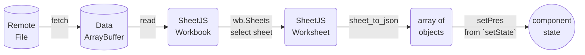
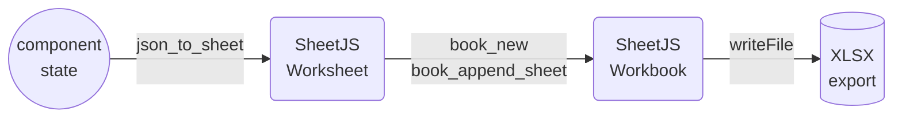

import current from '/version.js';
import Tabs from '@theme/Tabs';
import TabItem from '@theme/TabItem';
import CodeBlock from '@theme/CodeBlock';

Angular is a JS library for building user interfaces.[^1]

[SheetJS](https://sheetjs.com) is a JavaScript library for reading and writing
data from spreadsheets.

This demo uses Angular and SheetJS to process and generate spreadsheets. We'll
explore how to load SheetJS in Angular projects and compare common state models
and data flow strategies.

:::note pass

This demo focuses on Angular concepts. Other demos cover general deployments:

- [iOS and Android applications powered by NativeScript](/docs/demos/mobile/nativescript)
- [iOS and Android applications powered by Ionic](/docs/demos/mobile/ionic)

:::

:::caution pass

Angular tooling uses native NodeJS modules. There are a number of issues when
trying to run Angular projects with different NodeJS versions. These issues
should be directed to the Angular project.

:::

:::danger Telemetry

Angular CLI enables telemetry by default. When using a recent version, disable
analytics globally through the CLI tool before creating a new project:

```bash
npx @angular/cli analytics disable -g
```

(If prompted to share data, type `N` and press Enter)

:::


## Installation

[The "Frameworks" section](/docs/getting-started/installation/frameworks) covers
installation with `pnpm` and other package managers.

The library can be imported directly from JS or TS code with:

```js
import { read, utils, writeFile } from 'xlsx';
```


## Internal State

The various SheetJS APIs work with various data shapes.  The preferred state
depends on the application.

:::danger pass

Angular 17 broke backwards compatibility with projects using Angular 2 - 16.

**Despite the Angular turmoil, SheetJS plays nice with each version of Angular**.

When relevant, code snippets for Angular 17 and Angular 2 - 16 are included. The
"Angular 2-16" and "Angular 17+" tabs change the displayed code blocks

:::

### Array of Objects

Typically, some users will create a spreadsheet with source data that should be
loaded into the site.  This sheet will have known columns.

#### State

The example [presidents sheet](https://docs.sheetjs.com/pres.xlsx) has one
header row with "Name" and "Index" columns. The natural JS representation is an
object for each row, using the values in the first rows as keys:

<table>
  <thead><tr><th>Spreadsheet</th><th>State</th></tr></thead>
  <tbody><tr><td>


</td><td>

```js
[
  { Name: "Bill Clinton", Index: 42 },
  { Name: "GeorgeW Bush", Index: 43 },
  { Name: "Barack Obama", Index: 44 },
  { Name: "Donald Trump", Index: 45 },
  { Name: "Joseph Biden", Index: 46 }
]
```

</td></tr></tbody></table>

This data is typically stored as an array of objects in the component class:

```ts
import { Component } from '@angular/core';

@Component({ /* ... component configuration options ... */ })
export class AppComponent {
  /* the component state is an array of objects */
  // highlight-next-line
  rows: any[] = [ { Name: "SheetJS", Index: 0 }];
}
```

When the spreadsheet header row is known ahead of time, row typing is possible:

```ts
import { Component } from '@angular/core';

interface President {
  Name: string;
  Index: number;
}

@Component({ /* ... component configuration options ... */ })
export class AppComponent {
  /* the component state is an array of presidents */
  // highlight-next-line
  rows: President[] = [ { Name: "SheetJS", Index: 0 }];
}
```

:::caution pass

The types are informative. They do not enforce that worksheets include the named
columns. A runtime data validation library should be used to verify the dataset.

When the file header is not known in advance, `any` should be used.

:::

#### Updating State

The SheetJS [`read`](/docs/api/parse-options) and [`sheet_to_json`](/docs/api/utilities/array#array-output)
functions simplify state updates. They are best used in the function bodies of
`ngOnInit`[^2] and event handlers.

A `ngOnInit` method can download and update state when a person loads the site:



```ts
import { Component } from '@angular/core';
import { read, utils } from 'xlsx';

interface President { Name: string; Index: number };

@Component({ /* ... component configuration options ... */ })
export class AppComponent {
  rows: President[] = [ { Name: "SheetJS", Index: 0 }];
  ngOnInit(): void { (async() => {
    /* Download from https://docs.sheetjs.com/pres.numbers */
    const f = await fetch("https://docs.sheetjs.com/pres.numbers");
    const ab = await f.arrayBuffer();

    // highlight-start
    /* parse workbook */
    const wb = read(ab);

    /* generate array of objects from first worksheet */
    const ws = wb.Sheets[wb.SheetNames[0]]; // get the first worksheet
    const data = utils.sheet_to_json<President>(ws); // generate objects

    /* update data */
    this.rows = data;
    // highlight-end
  })(); }
}
```

#### Rendering Data

Components typically render HTML tables from arrays of objects. The `<tr>` table
row elements are typically generated by mapping over the state array, as shown
in the example template.

:::caution pass

Angular 2 - 16 recommended using `ngFor`[^3]. Angular 17 no longer supports the
storied syntax, instead opting for a `@for` block reminiscent of JavaScript[^4].

:::

<Tabs groupId="ngVer">
  <TabItem value="2" label="Angular 2-16">

```html title="Example Template for displaying arrays of objects (Angular 2-16)"
<div class="content" role="main"><table>
  <thead><tr><th>Name</th><th>Index</th></tr></thead>
  <tbody>
// highlight-start
    <tr *ngFor="let row of rows">
      <td>{{row.Name}}</td>
      <td>{{row.Index}}</td>
    </tr>
// highlight-end
  </tbody>
</table></div>
```

  </TabItem>
  <TabItem value="17" label="Angular 17+">

```html title="Example Template for displaying arrays of objects (Angular 17+)"
<div class="content" role="main"><table>
  <thead><tr><th>Name</th><th>Index</th></tr></thead>
  <tbody>
// highlight-start
  @for(row of rows; track $index) { <tr>
      <td>{{row.Name}}</td>
      <td>{{row.Index}}</td>
  </tr> }
// highlight-end
  </tbody>
</table></div>
```

  </TabItem>
</Tabs>

#### Exporting Data

The [`writeFile`](/docs/api/write-options) and [`json_to_sheet`](/docs/api/utilities/array#array-of-objects-input)
functions simplify exporting data. They are best used in the function bodies of
event handlers attached to button or other elements.

A callback can generate a local file when a user clicks a button:



```ts title="src/app/app.component.ts"
import { Component } from '@angular/core';
import { utils, writeFileXLSX } from 'xlsx';

interface President { Name: string; Index: number };

@Component({ /* ... component configuration options ... */ })
export class AppComponent {
  rows: President[] = [ { Name: "SheetJS", Index: 0 }];
  /* get state data and export to XLSX */
  onSave(): void {
    /* generate worksheet from state */
    // highlight-next-line
    const ws = utils.json_to_sheet(this.rows);
    /* create workbook and append worksheet */
    const wb = utils.book_new();
    utils.book_append_sheet(wb, ws, "Data");
    /* export to XLSX */
    writeFileXLSX(wb, "SheetJSAngularAoO.xlsx");
  }
}
```

#### Complete Component

This complete component example fetches a test file and displays the contents in
a HTML table. When the export button is clicked, a callback will export a file:

<Tabs groupId="ngVer">
  <TabItem value="2" label="Angular 2-16">

```ts title="src/app/app.component.ts"
import { Component } from '@angular/core';
import { read, utils, writeFileXLSX } from 'xlsx';

interface President { Name: string; Index: number };

@Component({
  selector: 'app-root',
  template: `
<div class="content" role="main"><table>
  <thead><tr><th>Name</th><th>Index</th></tr></thead>
  <tbody>
// highlight-start
    <tr *ngFor="let row of rows">
      <td>{{row.Name}}</td>
      <td>{{row.Index}}</td>
    </tr>
// highlight-end
  </tbody><tfoot>
    <button (click)="onSave()">Export XLSX</button>
  </tfoot>
</table></div>
`
})
export class AppComponent {
  // highlight-next-line
  rows: President[] = [ { Name: "SheetJS", Index: 0 }];
  ngOnInit(): void { (async() => {
    /* Download from https://docs.sheetjs.com/pres.numbers */
    const f = await fetch("https://docs.sheetjs.com/pres.numbers");
    const ab = await f.arrayBuffer();

    /* parse workbook */
    // highlight-next-line
    const wb = read(ab);

    /* update data */
    // highlight-next-line
    this.rows = utils.sheet_to_json<President>(wb.Sheets[wb.SheetNames[0]]);

  })(); }
  /* get state data and export to XLSX */
  onSave(): void {
    // highlight-next-line
    const ws = utils.json_to_sheet(this.rows);
    const wb = utils.book_new();
    utils.book_append_sheet(wb, ws, "Data");
    writeFileXLSX(wb, "SheetJSAngularAoO.xlsx");
  }
}
```

  </TabItem>
  <TabItem value="17" label="Angular 17+">

```ts title="src/app/app.component.ts"
import { Component } from '@angular/core';
import { read, utils, writeFileXLSX } from 'xlsx';

interface President { Name: string; Index: number };

@Component({
  selector: 'app-root',
  standalone: true,
  template: `
<div class="content" role="main"><table>
  <thead><tr><th>Name</th><th>Index</th></tr></thead>
  <tbody>
// highlight-start
  @for(row of rows; track $index) {
    <tr>
      <td>{{row.Name}}</td>
      <td>{{row.Index}}</td>
    </tr>
  }
// highlight-end
  </tbody><tfoot>
    <button (click)="onSave()">Export XLSX</button>
  </tfoot>
</table></div>
`
})
export class AppComponent {
  // highlight-next-line
  rows: President[] = [ { Name: "SheetJS", Index: 0 }];
  ngOnInit(): void { (async() => {
    /* Download from https://docs.sheetjs.com/pres.numbers */
    const f = await fetch("https://docs.sheetjs.com/pres.numbers");
    const ab = await f.arrayBuffer();

    /* parse workbook */
    // highlight-next-line
    const wb = read(ab);

    /* update data */
    // highlight-next-line
    this.rows = utils.sheet_to_json<President>(wb.Sheets[wb.SheetNames[0]]);

  })(); }
  /* get state data and export to XLSX */
  onSave(): void {
    // highlight-next-line
    const ws = utils.json_to_sheet(this.rows);
    const wb = utils.book_new();
    utils.book_append_sheet(wb, ws, "Data");
    writeFileXLSX(wb, "SheetJSAngularAoO.xlsx");
  }
}
```

  </TabItem>
</Tabs>

<details open>
  <summary><b>How to run the example</b> (click to hide)</summary>

:::note Tested Deployments

This demo was tested in the following environments:

| Angular   | Date       |
|:----------|:-----------|
| `17.3.0`  | 2024-03-13 |
| `16.2.12` | 2024-03-13 |

:::

0) Disable telemetry:

```bash
npx @angular/cli analytics disable -g
```

1) Create a new project:

```bash
npx @angular/cli@17.3.0 new --minimal --defaults --no-interactive sheetjs-angular
```

:::note pass

The `@angular/cli` version controls the project version of Angular. For example,
the following command uses Angular 16.2.12:

```bash
npx @angular/cli@16.2.12 new --minimal --defaults --no-interactive sheetjs-angular
```

:::

2) Install the SheetJS dependency and start the dev server:

<CodeBlock language="bash">{`\
cd sheetjs-angular
npm i
npm i --save https://cdn.sheetjs.com/xlsx-${current}/xlsx-${current}.tgz
npx @angular/cli analytics disable
npm start`}
</CodeBlock>

3) Open a web browser and access the displayed URL (`http://localhost:4200`)

4) In the previous `src/app/app.component.ts` code snippet, select the tab for
the appropriate version of Angular ("Angular 2-16" or "Angular 17+"), copy the
code contents and replace `src/app/app.component.ts` in the project.

The page will refresh and show a table with an Export button. Click the button
and the page will attempt to download `SheetJSAngularAoO.xlsx`. Open the file
with a spreadsheet editor.

5) Stop the dev server and build the site:

```bash
npm run build
```

To test the generated site, start a web server:

<Tabs groupId="ngVer">
  <TabItem value="2" label="Angular 2-16">

```bash
npx -y http-server dist/sheetjs-angular/
```

  </TabItem>
  <TabItem value="17" label="Angular 17+">

```bash
npx -y http-server dist/sheetjs-angular/browser/
```

  </TabItem>
</Tabs>

Access the displayed URL (typically `http://localhost:8080`) with a web browser
to test the bundled site.

</details>

### HTML

The main disadvantage of the Array of Objects approach is the specific nature
of the columns.  For more general use, passing around an Array of Arrays works.
However, this does not handle merge cells[^5] well!

The `sheet_to_html` function generates HTML that is aware of merges and other
worksheet features.  The generated HTML does not contain any `<script>` tags,
and should therefore be safe to pass to an `innerHTML`-bound variable, but the
`DomSanitizer` approach[^6] is strongly recommended:

<Tabs groupId="ngVer">
  <TabItem value="2" label="Angular 2-16">

```ts title="src/app/app.component.ts"
import { Component, ElementRef, ViewChild } from '@angular/core';
// highlight-next-line
import { DomSanitizer, SafeHtml } from '@angular/platform-browser';
import { read, utils, writeFileXLSX } from 'xlsx';

@Component({
  selector: 'app-root',
// highlight-next-line
  template: `<div class="content" role="main" [innerHTML]="html" #tableau></div>
    <button (click)="onSave()">Export XLSX</button>`
})
export class AppComponent {
  // highlight-start
  constructor(private sanitizer: DomSanitizer) {}
  html: SafeHtml = "";
  @ViewChild('tableau') tabeller!: ElementRef<HTMLDivElement>;
  // highlight-end
  ngOnInit(): void { (async() => {
    /* Download from https://docs.sheetjs.com/pres.numbers */
    const f = await fetch("https://docs.sheetjs.com/pres.numbers");
    const ab = await f.arrayBuffer();

    /* parse workbook */
    const wb = read(ab);

    /* update data */
    // highlight-start
    const h = utils.sheet_to_html(wb.Sheets[wb.SheetNames[0]]);
    this.html = this.sanitizer.bypassSecurityTrustHtml(h);
    // highlight-end
  })(); }
  /* get live table and export to XLSX */
  onSave(): void {
    // highlight-start
    const elt = this.tabeller.nativeElement.getElementsByTagName("TABLE")[0];
    const wb = utils.table_to_book(elt);
    // highlight-end
    writeFileXLSX(wb, "SheetJSAngularHTML.xlsx");
  }
}
```

  </TabItem>
  <TabItem value="17" label="Angular 17+">

```ts title="src/app/app.component.ts"
import { Component, ElementRef, ViewChild } from '@angular/core';
// highlight-next-line
import { DomSanitizer, SafeHtml } from '@angular/platform-browser';
import { read, utils, writeFileXLSX } from 'xlsx';

@Component({
  selector: 'app-root',
  standalone: true,
// highlight-next-line
  template: `<div class="content" role="main" [innerHTML]="html" #tableau></div>
    <button (click)="onSave()">Export XLSX</button>`
})
export class AppComponent {
  // highlight-start
  constructor(private sanitizer: DomSanitizer) {}
  html: SafeHtml = "";
  @ViewChild('tableau') tabeller!: ElementRef<HTMLDivElement>;
  // highlight-end
  ngOnInit(): void { (async() => {
    /* Download from https://docs.sheetjs.com/pres.numbers */
    const f = await fetch("https://docs.sheetjs.com/pres.numbers");
    const ab = await f.arrayBuffer();

    /* parse workbook */
    const wb = read(ab);

    /* update data */
    // highlight-start
    const h = utils.sheet_to_html(wb.Sheets[wb.SheetNames[0]]);
    this.html = this.sanitizer.bypassSecurityTrustHtml(h);
    // highlight-end
  })(); }
  /* get live table and export to XLSX */
  onSave(): void {
    // highlight-start
    const elt = this.tabeller.nativeElement.getElementsByTagName("TABLE")[0];
    const wb = utils.table_to_book(elt);
    // highlight-end
    writeFileXLSX(wb, "SheetJSAngularHTML.xlsx");
  }
}
```

  </TabItem>
</Tabs>

<details open>
  <summary><b>How to run the example</b> (click to hide)</summary>

:::note Tested Deployments

This demo was tested in the following environments:

| Angular   | Date       |
|:----------|:-----------|
| `17.3.0`  | 2024-03-13 |
| `16.2.12` | 2024-03-13 |

:::

0) Disable telemetry:

```bash
npx @angular/cli analytics disable -g
```

1) Create a new project:

```bash
npx @angular/cli@17.3.0 new --minimal --defaults --no-interactive sheetjs-angular
```

:::note pass

The `@angular/cli` version controls the project version of Angular. For example,
the following command uses Angular 16.2.12:

```bash
npx @angular/cli@16.2.12 new --minimal --defaults --no-interactive sheetjs-angular
```

:::

2) Install the SheetJS dependency and start the dev server:

<CodeBlock language="bash">{`\
cd sheetjs-angular
npm i
npm i --save https://cdn.sheetjs.com/xlsx-${current}/xlsx-${current}.tgz
npx @angular/cli analytics disable
npm start`}
</CodeBlock>

3) Open a web browser and access the displayed URL (`http://localhost:4200`)

4) In the previous `src/app/app.component.ts` code snippet, select the tab for
the appropriate version of Angular ("Angular 2-16" or "Angular 17+"), copy the
code contents and replace `src/app/app.component.ts` in the project.

The page will refresh and show a table with an Export button. Click the button
and the page will attempt to download `SheetJSAngularHTML.xlsx`. Open the file
with a spreadsheet editor.

5) Stop the dev server and build the site:

```bash
npm run build
```

To test the generated site, start a web server:

<Tabs groupId="ngVer">
  <TabItem value="2" label="Angular 2-16">

```bash
npx -y http-server dist/sheetjs-angular/
```

  </TabItem>
  <TabItem value="17" label="Angular 17+">

```bash
npx -y http-server dist/sheetjs-angular/browser/
```

  </TabItem>
</Tabs>

Access `http://localhost:8080` with a web browser to test the bundled site.

</details>

### Rows and Columns

Some data grids and UI components split worksheet state in two parts: an array
of column attribute objects and an array of row objects.  The former is used to
generate column headings and for indexing into the row objects.

The safest approach is to use an array of arrays for state and to generate
column objects that map to A1-Style column headers.

`ngx-datatable` uses `prop` as the key and `name` for the column label:

```js
/* rows are generated with a simple array of arrays */
this.rows = utils.sheet_to_json(worksheet, { header: 1 });

/* column objects are generated based on the worksheet range */
const range = utils.decode_range(ws["!ref"]||"A1");
this.columns = Array.from({ length: range.e.c + 1 }, (_, i) => ({
  /* for an array of arrays, the keys are "0", "1", "2", ... */
  prop: String(i),
  /* column labels: encode_col translates 0 -> "A", 1 -> "B", 2 -> "C", ... */
  name: XLSX.utils.encode_col(i)
}));
```


## Older Versions

:::danger pass

This demo is included for legacy deployments. There are incompatibilities with
different NodeJS and other ecosystem versions.  Issues should be raised with
Google and the Angular team.

**The newest versions of NodeJS will not work with older Angular projects!**

:::

:::caution pass

The Angular tooling does not provide a command to switch between versions!

This is a known Angular problem.

To work around this, [`SheetJSAngular.zip`](pathname:///angular/SheetJSAngular.zip)
is a skeleton project designed to play nice with each Angular version.

:::

### Strategies

#### Internal State

This demo uses an array of arrays as the internal state:

```ts
export class SheetJSComponent {
  data: any[][] = [ [1, 2], [3, 4] ];
  // ...
}
```

Nested `ngFor` in a template can loop across the rows and cells:

```html
<table class="sjs-table">
  <tr *ngFor="let row of data">
    <td *ngFor="let val of row">{{val}}</td>
  </tr>
</table>
```

#### Reading Data

For legacy deployments, the best ingress is a standard HTML INPUT file element:

```html
<input type="file" (change)="onFileChange($event)" multiple="false" />
```

In the component, the event is a standard file event.  Using a `FileReader` has
broad support compared to the modern `Blob#arrayBuffer` approach:

```ts
  onFileChange(evt: any) {
    /* wire up file reader */
    const target: DataTransfer = <DataTransfer>(evt.target);
    if (target.files.length !== 1) throw new Error('Cannot use multiple files');
    const reader: FileReader = new FileReader();
    reader.onload = (e: any) => {
      /* read workbook */
      const ab: ArrayBuffer = e.target.result;
      // highlight-next-line
      const wb: WorkBook = read(ab);

      /* grab first sheet */
      const wsname: string = wb.SheetNames[0];
      const ws: WorkSheet = wb.Sheets[wsname];

      /* save data */
      // highlight-next-line
      this.data = <AOA>(utils.sheet_to_json(ws, {header: 1}));
    };
    reader.readAsArrayBuffer(target.files[0]);
  }
```

#### Writing Data

The demo uses an HTML5 button in the template:

```html
<button (click)="export()">Export!</button>
```

In the component, `aoa_to_sheet` is used to generate the worksheet:

```ts
  export(): void {
    /* generate worksheet */
    const ws: WorkSheet = utils.aoa_to_sheet(this.data);

    /* generate workbook and add the worksheet */
    const wb: WorkBook = utils.book_new();
    utils.book_append_sheet(wb, ws, 'Sheet1');

    /* save to file */
    writeFile(wb, "SheetJS.xlsx");
  }
```

### SystemJS

The default `angular-cli` configuration requires no additional configuration.

Some deployments use the SystemJS loader, which does require configuration.
[The SystemJS demo](/docs/demos/frontend/bundler/systemjs) includes the
required settings.


### Legacy Demo

0) Download and unzip [`SheetJSAngular.zip`](pathname:///angular/SheetJSAngular.zip):

```bash
curl -LO https://docs.sheetjs.com/angular/SheetJSAngular.zip
unzip SheetJSAngular.zip
cd SheetJSAngular
```

1) Download the files for the desired Angular version:

<Tabs>
  <TabItem value="2" label="2">

- [`package.json-ng2`](pathname:///angular/versions/package.json-ng2) save to `package.json`
- [`polyfills.ts-ng2`](pathname:///angular/versions/polyfills.ts-ng2) save to `src/polyfills.ts`

```bash
curl -o package.json -L https://docs.sheetjs.com/angular/versions/package.json-ng2
curl -o src/polyfills.ts -L https://docs.sheetjs.com/angular/versions/polyfills.ts-ng2
```

  </TabItem>
  <TabItem value="4" label="4">

- [`package.json-ng4`](pathname:///angular/versions/package.json-ng4) save to `package.json`
- [`polyfills.ts-ng4`](pathname:///angular/versions/polyfills.ts-ng4) save to `src/polyfills.ts`

```bash
curl -o package.json -L https://docs.sheetjs.com/angular/versions/package.json-ng4
curl -o src/polyfills.ts -L https://docs.sheetjs.com/angular/versions/polyfills.ts-ng4
```

  </TabItem>
  <TabItem value="5" label="5">

- [`package.json-ng5`](pathname:///angular/versions/package.json-ng5) save to `package.json`
- [`polyfills.ts-ng5`](pathname:///angular/versions/polyfills.ts-ng5) save to `src/polyfills.ts`

```bash
curl -o package.json -L https://docs.sheetjs.com/angular/versions/package.json-ng5
curl -o src/polyfills.ts -L https://docs.sheetjs.com/angular/versions/polyfills.ts-ng5
```

  </TabItem>
  <TabItem value="6" label="6">

- [`package.json-ng6`](pathname:///angular/versions/package.json-ng6) save to `package.json`
- [`polyfills.ts-ng6`](pathname:///angular/versions/polyfills.ts-ng6) save to `src/polyfills.ts`
- [`angular.json-ng6`](pathname:///angular/versions/angular.json-ng6) save to `angular.json`

```bash
curl -o package.json -L https://docs.sheetjs.com/angular/versions/package.json-ng6
curl -o src/polyfills.ts -L https://docs.sheetjs.com/angular/versions/polyfills.ts-ng6
curl -o angular.json -L https://docs.sheetjs.com/angular/versions/angular.json-ng6
```

  </TabItem>
  <TabItem value="7" label="7">

- [`package.json-ng7`](pathname:///angular/versions/package.json-ng7) save to `package.json`
- [`polyfills.ts-ng7`](pathname:///angular/versions/polyfills.ts-ng7) save to `src/polyfills.ts`
- [`angular.json-ng7`](pathname:///angular/versions/angular.json-ng7) save to `angular.json`

```bash
curl -o package.json -L https://docs.sheetjs.com/angular/versions/package.json-ng7
curl -o src/polyfills.ts -L https://docs.sheetjs.com/angular/versions/polyfills.ts-ng7
curl -o angular.json -L https://docs.sheetjs.com/angular/versions/angular.json-ng7
```

  </TabItem>
  <TabItem value="8" label="8">

- [`package.json-ng8`](pathname:///angular/versions/package.json-ng8) save to `package.json`
- [`polyfills.ts-ng8`](pathname:///angular/versions/polyfills.ts-ng8) save to `src/polyfills.ts`
- [`angular.json-ng8`](pathname:///angular/versions/angular.json-ng8) save to `angular.json`
- [`tsconfig.app.json-ng8`](pathname:///angular/versions/tsconfig.app.json-ng8) save to `tsconfig.app.json`

```bash
curl -o package.json -L https://docs.sheetjs.com/angular/versions/package.json-ng8
curl -o src/polyfills.ts -L https://docs.sheetjs.com/angular/versions/polyfills.ts-ng8
curl -o angular.json -L https://docs.sheetjs.com/angular/versions/angular.json-ng8
curl -o tsconfig.app.json -L https://docs.sheetjs.com/angular/versions/tsconfig.app.json-ng8
```

  </TabItem>
  <TabItem value="9" label="9">

- [`package.json-ng9`](pathname:///angular/versions/package.json-ng9) save to `package.json`
- [`polyfills.ts-ng9`](pathname:///angular/versions/polyfills.ts-ng9) save to `src/polyfills.ts`
- [`angular.json-ng9`](pathname:///angular/versions/angular.json-ng9) save to `angular.json`
- [`tsconfig.app.json-ng9`](pathname:///angular/versions/tsconfig.app.json-ng9) save to `tsconfig.app.json`

```bash
curl -o package.json -L https://docs.sheetjs.com/angular/versions/package.json-ng9
curl -o src/polyfills.ts -L https://docs.sheetjs.com/angular/versions/polyfills.ts-ng9
curl -o angular.json -L https://docs.sheetjs.com/angular/versions/angular.json-ng9
curl -o tsconfig.app.json -L https://docs.sheetjs.com/angular/versions/tsconfig.app.json-ng9
```

  </TabItem>
  <TabItem value="10" label="10">

- [`package.json-ng10`](pathname:///angular/versions/package.json-ng10) save to `package.json`
- [`polyfills.ts-ng10`](pathname:///angular/versions/polyfills.ts-ng10) save to `src/polyfills.ts`
- [`angular.json-ng10`](pathname:///angular/versions/angular.json-ng10) save to `angular.json`
- [`tsconfig.app.json-ng10`](pathname:///angular/versions/tsconfig.app.json-ng10) save to `tsconfig.app.json`

```bash
curl -o package.json -L https://docs.sheetjs.com/angular/versions/package.json-ng10
curl -o src/polyfills.ts -L https://docs.sheetjs.com/angular/versions/polyfills.ts-ng10
curl -o angular.json -L https://docs.sheetjs.com/angular/versions/angular.json-ng10
curl -o tsconfig.app.json -L https://docs.sheetjs.com/angular/versions/tsconfig.app.json-ng10
```

  </TabItem>
  <TabItem value="11" label="11">

- [`package.json-ng11`](pathname:///angular/versions/package.json-ng11) save to `package.json`
- [`polyfills.ts-ng11`](pathname:///angular/versions/polyfills.ts-ng11) save to `src/polyfills.ts`
- [`angular.json-ng11`](pathname:///angular/versions/angular.json-ng11) save to `angular.json`
- [`tsconfig.app.json-ng11`](pathname:///angular/versions/tsconfig.app.json-ng11) save to `tsconfig.app.json`

```bash
curl -o package.json -L https://docs.sheetjs.com/angular/versions/package.json-ng11
curl -o src/polyfills.ts -L https://docs.sheetjs.com/angular/versions/polyfills.ts-ng11
curl -o angular.json -L https://docs.sheetjs.com/angular/versions/angular.json-ng11
curl -o tsconfig.app.json -L https://docs.sheetjs.com/angular/versions/tsconfig.app.json-ng11
```

  </TabItem>
  <TabItem value="12" label="12">

- [`package.json-ng12`](pathname:///angular/versions/package.json-ng12) save to `package.json`
- [`polyfills.ts-ng12`](pathname:///angular/versions/polyfills.ts-ng12) save to `src/polyfills.ts`
- [`angular.json-ng12`](pathname:///angular/versions/angular.json-ng12) save to `angular.json`
- [`tsconfig.app.json-ng12`](pathname:///angular/versions/tsconfig.app.json-ng12) save to `tsconfig.app.json`

```bash
curl -o package.json -L https://docs.sheetjs.com/angular/versions/package.json-ng12
curl -o src/polyfills.ts -L https://docs.sheetjs.com/angular/versions/polyfills.ts-ng12
curl -o angular.json -L https://docs.sheetjs.com/angular/versions/angular.json-ng12
curl -o tsconfig.app.json -L https://docs.sheetjs.com/angular/versions/tsconfig.app.json-ng12
```

  </TabItem>
  <TabItem value="13" label="13">

- [`package.json-ng13`](pathname:///angular/versions/package.json-ng13) save to `package.json`
- [`polyfills.ts-ng13`](pathname:///angular/versions/polyfills.ts-ng13) save to `src/polyfills.ts`
- [`angular.json-ng13`](pathname:///angular/versions/angular.json-ng13) save to `angular.json`
- [`tsconfig.app.json-ng13`](pathname:///angular/versions/tsconfig.app.json-ng13) save to `tsconfig.app.json`

```bash
curl -o package.json -L https://docs.sheetjs.com/angular/versions/package.json-ng13
curl -o src/polyfills.ts -L https://docs.sheetjs.com/angular/versions/polyfills.ts-ng13
curl -o angular.json -L https://docs.sheetjs.com/angular/versions/angular.json-ng13
curl -o tsconfig.app.json -L https://docs.sheetjs.com/angular/versions/tsconfig.app.json-ng13
```

  </TabItem>
  <TabItem value="14" label="14">

- [`package.json-ng14`](pathname:///angular/versions/package.json-ng14) save to `package.json`
- [`polyfills.ts-ng14`](pathname:///angular/versions/polyfills.ts-ng14) save to `src/polyfills.ts`
- [`angular.json-ng14`](pathname:///angular/versions/angular.json-ng14) save to `angular.json`
- [`tsconfig.app.json-ng14`](pathname:///angular/versions/tsconfig.app.json-ng14) save to `tsconfig.app.json`

```bash
curl -o package.json -L https://docs.sheetjs.com/angular/versions/package.json-ng14
curl -o src/polyfills.ts -L https://docs.sheetjs.com/angular/versions/polyfills.ts-ng14
curl -o angular.json -L https://docs.sheetjs.com/angular/versions/angular.json-ng14
curl -o tsconfig.app.json -L https://docs.sheetjs.com/angular/versions/tsconfig.app.json-ng14
```

  </TabItem>
</Tabs>

2) Install project and dependencies:

<CodeBlock language="bash">{`\
npm i
npm i -S https://cdn.sheetjs.com/xlsx-${current}/xlsx-${current}.tgz`}
</CodeBlock>

3) Start a local server with

```bash
npm start
```

The traditional site URL is `http://localhost:4200/` . Open the page with a web
browser and open the console.  In the "Elements" tab, the `app-root` element
will have an `ng-version` attribute.

4) Build the app with

```bash
npm run build
```

[^1]: The main website for Angular versions 2-16 is https://angular.io/ . The project moved to a new domain https://angular.dev/ during the Angular 17 launch.
[^2]: See `OnInit` in the [Angular 2-16 docs](https://angular.io/api/core/OnInit) or [Angular 17 docs](https://angular.dev/guide/components/lifecycle#ngoninit)
[^3]: See [`ngFor`](https://angular.io/api/common/NgFor) in the Angular 2-16 docs.
[^4]: See [`@for`](https://angular.dev/api/core/@for) in the Angular 17 docs.
[^5]: See ["Merged Cells" in "SheetJS Data Model"](/docs/csf/features/merges) for more details.
[^6]: See `DomSanitizer` in the [Angular 2-16 docs](https://angular.io/api/platform-browser/DomSanitizer) or [Angular 17 docs](https://angular.dev/api/platform-browser/DomSanitizer)
