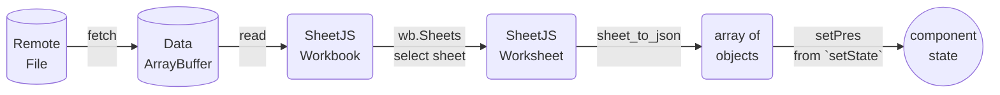
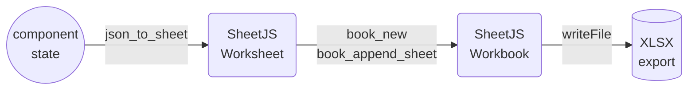

import current from '/version.js';
import Tabs from '@theme/Tabs';
import TabItem from '@theme/TabItem';
import CodeBlock from '@theme/CodeBlock';

[VueJS](https://vuejs.org/) is a JavaScript library for building user interfaces.

[SheetJS](https://sheetjs.com) is a JavaScript library for reading and writing
data from spreadsheets.

This demo uses VueJS and SheetJS to process and generate spreadsheets. We'll
explore how to load SheetJS in a VueJS SFC (single-file component) and compare
common state models and data flow strategies.

:::note pass

This demo focuses on VueJS concepts. Other demos cover general deployments:

- [Static Site Generation powered by NuxtJS](/docs/demos/static/nuxtjs)
- [iOS and Android applications powered by Quasar](/docs/demos/mobile/quasar)
- [Desktop application powered by Tauri](/docs/demos/desktop/tauri)
- [`vue3-table-lite` UI component](/docs/demos/grid/vtl)

:::

## Installation

[The "Frameworks" section](/docs/getting-started/installation/frameworks) covers
installation with Yarn and other package managers.

The library can be imported directly from JS or JSX code with:

```js
import { read, utils, writeFile } from 'xlsx';
```


## Internal State

The various SheetJS APIs work with various data shapes.  The preferred state
depends on the application.

### Array of Objects

Typically, some users will create a spreadsheet with source data that should be
loaded into the site.  This sheet will have known columns.

#### State

The example [presidents sheet](https://docs.sheetjs.com/pres.xlsx) has one
header row with "Name" and "Index" columns. The natural JS representation is an
object for each row, using the values in the first rows as keys:

<table>
  <thead><tr><th>Spreadsheet</th><th>State</th></tr></thead>
  <tbody><tr><td>


</td><td>

```js
[
  { Name: "Bill Clinton", Index: 42 },
  { Name: "GeorgeW Bush", Index: 43 },
  { Name: "Barack Obama", Index: 44 },
  { Name: "Donald Trump", Index: 45 },
  { Name: "Joseph Biden", Index: 46 }
]
```

</td></tr></tbody></table>

Using the VueJS Composition API, the `ref`[^1] function creates state objects:

<Tabs groupId="lang">
  <TabItem name="JS" value="JavaScript">

```html
<script setup>
import { ref } from "vue";

/* the component state is an array of objects */
const pres = ref([]);
</script>
```

  </TabItem>
  <TabItem name="TS" value="TypeScript" default>

```html
<script setup lang="ts">
import { ref } from "vue";

/* the component state is an array of objects */
const pres = ref<any[]>([]);
</script>
```

When the spreadsheet header row is known ahead of time, row typing is possible:

```html
<script setup lang="ts">
import { ref } from "vue";

interface President {
  Name: string;
  Index: number;
}

/* the component state is an array of presidents */
const pres = ref<President[]>([]);
</script>
```

:::caution pass

The types are informative. They do not enforce that worksheets include the named
columns. A runtime data validation library should be used to verify the dataset.

When the file header is not known in advance, `any` should be used.

:::

  </TabItem>
</Tabs>

#### Updating State

The SheetJS [`read`](/docs/api/parse-options) and [`sheet_to_json`](/docs/api/utilities/array#array-output)
functions simplify state updates. They are best used in the function bodies of
lifecycle hooks including `onMounted`[^2].

The `onMounted` hook can download and update state when a person loads the site:



<Tabs groupId="lang">
  <TabItem name="JS" value="JavaScript">

```html
<script setup>
import { ref, onMounted } from "vue";
import { read, utils } from 'xlsx';

/* the component state is an array of objects */
const pres = ref([]);

/* Fetch and update the state once */
onMounted(async() => {
  /* Download from https://docs.sheetjs.com/pres.numbers */
  const f = await fetch("https://docs.sheetjs.com/pres.numbers");
  const ab = await f.arrayBuffer();

  // highlight-start
  /* parse */
  const wb = read(ab);

  /* generate array of objects from first worksheet */
  const ws = wb.Sheets[wb.SheetNames[0]]; // get the first worksheet
  const data = utils.sheet_to_json(ws); // generate objects

  /* update state */
  pres.value = data;
  // highlight-end
});
</script>
```

  </TabItem>
  <TabItem name="TS" value="TypeScript" default>

```html
<script setup lang="ts">
import { ref, onMounted } from "vue";
import { read, utils } from 'xlsx';

interface President {
  Name: string;
  Index: number;
}

/* the component state is an array of presidents */
const pres = ref<President[]>([]);

/* Fetch and update the state once */
onMounted(async() => {
  /* Download from https://docs.sheetjs.com/pres.numbers */
  const f = await fetch("https://docs.sheetjs.com/pres.numbers");
  const ab = await f.arrayBuffer();

  // highlight-start
  /* parse */
  const wb = read(ab);

  /* generate array of presidents from the first worksheet */
  const ws = wb.Sheets[wb.SheetNames[0]]; // get the first worksheet
  const data: President[] = utils.sheet_to_json<President>(ws); // generate objects

  /* update state */
  pres.value = data;
  // highlight-end
});
</script>
```

  </TabItem>
</Tabs>

#### Rendering Data

A component will typically map over the data with `v-for`[^3]. The following
example generates a TABLE with a row for each President:

```html title="Example SFC for displaying arrays of objects"
<script setup>
import { ref } from "vue";
const rows = ref([]);
</script>

<template>
<table>
  <!-- The `thead` section includes the table header row -->
  <thead><tr><th>Name</th><th>Index</th></tr></thead>
  <!-- The `tbody` section includes the data rows -->
  <tbody>
    <!-- generate row (TR) for each president -->
    <!-- highlight-start-->
    <tr v-for="(row, idx) in rows" :key="idx">
      <td>{{ row.Name }}</td>
      <td>{{ row.Index }}</td>
    </tr>
    <!-- highlight-end-->
  </tbody>
</table>
</template>
```

#### Exporting Data

The [`writeFile`](/docs/api/write-options) and [`json_to_sheet`](/docs/api/utilities/array#array-of-objects-input)
functions simplify exporting data. They are best used in the function bodies of
`v-on` event handlers like `@click`[^4].

A callback can generate a local file when a user clicks a button:



```html
<script setup>
import { ref } from "vue";
import { utils, writeFileXLSX } from 'xlsx';

const pres = ref([]);

/* get state data and export to XLSX */
function exportFile() {
  /* generate worksheet from state */
  // highlight-next-line
  const ws = utils.json_to_sheet(pres.value);
  /* create workbook and append worksheet */
  const wb = utils.book_new();
  utils.book_append_sheet(wb, ws, "Data");
  /* export to XLSX */
  writeFileXLSX(wb, "SheetJSVueAoO.xlsx");
}
</script>

<template>
  <button @click="exportFile">Export XLSX</button>
</template>
```

#### Complete Component

This complete component example fetches a test file and displays the contents in
a HTML table. When the export button is clicked, a callback will export a file:

```html title="src/SheetJSVueAoO.vue"
<script setup>
import { ref, onMounted } from "vue";
import { read, utils, writeFileXLSX } from 'xlsx';

const rows = ref([]);

onMounted(async() => {
  /* Download from https://docs.sheetjs.com/pres.numbers */
  const f = await fetch("https://docs.sheetjs.com/pres.numbers");
  const ab = await f.arrayBuffer();

  /* parse workbook */
  const wb = read(ab);

  /* update data */
  rows.value = utils.sheet_to_json(wb.Sheets[wb.SheetNames[0]]);
});

/* get state data and export to XLSX */
function exportFile() {
  const ws = utils.json_to_sheet(rows.value);
  const wb = utils.book_new();
  utils.book_append_sheet(wb, ws, "Data");
  writeFileXLSX(wb, "SheetJSVueAoO.xlsx");
}
</script>

<template>
  <table><thead><tr><th>Name</th><th>Index</th></tr></thead><tbody>
    <tr v-for="(row, idx) in rows" :key="idx">
      <td>{{ row.Name }}</td>
      <td>{{ row.Index }}</td>
    </tr>
  </tbody><tfoot><td colSpan={2}>
    <button @click="exportFile">Export XLSX</button>
  </td></tfoot></table>
</template>
```

<details open>
  <summary><b>How to run the example</b> (click to hide)</summary>

<Tabs groupId="starter">
  <TabItem name="vite" value="ViteJS">

:::note Tested Deployments

This demo was tested in the following environments:

| VueJS    | ViteJS   | Date       |
|:---------|:---------|:-----------|
| `3.4.27` | `5.2.11` | 2024-05-26 |

:::

1) Create a new site:

```bash
npm init vue@latest -- sheetjs-vue --default
```

2) Install the SheetJS dependency and start the dev server:

<CodeBlock language="bash">{`\
cd sheetjs-vue
npm i
npm i --save https://cdn.sheetjs.com/xlsx-${current}/xlsx-${current}.tgz
npm run dev`}
</CodeBlock>

3) Open a web browser and access the displayed URL (`http://localhost:5173`)

4) Replace `src/App.vue` with the `src/SheetJSVueAoO.vue` example.

The page will refresh and show a table with an Export button.  Click the button
and the page will attempt to download `SheetJSVueAoO.xlsx`. There may be a delay
since Vite will try to optimize the SheetJS library on the fly.

5) Stop the dev server and build the site:

```bash
npm run build
```

The generated site will be placed in the `dist` folder.

6) Start a local web server:

```bash
npx http-server dist
```

Access the displayed URL (typically `http://localhost:8080`) with a web browser
and test the page.

  </TabItem>
  <TabItem name="nuxt" value="NuxtJS">

:::note Tested Deployments

This demo was tested in the following environments:

| VueJS    | NuxtJS   | Date       |
|:---------|:---------|:-----------|
| `3.4.21` | `3.11.1` | 2024-03-21 |

:::

1) Create a new site:

```bash
npx nuxi@latest init sheetjs-nuxt --packageManager npm --no-install --no-gitInit
```

2) Install the SheetJS dependency and start the dev server:

<CodeBlock language="bash">{`\
cd sheetjs-nuxt
npm i
npm i --save https://cdn.sheetjs.com/xlsx-${current}/xlsx-${current}.tgz
npm run dev`}
</CodeBlock>

3) Open a web browser and access the displayed URL (`http://localhost:3000`)

4) Replace `app.vue` with the `src/SheetJSVueAoO.vue` example.

The page will refresh and show a table with an Export button.  Click the button
and the page will attempt to download `SheetJSVueAoO.xlsx`.

5) Stop the dev server and build the site:

```bash
npm run generate
```

The generated site will be placed in the `dist` folder.

6) Start a local web server:

```bash
npx http-server .output/public/
```

Access the displayed URL (typically `http://localhost:8080`) with a web browser
and test the page.

  </TabItem>
</Tabs>

</details>

### HTML

The main disadvantage of the Array of Objects approach is the specific nature
of the columns.  For more general use, passing around an Array of Arrays works.
However, this does not handle merge cells[^5] well!

The [`sheet_to_html`](/docs/api/utilities/html#html-table-output) function
generates HTML that is aware of merges and other worksheet features.  VueJS
`v-html`[^6] attribute allows code to set the `innerHTML` attribute, effectively
inserting the code into the page.

In this example, the component attaches a `ref` to the `DIV` container. During
export, the first `TABLE` child element can be parsed with [`table_to_book`](/docs/api/utilities/html#html-table-input) to
generate a workbook object.

```html title="src/SheetJSVueHTML.vue"
<script setup>
import { ref, onMounted } from "vue";
import { read, utils, writeFileXLSX } from 'xlsx';

const html = ref("");
const tableau = ref();

onMounted(async() => {
  /* Download from https://docs.sheetjs.com/pres.numbers */
  const f = await fetch("https://docs.sheetjs.com/pres.numbers");
  const ab = await f.arrayBuffer();

  /* parse workbook */
  const wb = read(ab);

  /* update data */
  html.value = utils.sheet_to_html(wb.Sheets[wb.SheetNames[0]]);
});

/* get live table and export to XLSX */
function exportFile() {
  const wb = utils.table_to_book(tableau.value.getElementsByTagName("TABLE")[0])
  writeFileXLSX(wb, "SheetJSVueHTML.xlsx");
}
</script>

<template>
  <div ref="tableau" v-html="html"></div>
  <button @click="exportFile">Export XLSX</button>
</template>
```

<details open>
  <summary><b>How to run the example</b> (click to hide)</summary>

<Tabs groupId="starter">
  <TabItem name="vite" value="ViteJS">

:::note Tested Deployments

This demo was tested in the following environments:

| VueJS    | ViteJS  | Date       |
|:---------|:--------|:-----------|
| `3.4.21` | `5.2.2` | 2024-03-21 |

:::

1) Create a new site:

```bash
npm init vue@latest -- sheetjs-vue --default
```

2) Install the SheetJS dependency and start the dev server:

<CodeBlock language="bash">{`\
cd sheetjs-vue
npm i
npm i --save https://cdn.sheetjs.com/xlsx-${current}/xlsx-${current}.tgz
npm run dev`}
</CodeBlock>

3) Open a web browser and access the displayed URL (`http://localhost:5173`)

4) Replace `src/App.vue` with the `src/SheetJSVueHTML.vue` example.

The page will refresh and show a table with an Export button.  Click the button
and the page will attempt to download `SheetJSVueHTML.xlsx`. There may be a delay
since Vite will try to optimize the SheetJS library on the fly.

5) Stop the dev server and build the site:

```bash
npm run build
```

The generated site will be placed in the `dist` folder.

6) Start a local web server:

```bash
npx http-server dist
```

Access the displayed URL (typically `http://localhost:8080`) with a web browser
and test the page.

  </TabItem>
  <TabItem name="nuxt" value="NuxtJS">

:::note Tested Deployments

This demo was tested in the following environments:

| VueJS    | NuxtJS   | Date       |
|:---------|:---------|:-----------|
| `3.4.21` | `3.11.1` | 2024-03-21 |

:::

1) Create a new site:

```bash
npx nuxi@latest init sheetjs-nuxt --packageManager npm --no-install --no-gitInit
```

2) Install the SheetJS dependency and start the dev server:

<CodeBlock language="bash">{`\
cd sheetjs-nuxt
npm i
npm i --save https://cdn.sheetjs.com/xlsx-${current}/xlsx-${current}.tgz
npm run dev`}
</CodeBlock>

3) Open a web browser and access the displayed URL (`http://localhost:3000`)

4) Replace `app.vue` with the `src/SheetJSVueHTML.vue` example.

The page will refresh and show a table with an Export button.  Click the button
and the page will attempt to download `SheetJSVueHTML.xlsx`.

5) Stop the dev server and build the site:

```bash
npm run generate
```

The generated site will be placed in the `dist` folder.

6) Start a local web server:

```bash
npx http-server .output/public/
```

Access the displayed URL (typically `http://localhost:8080`) with a web browser
and test the page.

  </TabItem>
</Tabs>

</details>

### Rows and Columns

Some data grids and UI components split worksheet state in two parts: an array
of column attribute objects and an array of row objects.  The former is used to
generate column headings and for indexing into the row objects.

The safest approach is to use an array of arrays for state and to generate
column objects that map to A1-Style column headers.

The [`vue3-table-lite` demo](/docs/demos/grid/vtl#rows-and-columns-bindings)
generates rows and columns objects with the following structure:

```js
/* rows are generated with a simple array of arrays */
rows.value = utils.sheet_to_json(worksheet, { header: 1 });

/* column objects are generated based on the worksheet range */
const range = utils.decode_range(ws["!ref"]||"A1");
columns.value = Array.from({ length: range.e.c + 1 }, (_, i) => ({
  /* for an array of arrays, the keys are "0", "1", "2", ... */
  field: String(i),
  /* column labels: encode_col translates 0 -> "A", 1 -> "B", 2 -> "C", ... */
  label: XLSX.utils.encode_col(i)
}));
```


## Legacy Deployments

[The Standalone Scripts](/docs/getting-started/installation/standalone) play nice
with legacy deployments that do not use a bundler.

The legacy demos show a simple VueJS component.  It is written in ES5 syntax.
The pages are not minified and "View Source" should be used to inspect.

- [VueJS version 2](pathname:///vue/index2.html)
- [VueJS version 3](pathname:///vue/index3.html)

There is a shared component [`SheetJS-vue.js`](pathname:///vue/SheetJS-vue.js)

:::caution pass

The entire demo is designed to run in Internet Explorer and does not reflect
modern design patterns.

:::

[^1]: See [`ref()`](https://vuejs.org/api/reactivity-core.html#ref) in the VueJS documentation.
[^2]: See [`onMounted()`](https://vuejs.org/api/composition-api-lifecycle.html#onmounted) in the VueJS documentation.
[^3]: See [`v-for`](https://vuejs.org/api/built-in-directives.html#v-for) in the VueJS documentation.
[^4]: See [`v-on`](https://vuejs.org/api/built-in-directives.html#v-on) in the VueJS documentation.
[^5]: See ["Merged Cells" in "SheetJS Data Model"](/docs/csf/features/merges) for more details.
[^6]: See [`v-html`](https://vuejs.org/api/built-in-directives.html#v-html) in the VueJS documentation.
