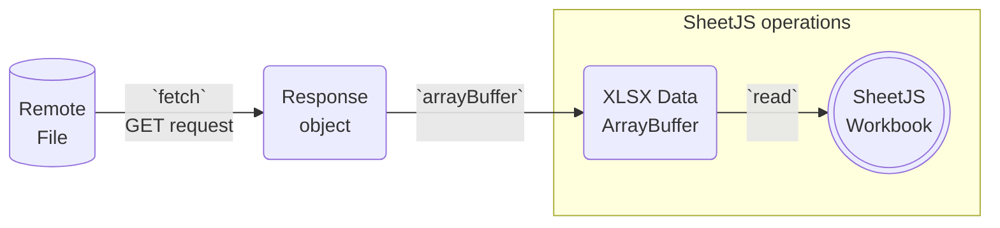

<head>
  <script src="https://unpkg.com/axios@1.6.5/dist/axios.min.js"></script>
  <script src="https://unpkg.com/superagent@8.1.2/dist/superagent.min.js"></script>
</head>

import current from '/version.js';
import CodeBlock from '@theme/CodeBlock';

[SheetJS](https://sheetjs.com) is a JavaScript library for reading and writing
data from spreadsheets.

A number of JavaScript APIs, including `XMLHttpRequest` and `fetch`, allow
scripts to download spreadsheets for further processing.

This demo uses various APIs and wrapper libraries to download workbooks and pass
raw binary data to SheetJS libraries.

- ["Browser Demos"](#browser-demos) run entirely within the web browser. A test
  workbook will be downloaded and parsed in the web browser.

- ["NodeJS Demos"](#nodejs-demos) run in NodeJS and other server-side platforms.

:::info pass

This demo focuses on downloading files. Other demos cover other HTTP use cases:

- ["HTTP Uploads"](/docs/demos/net/upload) covers uploading files
- ["HTTP Server Processing"](/docs/demos/net/server) covers HTTP servers

:::

:::caution Third-Party Hosts and Binary Data

Third-party cloud platforms such as AWS may corrupt raw binary downloads by
encoding requests and responses in UTF-8 strings.

For AWS, in the "Binary Media Types" section of the API Gateway console, the
`"application/vnd.ms-excel"` type should be added to ensure that AWS Lambda
functions functions can send files to clients.

:::

## Binary Data

Most interesting spreadsheet files are binary data that contain byte sequences
that represent invalid UTF-8 characters.

APIs generally provide options to control how downloaded data is interpreted.
The `arraybuffer` response type usually forces the data to be presented as an
`ArrayBuffer` object which can be parsed with the SheetJS `read` method[^1].

The following example shows the data flow using `fetch` to download files:



```js
/* download data into an ArrayBuffer object */
const res = await fetch("https://docs.sheetjs.com/pres.numbers");
const ab = await res.arrayBuffer(); // recover data as ArrayBuffer

/* parse file */
const wb = XLSX.read(ab);
```

## Browser Demos

When the page is accessed, https://docs.sheetjs.com/pres.numbers will be fetched
and parsed. The old table will be replaced with a table whose contents match the
first worksheet. The SheetJS `sheet_to_html` method[^2] creates the HTML table.

:::note Tested Deployments

Each browser demo was tested in the following environments:

| Browser     | Date       |
|:------------|:-----------|
| Chrome 126  | 2024-06-19 |
| Safari 17.3 | 2024-06-19 |

:::

### XMLHttpRequest

For downloading data, the `arraybuffer` response type generates an `ArrayBuffer`
that can be viewed as an `Uint8Array` and fed to the SheetJS `read` method. For
legacy browsers, the option `type: "array"` should be specified:

```js
/* set up an async GET request */
var req = new XMLHttpRequest();
req.open("GET", url, true);
req.responseType = "arraybuffer";

req.onload = function(e) {
  /* parse the data when it is received */
  var data = new Uint8Array(req.response);
  var workbook = XLSX.read(data, {type:"array"});
  /* DO SOMETHING WITH workbook HERE */
};
req.send();
```

<details>
  <summary><b>Live Download demo</b> (click to show)</summary>

This demo uses `XMLHttpRequest` to fetch https://docs.sheetjs.com/pres.numbers
and show the data in an HTML table.

```jsx live
function SheetJSXHRDL() {
  const [__html, setHTML] = React.useState("");

  /* Fetch and update HTML */
  React.useEffect(() => { (async() => {
    /* Fetch file */
    const req = new XMLHttpRequest();
    req.open("GET", "https://docs.sheetjs.com/pres.numbers", true);
    req.responseType = "arraybuffer";
    req.onload = e => {
      /* Parse file */
      const wb = XLSX.read(new Uint8Array(req.response));
      const ws = wb.Sheets[wb.SheetNames[0]];

      /* Generate HTML */
      setHTML(XLSX.utils.sheet_to_html(ws));
    };
    req.send();
  })(); }, []);

  return ( <div dangerouslySetInnerHTML={{ __html }}/> );
}
```

</details>


### fetch

For downloading data, `Response#arrayBuffer` resolves to an `ArrayBuffer` that
can be converted to `Uint8Array` and passed to the SheetJS `read` method:

```js
fetch(url).then(function(res) {
  /* get the data as a Blob */
  if(!res.ok) throw new Error("fetch failed");
  return res.arrayBuffer();
}).then(function(ab) {
  /* parse the data when it is received */
  var data = new Uint8Array(ab);
  var workbook = XLSX.read(data, {type:"array"});

  /* DO SOMETHING WITH workbook HERE */
});
```

<details>
  <summary><b>Live Download demo</b> (click to show)</summary>

This demo uses `fetch` to download https://docs.sheetjs.com/pres.numbers and
show the data in an HTML table.

```jsx live
function SheetJSFetchDL() {
  const [__html, setHTML] = React.useState("");

  /* Fetch and update HTML */
  React.useEffect(() => { (async() => {
    /* Fetch file */
    const res = await fetch("https://docs.sheetjs.com/pres.numbers");
    const ab = await res.arrayBuffer();

    /* Parse file */
    const wb = XLSX.read(ab);
    const ws = wb.Sheets[wb.SheetNames[0]];

    /* Generate HTML */
    setHTML(XLSX.utils.sheet_to_html(ws));
  })(); }, []);

  return ( <div dangerouslySetInnerHTML={{ __html }}/> );
}
```

</details>

### jQuery

[jQuery](https://jquery.com/) is a JavaScript library that includes helpers for
performing "Ajax" network requests. `jQuery.ajax` (`$.ajax`) does not support
binary data out of the box[^3]. A custom `ajaxTransport` can add support.

SheetJS users have reported success with `jquery.binarytransport.js`[^4] in IE10.

After including the main `jquery.js` and `jquery.binarytransport.js` scripts,
`$.ajax` will support `dataType: "binary"` and `processData: false`.

**[Live Download Demo](pathname:///jquery/index.html)**

In a GET request, the default behavior is to return a `Blob` object.  Passing
`responseType: "arraybuffer"` returns a proper `ArrayBuffer` object in IE10:

```js
$.ajax({
  type: "GET", url: "https://docs.sheetjs.com/pres.numbers",

  /* suppress jQuery post-processing */
  // highlight-next-line
  processData: false,

  /* use the binary transport */
  // highlight-next-line
  dataType: "binary",

  /* pass an ArrayBuffer in the callback */
  // highlight-next-line
  responseType: "arraybuffer",

  success: function (ab) {
    /* at this point, ab is an ArrayBuffer */
    // highlight-next-line
    var wb = XLSX.read(ab);

    /* do something with workbook here */
    var ws = wb.Sheets[wb.SheetNames[0]];
    var html = XLSX.utils.sheet_to_html(ws);
    $("#out").html(html);
  }
});
```

### Wrapper Libraries

Before `fetch` shipped with browsers, there were various wrapper libraries to
simplify `XMLHttpRequest`. Due to limitations with `fetch`, these libraries are
still relevant.

#### axios

[`axios`](https://axios-http.com/) presents a Promise based interface. Setting
`responseType` to `arraybuffer` ensures the return type is an ArrayBuffer. The
`data` property of the result can be passed to the SheetJS `read` method:

```js
async function workbook_dl_axios(url) {
  const res = await axios(url, {responseType:'arraybuffer'});
  const workbook = XLSX.read(res.data);
  return workbook;
}
```

<details>
  <summary><b>Live Download demo</b> (click to show)</summary>

This demo uses `axios` to download https://docs.sheetjs.com/pres.numbers and
show the data in an HTML table.

:::caution pass

If the live demo shows a message

```
ReferenceError: axios is not defined
```

please refresh the page.  This is a known bug in the documentation generator.

:::

```jsx live
function SheetJSAxiosDL() {
  const [__html, setHTML] = React.useState("");

  /* Fetch and update HTML */
  React.useEffect(() => { (async() => {
    if(typeof axios != "function") return setHTML("ReferenceError: axios is not defined");
    /* Fetch file */
    const res = await axios("https://docs.sheetjs.com/pres.numbers", {responseType: "arraybuffer"});

    /* Parse file */
    const wb = XLSX.read(res.data);
    const ws = wb.Sheets[wb.SheetNames[0]];

    /* Generate HTML */
    setHTML(XLSX.utils.sheet_to_html(ws));
  })(); }, []);

  return ( <div dangerouslySetInnerHTML={{ __html }}/> );
}
```

</details>

#### superagent

[`superagent`](https://ladjs.github.io/superagent/) is a network request library
with a "Fluent Interface". Calling the `responseType` method with
`"arraybuffer"` will ensure the final response object is an `ArrayBuffer`:

```js
/* set up an async GET request with superagent */
superagent
  .get(url)
  .responseType('arraybuffer')
  .end(function(err, res) {
    /* parse the data when it is received */
    var data = new Uint8Array(res.body);
    var workbook = XLSX.read(data, {type:"array"});

    /* DO SOMETHING WITH workbook HERE */
  });
```

<details>
  <summary><b>Live Download demo</b> (click to show)</summary>

This demo uses `superagent` to download https://docs.sheetjs.com/pres.numbers
and show the data in an HTML table.

:::caution pass

If the live demo shows a message

```
ReferenceError: superagent is not defined
```

please refresh the page.  This is a known bug in the documentation generator.

:::

```jsx live
function SheetJSSuperAgentDL() {
  const [__html, setHTML] = React.useState("");

  /* Fetch and update HTML */
  React.useEffect(() => { (async() => {
    if(typeof superagent == "undefined" || typeof superagent.get != "function")
      return setHTML("ReferenceError: superagent is not defined");
    /* Fetch file */
    superagent
      .get("https://docs.sheetjs.com/pres.numbers")
      .responseType("arraybuffer")
      .end((err, res) => {
        /* Parse file */
        const wb = XLSX.read(res.body);
        const ws = wb.Sheets[wb.SheetNames[0]];

        /* Generate HTML */
        setHTML(XLSX.utils.sheet_to_html(ws));
      });
  })(); }, []);

  return ( <div dangerouslySetInnerHTML={{ __html }}/> );
}
```

</details>

## NodeJS Demos

These examples show how to download data in NodeJS.

### HTTPS GET

The `https` module provides a low-level `get` method for HTTPS GET requests:

```js title="SheetJSHTTPSGet.js"
var https = require("https"), XLSX = require("xlsx");

https.get('https://docs.sheetjs.com/pres.xlsx', function(res) {
  var bufs = [];
  res.on('data', function(chunk) { bufs.push(chunk); });
  res.on('end', function() {
    var buf = Buffer.concat(bufs);
    var wb = XLSX.read(buf);
    /* print the first worksheet to console */
    var ws = wb.Sheets[wb.SheetNames[0]];
    console.log(XLSX.utils.sheet_to_csv(ws));
  });
});
```

:::note Tested Deployments

This demo was tested in the following environments:

| NodeJS     | Date       | Workarounds                    |
|:-----------|:-----------|:-------------------------------|
| `0.10.48`  | 2024-06-21 | `NODE_TLS_REJECT_UNAUTHORIZED` |
| `0.12.18`  | 2024-06-21 | `NODE_TLS_REJECT_UNAUTHORIZED` |
| `4.9.1`    | 2024-06-21 | `NODE_TLS_REJECT_UNAUTHORIZED` |
| `6.17.1`   | 2024-06-21 | `NODE_TLS_REJECT_UNAUTHORIZED` |
| `8.17.0`   | 2024-06-21 | `NODE_TLS_REJECT_UNAUTHORIZED` |
| `10.24.1`  | 2024-06-21 |                                |
| `12.22.12` | 2024-06-21 |                                |
| `14.21.3`  | 2024-06-21 |                                |
| `16.20.2`  | 2024-06-21 |                                |
| `18.20.3`  | 2024-06-21 |                                |
| `20.15.0`  | 2024-06-21 |                                |
| `22.3.0`   | 2024-06-21 |                                |

The `NODE_TLS_REJECT_UNAUTHORIZED` workaround sets the value to `'0'`:

```js title="Legacy NodeJS Certificate has Expired Bypass (prepend to script)"
process.env.NODE_TLS_REJECT_UNAUTHORIZED = '0';
```

:::

<details>
  <summary><b>Complete Example</b> (click to show)</summary>

1) Install the [NodeJS module](/docs/getting-started/installation/nodejs)

<CodeBlock language="bash">{`\
npm i --save https://cdn.sheetjs.com/xlsx-${current}/xlsx-${current}.tgz`}
</CodeBlock>

2) Copy the `SheetJSHTTPSGet.js` code snippet to a file `SheetJSHTTPSGet.js`

3) Run the script:

```bash
node SheetJSHTTPSGet.js
```

If successful, the script will print CSV contents of the test file.

:::caution pass

For older versions of NodeJS, the script will fail due to a certificate error.
The error can be suppressed by prepending the following line to the script:

```js title="SheetJSHTTPSGet.js (add to top)"
process.env.NODE_TLS_REJECT_UNAUTHORIZED = '0';
```

**It is strongly encouraged to upgrade to a newer NodeJS version!**

:::

</details>

### fetch

:::info pass

Experimental support for `fetch` was introduced in NodeJS `16.15.0`. It will be
considered stable in NodeJS LTS version `22`.

:::

The `fetch` implementation has the same return types as the browser version:

```js
async function parse_from_url(url) {
  const res = await fetch(url);
  if(!res.ok) throw new Error("fetch failed");
  const ab = await res.arrayBuffer();
  const workbook = XLSX.read(ab);
  return workbook;
}
```

:::note Tested Deployments

This demo was tested in the following environments:

| NodeJS     | Date       |
|:-----------|:-----------|
| `18.20.3`  | 2024-06-21 |
| `20.15.0`  | 2024-06-21 |
| `22.3.0`   | 2024-06-21 |

:::

<details>
  <summary><b>Complete Example</b> (click to show)</summary>

1) Install the [NodeJS module](/docs/getting-started/installation/nodejs)

<CodeBlock language="bash">{`\
npm i --save https://cdn.sheetjs.com/xlsx-${current}/xlsx-${current}.tgz`}
</CodeBlock>

2) Save the following to `SheetJSFetch.js`:

```js title="SheetJSFetch.js"
var XLSX = require("xlsx");

async function parse_from_url(url) {
  const res = await fetch(url);
  if(!res.ok) throw new Error("fetch failed");
  const ab = await res.arrayBuffer();
  const workbook = XLSX.read(ab);
  return workbook;
}

(async() => {
  const wb = await parse_from_url('https://docs.sheetjs.com/pres.numbers');
  /* print the first worksheet to console */
  var ws = wb.Sheets[wb.SheetNames[0]];
  console.log(XLSX.utils.sheet_to_csv(ws));
})();
```

3) Run the script:

```bash
node SheetJSFetch.js
```

If successful, the script will print CSV contents of the test file.

</details>

### Wrapper Libraries

The latest releases of NodeJS support `fetch` natively.  Before `fetch` support
was added to the platform, third party modules wrapped the native APIs.

#### request

:::danger pass

`request` has been deprecated and should only be used in legacy deployments.

:::

Setting the option `encoding: null` passes raw buffers:

```js title="SheetJSRequest.js"
var XLSX = require('xlsx'), request = require('request');
var url = 'https://docs.sheetjs.com/pres.xlsx';

/* call `request` with the option `encoding: null` */
// highlight-next-line
request(url, {encoding: null}, function(err, res, data) {
  if(err || res.statusCode !== 200) return;

  /* if the request was successful, parse the data */
  // highlight-next-line
  var wb = XLSX.read(data);

  /* print the first worksheet to console */
  var ws = wb.Sheets[wb.SheetNames[0]];
  console.log(XLSX.utils.sheet_to_csv(ws));
});
```

:::note Tested Deployments

This demo was tested in the following environments:

| NodeJS     | Date       | Workarounds                    |
|:-----------|:-----------|:-------------------------------|
| `0.10.48`  | 2024-06-21 | `NODE_TLS_REJECT_UNAUTHORIZED` |
| `0.12.18`  | 2024-06-21 | `NODE_TLS_REJECT_UNAUTHORIZED` |
| `4.9.1`    | 2024-06-21 | `NODE_TLS_REJECT_UNAUTHORIZED` |
| `6.17.1`   | 2024-06-21 | `NODE_TLS_REJECT_UNAUTHORIZED` |
| `8.17.0`   | 2024-06-21 | `NODE_TLS_REJECT_UNAUTHORIZED` |
| `10.24.1`  | 2024-06-21 |                                |
| `12.22.12` | 2024-06-21 |                                |
| `14.21.3`  | 2024-06-21 |                                |
| `16.20.2`  | 2024-06-21 |                                |
| `18.20.3`  | 2024-06-21 |                                |
| `20.15.0`  | 2024-06-21 |                                |
| `22.3.0`   | 2024-06-21 |                                |

The `NODE_TLS_REJECT_UNAUTHORIZED` workaround sets the value to `'0'`:

```js title="Legacy NodeJS Certificate has Expired Bypass (prepend to script)"
process.env.NODE_TLS_REJECT_UNAUTHORIZED = '0';
```

:::

<details>
  <summary><b>Complete Example</b> (click to show)</summary>

1) Install the [NodeJS module](/docs/getting-started/installation/nodejs)

<CodeBlock language="bash">{`\
npm i --save https://cdn.sheetjs.com/xlsx-${current}/xlsx-${current}.tgz request@2.88.2`}
</CodeBlock>

2) Copy the `SheetJSRequest.js` code snippet to a file `SheetJSRequest.js`

3) Run the script:

```bash
node SheetJSRequest.js
```

If successful, the script will print CSV contents of the test file.

:::caution pass

For older versions of NodeJS, the script will fail due to a certificate error.
The error can be suppressed by prepending the following line to the script:

```js title="SheetJSRequest.js (add to top)"
process.env.NODE_TLS_REJECT_UNAUTHORIZED = '0';
```

**It is strongly encouraged to upgrade to a newer NodeJS version!**

:::

</details>

#### axios

When the `responseType` is `"arraybuffer"`, `axios` actually captures the data
in a NodeJS Buffer. The SheetJS `read` method handles NodeJS Buffer objects:

```js title="SheetJSAxios.js"
const XLSX = require("xlsx"), axios = require("axios");

async function workbook_dl_axios(url) {
  const res = await axios(url, {responseType:'arraybuffer'});
  /* at this point, res.data is a Buffer */
  const workbook = XLSX.read(res.data);
  return workbook;
}
```

:::note Tested Deployments

This demo was tested in the following environments:

| NodeJS     | Axios  | Date       |
|:-----------|:-------|:-----------|
| `10.24.1`  | 0.28.1 | 2024-06-21 |
| `12.22.12` | 1.7.2  | 2024-06-21 |
| `14.21.3`  | 1.7.2  | 2024-06-21 |
| `16.20.2`  | 1.7.2  | 2024-06-21 |
| `18.20.3`  | 1.7.2  | 2024-06-21 |
| `20.15.0`  | 1.7.2  | 2024-06-21 |
| `22.3.0`   | 1.7.2  | 2024-06-21 |

:::

<details>
  <summary><b>Complete Example</b> (click to show)</summary>

1) Install the [NodeJS module](/docs/getting-started/installation/nodejs)

<CodeBlock language="bash">{`\
npm i --save https://cdn.sheetjs.com/xlsx-${current}/xlsx-${current}.tgz axios@1.7.2`}
</CodeBlock>

2) Save the following to `SheetJSAxios.js`:

```js title="SheetJSAxios.js"
const XLSX = require("xlsx"), axios = require("axios");

async function workbook_dl_axios(url) {
  const res = await axios(url, {responseType:'arraybuffer'});
  /* at this point, res.data is a Buffer */
  const workbook = XLSX.read(res.data);
  return workbook;
}

(async() => {
  const wb = await workbook_dl_axios('https://docs.sheetjs.com/pres.numbers');
  /* print the first worksheet to console */
  var ws = wb.Sheets[wb.SheetNames[0]];
  console.log(XLSX.utils.sheet_to_csv(ws));
})();
```

3) Run the script:

```bash
node SheetJSAxios.js
```

If successful, the script will print CSV contents of the test file.

</details>

## Other Platforms

Other demos show network operations in special platforms:

- [React Native "Fetching Remote Data"](/docs/demos/mobile/reactnative#fetching-remote-data)
- [NativeScript "Fetching Remote Files"](/docs/demos/mobile/nativescript#fetching-remote-files)
- [AngularJS "Remote Files"](/docs/demos/frontend/angularjs#remote-files)
- [Dojo Toolkit "Parsing Remote Files"](/docs/demos/frontend/dojo#parsing-remote-files)

[^1]: See [`read` in "Reading Files"](/docs/api/parse-options)
[^2]: See [`sheet_to_html` in "Utilities"](/docs/api/utilities/html#html-table-output)
[^3]: See [`dataType` in `jQuery.ajax`](https://api.jquery.com/jQuery.ajax/) in the official jQuery documentation.
[^4]: See [the official `jquery.binarytransport.js` repo](https://github.com/henrya/js-jquery/tree/master/BinaryTransport) for more details.
