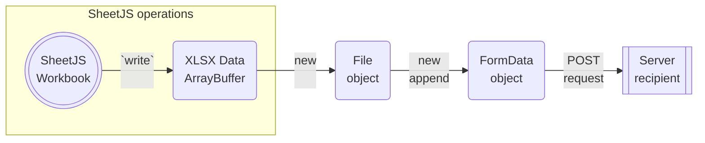

<head>
  <script src="https://unpkg.com/axios@1.6.5/dist/axios.min.js"></script>
  <script src="https://unpkg.com/superagent@8.1.2/dist/superagent.min.js"></script>
</head>

import current from '/version.js';
import CodeBlock from '@theme/CodeBlock';

Browsers and other platforms offer solutions for uploading files to servers and
cloud storage solutions. Spreadsheets can be written using SheetJS and uploaded.

This demo explores file uploads using a number of browser APIs and wrapper
libraries. The upload process will generate a sample XLSX workbook, upload the
file to [a test server](https://s2c.sheetjs.com), and display the response.

:::info pass

This demo focuses on uploading files. Other demos cover other HTTP use cases:

- ["HTTP Downloads"](/docs/demos/net/network) covers downloading files
- ["HTTP Server Processing"](/docs/demos/net/server) covers HTTP servers

:::

:::caution Third-Party Hosts and Binary Data

Third-party cloud platforms such as AWS may corrupt raw binary uploads by
encoding requests and responses in UTF-8 strings.

For AWS, in the "Binary Media Types" section of the API Gateway console, the
`"multipart/form-data"` type should be added to ensure that AWS Lambda functions
can receive uploads from clients.

:::

## Uploading Binary Data

The SheetJS `write` method[^1] generates file data stored in `ArrayBuffer`
objects. The `ArrayBuffer` can be added to a `FormData` object. The `FormData`
object can be passed along to POST requests.



### Generating Files

In a typical scenario, a process generates arrays of simple objects.

The SheetJS `json_to_sheet` method[^2] generates a SheetJS worksheet object[^3].
The `book_new` method[^4] creates a workbook object that includes the worksheet.

The `write` method[^5] generates the file in memory.

The following snippet creates a sample dataset and generates an `ArrayBuffer`
object representing the workbook bytes:

```js title="Generating an XLSX file in memory"
/* create sample SheetJS workbook object */
var aoa = [
  ["S", "h", "e", "e", "t", "J", "S"],
  [  5,   4,   3,   3,   7,   9,   5]
];
var ws = XLSX.utils.aoa_to_sheet(aoa);
var wb = XLSX.utils.book_new(ws, "Sheet1");
XLSX.utils.book_append_sheet(wb, ws, "Sheet1");

/* export SheetJS workbook object to XLSX file bytes */
var data = XLSX.write(wb, {bookType: 'xlsx', type: 'array'});
```

### Creating Form Data

`File` objects represent files. The `File` constructor accepts an array of data
fragments and a filename.

Browser APIs typically represent form body data using `FormData` objects. The
`append` method adds fields to the `FormData` object. Adding `File` objects
effectively "attaches" a file in the upload.

The following snippet constructs a new `FormData` object. The `file` field in
the form will be set to the data from the previous snippet:

```js title="Creating Form Data and attaching the generated file"
/* create File */
var file = new File([data], 'sheetjs.xlsx')
//    generated XLSX ^^^^    ^^^^^^^^^^^^ file name

/* build FormData with the generated file */
var fdata = new FormData();
fdata.append('file', file);
//            ^^^^ field name in the form body
```

### POST Request

This demo explores a number of APIs and libraries for making POST requests. Each
approach will upload data stored in `FormData` objects.

This snippet uses `XMLHttpRequest` to upload data to https://s2c.sheetjs.com:

```js title="Uploading Form Data with XMLHttpRequest"
/* send data using XMLHttpRequest */
var req = new XMLHttpRequest();
req.open("POST", "https://s2c.sheetjs.com", true);
req.send(fdata);
```

## Browser Demos

When the upload button is clicked, the browser will build up a new workbook,
generate a XLSX file, upload it to https://s2c.sheetjs.com and show the
response. If the process was successful, a HTML table will be displayed

:::note Tested Deployments

Each browser demo was tested in the following environments:

| Browser     | Date       |
|:------------|:-----------|
| Chrome 126  | 2024-06-19 |
| Safari 17.3 | 2024-06-19 |

:::

#### Test Server

The https://s2c.sheetjs.com service is currently hosted on Deno Deploy. The
["Deno Deploy" demo](/docs/demos/cloud/deno#demo) covers the exact steps for
deploying the service.

The CORS-enabled service handles POST requests by looking for uploaded files in
the `"file"` key. If a file is found, the file will be parsed using the SheetJS
`read` method[^6] and the first worksheet will be converted to HTML using the
`sheet_to_html` method[^7].

### XMLHttpRequest

Using the `XMLHttpRequest` API, the `send` method can accept `FormData` objects:

```js title="Uploading Form Data with XMLHttpRequest"
/* send data using XMLHttpRequest */
var req = new XMLHttpRequest();
req.open("POST", "https://s2c.sheetjs.com", true);
req.send(fdata);
```

<details>
  <summary><b>Complete Code Snippet</b> (click to show)</summary>

```js title="SheetJS + XMLHttpRequest example"
/* create sample SheetJS workbook object */
var aoa = [
  ["S", "h", "e", "e", "t", "J", "S"],
  [  5,   4,   3,   3,   7,   9,   5]
];
const ws = XLSX.utils.aoa_to_sheet(aoa);
const wb = XLSX.utils.book_new();
XLSX.utils.book_append_sheet(wb, ws, "Sheet1");

/* export SheetJS workbook object to XLSX file bytes */
var data = XLSX.write(wb, {bookType: 'xlsx', type: 'array'});

/* build FormData with the generated file */
var fdata = new FormData();
fdata.append('file', new File([data], 'sheetjs.xlsx'));
// field name ^^^^           file name ^^^^^^^^^^^^

/* send data using XMLHttpRequest */
var req = new XMLHttpRequest();
req.open("POST", "https://s2c.sheetjs.com", true);
req.send(fdata);
```

</details>

<details>
  <summary><b>Live demo</b> (click to show)</summary>

This demo starts from an array of arrays of data. When the button is clicked, a
workbook file will be generated and uploaded to https://s2c.sheetjs.com. The
service will return a HTML table.

```jsx live
function SheetJSXHRUL() {
  const [__html, setHTML] = React.useState("");
  const [sz, setSz] = React.useState(0);
  const [csv, setCSV] = React.useState("");

  /* raw data */
  const aoa = [
    ["S", "h", "e", "e", "t", "J", "S"],
    [  5,   4,   3,   3,   7,   9,   5]
  ];
  /* target URL */
  const url = "https://s2c.sheetjs.com";

  /* Fetch and update HTML */
  const xport = React.useCallback(async() => { try {
    /* Make SheetJS Workbook from data */
    const ws = XLSX.utils.aoa_to_sheet(aoa);
    const wb = XLSX.utils.book_new();
    XLSX.utils.book_append_sheet(wb, ws, "Sheet1");

    /* Export to XLSX */
    const data = XLSX.write(wb, {bookType: 'xlsx', type: 'array'});
    setSz(data.length || data.byteLength);

    /* Make FormData */
    const fdata = new FormData();
    fdata.append('file', new File([data], 'sheetjs.xlsx'));

    /* Upload */
    /* - create XMLHttpRequest */
    const req = new XMLHttpRequest();
    req.open("POST", url, true);
    /* - on success, display the contents */
    req.onload = (e) => setHTML(req.responseText);
    /* - on error, display "Request failed" */
    req.onerror = (e) => setHTML("Request failed");
    /* - send data */
    req.send(fdata);
  } catch(e) { setHTML(e && e.message || e); } });

  /* Display data in CSV form */
  React.useEffect(() => {
    const ws = XLSX.utils.aoa_to_sheet(aoa);
    setCSV(XLSX.utils.sheet_to_csv(ws));
  }, []);

  return ( <pre><b>CSV Data</b><div>{csv}</div>
    {sz ? ( <>
      <b>Generated file size: {sz} bytes</b>
      <div dangerouslySetInnerHTML={{ __html }}/>
    </> ) : (<button onClick={xport}><b>Export and Upload!</b></button>)}
  </pre> );
}
```

</details>

### fetch

`fetch` takes a second parameter which allows for setting POST request body:

```js title="Uploading Form Data with fetch"
/* send data using fetch */
fetch("https://s2c.sheetjs.com", { method: "POST", body: fdata });
```

<details>
  <summary><b>Complete Code Snippet</b> (click to show)</summary>

```js title="SheetJS + fetch example"
/* create sample SheetJS workbook object */
var aoa = [
  ["S", "h", "e", "e", "t", "J", "S"],
  [  5,   4,   3,   3,   7,   9,   5]
];
const ws = XLSX.utils.aoa_to_sheet(aoa);
const wb = XLSX.utils.book_new();
XLSX.utils.book_append_sheet(wb, ws, "Sheet1");

/* export SheetJS workbook object to XLSX file bytes */
var data = XLSX.write(wb, {bookType: 'xlsx', type: 'array'});

/* build FormData with the generated file */
var fdata = new FormData();
fdata.append('file', new File([data], 'sheetjs.xlsx'));
// field name ^^^^           file name ^^^^^^^^^^^^

/* send data using fetch */
fetch("https://s2c.sheetjs.com", { method: "POST", body: fdata });
```

</details>

<details>
  <summary><b>Live demo</b> (click to show)</summary>

This demo uses `fetch` to upload data to https://s2c.sheetjs.com.  It will parse
the workbook and return an HTML table.

```jsx live
function SheetJSFetchUL() {
  const [__html, setHTML] = React.useState("");
  const [sz, setSz] = React.useState(0);
  const [csv, setCSV] = React.useState("");

  /* raw data */
  const aoa = [
    ["S", "h", "e", "e", "t", "J", "S"],
    [  5,   4,   3,   3,   7,   9,   5]
  ];
  /* target URL */
  const url = "https://s2c.sheetjs.com";

  /* Fetch and update HTML */
  const xport = React.useCallback(async() => { try {
    /* Make SheetJS Workbook from data */
    const ws = XLSX.utils.aoa_to_sheet(aoa);
    const wb = XLSX.utils.book_new();
    XLSX.utils.book_append_sheet(wb, ws, "Sheet1");

    /* Export to XLSX */
    const data = XLSX.write(wb, {bookType: 'xlsx', type: 'array'});
    setSz(data.length || data.byteLength);

    /* Make FormData */
    const fdata = new FormData();
    fdata.append('file', new File([data], 'sheetjs.xlsx'));

    /* Upload */
    const res = await fetch(url, {method:"POST", body: fdata});

    /* Show Server Response */
    setHTML((await res.text()));
  } catch(e) { setHTML(e && e.message || e); }});

  /* Display data in CSV form */
  React.useEffect(() => {
    const ws = XLSX.utils.aoa_to_sheet(aoa);
    setCSV(XLSX.utils.sheet_to_csv(ws));
  }, []);

  return (<pre><b>CSV Data</b><div>{csv}</div>
    {sz ? ( <>
      <b>Generated file size: {sz} bytes</b>
      <div dangerouslySetInnerHTML={{ __html }}/>
    </> ) : (<button onClick={xport}><b>Export and Upload!</b></button>)}
  </pre>);
}
```

</details>

### Wrapper Libraries

Before `fetch` shipped with browsers, there were various wrapper libraries to
simplify `XMLHttpRequest`.  Due to limitations with `fetch`, these libraries
are still relevant.

#### axios

[`axios`](https://axios-http.com/) presents a Promise based interface.

Uploading form data is nearly identical to the `fetch` example:

```js title="Uploading Form Data with axios"
/* send data using axios */
axios("https://s2c.sheetjs.com", { method: "POST", body: fdata });
```

<details>
  <summary><b>Complete Code Snippet</b> (click to show)</summary>

```js title="SheetJS + axios example"
/* create sample SheetJS workbook object */
var aoa = [
  ["S", "h", "e", "e", "t", "J", "S"],
  [  5,   4,   3,   3,   7,   9,   5]
];
const ws = XLSX.utils.aoa_to_sheet(aoa);
const wb = XLSX.utils.book_new();
XLSX.utils.book_append_sheet(wb, ws, "Sheet1");

/* export SheetJS workbook object to XLSX file bytes */
var data = XLSX.write(wb, {bookType: 'xlsx', type: 'array'});

/* build FormData with the generated file */
var fdata = new FormData();
fdata.append('file', new File([data], 'sheetjs.xlsx'));
// field name ^^^^           file name ^^^^^^^^^^^^

/* send data using axios */
axios("https://s2c.sheetjs.com", { method: "POST", data: fdata });
```

</details>

<details>
  <summary><b>Live demo</b> (click to show)</summary>

This demo uses `axios` to upload data to https://s2c.sheetjs.com.  It will parse
the workbook and return an HTML table.

:::caution pass

If the live demo shows a message

```
ReferenceError: axios is not defined
```

please refresh the page.  This is a known bug in the documentation generator.

:::

```jsx live
function SheetJSAxiosUL() {
  const [__html, setHTML] = React.useState("");
  const [sz, setSz] = React.useState(0);
  const [csv, setCSV] = React.useState("");

  /* raw data */
  const aoa = [
    ["S", "h", "e", "e", "t", "J", "S"],
    [  5,   4,   3,   3,   7,   9,   5]
  ];
  /* target URL */
  const url = "https://s2c.sheetjs.com";

  /* Fetch and update HTML */
  const xport = React.useCallback(async() => { try {
    /* Make SheetJS Workbook from data */
    const ws = XLSX.utils.aoa_to_sheet(aoa);
    const wb = XLSX.utils.book_new();
    XLSX.utils.book_append_sheet(wb, ws, "Sheet1");

    /* Export to XLSX */
    const data = XLSX.write(wb, {bookType: 'xlsx', type: 'array'});
    setSz(data.length || data.byteLength);

    /* Make FormData */
    const fdata = new FormData();
    fdata.append('file', new File([data], 'sheetjs.xlsx'));

    /* Upload */
    const res = await axios(url, {method:"POST", data: fdata});

    /* Show Server Response */
    setHTML(res.data);
  } catch(e) { setHTML(e && e.message || e); }});

  /* Display data in CSV form */
  React.useEffect(() => {
    const ws = XLSX.utils.aoa_to_sheet(aoa);
    setCSV(XLSX.utils.sheet_to_csv(ws));
  }, []);

  return (<pre><b>CSV Data</b><div>{csv}</div>
    {sz ? ( <>
      <b>Generated file size: {sz} bytes</b>
      <div dangerouslySetInnerHTML={{ __html }}/>
    </> ) : (<button onClick={xport}><b>Export and Upload!</b></button>)}
  </pre>);
}
```

</details>

#### superagent

[`superagent`](https://ladjs.github.io/superagent/) is a network request library
with a "Fluent Interface".

The `send` method accepts a `FormData` object as the first argument:

```js title="Uploading Form Data with superagent"
/* send data using superagent */
superagent.post("https://s2c.sheetjs.com").send(fd);
```

<details>
  <summary><b>Complete Code Snippet</b> (click to show)</summary>

```js title="SheetJS + superagent example"
/* create sample SheetJS workbook object */
var aoa = [
  ["S", "h", "e", "e", "t", "J", "S"],
  [  5,   4,   3,   3,   7,   9,   5]
];
const ws = XLSX.utils.aoa_to_sheet(aoa);
const wb = XLSX.utils.book_new();
XLSX.utils.book_append_sheet(wb, ws, "Sheet1");

/* export SheetJS workbook object to XLSX file bytes */
var data = XLSX.write(wb, {bookType: 'xlsx', type: 'array'});

/* build FormData with the generated file */
var fdata = new FormData();
fdata.append('file', new File([data], 'sheetjs.xlsx'));
// field name ^^^^           file name ^^^^^^^^^^^^

/* send data (fd is the FormData object) */
superagent.post("https://s2c.sheetjs.com").send(fd);
```

</details>

<details>
  <summary><b>Live demo</b> (click to show)</summary>

This demo uses `superagent` to upload data to https://s2c.sheetjs.com.  It will
parse the workbook and return an HTML table.

:::caution pass

If the live demo shows a message

```
ReferenceError: superagent is not defined
```

please refresh the page.  This is a known bug in the documentation generator.

:::

```jsx live
function SheetJSSuperAgentUL() {
  const [__html, setHTML] = React.useState("");
  const [sz, setSz] = React.useState(0);
  const [csv, setCSV] = React.useState("");

  /* raw data */
  const aoa = [
    ["S", "h", "e", "e", "t", "J", "S"],
    [  5,   4,   3,   3,   7,   9,   5]
  ];
  /* target URL */
  const url = "https://s2c.sheetjs.com";

  /* Fetch and update HTML */
  const xport = React.useCallback(async() => { try {
    /* Make SheetJS Workbook from data */
    const ws = XLSX.utils.aoa_to_sheet(aoa);
    const wb = XLSX.utils.book_new();
    XLSX.utils.book_append_sheet(wb, ws, "Sheet1");

    /* Export to XLSX */
    const data = XLSX.write(wb, {bookType: 'xlsx', type: 'array'});
    setSz(data.length || data.byteLength);

    /* Make FormData */
    const fdata = new FormData();
    fdata.append('file', new File([data], 'sheetjs.xlsx'));

    /* Upload */
    superagent.post(url).send(fdata).end((err, res) => {
      /* Show Server Response */
      setHTML(res.text);
    });
  } catch(e) { setHTML(e && e.message || e); }});

  /* Display data in CSV form */
  React.useEffect(() => {
    const ws = XLSX.utils.aoa_to_sheet(aoa);
    setCSV(XLSX.utils.sheet_to_csv(ws));
  }, []);

  return (<pre><b>CSV Data</b><div>{csv}</div>
    {sz ? ( <>
      <b>Generated file size: {sz} bytes</b>
      <div dangerouslySetInnerHTML={{ __html }}/>
    </> ) : (<button onClick={xport}><b>Export and Upload!</b></button>)}
  </pre>);
}
```

</details>

## NodeJS Demos

These examples show how to upload data in NodeJS.

### fetch

NodeJS `fetch`, available in version 20, mirrors the [browser `fetch`](#fetch).

:::note Tested Deployments

This demo was tested in the following environments:

| NodeJS     | Date       |
|:-----------|:-----------|
| `20.12.1`  | 2024-04-07 |
| `21.7.2`   | 2024-04-07 |

:::

<details>
  <summary><b>Complete Example</b> (click to show)</summary>

This demo uses `fetch` to upload data to https://s2c.sheetjs.com.  It will parse
the workbook and return data in CSV rows.

1) Install the [SheetJS NodeJS module](/docs/getting-started/installation/nodejs):

<CodeBlock language="bash">{`\
npm i --save https://cdn.sheetjs.com/xlsx-${current}/xlsx-${current}.tgz`}
</CodeBlock>

2) Save the following to `SheetJSFetch.js`:

```js title="SheetJSFetch.js"
const XLSX = require("xlsx");

/* create sample SheetJS workbook object */
var aoa = [
  ["S", "h", "e", "e", "t", "J", "S"],
  [  5,   4,   3,   3,   7,   9,   5]
];
const ws = XLSX.utils.aoa_to_sheet(aoa);
const wb = XLSX.utils.book_new();
XLSX.utils.book_append_sheet(wb, ws, "Sheet1");

/* export SheetJS workbook object to XLSX file bytes */
var data = XLSX.write(wb, {bookType: 'xlsx', type: 'array'});

/* build FormData with the generated file */
var fdata = new FormData();
fdata.append('file', new File([data], 'sheetjs.xlsx'));
// field name ^^^^           file name ^^^^^^^^^^^^
fdata.append('type', 'csv');

(async() => {
  /* send data using fetch */
  const res = await fetch("https://s2c.sheetjs.com", { method: "POST", body: fdata });
  const txt = await res.text();
  console.log(txt);
})();
```

3) Run the script:

```bash
node SheetJSFetch.js
```

It will print CSV contents of the test file.

</details>

### request

The deprecated [`request`](https://github.com/request/request) library is useful
in legacy NodeJS deployments where `fetch` may not be available.

The SheetJS `write` method will generate NodeJS Buffer objects when the `type`
option is set to `"buffer"`:

```js
/* export SheetJS workbook object to XLSX file bytes */
const data = XLSX.write(wb, {bookType: 'xlsx', type: 'buffer'});
```

A `request` file object can be built using the Buffer. The file object must
include an `options` object that specifies the file name and content type:

```js
/* create a file object for the `request` form data */
const request_file = {
  /* `value` can be a Buffer object */
  value: data,
  options: {
    /* `options.filename` is the filename that the server will see */
    filename: "sheetjs.xlsx",
    /* `options.contentType` must be set */
    contentType: "application/octet-stream"
  }
};
```


The `request` and `request.post` methods accept an options argument. The
`formData` property specifies the body to be uploaded. Property names correspond
to the uploaded form names and values describe the uploaded content.

The `request` file object should be added to the `formData` object:

```js
request({
  // ... other options ...
  formData: {
    // ... other form fields ...

    /* the server will see the uploaded file in the `file` body property */
    /* highlight-next-line */
    file: request_file
  }
}, function(err, res) { /* handle response ... */ });
```

:::note Tested Deployments

This demo was tested in the following environments:

| NodeJS     | `request` | Date       |
|:-----------|:----------|:-----------|
| `0.10.48`  | `2.88.2`  | 2024-04-07 |
| `0.12.18`  | `2.88.2`  | 2024-04-07 |
| `4.9.1`    | `2.88.2`  | 2024-04-07 |
| `6.17.1`   | `2.88.2`  | 2024-04-07 |
| `8.17.0`   | `2.88.2`  | 2024-04-07 |
| `10.24.1`  | `2.88.2`  | 2024-04-07 |
| `12.22.12` | `2.88.2`  | 2024-04-07 |
| `14.21.3`  | `2.88.2`  | 2024-04-07 |
| `16.20.2`  | `2.88.2`  | 2024-04-07 |
| `18.20.1`  | `2.88.2`  | 2024-04-07 |
| `20.12.1`  | `2.88.2`  | 2024-04-07 |

:::

<details>
  <summary><b>Complete Example</b> (click to show)</summary>

This demo uses `request` to upload data to https://s2c.sheetjs.com. It will
parse the workbook and return data in CSV rows.

1) Install the [SheetJS NodeJS module](/docs/getting-started/installation/nodejs)
and `request` module:

<CodeBlock language="bash">{`\
npm i --save https://cdn.sheetjs.com/xlsx-${current}/xlsx-${current}.tgz request`}
</CodeBlock>

2) Save the following to `SheetJSRequest.js`:

```js title="SheetJSRequest.js"
const XLSX = require("xlsx");
const request = require("request");

/* create sample SheetJS workbook object */
var aoa = [
  ["S", "h", "e", "e", "t", "J", "S"],
  [  5,   4,   3,   3,   7,   9,   5]
];
const ws = XLSX.utils.aoa_to_sheet(aoa);
const wb = XLSX.utils.book_new();
XLSX.utils.book_append_sheet(wb, ws, "Sheet1");

/* export SheetJS workbook object to XLSX file bytes */
var data = XLSX.write(wb, {bookType: 'xlsx', type: 'buffer'});

request({
  method: "POST",
  url: "https://s2c.sheetjs.com",
  headers: {
    Accept: "text/html"
  },
  formData: {
    type: "csv",
    file: {
      value: data,
      options: {
        filename: "sheetjs.xlsx",
        contentType: "application/octet-stream"
      }
    }
  }
}, function(err, res, body) {
  if(err) return console.error(err);
  console.log(body);
});
```

3) Run the script:

```bash
node SheetJSRequest.js
```

It will print CSV contents of the test file.

:::caution pass

For legacy versions of NodeJS, the process may fail with a certificate error:

```
{ [Error: certificate not trusted] code: 'CERT_UNTRUSTED' }
```

The environment variable `NODE_TLS_REJECT_UNAUTHORIZED` can be set to `0`:

```bash
env NODE_TLS_REJECT_UNAUTHORIZED="0" node SheetJSRequest.js
```

**It is strongly recommended to upgrade to a newer version of NodeJS!**

:::

</details>

## Troubleshooting

Some SheetJS users have reported corrupted files. To diagnose the error, it is
strongly recommended to write local files.

For example, using `fetch` in the browser, the bytes can be downloaded using the
[HTML5 Download Attribute](/docs/demos/local/file#html5-download-attribute). The
highlighted lines should be added immediately after `write`:

```js title="Diagnosing issues in a fetch upload"
/* Generate XLSX file */
const data = XLSX.write(wb, {bookType: 'xlsx', type: 'array'});

// highlight-start
/* Write to Local File */
const blob = new Blob([data]);
const url = URL.createObjectURL(blob);
const a = document.createElement("a");
a.download = "SheetJS.xlsx";
a.href = url;
document.body.appendChild(a);
a.click();
document.body.removeChild(a);
// highlight-end

/* Make FormData */
const fdata = new FormData();
fdata.append('file', new File([data], 'sheetjs.xlsx'));

/* Upload */
const url = "https://s2c.sheetjs.com";
const res = await fetch(url, {method:"POST", body: fdata});
```

If the generated file is valid, then the issue is in the server infrastructure.

[^1]: See [`write` in "Writing Files"](/docs/api/write-options)
[^2]: See [`json_to_sheet` in "Utilities"](/docs/api/utilities/array#array-of-objects-input)
[^3]: See ["Worksheet Object" in "SheetJS Data Model"](/docs/csf/sheet) for more details.
[^4]: See [`book_new` in "Utilities"](/docs/api/utilities/wb)
[^5]: See [`write` in "Writing Files"](/docs/api/write-options)
[^6]: See [`read` in "Reading Files"](/docs/api/parse-options)
[^7]: See [`sheet_to_html` in "Utilities"](/docs/api/utilities/html#html-table-output)
