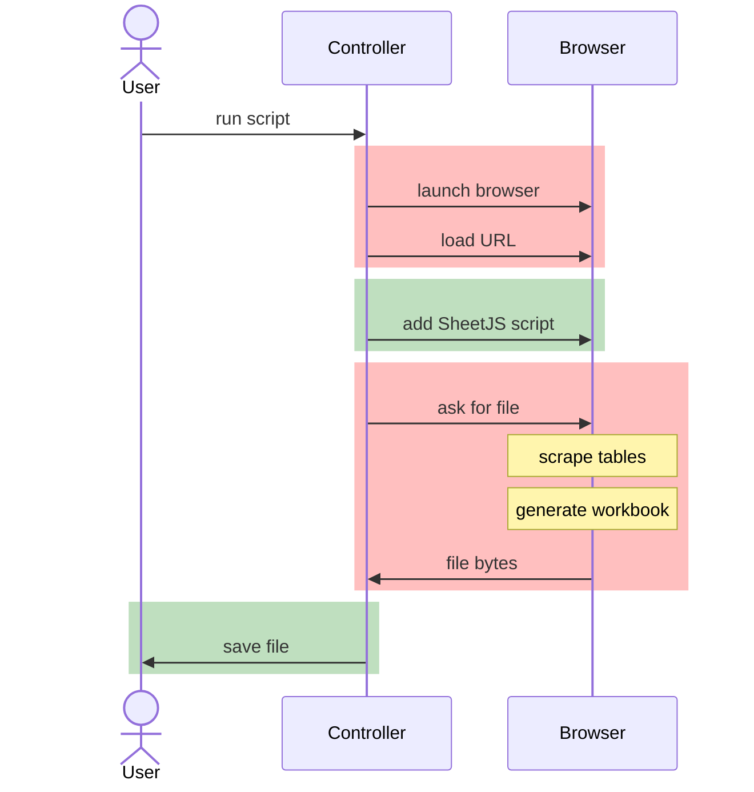

import current from '/version.js';
import Tabs from '@theme/Tabs';
import TabItem from '@theme/TabItem';
import CodeBlock from '@theme/CodeBlock';

Headless automation involves controlling "headless browsers" to access websites
and submit or download data.  It is also possible to automate browsers using
custom browser extensions.

The [SheetJS standalone scripts](/docs/getting-started/installation/standalone)
can be added to any website by inserting a `SCRIPT` tag.  Headless browsers
usually provide utility functions for running custom snippets in the browser and
passing data back to the automation script.

## Use Case

This demo focuses on exporting table data to a workbook.  Headless browsers do
not generally support passing objects between the browser context and the
automation script, so the file data must be generated in the browser context
and sent back to the automation script for saving in the file system.



<details open>
  <summary><b>Key Steps</b> (click to hide)</summary>

1) Launch the headless browser and load the target site.

2) Add the standalone SheetJS build to the page in a `SCRIPT` tag.

3) Add a script to the page (in the browser context) that will:

- Make a workbook object from the first table using `XLSX.utils.table_to_book`
- Generate the bytes for an XLSB file using `XLSX.write`
- Send the bytes back to the automation script

4) When the automation context receives data, save to a file

</details>

This demo exports data from https://sheetjs.com/demos/table.

:::note pass

It is also possible to parse files from the browser context, but parsing from
the automation context is more efficient and strongly recommended.

:::

## Puppeteer

[Puppeteer](https://pptr.dev/) enables headless Chromium automation for NodeJS.
Releases ship with an installer script that installs a headless browser.

<Tabs>
  <TabItem value="nodejs" label="NodeJS">

Binary strings are the favored data type.  They can be safely passed from the
browser context to the automation script.  NodeJS provides an API to write
binary strings to file (`fs.writeFileSync` using encoding `binary`).

The key steps are commented below:

<CodeBlock language="js" title="SheetJSPuppeteer.js">{`\
const fs = require("fs");
const puppeteer = require('puppeteer');
(async () => {
  /* (1) Load the target page */
  const browser = await puppeteer.launch();
  const page = await browser.newPage();
  page.on("console", msg => console.log("PAGE LOG:", msg.text()));
  await page.setViewport({width: 1920, height: 1080});
  await page.goto('https://sheetjs.com/demos/table');
\n\
  /* (2) Load the standalone SheetJS build from the CDN */
  await page.addScriptTag({ url: 'https://cdn.sheetjs.com/xlsx-${current}/package/dist/xlsx.full.min.js' });
\n\
  /* (3) Run the snippet in browser and return data */
  const bin = await page.evaluate(() => {
    /* NOTE: this function will be evaluated in the browser context.
       \`page\`, \`fs\` and \`puppeteer\` are not available.
       \`XLSX\` will be available thanks to step 2 */
\n\
    /* find first table */
    var table = document.body.getElementsByTagName('table')[0];
\n\
    /* call table_to_book on first table */
    var wb = XLSX.utils.table_to_book(table);
\n\
    /* generate XLSB and return binary string */
    return XLSX.write(wb, {type: "binary", bookType: "xlsb"});
  });
\n\
  /* (4) write data to file */
  fs.writeFileSync("SheetJSPuppeteer.xlsb", bin, { encoding: "binary" });
\n\
  await browser.close();
})();`}
</CodeBlock>

**Demo**

:::note Tested Deployments

This demo was last tested on 2024 June 24 against Puppeteer 22.12.0.

:::

1) Install SheetJS and Puppeteer:

<CodeBlock language="bash">{`\
npm i --save https://cdn.sheetjs.com/xlsx-${current}/xlsx-${current}.tgz puppeteer@22.12.0`}
</CodeBlock>

2) Save the `SheetJSPuppeteer.js` code snippet to `SheetJSPuppeteer.js`.

3) Run the script:

```bash
node SheetJSPuppeteer.js
```

When the script finishes, the file `SheetJSPuppeteer.xlsb` will be created.
This file can be opened with Excel.

  </TabItem>
  <TabItem value="deno" label="Deno">

:::caution pass

Deno Puppeteer is a fork. It is not officially supported by the Puppeteer team.

:::

Base64 strings are the favored data type.  They can be safely passed from the
browser context to the automation script.  Deno can decode the Base64 strings
and write the decoded `Uint8Array` data to file with `Deno.writeFileSync`

The key steps are commented below:

<CodeBlock language="ts" title="SheetJSPuppeteer.ts">{`\
import puppeteer from "https://deno.land/x/puppeteer@16.2.0/mod.ts";
import { decode } from "https://deno.land/std/encoding/base64.ts"
\n\
/* (1) Load the target page */
const browser = await puppeteer.launch();
const page = await browser.newPage();
page.on("console", msg => console.log("PAGE LOG:", msg.text()));
await page.setViewport({width: 1920, height: 1080});
await page.goto('https://sheetjs.com/demos/table');
\n\
/* (2) Load the standalone SheetJS build from the CDN */
await page.addScriptTag({ url: 'https://cdn.sheetjs.com/xlsx-${current}/package/dist/xlsx.full.min.js' });
\n\
/* (3) Run the snippet in browser and return data */
const b64 = await page.evaluate(() => {
  /* NOTE: this function will be evaluated in the browser context.
     \`page\`, \`fs\` and \`puppeteer\` are not available.
     \`XLSX\` will be available thanks to step 2 */
\n\
  /* find first table */
  var table = document.body.getElementsByTagName('table')[0];
\n\
  /* call table_to_book on first table */
  var wb = XLSX.utils.table_to_book(table);
\n\
  /* generate XLSB and return binary string */
  return XLSX.write(wb, {type: "base64", bookType: "xlsb"});
});
/* (4) write data to file */
Deno.writeFileSync("SheetJSPuppeteer.xlsb", decode(b64));
\n\
await browser.close();`}
</CodeBlock>

**Demo**

:::note Tested Deployments

This demo was last tested on 2024 June 24 against deno-puppeteer 16.2.0.

:::

1) Install deno-puppeteer:

```bash
env PUPPETEER_PRODUCT=chrome deno run -A --unstable https://deno.land/x/puppeteer@16.2.0/install.ts
```

:::note pass

In PowerShell, the environment variable should be set separately:

```powershell
[Environment]::SetEnvironmentVariable('PUPPETEER_PRODUCT', 'chrome')
deno run -A --unstable  https://deno.land/x/puppeteer@16.2.0/install.ts
```

:::

2) Save the `SheetJSPuppeteer.ts` code snippet to `SheetJSPuppeteer.ts`.

3) Run the script:

```bash
deno run -A --unstable SheetJSPuppeteer.ts
```

When the script finishes, the file `SheetJSPuppeteer.xlsb` will be created.
This file can be opened with Excel.

  </TabItem>
</Tabs>


## Playwright

[Playwright](https://playwright.dev/) presents a unified scripting framework for
Chromium, WebKit, and other browsers. It draws inspiration from Puppeteer. In
fact, the example code is almost identical!

Differences from the Puppeteer example are highlighted below:

<CodeBlock language="js" title="SheetJSPlaywright.js">{`\
const fs = require("fs");
// highlight-next-line
const { webkit } = require('playwright'); // import desired browser
(async () => {
  /* (1) Load the target page */
  // highlight-next-line
  const browser = await webkit.launch(); // launch desired browser
  const page = await browser.newPage();
  page.on("console", msg => console.log("PAGE LOG:", msg.text()));
  // highlight-next-line
  await page.setViewportSize({width: 1920, height: 1080}); // different name :(
  await page.goto('https://sheetjs.com/demos/table');
\n\
  /* (2) Load the standalone SheetJS build from the CDN */
  await page.addScriptTag({ url: 'https://cdn.sheetjs.com/xlsx-${current}/package/dist/xlsx.full.min.js' });
\n\
  /* (3) Run the snippet in browser and return data */
  const bin = await page.evaluate(() => {
    /* NOTE: this function will be evaluated in the browser context.
       \`page\`, \`fs\` and the browser engine are not available.
       \`XLSX\` will be available thanks to step 2 */
\n\
    /* find first table */
    var table = document.body.getElementsByTagName('table')[0];
\n\
    /* call table_to_book on first table */
    var wb = XLSX.utils.table_to_book(table);
\n\
    /* generate XLSB and return binary string */
    return XLSX.write(wb, {type: "binary", bookType: "xlsb"});
  });
\n\
  /* (4) write data to file */
  fs.writeFileSync("SheetJSPlaywright.xlsb", bin, { encoding: "binary" });
\n\
  await browser.close();
})();`}
</CodeBlock>

**Demo**

:::note Tested Deployments

This demo was last tested on 2024 June 24 against Playwright 1.45.0.

:::

1) Install SheetJS and Playwright:

<CodeBlock language="bash">{`\
npm i --save https://cdn.sheetjs.com/xlsx-${current}/xlsx-${current}.tgz playwright@1.45.0`}
</CodeBlock>

2) Save the `SheetJSPlaywright.js` code snippet to `SheetJSPlaywright.js`.

3) Run the script

```bash
node SheetJSPlaywright.js
```

When the script finishes, the file `SheetJSPlaywright.xlsb` will be created.
This file can be opened with Excel.

:::caution pass

The commmand may fail with a message such as:

```
╔═════════════════════════════════════════════════════════════════════════╗
║ Looks like Playwright Test or Playwright was just installed or updated. ║
║ Please run the following command to download new browsers:              ║
║                                                                         ║
║     npx playwright install                                              ║
║                                                                         ║
║ <3 Playwright Team                                                      ║
╚═════════════════════════════════════════════════════════════════════════╝
```

Running the recommended command will download and install browser engines:

```bash
npx playwright install
```

After installing engines, re-run the script.

:::

## PhantomJS

PhantomJS is a headless web browser powered by WebKit.

:::danger pass

This information is provided for legacy deployments.  PhantomJS development has
been suspended and there are known vulnerabilities, so new projects should use
alternatives.  For WebKit automation, new projects should use Playwright.

:::

Binary strings are the favored data type.  They can be safely passed from the
browser context to the automation script.  PhantomJS provides an API to write
binary strings to file (`fs.write` using mode `wb`).

<details>
  <summary><b>Integration Details and Demo</b> (click to show)</summary>

The steps are marked in the comments:

<CodeBlock language="js" title="SheetJSPhantom.js">{`\
var page = require('webpage').create();
page.onConsoleMessage = function(msg) { console.log(msg); };
\n\
/* (1) Load the target page */
page.open('https://sheetjs.com/demos/table', function() {
\n\
  /* (2) Load the standalone SheetJS build from the CDN */
  page.includeJs("https://cdn.sheetjs.com/xlsx-${current}/package/dist/xlsx.full.min.js", function() {
\n\
    /* (3) Run the snippet in browser and return data */
    var bin = page.evaluateJavaScript([ "function(){",
\n\
      /* find first table */
      "var table = document.body.getElementsByTagName('table')[0];",
\n\
      /* call table_to_book on first table */
      "var wb = XLSX.utils.table_to_book(table);",
\n\
      /* generate XLSB file and return binary string */
      "return XLSX.write(wb, {type: 'binary', bookType: 'xlsb'});",
    "}" ].join(""));
\n\
    /* (4) write data to file */
    require("fs").write("SheetJSPhantomJS.xlsb", bin, "wb");
\n\
    phantom.exit();
  });
});`}
</CodeBlock>

:::caution pass

PhantomJS is very finicky and will hang if there are script errors.  It is
strongly recommended to add verbose logging and to lint scripts before use.

:::

**Demo**

:::note Tested Deployments

This demo was tested in the following environments:

| Architecture | PhantomJS | Date       |
|:-------------|:----------|:-----------|
| `darwin-x64` | `2.1.1`   | 2024-03-15 |
| `win10-x64`  | `2.1.1`   | 2024-03-24 |
| `win11-x64`  | `2.1.1`   | 2024-05-22 |
| `linux-x64`  | `2.1.1`   | 2024-04-25 |

:::

1) [Download and extract PhantomJS](https://phantomjs.org/download.html)

2) Save the `SheetJSPhantom.js` code snippet to `SheetJSPhantom.js`.

3) Run the `phantomjs` program and pass the script as the first argument.

For example, if the macOS Archive Utility unzipped the `2.1.1` release, binaries
will be placed in `phantomjs-2.1.1-macosx/bin/` and the command will be:

```bash
./phantomjs-2.1.1-macosx/bin/phantomjs SheetJSPhantom.js
```

When the script finishes, the file `SheetJSPhantomJS.xlsb` will be created.
This file can be opened with Excel.

:::caution pass

When this demo was last tested on Linux, there were multiple errors.

```
This application failed to start because it could not find or load the Qt platform plugin "xcb".
```

The environment variable `QT_QPA_PLATFORM=phantom` resolves the issue. There is
a different error after assignment:

```
140412268664640:error:25066067:DSO support routines:DLFCN_LOAD:could not load the shared library:dso_dlfcn.c:185:filename(libproviders.so): libproviders.so: cannot open shared object file: No such file or directory
140412268664640:error:25070067:DSO support routines:DSO_load:could not load the shared library:dso_lib.c:244:
140412268664640:error:0E07506E:configuration file routines:MODULE_LOAD_DSO:error loading dso:conf_mod.c:285:module=providers, path=providers
140412268664640:error:0E076071:configuration file routines:MODULE_RUN:unknown module name:conf_mod.c:222:module=providers
```

This error is resolved by ignoring SSL errors. The complete command is:

```bash
env OPENSSL_CONF=/dev/null QT_QPA_PLATFORM=phantom ./phantomjs-2.1.1-linux-x86_64/bin/phantomjs --ignore-ssl-errors=true test.js
```

:::

</details>
