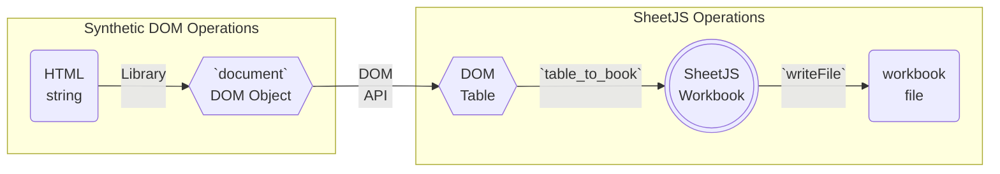

import current from '/version.js';
import CodeBlock from '@theme/CodeBlock';

[SheetJS](https://sheetjs.com) is a JavaScript library for reading and writing
data from spreadsheets.

SheetJS offers three methods to directly process HTML DOM TABLE elements:

- `table_to_sheet`[^1] generates a SheetJS worksheet[^2] from a TABLE element
- `table_to_book`[^3] generates a SheetJS workbook[^4] from a TABLE element
- `sheet_add_dom`[^5] adds data from a TABLE element to an existing worksheet

These methods work in the web browser. NodeJS and other server-side platforms
traditionally lack a DOM implementation, but third-party modules fill the gap.

This demo covers synthetic DOM implementations for non-browser platforms.  We'll
explore how to use SheetJS DOM methods in server-side environments to parse
tables and export data to spreadsheets.

:::tip pass

The most robust approach for server-side processing is to automate a headless
web browser. ["Browser Automation"](/docs/demos/net/headless) includes demos.

:::

## Integration Details

Synthetic DOM implementations typically provide a function that accept a HTML
string and return an object that represents `document`. An API method such as
`getElementsByTagName` or `querySelector` can pull TABLE elements.



SheetJS methods use features that may be missing from some DOM implementations.

### Table rows

The `rows` property of TABLE elements is a list of TR row children. This list
automatically updates when rows are added and deleted.

SheetJS methods do not mutate `rows`. Assuming there are no nested tables, the
`rows` property can be created using `getElementsByTagName`:

```js
tbl.rows = Array.from(tbl.getElementsByTagName("tr"));
```

### Row cells

The `cells` property of TR elements is a list of TD cell children. This list
automatically updates when cells are added and deleted.

SheetJS methods do not mutate `cells`. Assuming there are no nested tables, the
`cells` property can be created using `getElementsByTagName`:

```js
tbl.rows.forEach(row => row.cells = Array.from(row.getElementsByTagName("td")));
```

## NodeJS

### JSDOM

[JSDOM](https://git.io/jsdom) is a DOM implementation for NodeJS. The synthetic
DOM elements are compatible with SheetJS methods.

The following example scrapes the first table from the file `SheetJSTable.html`
and generates a XLSX workbook:

```js title="SheetJSDOM.js"
const XLSX = require("xlsx");
const { readFileSync } = require("fs");
const { JSDOM } = require("jsdom");

/* obtain HTML string.  This example reads from SheetJSTable.html */
const html_str = readFileSync("SheetJSTable.html", "utf8");

// highlight-start
/* get first TABLE element */
const doc = new JSDOM(html_str).window.document.querySelector("table");

/* generate workbook */
const workbook = XLSX.utils.table_to_book(doc);
// highlight-end

XLSX.writeFile(workbook, "SheetJSDOM.xlsx");
```

:::note Tested Deployments

This demo was tested in the following deployments:

| JSDOM   | Date       |
|:--------|:-----------|
| 24.1.0  | 2024-06-24 |
| 23.2.0  | 2024-06-24 |
| 22.1.0  | 2024-06-24 |
| 21.1.2  | 2024-06-24 |
| 20.0.3  | 2024-06-24 |
| 19.0.0  | 2024-06-24 |
| 18.1.1  | 2024-06-24 |
| 17.0.0  | 2024-06-24 |
| 16.7.0  | 2024-06-24 |
| 15.2.1  | 2024-06-24 |
| 14.1.0  | 2024-06-24 |
| 13.2.0  | 2024-06-24 |
| 12.2.0  | 2024-06-24 |
| 11.12.0 | 2024-06-24 |
| 10.1.0  | 2024-06-24 |

:::

<details>
  <summary><b>Complete Demo</b> (click to show)</summary>

1) Install SheetJS and JSDOM libraries:

<CodeBlock language="bash">{`\
npm i --save https://cdn.sheetjs.com/xlsx-${current}/xlsx-${current}.tgz jsdom@24.0.0`}
</CodeBlock>

2) Save the previous codeblock to `SheetJSDOM.js`.

3) Download [the sample `SheetJSTable.html`](pathname:///dom/SheetJSTable.html):

```bash
curl -LO https://docs.sheetjs.com/dom/SheetJSTable.html
```

4) Run the script:

```bash
node SheetJSDOM.js
```

The script will create a file `SheetJSDOM.xlsx` that can be opened.

</details>

### HappyDOM

HappyDOM provides a DOM framework for NodeJS. For the tested version (`13.3.1`),
the following patches were needed:

- TABLE `rows` property (explained above)
- TR `cells` property (explained above)

:::note Tested Deployments

This demo was tested in the following deployments:

| HappyDOM | Date       |
|:---------|:-----------|
| 14.12.3  | 2024-06-24 |
| 13.10.1  | 2024-06-24 |
| 12.10.3  | 2024-06-24 |
| 11.2.0   | 2024-06-24 |
| 10.11.2  | 2024-06-24 |
| 9.20.3   | 2024-06-24 |
| 8.9.0    | 2024-06-24 |
| 7.8.1    | 2024-06-24 |
| 6.0.4    | 2024-06-24 |
| 5.4.0    | 2024-06-24 |
| 4.1.0    | 2024-06-24 |
| 3.2.2    | 2024-06-24 |
| 2.55.0   | 2024-06-24 |

:::

<details>
  <summary><b>Complete Demo</b> (click to show)</summary>

1) Install SheetJS and HappyDOM libraries:

<CodeBlock language="bash">{`\
npm i --save https://cdn.sheetjs.com/xlsx-${current}/xlsx-${current}.tgz happy-dom@13.3.1`}
</CodeBlock>

2) Download [the sample script `SheetJSHappyDOM.js`](pathname:///dom/SheetJSHappyDOM.js):

```bash
curl -LO https://docs.sheetjs.com/dom/SheetJSHappyDOM.js
```

3) Download [the sample `SheetJSTable.html`](pathname:///dom/SheetJSTable.html):

```bash
curl -LO https://docs.sheetjs.com/dom/SheetJSTable.html
```

4) Run the script:

```bash
node SheetJSHappyDOM.js
```

The script will create a file `SheetJSHappyDOM.xlsx` that can be opened.

</details>

### XMLDOM

[XMLDOM](https://xmldom.org/) provides a DOM framework for NodeJS. For the
tested version (`0.8.10`), the following patches were needed:

- TABLE `rows` property (explained above)
- TR `cells` property (explained above)
- Element `innerHTML` property:

```js
Object.defineProperty(tbl.__proto__, "innerHTML", { get: function() {
  var outerHTML = new XMLSerializer().serializeToString(this);
  if(outerHTML.match(/</g).length == 1) return "";
  return outerHTML.slice(0, outerHTML.lastIndexOf("</")).replace(/<[^"'>]*(("[^"]*"|'[^']*')[^"'>]*)*>/, "");
}});
```

<details>
  <summary><b>Complete Demo</b> (click to show)</summary>

:::note Tested Deployments

This demo was last tested on 2024 March 12 against XMLDOM `0.8.10`

:::

1) Install SheetJS and XMLDOM libraries:

<CodeBlock language="bash">{`\
npm i --save https://cdn.sheetjs.com/xlsx-${current}/xlsx-${current}.tgz @xmldom/xmldom@0.8.10`}
</CodeBlock>

2) Download [the sample script `SheetJSXMLDOM.js`](pathname:///dom/SheetJSXMLDOM.js):

```bash
curl -LO https://docs.sheetjs.com/dom/SheetJSXMLDOM.js
```

3) Run the script:

```bash
node SheetJSXMLDOM.js
```

The script will create a file `SheetJSXMLDOM.xlsx` that can be opened.

</details>

### CheerioJS

:::caution pass

Cheerio does not support a number of fundamental properties out of the box. They
can be shimmed, but it is strongly recommended to use a more compliant library.

:::

[CheerioJS](https://cheerio.js.org/) provides a DOM-like framework for NodeJS.
[`SheetJSCheerio.js`](pathname:///dom/SheetJSCheerio.js) implements the missing
features to ensure that SheetJS DOM methods can process TABLE elements.

<details>
  <summary><b>Complete Demo</b> (click to show)</summary>

:::note Tested Deployments

This demo was last tested on 2024 March 12 against Cheerio `1.0.0-rc.12`

:::

1) Install SheetJS and CheerioJS libraries:

<CodeBlock language="bash">{`\
npm i --save https://cdn.sheetjs.com/xlsx-${current}/xlsx-${current}.tgz cheerio@1.0.0-rc.12`}
</CodeBlock>

2) Download [the sample script `SheetJSCheerio.js`](pathname:///dom/SheetJSCheerio.js):

```bash
curl -LO https://docs.sheetjs.com/dom/SheetJSCheerio.js
```

3) Download [the sample `SheetJSTable.html`](pathname:///dom/SheetJSTable.html):

```bash
curl -LO https://docs.sheetjs.com/dom/SheetJSTable.html
```

4) Run the script:

```bash
node SheetJSCheerio.js
```

The script will create a file `SheetJSCheerio.xlsx` that can be opened.

</details>

## Other Platforms

### DenoDOM

[DenoDOM](https://deno.land/x/deno_dom) provides a DOM framework for Deno. For
the tested version (`0.1.46`), the following patches were needed:

- TABLE `rows` property (explained above)
- TR `cells` property (explained above)

This example fetches [a sample table](pathname:///dom/SheetJSTable.html):

<CodeBlock language="ts" title="SheetJSDenoDOM.ts">{`\
// @deno-types="https://cdn.sheetjs.com/xlsx-${current}/package/types/index.d.ts"
import * as XLSX from 'https://cdn.sheetjs.com/xlsx-${current}/package/xlsx.mjs';
\n\
import { DOMParser } from 'https://deno.land/x/deno_dom@v0.1.46/deno-dom-wasm.ts';
\n\
const doc = new DOMParser().parseFromString(
  await (await fetch('https://docs.sheetjs.com/dom/SheetJSTable.html')).text(),
  "text/html",
)!;
// highlight-start
const tbl = doc.querySelector("table");
\n\
/* patch DenoDOM element */
tbl.rows = tbl.querySelectorAll("tr");
tbl.rows.forEach(row => row.cells = row.querySelectorAll("td, th"))
\n\
/* generate workbook */
const workbook = XLSX.utils.table_to_book(tbl);
// highlight-end
XLSX.writeFile(workbook, "SheetJSDenoDOM.xlsx");`}
</CodeBlock>

<details>
  <summary><b>Complete Demo</b> (click to show)</summary>

:::note Tested Deployments

This demo was tested in the following deployments:

| Architecture | DenoDOM | Deno   | Date       |
|:-------------|:--------|:-------|:-----------|
| `darwin-x64` | 0.1.46  | 1.44.4 | 2024-06-19 |
| `darwin-arm` | 0.1.46  | 1.44.4 | 2024-06-19 |

:::

1) Save the previous codeblock to `SheetJSDenoDOM.ts`.

2) Run the script with `--allow-net` and `--allow-write` entitlements:

```bash
deno run --allow-net --allow-write SheetJSDenoDOM.ts
```

The script will create a file `SheetJSDenoDOM.xlsx` that can be opened.

</details>

[^1]: See [`table_to_sheet` in "HTML" Utilities](/docs/api/utilities/html#create-new-sheet)
[^2]: See ["Worksheet Object" in "SheetJS Data Model"](/docs/csf/sheet) for more details.
[^3]: See [`table_to_book` in "HTML" Utilities](/docs/api/utilities/html#create-new-sheet)
[^4]: See ["Workbook Object" in "SheetJS Data Model"](/docs/csf/book) for more details.
[^5]: See [`sheet_add_dom` in "HTML" Utilities](/docs/api/utilities/html#add-to-sheet)