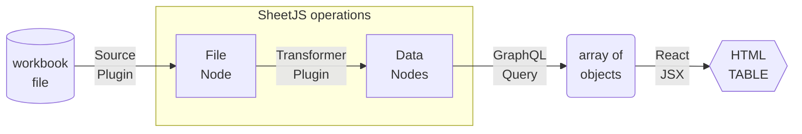

import current from '/version.js';
import Tabs from '@theme/Tabs';
import TabItem from '@theme/TabItem';
import CodeBlock from '@theme/CodeBlock';

export const r = {style: {color:"red"}};
export const R = {style: {backgroundColor:"darkred"}};

GatsbyJS is a framework for creating websites. It uses React components for page
templates and GraphQL for loading data.

[SheetJS](https://sheetjs.com) is a JavaScript library for reading and writing
data from spreadsheets.

This demo uses GatsbyJS and SheetJS (through the `gatsby-transformer-excel`[^1]
transformer) to pull data from a spreadsheet and display the content in a page.

The ["Complete Example"](#complete-example) section includes a complete website
powered by an XLSX spreadsheet.

:::info pass

`gatsby-transformer-excel` is maintained by the Gatsby core team and all bugs
should be directed to the main Gatsby project.  If it is determined to be a bug
in the parsing logic, issues should then be raised with the SheetJS team.

:::

:::caution pass

`gatsby-transformer-excel` uses an older version of the library.  It can be
overridden through a `package.json` override in the latest versions of NodeJS:

<CodeBlock language="json" title="package.json (add highlighted lines)">{`\
{
  "overrides": {
    "xlsx": "https://cdn.sheetjs.com/xlsx-${current}/xlsx-${current}.tgz"
  }
}`}
</CodeBlock>

:::

:::danger Telemetry

GatsbyJS collects telemetry by default. The `telemetry` subcommand can disable it:

```js
npx gatsby telemetry --disable
```

:::

## Integration Details



In the GatsbyJS data system, source plugins read from data sources and generate
nodes represent raw data. Transformer plugins transform these nodes into other
nodes that represent processed data for use in pages.

This example uses `gatsby-source-filesystem`[^2] to read files from the
filesystem and `gatsby-transformer-excel` transformer to perform the transform.

### Installation

The [SheetJS NodeJS module](/docs/getting-started/installation/nodejs) will be
referenced by `gatsby-transformer-excel`.

Before installing, to ensure that the transformer uses the latest version of the
library, the `overrides` section must be added to `package.json`:

<CodeBlock language="json" title="package.json (add highlighted lines)">{`\
{
  // highlight-start
  "overrides": {
    "xlsx": "https://cdn.sheetjs.com/xlsx-${current}/xlsx-${current}.tgz"
  }
  // highlight-end
}`}
</CodeBlock>

`gatsby-transformer-excel` and `gatsby-source-filesystem` should be installed
after installing SheetJS modules:

<Tabs groupId="pm">
  <TabItem value="npm" label="npm">
<CodeBlock language="bash">{`\
npx gatsby telemetry --disable
npm i --save https://cdn.sheetjs.com/xlsx-${current}/xlsx-${current}.tgz
npm i --save gatsby-transformer-excel gatsby-source-filesystem`}
</CodeBlock>
  </TabItem>
  <TabItem value="pnpm" label="pnpm">
<CodeBlock language="bash">{`\
npx gatsby telemetry --disable
pnpm install --save https://cdn.sheetjs.com/xlsx-${current}/xlsx-${current}.tgz
pnpm install --save gatsby-transformer-excel gatsby-source-filesystem`}
</CodeBlock>
  </TabItem>
  <TabItem value="yarn" label="Yarn" default>
<CodeBlock language="bash">{`\
npx gatsby telemetry --disable
yarn add https://cdn.sheetjs.com/xlsx-${current}/xlsx-${current}.tgz
yarn add gatsby-transformer-excel gatsby-source-filesystem`}
</CodeBlock>
  </TabItem>
</Tabs>

### GraphQL details

Under the hood, `gatsby-transformer-excel` uses the SheetJS `read`[^3] method to
parse the workbook into a SheetJS workbook[^4]. Each worksheet is extracted from
the workbook. The `sheet_to_json` method[^5] generates row objects using the
headers in the first row as keys.

Consider the following worksheet:


Assuming the file name is `pres.xlsx` and the data is stored in "Sheet1", the
following nodes will be created:

```js title="GraphQL Nodes"
[
  { Name: "Bill Clinton", Index: 42, type: "PresXlsxSheet1" },
  { Name: "GeorgeW Bush", Index: 43, type: "PresXlsxSheet1" },
  { Name: "Barack Obama", Index: 44, type: "PresXlsxSheet1" },
  { Name: "Donald Trump", Index: 45, type: "PresXlsxSheet1" },
  { Name: "Joseph Biden", Index: 46, type: "PresXlsxSheet1" },
]
```

The type is a proper casing of the file name concatenated with the sheet name.

The following query pulls the `Name` and `Index` fields from each row:

```graphql title="GraphQL Query to pull Name and Index fields from each row"
{
  allPresXlsxSheet1 { # "all" followed by type
    edges {
      node { # each line in this block should be a field in the data
        Name
        Index
      }
    }
  }
}
```

## Complete Example

:::note Tested Deployments

This demo was tested in the following environments:

| GatsbyJS | Date       |
|:---------|:-----------|
| `5.13.4` | 2024-05-04 |
| `4.25.8` | 2024-03-27 |

:::

### Project setup

0) Disable GatsbyJS telemetry:

```bash
npx gatsby telemetry --disable
```

:::info pass

In NodeJS 22, the process displayed an error:

<pre>
<span {...R}> ERROR </span><span {...r}> UNKNOWN</span>
{`\n`}
{`\n`}
(node:25039) [DEP0040] DeprecationWarning: The `punycode` module is deprecated.
Please use a userland alternative instead.
(Use `node --trace-deprecation ...` to show where the warning was created)
</pre>

**This is a false report!**

The error can be safely ignored.

:::

1) Create a template site:

```bash
npx gatsby new sheetjs-gatsby
```

:::info pass

For older Gatsby versions, the project must be built from the starter project.

For GatsbyJS 4, the starter commit is `6bc4466090845f20650117b3d27e68e6e46dc8d5`
and the steps are shown below:

```bash
git clone https://github.com/gatsbyjs/gatsby-starter-default sheetjs-gatsby
cd sheetjs-gatsby
git checkout 6bc4466090845f20650117b3d27e68e6e46dc8d5
npm install
cd ..
```

:::

2) Follow the on-screen instructions for starting the local development server:

```bash
cd sheetjs-gatsby
npm run develop
```

Open a web browser to the displayed URL (typically `http://localhost:8000/`)

3) Edit `package.json` and add the highlighted lines in the JSON object:

<CodeBlock language="json" title="package.json (add highlighted lines)">{`\
{
  // highlight-start
  "overrides": {
    "xlsx": "https://cdn.sheetjs.com/xlsx-${current}/xlsx-${current}.tgz"
  },
  // highlight-end
  "name": "sheetjs-gatsby",
  "version": "1.0.0",
`}
</CodeBlock>

4) Install the library and plugins:

<CodeBlock language="bash">{`\
npm i --save https://cdn.sheetjs.com/xlsx-${current}/xlsx-${current}.tgz
npm i --save gatsby-transformer-excel gatsby-source-filesystem
`}
</CodeBlock>

:::info pass

For older versions of Gatsby, older versions of the dependencies must be used.

For GatsbyJS 4, the plugin version numbers align with the Gatsby version:

```bash
npm i --save gatsby-transformer-excel@4 gatsby-source-filesystem@4
```

:::

5) Make a `src/data` directory, download https://docs.sheetjs.com/pres.xlsx, and
move the downloaded file into the new folder:

```bash
mkdir -p src/data
curl -L -o src/data/pres.xlsx https://docs.sheetjs.com/pres.xlsx
```

6) Edit `gatsby-config.js` and add the following lines to the `plugins` array:

```js title="gatsby-config.js (add highlighted lines)"
module.exports = {
  siteMetadata: {
    title: `sheetjs-gatsby`,
    siteUrl: `https://www.yourdomain.tld`,
  },
// highlight-start
  plugins: [
    {
      resolve: `gatsby-source-filesystem`,
      options: {
        name: `data`,
        path: `${__dirname}/src/data/`,
      },
    },
    `gatsby-transformer-excel`,
  ],
// highlight-end
}
```

:::note pass

If the `plugins` array exists, the two plugins should be added at the beginning:

```js title="gatsby-config.js (add highlighted lines)"
  plugins: [
// highlight-start
    {
      resolve: `gatsby-source-filesystem`,
      options: {
        name: `data`,
        path: `${__dirname}/src/data/`,
      },
    },
    `gatsby-transformer-excel`,
// highlight-end
    // ...
```

:::

Stop and restart the development server process (`npm run develop`).

### GraphiQL test

7) Open the GraphiQL editor. The output of the previous step displayed the URL
(typically `http://localhost:8000/___graphql` )

There is an editor in the left pane.  Paste the following query into the editor:

```graphql title="GraphQL Query (paste into editor)"
{
  allPresXlsxSheet1 {
    edges {
      node {
        Name
        Index
      }
    }
  }
}
```

Press the Execute Query button (`▶`) and data should show up in the right pane:


<details>
  <summary><b>Sample Output</b> (click to show)</summary>

In GatsbyJS version `5.13.4`, the raw output was:

```json title="GraphQL query result from GatsbyJS 5.13.4"
{
  "data": {
    "allPresXlsxSheet1": {
      "edges": [
        {
          "node": {
            "Name": "Bill Clinton",
            "Index": 42
          }
        },
        {
          "node": {
            "Name": "GeorgeW Bush",
            "Index": 43
          }
        },
        {
          "node": {
            "Name": "Barack Obama",
            "Index": 44
          }
        },
        {
          "node": {
            "Name": "Donald Trump",
            "Index": 45
          }
        },
        {
          "node": {
            "Name": "Joseph Biden",
            "Index": 46
          }
        }
      ]
    }
  },
  "extensions": {}
}
```

</details>

### React page

8) Create a new file `src/pages/pres.js` that uses the query and displays the result:

```jsx title="src/pages/pres.js (create new file)"
import { graphql } from "gatsby"
import * as React from "react"

export const query = graphql`query {
  allPresXlsxSheet1 {
    edges {
      node {
        Name
        Index
      }
    }
  }
}`;

const PageComponent = ({data}) => {
  return ( <pre>{JSON.stringify(data, 2, 2)}</pre> );
};
export default PageComponent;
```

After saving the file, access `http://localhost:8000/pres` in the browser. The
displayed JSON is the data that the component receives:

```js title="Expected contents of /pres"
{
  "allPresXlsxSheet1": {
    "edges": [
      {
        "node": {
          "Name": "Bill Clinton",
          "Index": 42
        }
      },
  // ....
```

9) Change `PageComponent` to display a table based on the data:

```jsx title="src/pages/pres.js (replace PageComponent)"
import { graphql } from "gatsby"
import * as React from "react"

export const query = graphql`query {
  allPresXlsxSheet1 {
    edges {
      node {
        Name
        Index
      }
    }
  }
}`;

// highlight-start
const PageComponent = ({data}) => {
  const rows = data.allPresXlsxSheet1.edges.map(r => r.node);
  return ( <table>
    <thead><tr><th>Name</th><th>Index</th></tr></thead>
    <tbody>{rows.map(row => ( <tr>
      <td>{row.Name}</td>
      <td>{row.Index}</td>
    </tr> ))}</tbody>
  </table> );
};
// highlight-end

export default PageComponent;
```

Going back to the browser, `http://localhost:8000/pres` will show a table:


### Live refresh

10) Open the file `src/data/pres.xlsx` in Excel or another spreadsheet editor.
Add a new row at the end of the file, setting cell `A7` to "SheetJS Dev" and
cell `B7` to `47`. The sheet should look like the following screenshot:


Save the file and observe that the table has refreshed with the new data:


### Static site

11) Stop the development server and build the site:

```bash
npm run build
```

The build output will confirm that the `/pres` route is static:

```text title="Output from GatsbyJS build process"
Pages

┌ src/pages/404.js
│ ├   /404/
│ └   /404.html
├ src/pages/index.js
│ └   /
└ src/pages/pres.js
  └   /pres/

  ╭────────────────────────────────────────────────────────────────╮
  │                                                                │
  │   (SSG) Generated at build time                                │
  │ D (DSG) Deferred static generation - page generated at runtime │
  │ ∞ (SSR) Server-side renders at runtime (uses getServerData)    │
  │ λ (Function) Gatsby function                                   │
  │                                                                │
  ╰────────────────────────────────────────────────────────────────╯
```

The generated page will be placed in `public/pres/index.html`.

12) Open `public/pres/index.html` with a text editor and search for "SheetJS".
There will be a HTML row:

```html title="public/pres/index.html (Expected contents)"
<tr><td>SheetJS Dev</td><td>47</td></tr>
```

[^1]: The package is available as [`gatsby-transformer-excel` on the public NPM registry](https://www.npmjs.com/package/gatsby-transformer-excel). It is also listed on the [GatsbyJS plugin library](https://www.gatsbyjs.com/plugins/gatsby-transformer-excel/).
[^2]: See [the `gatsby-source-filesystem` plugin](https://www.gatsbyjs.com/plugins/gatsby-source-filesystem/) in the GatsbyJS documentation
[^3]: See [`read` in "Reading Files"](/docs/api/parse-options)
[^4]: See ["Workbook Object"](/docs/csf/book) for more details on the SheetJS workbook object.
[^5]: See [`sheet_to_json` in "Utilities"](/docs/api/utilities/array#array-output)