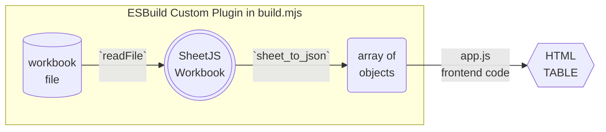

import current from '/version.js';
import CodeBlock from '@theme/CodeBlock';

[ESBuild](https://esbuild.github.io/) is a modern build tool for generating
static sites. It has a robust JavaScript-powered plugin system[^1]

[SheetJS](https://sheetjs.com) is a JavaScript library for reading and writing
data from spreadsheets.

This demo uses ESBuild and SheetJS to pull data from a spreadsheet and display
the content in an HTML table. We'll explore how to load SheetJS in a ESBuild
loader and generate data for use in webpages.

The ["Demo"](#demo) creates a complete website powered by a XLSX spreadsheet.

:::info pass

This demo covers static asset imports. For processing files in the browser, the
["Bundlers" demo](/docs/demos/frontend/bundler/esbuild) includes an example of
importing the SheetJS library in a browser script.

:::

## ESBuild Loader

ESBuild releases starting from `0.9.1` support custom loader plugins. The loader
receives an absolute path to the spreadsheet on the filesystem.

The [SheetJS NodeJS module](/docs/getting-started/installation/nodejs) can be
imported from ESBuild loader plugins.

:::info pass

ESBuild loader plugins use ECMAScript Modules. The plugin ultimately receives
raw paths to files. [`fs`](/docs/getting-started/installation/nodejs#esm-import)
must be manually imported:

```js
import * as XLSX from 'xlsx';

/* load 'fs' for readFile and writeFile support */
import * as fs from 'fs';
XLSX.set_fs(fs);
```

:::

The following diagram depicts the workbook waltz:



### ESBuild Config

Plugins can be referenced in the `plugins` array of the build config object:

```js title="build.mjs (structure)"
import * as esbuild from 'esbuild'

// highlight-next-line
let sheetjsPlugin = {
  name: 'sheetjs',
  setup(build) {
    // ...
  }
};

await esbuild.build({
  entryPoints: ['app.js'],
  bundle: true,
  outfile: 'out.js',
  // highlight-next-line
  plugins: [sheetjsPlugin],
})
```

### Registering File Extensions

The `setup` method receives the build options. Handlers for custom files should
be added using `build.onLoad`.

The first argument to `onLoad` is a configuration object. The `filter` property
is expected to be a regular expression. The following regular expression matches
NUMBERS, XLSX, XLS, and XLSB files:

```js
    const EXTS = /.(numbers|xlsx|xls|xlsb)$/;
```

The second argument to `onLoad` is a callback that receives an arguments object.
The `path` property of the object is the absolute path to the file.

```js
  setup(build) {
    build.onLoad({ filter: EXTS }, (args) => {
      const path = args.path;
      // ...
    });
  },
```

### SheetJS Operations

The SheetJS `readFile` method[^2] will directly read the file on the filesystem.
The return value is a SheetJS workbook object[^3].

The loader in this demo will parse the workbook, pull the first worksheet, and
generate an array of row objects using the `sheet_to_json` method[^4].

:::caution pass

JSON does not natively support Dates! `JSON.stringify` will generate strings.

Through a clever workaround, it is possible to encode dates separately and
recover the Date objects in the generated code module.

:::

```js title="build.mjs (plugin implementation)"
import * as XLSX from 'xlsx';
import * as fs from 'fs';
XLSX.set_fs(fs);

/* plugin */
let sheetjsPlugin = {
  name: 'sheetjs',
  setup(build) {
    /* match NUMBERS, XLSX, XLS, and XLSB files */
    const EXTS = /.(numbers|xlsx|xls|xlsb)$/;

    /* this method will be called once for each referenced file */
    build.onLoad({ filter: EXTS }, (args) => {
      /* parse file from filesystem */
      const wb = XLSX.readFile(args.path);
      /* get first worksheet */
      const ws = wb.Sheets[wb.SheetNames[0]];

      /* workaround for JSON limitation */
      Date.prototype.toJSON2 = Date.prototype.toJSON;
      Date.prototype.toJSON = function() { return {d:this.toISOString()}; };

      /* generate row objects */
      const data = XLSX.utils.sheet_to_json(ws);

      /* generate final module code */
      const res = JSON.stringify(data);
      Date.prototype.toJSON = Date.prototype.toJSON2;
      const contents = `const data = ${res};
data.forEach(row => {
  Object.keys(row).forEach(k => {
    if(row[k]?.d) row[k] = new Date(row[k].d);
  })
});
export default data;`
      return { contents, loader: 'js' };
    });
  },
};
```

### Asset Imports

Spreadsheets can be imported using the plugin.  Assuming `pres.xlsx` is stored
in the same folder as the script, `./pres.xlsx` will be a data module:

```js title="src/index.js"
import data from './pres.xlsx';
/* `data` is an array of objects from ./pres.xlsx */

const elt = document.createElement('div');
elt.innerHTML = "<table><tr><th>Name</th><th>Index</th></tr>" +
  data.map((row) => `<tr>
    <td>${row.Name}</td>
    <td>${row.Index}</td>
  </tr>`).join("") +
"</table>";
document.body.appendChild(elt);
```

## Demo

:::note Tested Deployments

This demo was tested in the following environments:

| `esbuild` | Date       |
|:----------|:-----------|
| `0.20.2`  | 2024-04-07 |
| `0.19.12` | 2024-04-07 |
| `0.18.20` | 2024-04-07 |
| `0.17.19` | 2024-04-07 |
| `0.16.17` | 2024-04-07 |
| `0.15.18` | 2024-04-07 |
| `0.14.54` | 2024-04-07 |
| `0.13.15` | 2024-04-07 |
| `0.12.29` | 2024-04-07 |
| `0.11.23` | 2024-04-07 |
| `0.10.2`  | 2024-04-07 |
| `0.9.7`   | 2024-04-07 |
| `0.9.1`   | 2024-04-07 |

:::

### Initial Setup

0) Create a new skeleton project:

```bash
mkdir sheetjs-esb
cd sheetjs-esb
npm init -y
npm i --save esbuild@0.20.2
```

1) Install the SheetJS NodeJS module:

<CodeBlock language="bash">{`\
npm i --save https://cdn.sheetjs.com/xlsx-${current}/xlsx-${current}.tgz`}
</CodeBlock>

2) Save the following to `index.html`:

```html title="index.html"
<!DOCTYPE html>
<html>
  <head>
    <title>SheetJS + ESBuild</title>
  </head>
  <body>
   <script src="out.js"></script>
  </body>
</html>
```

3) Save the following to `app.js`:

```js title="app.js"
import data from './pres.numbers'
const elt = document.createElement('div');
elt.innerHTML = "<table><tr><th>Name</th><th>Index</th></tr>" +
  data.map((row) => `<tr>
    <td>${row.Name}</td>
    <td>${row.Index}</td>
  </tr>`).join("") +
"</table>";
document.body.appendChild(elt);
```

4) Download [`build.mjs`](pathname:///esbuild/build.mjs) to the project folder:

```bash
curl -LO https://docs.sheetjs.com/esbuild/build.mjs
```

5) Download https://docs.sheetjs.com/pres.numbers to the project folder:

```bash
curl -LO https://docs.sheetjs.com/pres.numbers
```

### Static Site Test

6) Build the site:

```bash
node build.mjs
```

The final script will be saved to `out.js`

7) Start a local web server to host the project folder:

```bash
npx http-server .
```

The command will print a list of URLs.

8) Open one of the URLs printed in the previous step (`http://localhost:8080`)
and confirm that the same data is displayed.

To verify that the data was added to the page, append `out.js` to the URL
(`http://localhost:8080/out.js`) and view the source.  The source will include
president names.  It will not include SheetJS library references!

In the last test, the generated source looked like the following snippet

```js title="out.js (Expected output)"
(() => {
  // pres.numbers
  var data = [{ "Name": "Bill Clinton", "Index": 42 }, /* ... more data */];
  data.forEach((row) => {
    Object.keys(row).forEach((k) => {
      if (row[k]?.d)
        row[k] = new Date(row[k].d);
    });
  });
  var pres_default = data;

  // app.js
  var elt = document.createElement("div");
  elt.innerHTML = "<table><tr><th>Name</th><th>Index</th></tr>" + pres_default.map((row) => `<tr>
    <td>${row.Name}</td>
    <td>${row.Index}</td>
  </tr>`).join("") + "</table>";
  document.body.appendChild(elt);
})();
```

[^1]: See ["Plugins"](https://esbuild.github.io/plugins/) in the ESBuild documentation.
[^2]: See [`readFile` in "Reading Files"](/docs/api/parse-options)
[^3]: See ["Workbook Object"](/docs/csf/book)
[^4]: See [`sheet_to_json` in "Utilities"](/docs/api/utilities/array#array-output)
