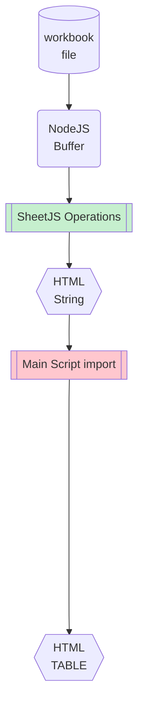
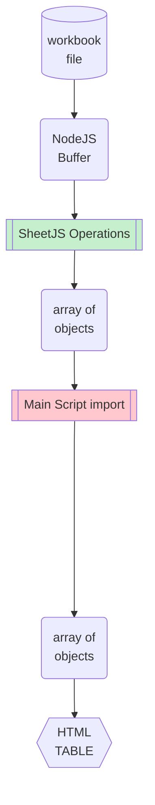
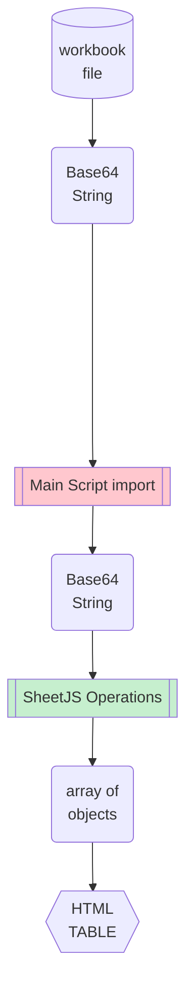
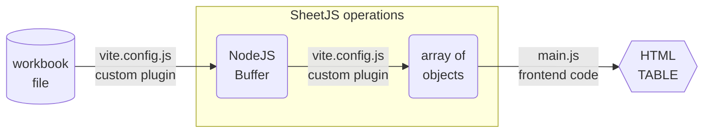
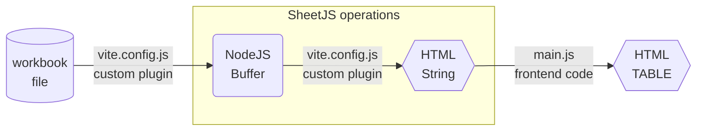
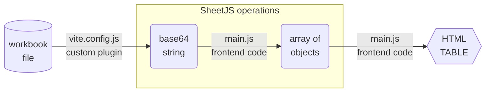

import current from '/version.js';
import CodeBlock from '@theme/CodeBlock';

[ViteJS](https://vitejs.dev/) is a build tool for generating static websites. It
has a robust JavaScript-powered plugin system[^1].

[SheetJS](https://sheetjs.com) is a JavaScript library for reading and writing
data from spreadsheets.

This demo uses ViteJS and SheetJS to pull data from a spreadsheet and display
the content in an HTML table. We'll explore how to load SheetJS in a ViteJS
plugin and evaluate data loading strategies.

The ["Complete Demo"](#complete-demo) section creates a complete website powered
by a XLSX spreadsheet.

:::info pass

This demo covers use cases where data is available at build time. This flow is
suitable for end of week or end of month (EOM) reports published in HTML tables.

For processing user-submitted files in the browser, the
[ViteJS "Bundlers" demo](/docs/demos/frontend/bundler/vitejs) shows client-side
bundling of SheetJS libraries. The ["ReactJS" demo](/docs/demos/frontend/react)
shows example sites using ViteJS with the ReactJS starter.

:::

## Plugins

ViteJS supports static asset imports[^2], but the default raw loader interprets
data as UTF-8 strings. This corrupts binary formats including XLSX and XLS. A
custom loader can bypass the raw loader and directly read files.

Since a custom loader must be used, some data processing work can be performed
by the loader. Three approaches are explored in this demo.

The following diagrams show the ViteJS data flow. The pink "Main Script import"
boxes represent the division between the loader and the main script. The green
"SheetJS Operations" boxes represent the steps performed by SheetJS libraries.

<table>
  <tr>
    <th>[HTML](#html-plugin)</th>
    <th>[Data](#pure-data-plugin)</th>
    <th>[Base64](#base64-plugin)</th>
  </tr>
  <tr>
    <td style={{verticalAlign: "top"}}>



    </td>
    <td style={{verticalAlign: "top"}}>



    </td>
    <td style={{verticalAlign: "top"}}>



    </td>
  </tr>
</table>

For simple tables of data, ["Pure Data Plugin"](#pure-data-plugin) is strongly
recommended. The file processing is performed at build time and the generated
site only includes the raw data.

For more complex parsing or display logic, ["Base64 Plugin"](#base64-plugin) is
preferable. Since the raw parsing logic is performed in the page, the library
will be included in the final bundle.

The ["HTML Plugin"](#html-plugin) generates HTML in the loader script. The
SheetJS HTML writer renders merged cells and other features.

### Pure Data Plugin

For a pure static site, a plugin can load data into an array of row objects. The
SheetJS work is performed in the plugin. The library is not loaded in the page!

The following diagram depicts the workbook waltz:



This ViteJS plugin will read spreadsheets using the SheetJS `read` method[^3]
and generate arrays of row objects with the SheetJS `sheet_to_json`[^4] method:

```js title="vite.config.js"
import { readFileSync } from 'fs';
import { read, utils } from 'xlsx';
import { defineConfig } from 'vite';

export default defineConfig({
  assetsInclude: ['**/*.xlsx'], // xlsx file should be treated as assets

  plugins: [
    { // this plugin handles ?sheetjs tags
      name: "vite-sheet",
      transform(code, id) {
        if(!id.match(/\?sheetjs$/)) return;
        var wb = read(readFileSync(id.replace(/\?sheetjs$/, "")));
        var data = utils.sheet_to_json(wb.Sheets[wb.SheetNames[0]]);
        return `export default JSON.parse('${JSON.stringify(data).replace(/\\/g, "\\\\")}')`;
      }
    }
  ]
});
```

:::info pass

ViteJS plugins are expected to return strings representing ECMAScript modules.

The plugin uses `JSON.stringify` to encode the array of objects. The generated
string is injected into the new module code. When ViteJS processes the module,
`JSON.parse` recovers the array of objects.

:::

In frontend code, the loader will look for all modules with a `?sheetjs`
query string. The default export is an array of row objects.

The following example script displays the data in a table:

```js title="main.js"
import data from './data/pres.xlsx?sheetjs';

document.querySelector('#app').innerHTML = `<table>
  <thead><tr><th>Name</th><th>Index</th></tr></thead>
  <tbody>
    ${data.map(row => `<tr>
      <td>${row.Name}</td>
      <td>${row.Index}</td>
    </tr>`).join("\n")}
  </tbody>
</table>`;
```

### HTML Plugin

A plugin can generate raw HTML strings that can be added to a page. The SheetJS
libraries are used in the plugin but will not be added to the site.

The following diagram depicts the workbook waltz:



This ViteJS plugin will read spreadsheets using the SheetJS `read` method[^5]
and generate HTML using the SheetJS `sheet_to_html`[^6] method:

```js title="vite.config.js"
import { readFileSync } from 'fs';
import { read, utils } from 'xlsx';
import { defineConfig } from 'vite';

export default defineConfig({
  assetsInclude: ['**/*.xlsx'], // xlsx file should be treated as assets

  plugins: [
    { // this plugin handles ?html tags
      name: "vite-sheet-html",
      transform(code, id) {
        if(!id.match(/\?html/)) return;
        var wb = read(readFileSync(id.replace(/\?html/, "")));
        var html = utils.sheet_to_html(wb.Sheets[wb.SheetNames[0]]);
        return (`export default JSON.parse('${JSON.stringify(html).replace(/\\/g, "\\\\")}')`);
      }
    }
  ]
});
```

:::info pass

ViteJS plugins are expected to return strings representing ECMAScript modules.

The plugin uses `JSON.stringify` to encode the HTML string. The generated string
is injected into the new module code. When ViteJS processes the module,
`JSON.parse` recovers the original HTML string.

:::

In frontend code, the loader will look for all modules with a `?html` query
string. The default export is a string that can be directly added to the page.

The following example script sets the `innerHTML` property of the container:

```js title="main.js"
import html from './data/pres.xlsx?html';

document.querySelector('#app').innerHTML = html;
```

### Base64 Plugin

This plugin pulls in data as a Base64 string that can be read with `read`[^7].
While this approach works, it is not recommended since it loads the library in
the front-end site.

The following diagram depicts the workbook waltz:



This ViteJS plugin will read spreadsheet files and export the data as a Base64
string. SheetJS is not imported in the plugin:

```js title="vite.config.js"
import { readFileSync } from 'fs';
import { defineConfig } from 'vite';

export default defineConfig({
  assetsInclude: ['**/*.xlsx'], // mark that xlsx file should be treated as assets

  plugins: [
    { // this plugin handles ?b64 tags
      name: "vite-b64-plugin",
      transform(code, id) {
        if(!id.match(/\?b64$/)) return;
        var path = id.replace(/\?b64/, "");
        var data = readFileSync(path, "base64");
        return `export default '${data}'`;
      }
    }
  ]
});
```

When importing using the `b64` query, the raw Base64 string will be exposed.
`read` will process the Base64 string using the `base64` input type[^8]:

```js title="main.js"
import { read, utils } from "xlsx";

/* import workbook data */
import b64 from './data.xlsx?b64';

/* parse workbook and pull data from the first worksheet */
const wb = read(b64, { type: "base64" });
const wsname = wb.SheetNames[0];
const data = utils.sheet_to_json(wb.Sheets[wsname]);

document.querySelector('#app').innerHTML = `<table>
  <thead><tr><th>Name</th><th>Index</th></tr></thead>
  <tbody>
    ${data.map(row => `<tr>
      <td>${row.Name}</td>
      <td>${row.Index}</td>
    </tr>`).join("\n")}
  </tbody>
</table>`;
```

## Complete Demo

The demo walks through the process of creating a new ViteJS website from scratch.
A Git repository with the completed site can be cloned[^9].

:::note Tested Deployments

This demo was tested in the following environments:

| ViteJS   | Date       |
|:---------|:-----------|
| `5.2.12` | 2024-06-02 |
| `4.5.3`  | 2024-06-02 |
| `3.2.10` | 2024-06-02 |
| `2.9.18` | 2024-06-02 |

:::

### Initial Setup

1) Create a new site with the `vue-ts` template and install the SheetJS package:

:::note pass

To force an older major version of ViteJS, change the `vite@5` to the desired
major version. For example, `npm create vite@3` will use ViteJS major version 3.

:::

<CodeBlock language="bash">{`\
npm create vite@5 sheetjs-vite -- --template vue-ts
cd sheetjs-vite
npm i
npm i --save https://cdn.sheetjs.com/xlsx-${current}/xlsx-${current}.tgz`}
</CodeBlock>

2) Download and replace [`vite.config.ts`](pathname:///vitejs/vite.config.ts)

```bash
curl -O https://docs.sheetjs.com/vitejs/vite.config.ts
```

3) Make a `data` folder and download https://docs.sheetjs.com/pres.xlsx :

```bash
mkdir -p data
curl -L -o data/pres.xlsx https://docs.sheetjs.com/pres.xlsx
```

### Pure Data Test

4) Run the dev server:

```bash
npm run dev
```

Open a browser window to the displayed URL (typically `http://localhost:5173` )

5) Replace the component `src/components/HelloWorld.vue` with:

```html title="src/components/HelloWorld.vue"
<script setup lang="ts">
// @ts-ignore
import data from '../../data/pres.xlsx?sheetjs';
</script>

<template>
  <table>
    <tr><th>Name</th><th>Index</th></tr>
    <tr v-for="(row,R) in data" v-bind:key="R">
      <td>{{row.Name}}</td>
      <td>{{row.Index}}</td>
    </tr>
  </table>
</template>
```

Save and refresh the page.  A data table should be displayed

6) Stop the dev server and build the site

```bash
npm run build
npx http-server dist/
```

The terminal will display a URL, typically `http://127.0.0.1:8080` . Access
that page with a web browser.

:::caution pass

When this demo was tested against ViteJS `2.9.18`, the build failed:

```
src/App.vue:8:3 - error TS7026: JSX element implicitly has type 'any' because no interface 'JSX.IntrinsicElements' exists.

8   
    ~~~~~~~~~~~~~~~~~~~~~~~~~~~~~~~~~~~~~~~~~~~~~~
```

**As it affects the project template, this is a bug in ViteJS.**

The simplest workaround is to force upgrade the `vue-tsc` dependency:

```bash
npm i vue-tsc@latest
```

:::

7) To confirm that only the raw data is present in the page, view the page
source. The code will reference a script `/assets/index-HASH.js` where `HASH` is
a string of characters. Open that script.

Searching for `Bill Clinton` reveals the following:

```js
{"Name":"Bill Clinton","Index":42}
```

Searching for `BESSELJ` should reveal no results.  The SheetJS scripts are not
included in the final site!

:::info pass

ViteJS also supports "Server-Side Rendering". In SSR, only the HTML table
would be added to the final page. Details are covered in the ViteJS docs[^10].

:::

### HTML Test

8) Run the dev server:

```bash
npm run dev
```

Open a browser window to the displayed URL (typically `http://localhost:5173` )

9) Replace the component `src/components/HelloWorld.vue` with:

```html title="src/components/HelloWorld.vue"
<script setup lang="ts">
// @ts-ignore
import html from '../../data/pres.xlsx?html';
</script>

<template>
  <div v-html="html"></div>
</template>
```

Save and refresh the page.  A data table should be displayed

10) Stop the dev server and build the site

```bash
npm run build
npx http-server dist/
```

The terminal will display a URL, typically `http://127.0.0.1:8080` . Access
that page with a web browser.

:::caution pass

When this demo was tested against ViteJS `2.9.18`, the build failed:

```
src/App.vue:8:3 - error TS7026: JSX element implicitly has type 'any' because no interface 'JSX.IntrinsicElements' exists.

8   
    ~~~~~~~~~~~~~~~~~~~~~~~~~~~~~~~~~~~~~~~~~~~~~~
```

**As it affects the project template, this is a bug in ViteJS.**

The simplest workaround is to force upgrade the `vue-tsc` dependency:

```bash
npm i vue-tsc@latest
```

:::

11) To confirm that only the raw HTML is present in the page, view the page
source. The code will reference a script `/assets/index-HASH.js` where `HASH` is
a string of characters. Open that script.

Searching for `Bill Clinton` reveals the following encoded HTML element:

```
<td data-t=\\"s\\" data-v=\\"Bill Clinton\\" id=\\"sjs-A2\\">Bill Clinton</td>
```

Searching for `BESSELJ` should reveal no results.  The SheetJS scripts are not
included in the final site!

:::info pass

The HTML code is still stored in a script and is injected dynamically.

ViteJS "Server-Side Rendering" offers the option to render the site at build
time, ensuring that the HTML table is directly added to the page.

:::

### Base64 Test

12) Run the dev server:

```bash
npm run dev
```

Open a browser window to the displayed URL (typically `http://localhost:5173` )

13) Replace the component `src/components/HelloWorld.vue` with:

```html title="src/components/HelloWorld.vue"
<script setup lang="ts">
// @ts-ignore
import b64 from '../../data/pres.xlsx?b64';
import { read, utils } from "xlsx";
/* parse workbook and convert first sheet to row array */
const wb = read(b64);
const ws = wb.Sheets[wb.SheetNames[0]];
interface IPresident { Name: string; Index: number; };
const data = utils.sheet_to_json<IPresident>(ws);
</script>

<template>
  <table>
    <tr><th>Name</th><th>Index</th></tr>
    <tr v-for="(row,R) in data" v-bind:key="R">
      <td>{{row.Name}}</td>
      <td>{{row.Index}}</td>
    </tr>
  </table>
</template>
```

14) Stop the dev server and build the site

```bash
npm run build
npx http-server dist/
```

The terminal will display a URL ( `http://127.0.0.1:8080` ).  Access that page
with a web browser.

:::caution pass

When this demo was tested against ViteJS `2.9.18`, the build failed:

```
src/App.vue:8:3 - error TS7026: JSX element implicitly has type 'any' because no interface 'JSX.IntrinsicElements' exists.

8   
    ~~~~~~~~~~~~~~~~~~~~~~~~~~~~~~~~~~~~~~~~~~~~~~
```

**As it affects the project template, this is a bug in ViteJS.**

The simplest workaround is to force upgrade the `vue-tsc` dependency:

```bash
npm i vue-tsc@latest
```

:::

15) To confirm that the object data is not present in the page, view the page
source. The code will reference a script `/assets/index-HASH.js` where `HASH` is
a string of characters. Open that script.

Searching for `BESSELJ` should match the code:

```
425:"BESSELJ"
```

Searching for `Bill Clinton` should yield no results. The SheetJS library is
embedded in the final site and the data is parsed when the page is loaded.

[^1]: See ["Using Plugins"](https://vitejs.dev/guide/using-plugins.html) in the ViteJS documentation.
[^2]: See ["Static Asset Handling"](https://vitejs.dev/guide/assets.html) in the ViteJS documentation.
[^3]: See [`read` in "Reading Files"](/docs/api/parse-options)
[^4]: See [`sheet_to_html` in "Utilities"](/docs/api/utilities/html#html-table-output)
[^5]: See [`read` in "Reading Files"](/docs/api/parse-options)
[^6]: See [`sheet_to_json` in "Utilities"](/docs/api/utilities/array#array-output)
[^7]: See [`read` in "Reading Files"](/docs/api/parse-options)
[^8]: See [the "base64" type in "Reading Files"](/docs/api/parse-options#input-type)
[^9]: See [`examples/sheetjs-vite`](https://git.sheetjs.com/examples/sheetjs-vite/) on the SheetJS git server.
[^10]: See ["Server-Side Rendering"](https://vitejs.dev/guide/ssr.html) in the ViteJS documentation.