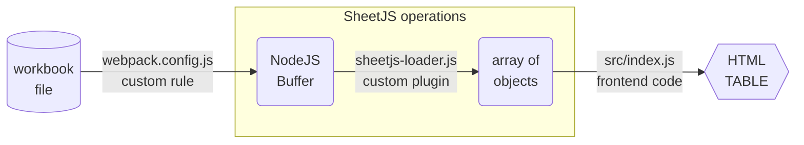

import current from '/version.js';
import CodeBlock from '@theme/CodeBlock';

[Webpack](https://webpack.js.org/) is a modern build tool for generating static
sites. It has a robust JavaScript-powered plugin system[^1]

[SheetJS](https://sheetjs.com) is a JavaScript library for reading and writing
data from spreadsheets.

This demo uses Webpack and SheetJS to pull data from a spreadsheet and display
the content in an HTML table. We'll explore how to load SheetJS in a Webpack 5
Asset Plugin and generate data for use in webpages.

The ["Webpack 5 Demo"](#webpack-5-demo) creates a complete website powered by a
XLSX spreadsheet.

:::info pass

This demo covers static asset imports. For processing files in the browser, the
["Bundlers" demo](/docs/demos/frontend/bundler/webpack) includes an example of
importing the SheetJS library in a browser script.

:::

## Webpack 5 Asset Module

Webpack 5 supports asset modules. With a special option, the loader will receive
NodeJS Buffers that can be parsed. The dev server will even watch the files and
reload the page in development mode!

The [SheetJS NodeJS module](/docs/getting-started/installation/nodejs) can be
imported from Webpack loader scripts.

The following diagram depicts the workbook waltz:



### Webpack Config

The Webpack configuration is normally saved to `webpack.config.js`.

#### Required Settings

`module.rules` is an array of rule objects that controls module synthesis.[^2]
For the SheetJS Webpack integration, the following properties are required:

- `test` describes whether the rule is relevant. If the property is a regular
expression, Webpack will test the filename against the `test` property.

- `use` lists the loaders that will process files matching the `test`. The
loaders are specified using the `loader` property of the loader object.

The following example instructs Webpack to use the `sheetjs-loader.js` script
when the file name ends in `.numbers` or `.xls` or `.xlsx` or `.xlsb`:

```js title="webpack.config.js (define loader)"
// ...
module.exports = {
  // ...
  module: {
    rules: [
      // highlight-start
      {
        /* `test` matches file extensions */
        test: /\.(numbers|xls|xlsx|xlsb)$/,
        /* use the loader script */
        use: [ { loader: './sheetjs-loader' } ]
      }
      // highlight-end
    ]
  }
};
```

#### Recommended Settings

It is strongly recommended to enable other Webpack features:

- `resolve.alias` defines path aliases. If data files are stored in one folder,
an alias ensures that each page can reference the files using the same name[^3].

- `devServer.hot` enables "hot module replacement"[^4], ensuring that pages will
refresh in development mode when spreadsheets are saved.

The following example instructs Webpack to treat `~` as the root of the project
(so `~/data/pres.xlsx` refers to `pres.xlsx` in the data folder) and to enable
live reloading:

```js title="webpack.config.js (other recommended settings)"
// ...
module.exports = {
  // ...
  // highlight-start
  resolve: {
    alias: {
      /* `~` root of the project */
      "~": __dirname
    }
  },
  // highlight-end
  // ...
  // highlight-start
  /* enable live reloading in development mode */
  devServer: { static: './dist', hot: true }
  // highlight-end
};
```

### SheetJS Loader

The SheetJS loader script must be saved to the script referenced in the Webpack
configuration (`sheetjs-loader.js`).

As with [ViteJS](/docs/demos/static/vitejs), Webpack will interpret data as
UTF-8 strings. This corrupts binary formats including XLSX and XLS. To suppress
this behavior and instruct Webpack to pass a NodeJS `Buffer` object, the loader
script must export a `raw` property that is set to `true`[^5].

The base export is expected to be the loader function. The loader receives the
file bytes as a Buffer, which can be parsed with the SheetJS `read` method[^6].
`read` returns a SheetJS workbook object[^7].

The loader in this demo will parse the workbook, pull the first worksheet, and
generate an array of row objects using the `sheet_to_json` method[^8]:

```js title="sheetjs-loader.js (Webpack loader)"
const XLSX = require("xlsx");

function loader(content) {
  /* since `loader.raw` is true, `content` is a Buffer */
  const wb = XLSX.read(content);
  /* pull data from first worksheet */
  var data = XLSX.utils.sheet_to_json(wb.Sheets[wb.SheetNames[0]]);
  return `export default JSON.parse('${JSON.stringify(data)}')`;
}

/* ensure the function receives a Buffer */
loader.raw = true;

/* export the loader */
module.exports = loader;
```

### Asset Imports

Spreadsheets can be imported using the plugin.  Assuming `pres.xlsx` is stored
in the `data` subfolder, `~/data/pres.xlsx` can be imported from any script:

```js title="src/index.js (main script)"
import data from '~/data/pres.xlsx';
/* `data` is an array of objects from data/pres.xlsx */

const elt = document.createElement('div');
elt.innerHTML = "<table><tr><th>Name</th><th>Index</th></tr>" +
  data.map((row) => `<tr>
    <td>${row.Name}</td>
    <td>${row.Index}</td>
  </tr>`).join("") +
"</table>";
document.body.appendChild(elt);
```

## Webpack 5 Demo

:::note Tested Deployments

This demo was last tested on 2024 April 06 against Webpack 5.91.0

:::

### Initial Setup

0) Create a new skeleton project:

```bash
mkdir sheetjs-wp5
cd sheetjs-wp5
npm init -y
npm install webpack@5.91.0 webpack-cli@5.1.4 webpack-dev-server@5.0.4 --save
mkdir -p dist
mkdir -p src
mkdir -p data
```

1) Install the SheetJS NodeJS module:

<CodeBlock language="bash">{`\
npm i --save https://cdn.sheetjs.com/xlsx-${current}/xlsx-${current}.tgz`}
</CodeBlock>

2) Save the following to `dist/index.html`:

```html title="dist/index.html"
<!DOCTYPE html>
<html>
  <head>
    <title>SheetJS + Webpack 5</title>
  </head>
  <body>
   <script src="main.js"></script>
  </body>
</html>
```

3) Save the following to `src/index.js`:

```js title="src/index.js"
import data from '~/data/pres.xlsx';

const elt = document.createElement('div');
elt.innerHTML = "<table><tr><th>Name</th><th>Index</th></tr>" +
  data.map((row) => `<tr>
    <td>${row.Name}</td>
    <td>${row.Index}</td>
  </tr>`).join("") +
"</table>";
document.body.appendChild(elt);
```

4) Save the following to `webpack.config.js`:

```js title="webpack.config.js"
const path = require('path');

module.exports = {
  entry: './src/index.js',
  output: {
    filename: 'main.js',
    path: path.resolve(__dirname, 'dist'),
  },
  devServer: {
    static: './dist',
    hot: true,
  },
  resolve: {
    alias: {
      "~": __dirname
    }
  },
  module: {
    rules: [
      {
        test: /\.(numbers|xls|xlsx|xlsb)$/,
        use: [ { loader: './sheetjs-loader' } ]
      }
    ]
  }
};
```

5) Save the following to `sheetjs-loader.js`:

```js title="sheetjs-loader.js"
const XLSX = require("xlsx");

function loader(content) {
  /* since `loader.raw` is true, `content` is a Buffer */
  const wb = XLSX.read(content);
  /* pull data from first worksheet */
  var data = XLSX.utils.sheet_to_json(wb.Sheets[wb.SheetNames[0]]);
  return `export default JSON.parse('${JSON.stringify(data)}')`;
}
/* ensure the function receives a Buffer */
loader.raw = true;
module.exports = loader;
```

6) Download https://docs.sheetjs.com/pres.xlsx and save to the `data` folder:

```bash
curl -L -o data/pres.xlsx https://docs.sheetjs.com/pres.xlsx
```

### Live Reload Test

7) Open the test file `data/pres.xlsx` in a spreadsheet editor like Excel.

8) Start the development server:

```bash
npx webpack serve --mode=development
```

The terminal will print URLs for the development server:

```
<i> [webpack-dev-server] Project is running at:
<i> [webpack-dev-server] Loopback: http://localhost:8080/
```

9) Open the `Loopback` address (`http://localhost:8080`) in a web browser.

It should display a table of Presidents with "Name" and "Index" columns

10) Add a new row to the spreadsheet (set `A7` to "SheetJS Dev" and `B7` to 47)
and save the file.

After saving the file, the page should automatically refresh with the new data.

### Static Site Test

11) Stop Webpack and build the site:

```bash
npx webpack --mode=production
```

The final site will be placed in the `dist` folder.

12) Start a local web server to host the `dist` folder:

```bash
npx http-server dist
```

The command will print a list of URLs.

13) Open one of the URLs printed in the previous step (`http://localhost:8080`)
and confirm that the same data is displayed.

To verify that the page is independent of the spreadsheet, make some changes to
the file and save.  The page will not automatically update.

To verify that the data was added to the page, append `main.js` to the URL
(`http://localhost:8080/main.js`) and view the source.  The source will include
president names.  It will not include SheetJS library references!

[^1]: See ["Plugins"](https://webpack.js.org/concepts/plugins/) in the Webpack documentation.
[^2]: See [`module.rules`](https://webpack.js.org/configuration/module/#modulerules) in the Webpack documentation.
[^3]: See [`resolve.alias`](https://webpack.js.org/configuration/resolve/#resolvealias) in the Webpack documentation.
[^4]: See ["Hot Module Replacement"](https://webpack.js.org/concepts/hot-module-replacement/) in the Webpack documentation.
[^5]: See ["Raw" Loader](https://webpack.js.org/api/loaders/#raw-loader) in the Webpack documentation.
[^6]: See [`read` in "Reading Files"](/docs/api/parse-options)
[^7]: See ["Workbook Object"](/docs/csf/book)
[^8]: See [`sheet_to_json` in "Utilities"](/docs/api/utilities/array#array-output)
