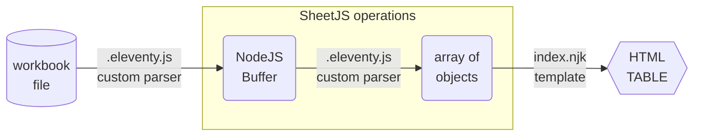

import current from '/version.js';
import Tabs from '@theme/Tabs';
import TabItem from '@theme/TabItem';
import CodeBlock from '@theme/CodeBlock';

[Eleventy](https://www.11ty.dev/docs) is a telemetry-free static site generator.
The data pipeline can be augmented with custom data file parsers.

[SheetJS](https://sheetjs.com) is a JavaScript library for reading and writing
data from spreadsheets.

This demo uses Eleventy and SheetJS to pull data from a spreadsheet and display
the content in a page. We'll explore how to load SheetJS libraries in a custom
data file format parser and generate arrays of objects for use in pages.

The following diagram depicts the workbook waltz:



:::tip No Telemetry

The author has publicly stated that Eleventy does not embed any telemetry or
data collection.[^1]

:::

## Integration Details

The [SheetJS NodeJS module](/docs/getting-started/installation/nodejs) can be
loaded in `.eleventy.js` and used in custom data file format parsers.

### Data File Parser

Custom data file parsers must be registered in `.eleventy.js`

The Eleventy config `addDataExtension` method[^2] accepts a list of file
extensions and a parser configuration object.

The parser object must include the options `read: true` and `encoding: null` .
Eleventy will read files and pass raw `Buffer` objects to the parser callback.

The `parser` callback can parse the raw `Buffer` data with the SheetJS `read`
method[^3]. The method returns a workbook object[^4].

In this example, the parser will use the SheetJS `sheet_to_json` method[^5] to
generate an array of objects from the data in the first worksheet:

```js title=".eleventy.js"
const XLSX = require("xlsx");

/* list of file extensions */
const exts = [ "numbers", "xlsx", "xlsb", "xls" ].join(", ");

module.exports = (eleventyConfig) => {
  eleventyConfig.addDataExtension(exts, {
    /* read file and pass raw Buffer object to parser */
    // highlight-next-line
    encoding: null, read: true,

    /* parser callback */
    parser: (contents) => {
      /* contents is the data stored as a Buffer */
      // highlight-next-line
      const wb = XLSX.read(contents);
      /* generate array of row objects from first worksheet */
      return XLSX.utils.sheet_to_json(wb.Sheets[wb.SheetNames[0]]);
    }
  });
};
```

### Usage

Spreadsheet files added in the `_data` subdirectory are accessible from template
files using the name stem.

For example, [`pres.numbers`](https://docs.sheetjs.com/pres.numbers) can be
accessed using the variable `pres` in a template:

```liquid title="index.njk"
<table><thead><tr><th>Name</th><th>Index</th></tr></thead>
  <tbody>
  
    <tr>
      <td>{{ row.Name }}</td>
      <td>{{ row.Index }}</td>
    </tr>
  
  </tbody>
</table>
```


## Complete Example

:::note Tested Deployments

This demo was tested in the following environments:

| Eleventy        | Date       |
|:----------------|:-----------|
| `2.0.1`         | 2024-03-15 |
| `3.0.0-alpha.5` | 2024-03-15 |

:::

### Project Setup

1) Create a new project:

```bash
mkdir sheetjs-11ty
cd sheetjs-11ty
npm init -y
```

2) Install Eleventy and SheetJS libraries:

<Tabs groupId="11ty">
  <TabItem value="2" label="Stable">

<CodeBlock language="bash">{`\
npm i --save https://cdn.sheetjs.com/xlsx-${current}/xlsx-${current}.tgz @11ty/eleventy@2.0.1`}
</CodeBlock>

  </TabItem>
  <TabItem value="3" label="Alpha">

<CodeBlock language="bash">{`\
npm i --save https://cdn.sheetjs.com/xlsx-${current}/xlsx-${current}.tgz @11ty/eleventy@3.0.0-alpha.5`}
</CodeBlock>

  </TabItem>
</Tabs>

3) Make a new `_data` subdirectory in the project. Download the example file
[`pres.xlsx`](https://docs.sheetjs.com/pres.xlsx) into `_data`:

```bash
mkdir _data
curl -Lo _data/pres.xlsx https://docs.sheetjs.com/pres.xlsx
```

4) Download the following files to the project folder:

- [`_eleventy.js`](pathname:///eleventy/_eleventy.js) (rename to `.eleventy.js`)
- [`index.njk`](pathname:///eleventy/index.njk)

```bash
curl -L -o .eleventy.js https://docs.sheetjs.com/eleventy/_eleventy.js
curl -LO https://docs.sheetjs.com/eleventy/index.njk
```

### Live Reload

5) Start the live reloading server:

```bash
npx @11ty/eleventy --serve
```

The server will generate `index.html` from `index.njk` and show the server URL:

```
[11ty] Writing _site/index.html from ./index.njk
[11ty] Wrote 1 file in 0.23 seconds (v2.0.1)
[11ty] Watching…
[11ty] Server at http://localhost:8080/ <-- this is the URL
```

6) Open the URL in a web browser. The page should include a table.

7) Open `_data/pres.xlsx` in a spreadsheet editor. Add a row to the bottom of
the "Sheet1" sheet (set `A7` to "SheetJS Dev" and `B7` to `47`). Save the file.

The server log will note that the file changed:

```
[11ty] File changed: _data/pres.xlsx
[11ty] Writing _site/index.html from ./index.njk
```

The browser will refresh to show the new data.

### Static Site

8) Stop the live reload server and build the static site:

```bash
npx @11ty/eleventy
```

Eleventy will place the generated site in the `_site` subfolder.

9) Start a web server to host the static site:

```bash
npx http-server _site
```

Open a web browser and access the displayed URL ( `http://localhost:8080` ).
View the page source and confirm that no JS was added to the page.  It only
contains the content from the file in an HTML table.

[^1]: See [the "Telemetry" section](https://www.zachleat.com/web/site-generator-review/#telemetry) of the site generator review from the author of Eleventy. When this page was last checked, the author proudly asserted that Eleventy had "No known Telemetry or data collection".
[^2]: See ["Custom Data File Formats"](https://www.11ty.dev/docs/data-custom/) in the Eleventy documentation.
[^3]: See [`read` in "Reading Files"](/docs/api/parse-options)
[^4]: See ["Workbook Object"](/docs/csf/book) for more details on the SheetJS workbook object.
[^5]: See [`sheet_to_json` in "Utilities"](/docs/api/utilities/array#array-output)