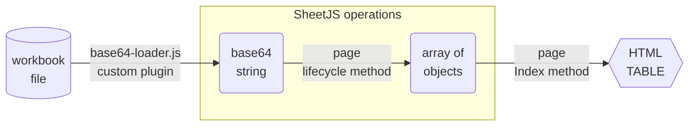
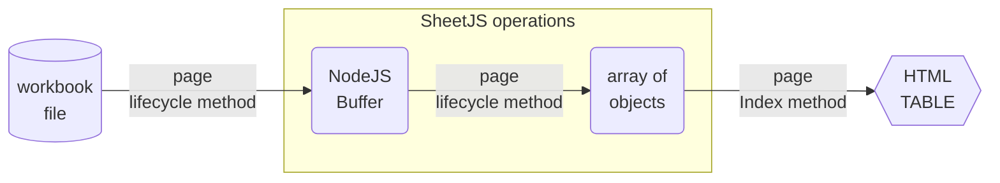
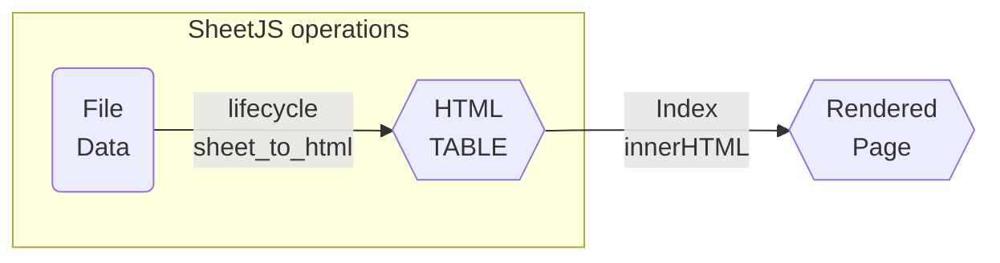
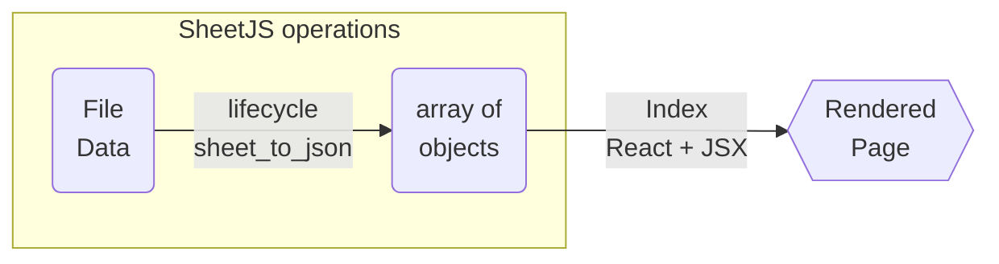

import current from '/version.js';
import Tabs from '@theme/Tabs';
import TabItem from '@theme/TabItem';
import CodeBlock from '@theme/CodeBlock';

[NextJS](https://nextjs.org/) is a server-side framework for building static
and dynamic sites using the ReactJS framework.

[SheetJS](https://sheetjs.com) is a JavaScript library for reading and writing
data from spreadsheets.

This discussion covers three key SheetJS + NextJS operations:

1) [Loading Data](#loading-data): NextJS can read files in lifecycle methods OR
custom Webpack loaders can create asset modules.

2) [Lifecycle Methods](#nextjs-strategies): NextJS includes strategies for
static pages (`getStaticProps`) as well as dynamic pages (`getServerSideProps`).

3) [Data Presentation](#data-presentation): Pages use React and JSX.

The ["Demo"](#demo) uses NextJS and SheetJS to pull data from a spreadsheet.
We'll explore how to create asset modules that process spreadsheet data at build
time and how to read files on the server in NextJS lifecycle methods.

:::danger Telemetry

NextJS collects telemetry by default. The `telemetry` subcommand can disable it:

```js
npx -y next@13.5.6 telemetry disable
```

The setting can be verified by running

```js
npx -y next@13.5.6 telemetry status
```

:::

:::info pass

This demo focuses on static sites where data files are processed at build time.

[The ReactJS demo](/docs/demos/frontend/react) shows NextJS "Client Components".

:::

:::caution Next 13+ and SWC

Next 13 switched to the SWC minifier. There are known issues with the minifier.
Until those issues are resolved, SWC should be disabled in `next.config.js`:

```js title="next.config.js"
module.exports = {
// highlight-next-line
  swcMinify: false
};
```

:::

:::note Tested Deployments

This demo was tested in the following environments:

| NextJS    | NodeJS    | Date       |
|:----------|:----------|:-----------|
| ` 9.5.5`  | `16.20.2` | 2024-06-07 |
| `10.2.3`  | `16.20.2` | 2024-06-07 |
| `11.1.4`  | `16.20.2` | 2024-06-07 |
| `12.3.4`  | `20.14.0` | 2024-06-07 |
| `13.5.6`  | `20.14.0` | 2024-06-07 |
| `14.2.3`  | `20.14.0` | 2024-06-07 |

:::

:::info pass

SheetJS libraries work in legacy NextJS apps. Older versions of this demo have
been tested against versions `3.2.3`, `4.2.3`, `5.1.0`, `6.1.2` and `7.0.3`.

NextJS has made a number of breaking changes over the years. Older versions of
NextJS use legacy versions of ReactJS that do not support function components
and other idioms.

[`examples/reactjs-legacy`](https://git.sheetjs.com/examples/reactjs-legacy) on
the SheetJS git server includes code samples for legacy NextJS versions.

:::

## Loading Data

At a high level, there are two ways to pull spreadsheet data into NextJS apps:
loading an asset module or performing the file read operations from the NextJS
lifecycle methods.

Asset modules are appropriate for static sites when the file names are known in
advance. Performing file read operations in lifecycle methods is more flexible
but does not support live reloading.

### Asset Module

:::caution pass

When the demo was last tested, Turbopack did not support true raw loaders. For
development use, the normal `npx next dev` should be used.

:::

The [SheetJS NodeJS module](/docs/getting-started/installation/nodejs) can be
imported in Webpack asset modules[^1].

The following diagram depicts the workbook waltz:



In this flow, it is strongly recommended to make a loader return a Base64 string:

```js title="base64-loader.js"
function loader(content) {
  /* since `loader.raw` is true, `content` is a Buffer */
  return `export default '${content.toString("base64")}'`;
}
/* ensure the function receives a Buffer */
loader.raw = true;
module.exports = loader;
```

The webpack configuration is controlled in `next.config.js`:

```js title="next.config.js"
module.exports = {
  webpack: (config) => {
    // highlight-start
    /* add to the webpack config module.rules array */
    config.module.rules.push({
      /* `test` matches file extensions */
      test: /\.(numbers|xls|xlsx|xlsb)/,
      /* use the loader script */
      use: [ { loader: './base64-loader' } ]
    });
    // highlight-end
    return config;
  }
};
```

Module alias directories can be defined in `jsconfig.json` or `tsconfig.json`:

```json title="jsconfig.json"
{
  "compilerOptions": {
    "baseUrl": ".",
    "paths": {
      // highlight-next-line
      "@/*": ["*"]
    }
  }
}
```

Pages can import the files directly. It is strongly recommended to store files
in a `data` folder.

In this example, the import statement pulls the `sheetjs.xlsx` file as a Base64
string. The SheetJS `read` method[^2] parses the string and returns a workbook
object[^3]. The `sheet_to_json`[^4] utility function generates an array of
objects based on the data. As long as the `base64` variable is only used in
`getStaticProps`, the library and file will be processed at build time.

```jsx title="index.js"
import { read, utils } from 'xlsx';
// highlight-next-line
import base64 from '@/data/sheetjs.xlsx';

export async function getStaticProps() {
  /* parse base64 data */
  // highlight-next-line
  const wb = read(base64, { type: "base64" });
  return { props: {
      /* generate array of objects from the first sheet */
      data: utils.sheet_to_json(wb.Sheets[wb.SheetNames[0]])
  } };
}
```

### Raw Operations

The [SheetJS NodeJS module](/docs/getting-started/installation/nodejs) can be
imported from page scripts.

:::danger pass

[The SheetJS ESM build](/docs/getting-started/installation/nodejs#esm-import)
does not load NodeJS native modules directly. The Installation section includes
a note on dynamic import of `fs` within lifecycle methods.

:::

Files can be read using the SheetJS `readFile`[^5] method in lifecycle methods.
The `cwd` method in the `process` module will point to the root of the project.

The following diagram depicts the workbook waltz:



This example reads the file `sheetjs.xlsx` in the `data` folder in the project
and uses `sheet_to_json`[^6] to generate data rows.

```js
import { readFile, utils, set_fs } from 'xlsx';
import { join } from 'path';
import { cwd } from 'process';

export async function getServerSideProps() {
// highlight-start
  set_fs(await import("fs")); // dynamically import 'fs' when needed
  const filename = join(cwd(), "data", "sheetjs.xlsx"); // /data/sheetjs.xlsx
  const wb = readFile(filename);
  // highlight-end

  /* generate and return the html from the first worksheet */
  const data = utils.sheet_to_json(wb.Sheets[wb.SheetNames[0]]);
  return { props: { data } };
}
```

:::danger Reading and writing files during the build process

As the NextJS workaround is non-traditional, it bears repeating:

`fs` cannot be statically imported from the top level in NextJS pages.  The
dynamic import must happen within a lifecycle function.

:::


## NextJS Strategies

NextJS currently provides 3 strategies:

- "Static Site Generation" using `getStaticProps`[^7]
- "SSG with Dynamic Routes" using `getStaticPaths`[^8]
- "Server-Side Rendering" using `getServerSideProps`[^9]

### Static Site Generation

When using `getStaticProps`, the file will be read once during build time.
This example reads `sheetjs.xlsx` from the `data` folder:

<Tabs groupId="data">
  <TabItem value="asset" label="Asset Module">

```js
import { read, utils } from 'xlsx';
import base64 from '@/data/sheetjs.xlsx';

export async function getStaticProps() {
  const wb = read(base64, { type: "base64" });

  /* generate and return the html from the first worksheet */
  const html = utils.sheet_to_html(wb.Sheets[wb.SheetNames[0]]);
  return { props: { html } };
};
```

  </TabItem>
  <TabItem value="raw" label="Raw Operations">

```js
import { readFile, set_fs, utils } from 'xlsx';
import { join } from 'path';
import { cwd } from 'process';

export async function getStaticProps() {
  set_fs(await import("fs"));
  const filename = join(cwd(), "data", "sheetjs.xlsx"); // /data/sheetjs.xlsx
  const wb = readFile(filename);

  /* generate and return the html from the first worksheet */
  const html = utils.sheet_to_html(wb.Sheets[wb.SheetNames[0]]);
  return { props: { html } };
};
```

  </TabItem>
</Tabs>

### Dynamic Routes

Typically a static site with dynamic routes has an endpoint `/sheets/[id]` that
implements both `getStaticPaths` and `getStaticProps`.

- `getStaticPaths` should return an array of worksheet indices:

<Tabs groupId="data">
  <TabItem value="asset" label="Asset Module">

```js
import { read } from 'xlsx';
import base64 from '@/data/sheetjs.xlsx';

export async function getStaticPaths() {
  /* read file */
  const wb = read(base64, { type: "base64" });

  /* generate an array of objects that will be used for generating pages */
  const paths = wb.SheetNames.map((name, idx) => ({ params: { id: idx.toString() } }));
  return { paths, fallback: false };
};
```

  </TabItem>
  <TabItem value="raw" label="Raw Operations">

```js
import { readFile, set_fs } from 'xlsx';
import { join } from 'path';
import { cwd } from 'process';

export async function getStaticPaths() {
  /* read file */
  set_fs(await import("fs"));
  const filename = join(cwd(), "data", "sheetjs.xlsx"); // /data/sheetjs.xlsx
  const wb = readFile(path);

  /* generate an array of objects that will be used for generating pages */
  const paths = wb.SheetNames.map((name, idx) => ({ params: { id: idx.toString() } }));
  return { paths, fallback: false };
};
```

  </TabItem>
</Tabs>

:::note pass

For a pure static site, `fallback` must be set to `false`![^10]

:::

- `getStaticProps` will generate the actual HTML for each page:

<Tabs groupId="data">
  <TabItem value="asset" label="Asset Module">

```js
import { read, utils } from 'xlsx';
import base64 from '@/data/sheetjs.xlsx';

export async function getStaticProps(ctx) {
  /* read file */
  const wb = read(base64, { type: "base64" });

  /* get the corresponding worksheet and generate HTML */
  const ws = wb.Sheets[wb.SheetNames[ctx.params.id]]; // id from getStaticPaths
  const html = utils.sheet_to_html(ws);
  return { props: { html } };
};
```

  </TabItem>
  <TabItem value="raw" label="Raw Operations">

```js
import { readFile, set_fs, utils } from 'xlsx';
import { join } from 'path';
import { cwd } from 'process';

export async function getStaticProps(ctx) {
  /* read file */
  set_fs(await import("fs"));
  const filename = join(cwd(), "data", "sheetjs.xlsx"); // /data/sheetjs.xlsx
  const wb = readFile(path);

  /* get the corresponding worksheet and generate HTML */
  const ws = wb.Sheets[wb.SheetNames[ctx.params.id]]; // id from getStaticPaths
  const html = utils.sheet_to_html(ws);
  return { props: { html } };
};
```

  </TabItem>
</Tabs>

### Server-Side Rendering

:::caution Do not use on a static site

These routes require a NodeJS dynamic server. Static page generation will fail!

`getStaticProps` and `getStaticPaths` support static site generation (SSG).

`getServerSideProps` is suited for NodeJS hosted deployments where the workbook
changes frequently and a static site is undesirable.

:::

When using `getServerSideProps`, the file will be read on each request.

<Tabs groupId="data">
  <TabItem value="asset" label="Asset Module">

:::caution Consider using a static strategy

When using asset modules, the file names and file paths are processed during the
build step. The content is fixed. In this situation, a static approach such as
`getStaticProps` is strongly recommended.

:::

```js
import { read } from 'xlsx';
import base64 from '@/data/sheetjs.xlsx';

export async function getServerSideProps() {
  /* read file */
  const wb = read(base64, { type: "base64" });

  /* generate and return the html from the first worksheet */
  const html = utils.sheet_to_html(wb.Sheets[wb.SheetNames[0]]);
  return { props: { html } };
};
```

  </TabItem>
  <TabItem value="raw" label="Raw Operations">

```js
import { readFile, set_fs, utils } from 'xlsx';
import { join } from 'path';
import { cwd } from 'process';

export async function getServerSideProps() {
  /* read file */
  set_fs(await import("fs"));
  const filename = join(cwd(), "data", "sheetjs.xlsx"); // /data/sheetjs.xlsx
  const wb = readFile(path);

  /* generate and return the html from the first worksheet */
  const html = utils.sheet_to_html(wb.Sheets[wb.SheetNames[0]]);
  return { props: { html } };
};
```

  </TabItem>
</Tabs>

## Data Presentation

[The ReactJS demo](/docs/demos/frontend/react) compares common approaches.

### HTML

HTML output can be generated using the SheetJS `sheet_to_html`[^11] method and
inserted into the document using the `dangerouslySetInnerHTML`[^12] attribute:



```jsx
export default function Index({html, type}) { return (
  <div dangerouslySetInnerHTML={{ __html: html }} />
); }
```

### Arrays of Objects

Arrays of objects can be generated using the SheetJS `sheet_to_json`[^13] method
and inserted into the document using standard JSX[^14]:



```jsx
export default function Index({aoo, type}) { return (
  <table><thead><tr key={0}><th>Name</th><th>Index</th></tr></thead><tbody>
// highlight-start
    {aoo.map(row => ( <tr>
      <td>{row.Name}</td>
      <td>{row.Index}</td>
    </tr>))}
// highlight-end
  </tbody></table>
); }
```

## Demo

:::note pass

This demo showcases the following SheetJS + NextJS flows:

| Page                  | Loading Data | Lifecycle Method     | SheetJS API     |
|:----------------------|:-------------|:---------------------|:----------------|
| `/getStaticProps`     | asset module | `getStaticProps`     | `sheet_to_json` |
| `/sheets/[id]`        | asset module | `getStaticPaths`     | `sheet_to_html` |
| `/getServerSideProps` | lifecycle    | `getServerSideProps` | `sheet_to_html` |

The commands in this demo use `next@13.5.6`. Other versions were tested by
replacing the version number in the relevant commands.

:::

:::caution pass

Older versions of NextJS will refuse to run in newer versions of NodeJS. The
error message points to an issue with OpenSSL:

```
Error: error:0308010C:digital envelope routines::unsupported
```

When upgrading NextJS is not an option, NodeJS should be downgraded to v16.

:::

### Initial Setup

0) Disable NextJS telemetry:

```js
npx -y next@13.5.6 telemetry disable
```

Confirm it is disabled by running

```js
npx -y next@13.5.6 telemetry status
```

1) Set up folder structure.  At the end, a `pages` folder with a `sheets`
   subfolder must be created.  On Linux or MacOS or WSL:

```bash
mkdir sheetjs-next
cd sheetjs-next
mkdir -p pages/sheets/
```

2) Download the [test file](pathname:///next/sheetjs.xlsx) and place in the
   project root.  On Linux or MacOS or WSL:

```bash
curl -LO https://docs.sheetjs.com/next/sheetjs.xlsx
```

3) Install dependencies:

:::note pass

The `next@13.5.6` depefndency can be adjusted to pick a different version. For
example, NextJS `12.3.4` is installed with

<CodeBlock language="bash">{`\
npm i --save https://cdn.sheetjs.com/xlsx-${current}/xlsx-${current}.tgz next@12.3.4`}
</CodeBlock>

:::

<CodeBlock language="bash">{`\
npm i --save https://cdn.sheetjs.com/xlsx-${current}/xlsx-${current}.tgz next@13.5.6`}
</CodeBlock>

4) Download NextJS config scripts and place in the root folder:

- [`base64-loader.js`](pathname:///next/base64-loader.js)
- [`jsconfig.json`](pathname:///next/jsconfig.json)
- [`next.config.js`](pathname:///next/next.config.js)
- [`styles.css`](pathname:///next/styles.css)

On Linux or MacOS or WSL:

```bash
curl -LO https://docs.sheetjs.com/next/base64-loader.js
curl -LO https://docs.sheetjs.com/next/jsconfig.json
curl -LO https://docs.sheetjs.com/next/next.config.js
curl -LO https://docs.sheetjs.com/next/styles.css
```

5) Download test scripts:

Download and place the following scripts in the `pages` subfolder:

- [`_app.js`](pathname:///next/_app.js)
- [`index.js`](pathname:///next/index.js)
- [`getServerSideProps.js`](pathname:///next/getServerSideProps.js)
- [`getStaticPaths.js`](pathname:///next/getStaticPaths.js)
- [`getStaticProps.js`](pathname:///next/getStaticProps.js)

Download [`[id].js`](pathname:///next/%5Bid%5D.js) and place in the
`pages/sheets` subfolder.

:::caution Percent-Encoding in the script name

The `[id].js` script must have the literal square brackets in the name. If your
browser saved the file to `%5Bid%5D.js`. rename the file.

:::

On Linux or MacOS or WSL:

```bash
cd pages
curl -LO https://docs.sheetjs.com/next/_app.js
curl -LO https://docs.sheetjs.com/next/index.js
curl -LO https://docs.sheetjs.com/next/getServerSideProps.js
curl -LO https://docs.sheetjs.com/next/getStaticPaths.js
curl -LO https://docs.sheetjs.com/next/getStaticProps.js
cd sheets
curl -LOg 'https://docs.sheetjs.com/next/[id].js'
cd ../..
```

### Testing

6) Test the deployment:

```bash
npx next
```

Open a web browser and access:

- `http://localhost:3000` landing page
- `http://localhost:3000/getStaticProps` shows data from the first sheet
- `http://localhost:3000/getServerSideProps` shows data from the first sheet
- `http://localhost:3000/getStaticPaths` shows a list (2 sheets)

The individual worksheets are available at

- `http://localhost:3000/sheets/0`
- `http://localhost:3000/sheets/1`

7) While the development server is running, open the `/getStaticProps` page and
open `sheetjs.xlsx` with a spreadsheet editor. In the editor, add a row to the
bottom of the "Indices" worksheet (set `A7` to "SheetJS Dev" and `B7` to `47`)

After saving the file, the website should refresh with the new row.

### Production Build

8) Stop the server and run a production build:

```bash
npx next build
```

The final output will show a list of the routes and types:

```
Route (pages)                              Size     First Load JS
┌ ○ /                                      563 B          75.3 kB
├   /_app                                  0 B            74.8 kB
├ ○ /404                                   182 B            75 kB
├ λ /getServerSideProps                    522 B          75.3 kB
├ ● /getStaticPaths                        2.91 kB        77.7 kB
├ ● /getStaticProps                        586 B          75.4 kB
└ ● /sheets/[id] (303 ms)                  522 B          75.3 kB
    ├ /sheets/0
    └ /sheets/1
```

As explained in the summary, the `/getStaticPaths` and `/getStaticProps` routes
are completely static.  2 `/sheets/#` pages were generated, corresponding to 2
worksheets in the file.  `/getServerSideProps` is server-rendered.

:::info pass

NextJS historically used lowercase Lambda (`λ`) to denote dynamic paths. This
was changed to a stylized lowercase F (`ƒ`) in recent versions of NextJS.

:::

9) Try to build a static site:

<Tabs groupId="nextver">
  <TabItem value="13" label="NextJS 9 - 13">

```bash
npx next export
```

  </TabItem>
  <TabItem value="14" label="NextJS 14">

:::danger NextJS breaking changes

**NextJS 14 removed the `export` subcommand!**

:::


Edit `next.config.js` and add the highlighted line:

```js title="next.config.js (add highlighted line)"
module.exports = {
  // highlight-next-line
  output: "export",
  webpack: (config) => {
```

After adding the line, run the `build` command:

```bash
npx next build
```

  </TabItem>
</Tabs>

This build will fail. A static page cannot be generated at this point because
`/getServerSideProps` is server-rendered.

### Static Site

10) Delete `pages/getServerSideProps.js`:

```bash
rm -f pages/getServerSideProps.js
```

11) Rebuild the static site:

<Tabs groupId="nextver">
  <TabItem value="13" label="NextJS 9 - 13">

  </TabItem>
  <TabItem value="14" label="NextJS 14">

Edit `next.config.js` and comment the highlighted line:

```js title="next.config.js (comment highlighted line)"
module.exports = {
  // highlight-next-line
  // output: "export",
  webpack: (config) => {
```

After editing `next.config.js`, run the build command:

  </TabItem>
</Tabs>

```bash
npx next build
```

Inspecting the output, there should be no lines with `λ` or `ƒ`:

```
Route (pages)                              Size     First Load JS
┌ ○ /                                      563 B          75.3 kB
├   /_app                                  0 B            74.8 kB
├ ○ /404                                   182 B            75 kB
├ ● /getStaticPaths                        2.91 kB        77.7 kB
├ ● /getStaticProps                        586 B          75.4 kB
└ ● /sheets/[id]                           522 B          75.3 kB
    ├ /sheets/0
    └ /sheets/1
```

12) Generate the static site:

<Tabs groupId="nextver">
  <TabItem value="13" label="NextJS 9 - 13">

```bash
npx next export
```

  </TabItem>
  <TabItem value="14" label="NextJS 14">

Edit `next.config.js` and restore the highlighted line:

```js title="next.config.js (restore highlighted line)"
module.exports = {
  // highlight-next-line
  output: "export",
  webpack: (config) => {
```

After adding the line, run the `build` command:

```bash
npx next build
```

  </TabItem>
</Tabs>

The static site will be written to the `out` subfolder

13) Serve the static site:

```bash
npx http-server out
```

The command will start a local HTTP server at `http://localhost:8080/` for
testing the generated site. Note that `/getServerSideProps` will 404 since the
page was removed.

[^1]: See the ["Webpack" asset module demo](/docs/demos/static/webpack) for more details.
[^2]: See [`read` in "Reading Files"](/docs/api/parse-options).
[^3]: See ["SheetJS Data Model"](/docs/csf/) for more details.
[^4]: See [`sheet_to_json` in "Utilities"](/docs/api/utilities/array#array-output).
[^5]: See [`readFile` in "Reading Files"](/docs/api/parse-options).
[^6]: See [`sheet_to_json` in "Utilities"](/docs/api/utilities/array#array-output).
[^7]: See [`getStaticProps`](https://nextjs.org/docs/pages/building-your-application/data-fetching/get-static-props) in the NextJS documentation.
[^8]: See [`getStaticPaths`](https://nextjs.org/docs/pages/building-your-application/data-fetching/get-static-paths) in the NextJS documentation.
[^9]: See [`getServerSideProps`](https://nextjs.org/docs/pages/building-your-application/data-fetching/get-server-side-props) in the NextJS documentation.
[^10]: See [`fallback` in getStaticPaths](https://nextjs.org/docs/pages/api-reference/functions/get-static-paths#fallback-false) in the NextJS documentation.
[^11]: See [`sheet_to_html` in "Utilities"](/docs/api/utilities/html#html-table-output)
[^12]: [`dangerouslySetInnerHTML`](https://react.dev/reference/react-dom/components/common#common-props) is a ReactJS prop supported for all built-in components.
[^13]: See [`sheet_to_json` in "Utilities"](/docs/api/utilities/array#array-output).
[^14]: See ["Array of Objects" in the ReactJS demo](/docs/demos/frontend/react#rendering-data).
