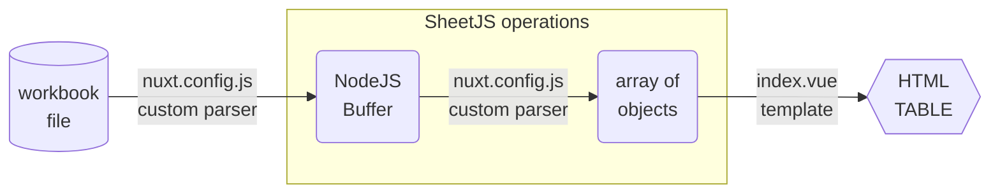
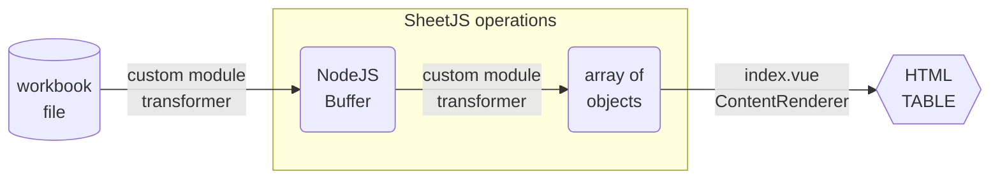

import current from '/version.js';
import Tabs from '@theme/Tabs';
import TabItem from '@theme/TabItem';
import CodeBlock from '@theme/CodeBlock';

[Nuxt Content](https://content.nuxtjs.org/) is a file-based CMS for NuxtJS,
enabling static-site generation and on-demand server rendering from data files.

[SheetJS](https://sheetjs.com) is a JavaScript library for reading and writing
data from spreadsheets.

This demo uses NuxtJS and SheetJS to pull data from a spreadsheet and display
the content in an HTML table.

:::note pass

There were breaking changes between VueJS 2.x and VueJS 3.x. Since many projects
still use VueJS 2.x, this demo includes examples for both versions of VueJS.

:::

The ["Nuxt Content v1"](#nuxt-content-v1) section explores "parsers" for NuxtJS
Content v1 (paired with VueJS 2.x and NuxtJS 2.x)

The ["Nuxt Content v2"](#nuxt-content-v2) section explores "transformers" for
NuxtJS Content v2 (paired with VueJS 3.x and NuxtJS 3.x)

:::info pass

This demo focuses on server-side processing with NuxtJS and VueJS.

The [VueJS demo](/docs/demos/frontend/vue) includes examples of NuxtJS sites
that process spreadsheets in the browser.

:::

:::note Tested Deployments

This demo was tested in the following environments:

| Nuxt Content | Nuxt     | Date       |
|:-------------|:---------|:-----------|
| `1.15.1`     | `2.17.3` | 2024-06-04 |
| `2.12.1`     | `3.11.2` | 2024-06-04 |

:::

:::danger Telemetry

Nuxt embeds telemetry. According to the docs, it can be disabled with:

```bash
npx nuxt telemetry disable
```

**When the demo was last tested, this command did not work.**

Disabling telemetry requires a few steps:

1) Set the environment variable `NUXT_TELEMETRY_DISABLED` to `1`

<Tabs groupId="os">
  <TabItem value="unix" label="Linux/MacOS">

Add the following line to `.profile`, `.bashrc` and `.zshrc`:

```bash
export NUXT_TELEMETRY_DISABLED=1
```

Close and restart the Terminal to load the changes.

  </TabItem>
  <TabItem value="win" label="Windows">

Type `env` in the search bar and select "Edit the system environment variables".

In the new window, click the "Environment Variables..." button.

In the new window, look for the "System variables" section and click "New..."

Set the "Variable name" to `NUXT_TELEMETRY_DISABLED` and the value to `1`.

Click "OK" in each window (3 windows) and restart your computer.

  </TabItem>
</Tabs>

2) A global setting should be added to `.nuxtrc` in the user home directory:

```ini title="~/.nuxtrc"
telemetry.enabled=false
```

The following command can be run in the Linux / MacOS terminal:

```bash
cat >~/.nuxtrc <<EOF
telemetry.enabled=false
EOF
```

3) For Nuxt 3 sites, set the `telemetry` option in the Nuxt config file (either `nuxt.config.ts` or `nuxt.config.js`):

```js title="nuxt.config.js"
// ...
// highlight-start
export default defineNuxtConfig({
  // @ts-ignore
  telemetry: false,
// highlight-end
  // ...
})
```

:::

## Nuxt Content v1

Nuxt Content v1 is designed to work with NuxtJS v2 and VueJS v2.

The following diagram depicts the workbook waltz:



### Installation

The [SheetJS NodeJS Module](/docs/getting-started/installation/nodejs) can be
imported from `nuxt.config.js` for build-time processing.

### Custom Parser

:::info pass

Custom parsers receive the file content interpreted as UTF-8 strings. For binary
formats including XLSX and XLS, the data is corrupt and cannot be used.

The workaround involves safely re-reading the spreadsheets.

:::

The second argument passed to the parser is an object. The `path` property of
the object is the path to the file.

The SheetJS `readFile`[^1] method can locate and parse the spreadsheet files.
The `sheet_to_json`[^2] utility function can generate arrays of row objects for
use in NuxtJS pages:

```js title="Custom Parser (in nuxt.config.js)"
import { readFile, utils } from 'xlsx';

/* This will be called when the files change */
const parseSheet = (file, { path }) => {
  /* `path` is a path that can be read with `XLSX.readFile` */
  const wb = readFile(path);

  /* iterate through each worksheet name and generate row objects */
  const o = wb.SheetNames.map(name => ({
    name: name,
    data: utils.sheet_to_json(wb.Sheets[name])
  }));

  /* The final result must be stored in the `data` key of an object */
  return { data: o };
};
```

### Configuration

Using `content.extendParser`[^3], Nuxt Content will use custom parsers.

The property is expected to be an object whose keys are file extensions (with
the `.` before the extension) and whose values are custom parser functions.

The relevant part of the config is shown below. In this snippet, the custom
parser `parseSheet` will be associated with XLSX, XLS and NUMBERS files:

```js title="nuxt.config.js"
export default {
// ...

  // content.extendParser allows us to hook into the parsing step
  content: {
    extendParser: {
      // the keys are the extensions that will be matched.  The "." is required
      ".numbers": parseSheet,
      ".xlsx": parseSheet,
      ".xls": parseSheet,
      // can add other extensions like ".fods" as desired
    }
  },

// ...
}
```

### Template Use

When a spreadsheet is placed in the `content` folder, Nuxt will find it.  The
data can be referenced in a view with `asyncData`.  The name should not include
the extension, so `"sheetjs.numbers"` would be referenced as `"sheetjs"`:

```js title="Script section of .vue VueJS page"
  async asyncData ({$content}) {
    return {
      // $content('sheetjs') will match files with extensions in nuxt.config.js
      data: await $content('sheetjs').fetch()
    };
  }
```

In the template, `data.data` is an array of objects.  Each object has a `name`
property for the worksheet name and a `data` array of row objects.  This maps
neatly with nested `v-for`[^4]:

```xml title="Template section of .vue VueJS page"
  <!-- loop over the worksheets -->
  <div v-for="item in data.data" v-bind:key="item.name">
    <table>
      <!-- loop over the rows of each worksheet -->
      <tr v-for="row in item.data" v-bind:key="row.Index">
        <!-- here `row` is a row object generated from sheet_to_json -->
        <td>{{ row.Name }}</td>
        <td>{{ row.Index }}</td>
      </tr>
    </table>
  </div>
```

### Nuxt Content Demo

:::caution pass

For some older versions, parts of the Nuxt dependency tree did not support
NodeJS version 20. `EBADENGINE` warnings were displayed during app creation:

```
npm WARN EBADENGINE Unsupported engine {
npm WARN EBADENGINE   package: '@nuxt/types@2.16.3',
npm WARN EBADENGINE   required: { node: '^14.18.0 || ^16.10.0 || ^17.0.0 || ...
npm WARN EBADENGINE   current: { node: 'v20.2.0', npm: '9.6.6' }
npm WARN EBADENGINE }
```

The recommended solution is to switch to Node 18.

:::

1) Create a stock app:

```bash
npx create-nuxt-app@4.0.0 sheetjs-nuxt
```

When prompted, enter the following options:

- `Project name`: press <kbd>Enter</kbd> (use default `sheetjs-nuxt`)
- `Programming language`: press <kbd>↓</kbd> (`TypeScript` selected) then <kbd>Enter</kbd>
- `Package manager`: select `Npm` and press <kbd>Enter</kbd>
- `UI framework`: select `None` and press <kbd>Enter</kbd>
- `Nuxt.js modules`: scroll to `Content`, select with <kbd>Space</kbd>, then press <kbd>Enter</kbd>
- `Linting tools`: press <kbd>Enter</kbd> (do not select any Linting tools)
- `Testing framework`: select `None` and press <kbd>Enter</kbd>
- `Rendering mode`: select `Universal (SSR / SSG)` and press <kbd>Enter</kbd>
- `Deployment target`: select `Static (Static/Jamstack hosting)` and press <kbd>Enter</kbd>
- `Development tools`: press <kbd>Enter</kbd> (do not select any Development tools)
- `What is your GitHub username?`: press <kbd>Enter</kbd> (use default)
- `Version control system`: select `None` and press <kbd>Enter</kbd>

The project will be configured and modules will be installed.

2) Install the SheetJS library and start the server:

<CodeBlock language="bash">{`\
cd sheetjs-nuxt
npm i --save https://cdn.sheetjs.com/xlsx-${current}/xlsx-${current}.tgz
npm run dev`}
</CodeBlock>

When the build finishes, the terminal will display a URL like:

```
ℹ Listening on: http://localhost:64688/
```

The server is listening on that URL.  Open the link in a web browser.

3) Download https://docs.sheetjs.com/pres.xlsx and move to the `content` folder.

```bash
curl -L -o content/pres.xlsx https://docs.sheetjs.com/pres.xlsx
```

4) Modify `nuxt.config.js` as follows:

- Add the following to the top of the script:

```js title="nuxt.config.js (add to top)"
import { readFile, utils } from 'xlsx';

// This will be called when the files change
const parseSheet = (file, { path }) => {
  // `path` is a path that can be read with `XLSX.readFile`
  const wb = readFile(path);
  const o = wb.SheetNames.map(name => ({ name, data: utils.sheet_to_json(wb.Sheets[name])}));
  return { data: o };
};
```

- Look for the exported object.  There should be a `content` property:

```js
  // Content module configuration: https://go.nuxtjs.dev/config-content
  content: {},
```

Replace the property with the following definition:

```js title="nuxt.config.js (replace content key in object)"
  // content.extendParser allows us to hook into the parsing step
  content: {
    extendParser: {
      // the keys are the extensions that will be matched.  The "." is required
      ".numbers": parseSheet,
      ".xlsx": parseSheet,
      ".xls": parseSheet,
      // can add other extensions like ".fods" as desired
    }
  },
```

(If the property is missing, add it to the end of the exported object)

5) Replace `pages/index.vue` with the following:

```html title="pages/index.vue"
<!-- sheetjs (C) 2013-present  SheetJS -- https://sheetjs.com -->
<template><div>
  <div v-for="item in data.data" v-bind:key="item.name">
    <h2>{{ item.name }}</h2>
    <table><thead><tr><th>Name</th><th>Index</th></tr></thead><tbody>
      <tr v-for="row in item.data" v-bind:key="row.Index">
        <td>{{ row.Name }}</td>
        <td>{{ row.Index }}</td>
      </tr>
    </tbody></table>
  </div>
</div></template>

<script>
export default {
  async asyncData ({$content}) {
    return {
      data: await $content('pres').fetch()
    };
  }
};
</script>
```

The browser should refresh to show the contents of the spreadsheet.  If it does
not, click Refresh manually or open a new browser window.


6) To verify that live reload works, open `pres.xlsx` from the `content` folder
with Excel or another spreadsheet editor.

Set cell `A7` to "SheetJS Dev" and set `B7` to `47`. Save the spreadsheet.


The server terminal window should show a line like:

```
ℹ Updated ./content/pres.xlsx                                       @nuxt/content 05:43:37
```

The page should automatically refresh with the new content:


7) Stop the server (press <kbd>CTRL</kbd>+<kbd>C</kbd> in the terminal window).

8) Build the static site:

```bash
npm run generate
```

This will create a static site in the `dist` folder.

9) Serve the static site:

```bash
npx http-server dist
```

Access the displayed URL (typically `http://localhost:8080`) in a web browser.

To confirm that the spreadsheet data is added to the site, view the page source.

Searching for `Bill Clinton` reveals the following encoded HTML row:

```html
<tr><td>Bill Clinton</td> <td>42</td></tr>
```

## Nuxt Content v2

Nuxt Content v2 is designed to work with NuxtJS v3 and VueJS v3.

The following diagram depicts the workbook waltz:



### Installation

The [SheetJS NodeJS Module](/docs/getting-started/installation/nodejs) can be
safely imported from `nuxt.config.js` or transformer or module scripts. As long
as the SheetJS modules are not imported in the various `.vue` pages, the library
will not be added to the final page bundle!

### Custom Transformer

Nuxt Content `v2` supports custom transformers for controlling data.  Although
the library hard-codes UTF-8 interpretations, the `_id` field currently uses
the pattern `content:` followed by the filename (if files are placed in the
`content` folder directly).  This enables a transformer to re-read the file.

For example, if the file `pres.xlsx` is stored in the `content` folder, NuxtJS
Content will use ID `"content:pres.xlsx"`. `"./content/" + _id.slice(8)` will
be the original path `"./content/pres.xlsx"`.

The NodeJS `resolve`[^5] method will return a file path. `readFileSync`[^6] will
read the file and return a NodeJS `Buffer`. That `Buffer` object can be parsed
with the SheetJS `read`[^7] method. The `sheet_to_json`[^8] utility function can
generate arrays of row objects for use in NuxtJS pages.

```ts title="sheetformer.ts (Transformer)"
// @ts-ignore
import { defineTransformer } from "@nuxt/content/transformers/utils";
import { read, utils } from "xlsx";
import { readFileSync } from "node:fs";
import { resolve } from 'node:path';

export default defineTransformer({
  name: 'sheetformer',
  /* list of file extensions */
  extensions: ['.xlsx'],
  parse (_id: string, rawContent: string) {
    // highlight-start
    /* read the underlying file */
    const buf = readFileSync(resolve("./content/" + _id.slice(8)));
    /* parse */
    const wb = read(buf);
    // highlight-end
    /* generate JS objects for each worksheet */
    const body = wb.SheetNames.map(name => ({
      name: name,
      data: utils.sheet_to_json(wb.Sheets[name])
    }));
    /* The final result must have the `_id` key and must store data in `body` */
    return { _id, body };
  }
});
```

The data object returned by the transformer must have the original `_id` key.
The data is stored in the `body` property of the final object.

### Custom Modules

NuxtJS modules are the main mechanism for adding transformers to the pipeline.

<details>
  <summary><b>Module Details</b> (click to show)</summary>

Due to the structure of the NuxtJS system, modules must be defined in separate
script files. The module script is expected to export a module configured with
`defineNuxtModule`. The setup method is expected to do the following:

- Register itself with the "Nitro" subsystem

- Add the transformer to Nuxt Content in the `content:context` hook

```js title="sheetmodule.ts (Module)"
import { resolve } from 'path'
import { defineNuxtModule } from '@nuxt/kit'

export default defineNuxtModule({
  /* module setup method */
  setup (_options, nuxt) {
    /* register with the nitro subsystem */
    nuxt.options.nitro.externals = nuxt.options.nitro.externals || {};
    nuxt.options.nitro.externals.inline = nuxt.options.nitro.externals.inline || [];
    nuxt.options.nitro.externals.inline.push(resolve('./sheetmodule'));

    /* add transformer in the content:context hook */
    // @ts-ignore
    nuxt.hook('content:context', (contentContext) => {
      contentContext.transformers.push(resolve('./sheetformer.ts'));
    });
  }
});
```

The module must be loaded in `nuxt.config.ts` and added to the `modules` array:

```ts title="nuxt.config.ts"
// highlight-next-line
import SheetJSModule from './sheetmodule'

export default defineNuxtConfig({
  // @ts-ignore
  telemetry: false,
  modules: [
    // highlight-next-line
    SheetJSModule,
    /* it is recommended to load the custom modules before @nuxt/content */
    '@nuxt/content'
  ],
  content: {}
});
```

</details>

### Rendering Data

Pages can pull data using `useAsyncData` in the page setup:

```html title="Script section of .vue VueJS page"
<script setup>
const key = "pres"; // matches pres.xlsx
const { data } = await useAsyncData('x', ()=>queryContent(`/${key}`).findOne());
</script>
```

Pages should use `ContentRenderer` to reference the data. The `data` variable
from the script setup will be shaped like the return value from the transformer.
`data.body` is an array of objects that holds the worksheet name and data.

```html title="Template section of .vue VueJS page"
<template>
  <ContentRenderer :value="data">
    <!-- data.body is the array defined in the transformer -->
    <div v-for="item in data.body" v-bind:key="item.name">
      <!-- each item has a "name" string for worksheet name -->
      <h2>{{ item.name }}</h2>
      <!-- each item has a "body" array of data rows -->
      <table><thead><tr><th>Name</th><th>Index</th></tr></thead><tbody>
        <tr v-for="row in item.data" v-bind:key="row.Index">
          <!-- Assuming the sheet uses the columns "Name" and "Index" -->
          <td>{{ row.Name }}</td>
          <td>{{ row.Index }}</td>
        </tr>
      </tbody></table>
    </div>
  </ContentRenderer>
</template>
```

### Nuxt Content 2 Demo

:::caution pass

For some older versions, parts of the Nuxt dependency tree did not support
NodeJS version 20. If the `yarn install` step fails with a message like

```
error @nuxt/kit@3.4.1: The engine "node" is incompatible with this module.
```

The recommended solution is to switch to Node 18.

:::

1) Create a stock app and install dependencies:

```bash
npx -y nuxi init -t content --packageManager yarn --no-gitInit sheetjs-nc2
cd sheetjs-nc2
npx -y yarn install
npx -y yarn add --dev @types/node
```

2) Install the SheetJS library and start the server:

<CodeBlock language="bash">{`\
npx -y yarn add https://cdn.sheetjs.com/xlsx-${current}/xlsx-${current}.tgz
npx -y yarn dev`}
</CodeBlock>


When the build finishes, the terminal will display a URL like:

```
  > Local:    http://localhost:3000/
```

The server is listening on that URL.  Open the link in a web browser.

3) Download https://docs.sheetjs.com/pres.xlsx and move to the `content` folder.

```bash
curl -L -o content/pres.xlsx https://docs.sheetjs.com/pres.xlsx
```

4) Create the transformer. Two files must be saved at the root of the project:

- [`sheetformer.ts`](https://docs.sheetjs.com/nuxt/3/sheetformer.ts) (raw transformer module)
- [`sheetmodule.ts`](https://docs.sheetjs.com/nuxt/3/sheetmodule.ts) (Nuxt configuration module)

```bash
curl -O https://docs.sheetjs.com/nuxt/3/sheetformer.ts
curl -O https://docs.sheetjs.com/nuxt/3/sheetmodule.ts
```

After creating the source files, the module must be added to `nuxt.config.ts`:

```ts title="nuxt.config.ts (add highlighted lines)"
// highlight-next-line
import SheetJSModule from './sheetmodule'

export default defineNuxtConfig({
  // highlight-start
  // @ts-ignore
  telemetry: false,
  // highlight-end
  devtools: { enabled: true },
  // highlight-start
  modules: [
    SheetJSModule,
    '@nuxt/content'
  ],
  content: {}
  // highlight-end
});
```

Stop the dev server (<kbd>CTRL</kbd>+<kbd>C</kbd>) and run the following:

```bash
npx -y nuxi clean
npx -y nuxi cleanup
npx -y nuxi typecheck
npx -y yarn run dev
```

Loading `http://localhost:3000/pres` should show some JSON data:

```json
{
  // ...
  "data": {
    "_path": "/pres",
    // ...
    "_id": "content:pres.xlsx",
    "body": [
      {
        "name": "Sheet1", // <-- sheet name
        "data": [ // <-- array of data objects
          {
            "Name": "Bill Clinton",
            "Index": 42
          },
```

5) Download [`pres.vue`](pathname:///nuxt/3/pres.vue) and save to `pages`:

```bash
curl -o pages/pres.vue https://docs.sheetjs.com/nuxt/3/pres.vue
```

Stop the dev server (<kbd>CTRL</kbd>+<kbd>C</kbd>) and run the following:

```bash
npx -y nuxi clean
npx -y nuxi cleanup
npx -y yarn run dev
```

The browser should now display an HTML table.

6) To verify that hot loading works, open `pres.xlsx` from the `content` folder
with a spreadsheet editor.

Set cell `A7` to "SheetJS Dev" and set `B7` to `47`. Save the spreadsheet.

The page should automatically refresh with the new content.

7) Stop the server (press <kbd>CTRL</kbd>+<kbd>C</kbd> in the terminal window).

8) Build the static site:

```bash
npx -y yarn run generate
```

This will create a static site in `.output/public`, which can be served with:

```bash
npx -y http-server .output/public
```

Access the displayed URL (typically `http://localhost:8080`) in a web browser.

To confirm that the spreadsheet data is added to the site, view the page source.

Searching for `Bill Clinton` reveals the following encoded HTML row:

```html
<tr><td>Bill Clinton</td><td>42</td></tr>
```

[^1]: See [`readFile` in "Reading Files"](/docs/api/parse-options)
[^2]: See [`sheet_to_json` in "Utilities"](/docs/api/utilities/array#array-output)
[^3]: See [`extendParser`](https://content.nuxtjs.org/v1/getting-started/configuration#extendparser) in the NuxtJS documentation.
[^4]: See ["Array of Objects" in the VueJS demo](/docs/demos/frontend/vue#array-of-objects)
[^5]: See [`resolve`](https://nodejs.org/api/path.html#pathresolvepaths) in the NodeJS `node:path` documentation
[^6]: See [`readFileSync`](https://nodejs.org/api/fs.html#fsreadfilesyncpath-options) in the NodeJS `node:fs` documentation
[^7]: See [`read` in "Reading Files"](/docs/api/parse-options)
[^8]: See [`sheet_to_json` in "Utilities"](/docs/api/utilities/array#array-output)
