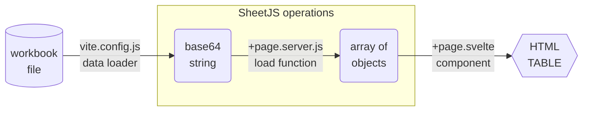

import current from '/version.js';
import CodeBlock from '@theme/CodeBlock';

[SvelteKit](https://kit.svelte.dev/) is a framework for generating static sites.
It leverages modern technologies including ViteJS and SvelteJS[^1]

[SheetJS](https://sheetjs.com) is a JavaScript library for reading and writing
data from spreadsheets.

This demo uses SvelteKit and SheetJS to pull data from a spreadsheet and display
the content in an HTML table. We'll explore how to use a plugin to pull raw data
from files and how to organize page scripts to process the files at compile time.

The ["Complete Example"](#complete-example) section includes a complete website
powered by an XLSX spreadsheet.

:::info pass

This demo focuses on server-side processing with SvelteKit and Svelte.

The [Svelte demo](/docs/demos/frontend/svelte) covers general client-side usage.

:::

The following diagram depicts the workbook waltz:



:::note Tested Deployments

This demo was tested in the following environments:

| SvelteJS         | Kit      | Date       |
|:-----------------|:---------|:-----------|
| `4.2.17`         | `2.5.10` | 2024-06-03 |
| `5.0.0-next.149` | `2.5.10` | 2024-06-03 |

:::

## Integration

`+page.server.js` scripts can be pre-rendered by exporting `prerender` from the
script. If the SheetJS operations are performed in the server script, only the
results will be added to the generated pages!

For static site generation, `@sveltejs/adapter-static` must be used.

### Loader

SvelteKit projects use ViteJS under the hood. They expose the `vite.config.js`
script. The "Base64 Loader" from the ViteJS demo[^2] can pull data from files
into Base64 strings for processing in `+page.server.js` scripts.

:::note pass

The ViteJS demo used the query `?b64` to identify files. To play nice with
SvelteKit, this demo matches the file extensions directly.

:::

The loader should be added to `vite.config.js`. The code is nearly identical to
the "Base64 Loader" ViteJS example.

```js title="vite.config.js"
import { sveltekit } from '@sveltejs/kit/vite';
import { defineConfig } from 'vite';
import { readFileSync } from 'fs';

export default defineConfig({
  assetsInclude: ['**/*.numbers', '**/*.xlsx'],
  plugins: [sveltekit(), {
    name: "sheet-base64",
    transform(code, id) {
      if(!id.match(/\.(numbers|xlsx)$/)) return;
      var data = readFileSync(id, "base64");
      return `export default '${data}'`;
    }
  }]
});
```

#### Types

For VSCodium integration, types can be specified in `src/app.d.ts`.

The example data loader returns Base64 strings. Declarations should be added for
each file extension supported in the loader:

```ts title="src/app.d.ts"
declare global {
  declare module '*.numbers' { const data: string; export default data; }
  declare module '*.xlsx'    { const data: string; export default data; }
}
```

### Data Processing

For static sites, SheetJS operations should be run in `+page.server.js`[^3]. The
script must include `export const prerender = true`[^4].

Assuming `pres.xlsx` is stored in the `data` directory from the project root,
the relative import

```js
import b64 from "../../data/pres.xlsx"
```

will return a Base64 string which can be parsed in the script. The workbook
object can be post-processed using utility functions.

The following example uses the SheetJS `read` method[^5] to parse spreadsheet
files and the `sheet_to_json` method[^6] to generate arrays of row objects for
each worksheet. The data presented to the page will be an object whose keys are
worksheet names:

```js title="src/routes/+page.server.js"
import b64 from "../../data/pres.xlsx";
import { read, utils } from "xlsx";

export const prerender = true;

/** @type {import('./$types').PageServerLoad} */
export async function load({ params }) {
  const wb = read(b64);
  /** @type {[string, any[]][]} */
  const data = wb.SheetNames.map(n => [n, utils.sheet_to_json(wb.Sheets[n])]);
  return Object.fromEntries(data);
}
```

### Data Rendering

The shape of the data is determined by the loader. The example loader returns an
object whose keys are worksheet names and whose values are arrays of objects.

Using standard Svelte patterns, HTML tables can be generated from the data:

```html title="src/routes/+page.svelte"
<script>
  /** @type {import('./$types').PageData} */
  export let data;

  /* `pres` will be the data from Sheet1 */
  /** @type {Array<{Name: string, Index: number}>}*/
  export let pres = data["Sheet1"];
</script>

<h1>Presidents</h1>
<table><thead><tr><th>Name</th><th>Index</th></tr></thead><tbody>
  {#each pres as p}<tr>
    <td>{p.Name}</td>
    <td>{p.Index}</td>
  </tr>{/each}
</tbody></table>
```

When built using `npm run build`, SvelteKit will perform the conversion and emit
a simple HTML table without any reference to the existing spreadsheet file!

## Complete Example

:::caution pass

When this demo was last tested, SvelteKit required NodeJS major version 20.

:::

### Initial Setup

1) Create a new site:

```bash
npm create svelte@latest sheetjs-svelte
```

When prompted:

- `Which Svelte app template?` select `Skeleton Project`
- `Add type checking with TypeScript?` select `Yes, using JavaScript with JSDoc`
- `Select additional options` press <kbd>Enter</kbd> (do not select options)

:::note pass

To test the Svelte 5 beta, select `Try the Svelte 5 preview (unstable!)`

:::

2) Enter the project folder and install dependencies:

```bash
cd sheetjs-svelte
npm i
```

3) Fetch the example file [`pres.xlsx`](https://docs.sheetjs.com/pres.xlsx) and
move to a `data` subdirectory in the root of the project:

```bash
mkdir -p data
curl -Lo data/pres.xlsx https://docs.sheetjs.com/pres.xlsx
```

4) Install the SheetJS library:

<CodeBlock language="bash">{`\
npm i --save https://cdn.sheetjs.com/xlsx-${current}/xlsx-${current}.tgz`}
</CodeBlock>

5) Replace the contents of `vite.config.js` with the following codeblock:

```js title="vite.config.js"
import { sveltekit } from '@sveltejs/kit/vite';
import { defineConfig } from 'vite';
import { readFileSync } from 'fs';

export default defineConfig({
  assetsInclude: ['**/*.numbers', '**/*.xlsx'],
  plugins: [sveltekit(), {
    name: "sheet-base64",
    transform(code, id) {
      if(!id.match(/\.(numbers|xlsx)$/)) return;
      var data = readFileSync(id, "base64");
      return `export default '${data}'`;
    }
  }]
});
```


6) Append the following lines to `src/app.d.ts`:

```ts title="src/app.d.ts (add to end of file)"
declare global {
  declare module '*.numbers' { const data: string; export default data; }
  declare module '*.xlsx'    { const data: string; export default data; }
}
```

7) Replace the contents of `src/routes/+page.server.js` with the following code.
Create the file if it does not exist.

```js title="src/routes/+page.server.js"
import b64 from "../../data/pres.xlsx";
import { read, utils } from "xlsx";

export const prerender = true;

/** @type {import('./$types').PageServerLoad} */
export async function load({ params }) {
  const wb = read(b64);
  /** @type {[string, any[]][]} */
  const data = wb.SheetNames.map(n => [n, utils.sheet_to_json(wb.Sheets[n])]);
  return Object.fromEntries(data);
}
```

8) Replace the contents of `src/routes/+page.svelte` with the following code.
Create the file if it does not exist.

```html title="src/routes/+page.svelte"
<script>
  /** @type {import('./$types').PageData} */
  export let data;

  /* `pres` will be the data from Sheet1 */
  /** @type {Array<{Name: string, Index: number}>}*/
  export let pres = data["Sheet1"];
</script>

<h1>Presidents</h1>
<table><thead><tr><th>Name</th><th>Index</th></tr></thead><tbody>
  {#each pres as p}<tr>
    <td>{p.Name}</td>
    <td>{p.Index}</td>
  </tr>{/each}
</tbody></table>
```

### Live Reload

9) Open `data/pres.xlsx` in a spreadsheet editor like Apple Numbers or Excel.

10) Start the development server:

```bash
npm run dev
```

Open the displayed URL (typically `http://localhost:5173`) in a web browser and
observe that the data from the spreadsheet is displayed in the page.

11) In the spreadsheet, set cell A7 to `SheetJS Dev` and cell B7 to `47`.  Save
the file.  After saving, the browser should automatically refresh with new data.

### Static Site

12) Stop the development server and install the static adapter:

```bash
npm i --save @sveltejs/adapter-static
```

13) Edit `svelte.config.js` to use the new adapter.

The config should currently use `adapter-auto`:

```js title="svelte.config.js (default configuration)"
import adapter from '@sveltejs/adapter-auto';
```

Replace the module name with `@sveltejs/adapter-static`:

```js title="svelte.config.js (change dependency)"
import adapter from '@sveltejs/adapter-static';
```

14) Build the static site:

```bash
npm run build
```

15) Start a local web server that will host the production build:

```bash
npx -y http-server build
```

16) Open a web browser and access the displayed URL (`http://localhost:8080`).
View the page source and confirm that the raw HTML table includes the data.

Searching for `Bill Clinton` should reveal the following row:

```html
<tr><td>Bill Clinton</td><td>42</td></tr>
```

[^1]: See ["SvelteKit vs Svelte"](https://kit.svelte.dev/docs/introduction#sveltekit-vs-svelte) in the SvelteKit documentation.
[^2]: See ["Base64 Plugin" in the ViteJS demo](/docs/demos/static/vitejs#base64-plugin)
[^3]: See ["Universal vs server"](https://kit.svelte.dev/docs/load#universal-vs-server) in the SvelteKit documentation.
[^4]: See ["prerender"](https://kit.svelte.dev/docs/page-options#prerender) in the SvelteKit documentation.
[^5]: See [`read` in "Reading Files"](/docs/api/parse-options)
[^6]: See [`sheet_to_json` in "Utilities"](/docs/api/utilities/array#array-output)
