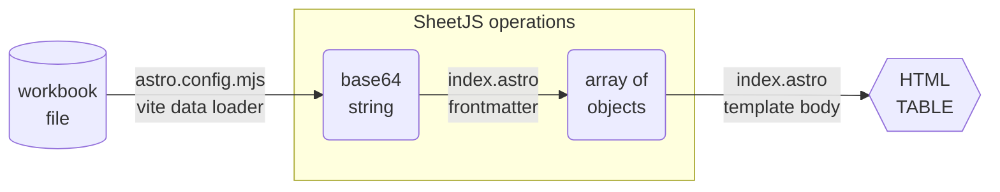

import current from '/version.js';
import CodeBlock from '@theme/CodeBlock';

AstroJS[^1] is a site generator. AstroJS projects support ViteJS[^2] plugins for
making custom data sources.

[SheetJS](https://sheetjs.com) is a JavaScript library for reading and writing
data from spreadsheets.

This demo uses AstroJS and SheetJS to pull data from a spreadsheet and display
the content in an HTML table. We'll explore how to load SheetJS libraries during
the AstroJS build process and create static HTML pages.

The ["Complete Example"](#complete-example) section includes a complete website
powered by Apple Numbers spreadsheets.

The following diagram depicts the workbook waltz:



:::danger Telemetry

AstroJS enables telemetry by default. The tool has an option to disable telemetry:

```bash
npx astro telemetry disable
```

:::

:::note Tested Deployments

This demo was tested in the following environments:

| AstroJS | Template         | Date       |
|:--------|:-----------------|:-----------|
| `3.6.5` | Starlight 0.14.0 | 2024-04-14 |
| `4.6.1` | Starlight 0.21.5 | 2024-04-14 |

:::

:::caution pass

AstroJS has introduced a number of breaking changes in minor releases.

**The demos worked as expected with the listed versions on the listed dates.**

:::

## Integration

:::info pass

This demo uses ["Base64 Loader"](/docs/demos/static/vitejs#base64-plugin)
from the ViteJS demo.

The ViteJS demo used the query `?b64` to identify files. To play nice with
AstroJS, this demo matches the file extensions directly.

:::

Since AstroJS performs per-page processing at build time, it is recommended to
use the Base64 string loader to get file data and parse with the SheetJS library
in the relevant pages.  If the SheetJS operations are performed in frontmatter,
only the results will be added to the generated pages!

### Loader

The loader should be added to `astro.config.mjs` under the `vite` key.

```js title="astro.config.mjs"
import { readFileSync } from 'fs';
import { defineConfig } from 'astro/config';
export default defineConfig({
  vite: {
    // this tells astro which extensions to handle
    assetsInclude: ['**/*.numbers', '**/*.xlsx', '**/*.xls', '**/*.xlsb'],

    plugins: [
      { // this plugin presents the data as a Base64 string
        name: "sheet-base64",
        transform(code, id) {
          if(!id.match(/\.(numbers|xlsx)$/)) return;
          var data = readFileSync(id, "base64");
          return `export default '${data}'`;
        }
      }
    ]
  }
});
```

#### Types

For VSCode and VSCodium integration, types can be specified in `src/env.d.ts`.

This data loader returns Base64 strings:

```ts title="src/env.d.ts"
/// <reference types="astro/client" />
declare module '*.numbers' { const data: string; export default data; }
declare module '*.xlsx'    { const data: string; export default data; }
declare module '*.xls'     { const data: string; export default data; }
declare module '*.xlsb'    { const data: string; export default data; }
// ... (more spreadsheet formats) ...
```

### AstroJS Frontmatter

Typically projects store files in `src/pages`. Assuming `pres.numbers` is stored
in the `src/data` directory in the project, the relative import

```js
import b64 from "../data/pres.numbers"
```

will return a Base64 string.

The Base64 string can be parsed in the frontmatter using the SheetJS `read`[^3]
method with the `base64` type. The method returns a SheetJS workbook object[^4].

```js
import { read } from "xlsx";

const wb = read(b64, { type: "base64" });
```

The workbook object can be post-processed using utility functions. The following
example uses the `sheet_to_json`[^5] method to generate row objects from the
first worksheet in the workbook:

```jsx title="src/pages/index.astro"
---
/* -- the code in the frontmatter is only run at build time -- */
import { read, utils } from "xlsx";

/* parse workbook */
import b64 from "../data/pres.numbers";
const wb = read(b64, { type: "base64" });

/* generate row objects */
interface IPresident {
  Name: string;
  Index: number;
}
const data = utils.sheet_to_json<IPresident>(wb.Sheets[wb.SheetNames[0]]);
---
```

### Page Body

The frontmatter used `sheet_to_json` to create an "array of objects"[^6]. Using
standard JSX techniques, the data can be rendered as table rows:

```jsx title="src/pages/index.astro"
<html>
  <body>
    <h3>Presidents</h3>
    <table>
      <thead><tr><th>Name</th><th>Index</th></tr></thead>
      {/* Display each row object as a TR within the TBODY element */}
      <tbody>{data.map(row => (
        <tr><td>{row.Name}</td><td>{row.Index}</td></tr>
      ))}</tbody>
    </table>
  </body>
</html>
```

When built using `npx astro build`, AstroJS will perform the conversion and emit
a simple HTML table without any reference to the existing spreadsheet file!

## Complete Example

:::caution pass

AstroJS has introduced a number of breaking changes. If the demo fails, please
[leave a note](https://git.sheetjs.com/sheetjs/docs.sheetjs.com/issues)

:::

0) Disable AstroJS telemetry:

```bash
npx astro telemetry disable
```

1) Create a new site using the `starlight` template:

```bash
npm create astro@latest -- --template starlight --yes ./sheetjs-astro
cd sheetjs-astro
```

:::note pass

To test an older version of AstroJS, install the specific version of `astro` and
a supported starter template after creating the project.

For major version 3, Starlight must be version `0.14.0`:

```bash
npm install --force astro@3.6.5 @astrojs/starlight@0.14.0
```

The version can be verified by running:

```bash
npx astro --version
```

:::

2) Fetch the example file [`pres.numbers`](https://docs.sheetjs.com/pres.numbers):

```bash
mkdir -p src/data
curl -Lo src/data/pres.numbers https://docs.sheetjs.com/pres.numbers
```

3) Install the SheetJS library:

<CodeBlock language="bash">{`\
npm i --save https://cdn.sheetjs.com/xlsx-${current}/xlsx-${current}.tgz`}
</CodeBlock>

4) Append the following lines to `src/env.d.ts`:

```ts title="src/env.d.ts (add to end)"
/* add to the end of the file */
declare module '*.numbers' { const data: string; export default data; }
declare module '*.xlsx'    { const data: string; export default data; }
```

5) Add the highlighted lines to `astro.config.mjs`:

- At the top of the script, import `readFileSync`:

```js title="astro.config.mjs (add higlighted lines)"
// highlight-start
/* import `readFileSync` at the top of the script*/
import { readFileSync } from 'fs';
// highlight-end
import { defineConfig } from 'astro/config';
```

- In the object argument to `defineConfig`, add a `vite` section:

```js title="astro.config.mjs (add highlighted lines)"
export default defineConfig({
  // highlight-start
  /* this vite section should be added as a property of the object */
  vite: {
    // this tells astro which extensions to handle
    assetsInclude: ['**/*.numbers', '**/*.xlsx'],

    plugins: [
      { // this plugin presents the data as a Base64 string
        name: "sheet-base64",
        transform(code, id) {
          if(!id.match(/\.(numbers|xlsx)$/)) return;
          var data = readFileSync(id, "base64");
          return `export default '${data}'`;
        }
      }
    ]
  },
  // highlight-end
```

6) Download [`index.astro`](pathname:///astrojs/index.js) and save to
   `src/pages/index.astro` (creating a new folder if it does not exist):

```bash
mkdir -p src/pages
curl -o src/pages/index.astro https://docs.sheetjs.com/astrojs/index.astro
```

7) Remove any `index` files in the `src/content` directory:

```bash
rm src/content/index.*
```

:::note pass

This command may show an error:

```
zsh: no matches found: src/content/index.*
```

This error can be ignored.

:::

8) Build the static site:

```bash
npx astro build
```

AstroJS will place the generated site in the `dist` subfolder.

9) Start a web server to host the static site:

```bash
npx http-server dist
```

Open a web browser and access the displayed URL ( `http://localhost:8080` ).
View the page source and confirm that no JS was added to the page.  It only
contains the content from the file in an HTML table.

:::caution pass

**If the site shows a Welcome page, inspect the project!**

When this demo was first written, the `docs` template used `src/pages/index.astro`

In a later test, AstroJS removed the `docs` template and introduced the
`starlight` template. This template included `src/content/index.mdx`, which
takes priority over `src/pages/index.astro`.

To resolve this issue, as noted in step 7, remove any `index.*` files in the
`src/content` folder.

:::

[^1]: The [official website](https://astro.build/) uses the name "Astro" but most of the tooling uses the name `@astrojs`.
[^2]: See ["ViteJS" demo](/docs/demos/static/vitejs) for more details and advanced use cases.
[^3]: See [`read` in "Reading Files"](/docs/api/parse-options)
[^4]: See ["SheetJS Data Model"](/docs/csf)
[^5]: See [`sheet_to_json` in "Utilities"](/docs/api/utilities/array#array-output)
[^6]: See ["Arrays of Objects" in "Utilities"](/docs/api/utilities/array#arrays-of-objects)
