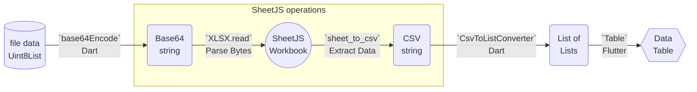

import current from '/version.js';
import Tabs from '@theme/Tabs';
import TabItem from '@theme/TabItem';
import CodeBlock from '@theme/CodeBlock';

export const r = {style: {color:"red"}};
export const g = {style: {color:"green"}};

Dart[^1] + Flutter[^2] is a popular cross-platform app framework. JavaScript
code can be run through [embedded engines](/docs/demos/engines).

[SheetJS](https://sheetjs.com) is a JavaScript library for reading and writing
data from spreadsheets.

This demo uses Dart + Flutter and SheetJS to process spreadsheets. We'll explore
how to use the `flutter_js` package to run JavaScript code and how to pass data
between Dart code and the platform-specific JS engines.

The "Demo" creates an app that looks like the screenshots below:

<table><thead><tr>
  <th><a href="#demo">iOS</a></th>
  <th><a href="#demo">Android</a></th>
</tr></thead><tbody><tr><td>


</td><td>


</td></tr></tbody></table>

:::note Tested Deployments

This demo was tested in the following environments:

**Real Devices**

| OS         | Device            | Dart    | Flutter  | Date       |
|:-----------|:------------------|:--------|:---------|:-----------|
| Android 30 | NVIDIA Shield     | `3.4.3` | `3.22.2` | 2024-06-09 |
| iOS 15.1   | iPad Pro          | `3.4.3` | `3.22.2` | 2024-06-09 |

**Simulators**

| OS         | Device            | Dart    | Flutter  | Dev Platform | Date       |
|:-----------|:------------------|:--------|:---------|:-------------|:-----------|
| Android 34 | Pixel 3a          | `3.4.3` | `3.22.2` | `darwin-x64` | 2024-06-09 |
| iOS 17.5   | iPhone 15 Pro Max | `3.4.3` | `3.22.2` | `darwin-x64` | 2024-06-09 |
| Android 35 | Pixel 3a          | `3.5.0` | `3.24.0` | `win11-x64`  | 2024-08-10 |

:::

:::danger Telemetry

Before starting this demo, manually disable telemetry.  On MacOS:

```bash
dart --disable-telemetry
dart --disable-analytics
flutter config --no-analytics
flutter config --disable-telemetry
```

:::

## Integration Details

:::note pass

This demo assumes familiarity with Dart and Flutter.

:::

For the iOS and Android targets, the `flutter_js` package[^3] wraps JavaScriptCore[^4]
and QuickJS[^5] engines respectively.

The [SheetJS Standalone scripts](/docs/getting-started/installation/standalone)
can be parsed and evaluated in the wrapped engines.

### Loading SheetJS

#### Adding the scripts

The `flutter.assets` property in `pubspec.yaml` specifies assets.  Assuming the
standalone script and shim are placed in the `scripts` folder, the following
snippet loads the scripts as assets:

```yaml title="pubspec.yaml"
flutter:
  assets:
    - scripts/xlsx.full.min.js
    - scripts/shim.min.js
```

Once loaded, the contents can be loaded with `rootBundle.loadString`:

```dart
import 'package:flutter/services.dart' show rootBundle;

String shim = await rootBundle.loadString("scripts/shim.min.js");
String sheetjs = await rootBundle.loadString("scripts/xlsx.full.min.js");
```

#### Initialization

It is strongly recommended to add the engine to the state of a `StatefulWidget`:

```dart
import 'package:flutter_js/flutter_js.dart';

class SheetJSFlutterState extends State<SheetJSFlutter> {
  // highlight-next-line
  late JavascriptRuntime _engine;

  @override void initState() {
    // highlight-next-line
    _engine = getJavascriptRuntime();
  }
}
```

#### Running SheetJS Scripts

Since fetching assets is asynchronous, it is recommended to create a wrapper
`async` function and sequentially await each script:

```dart
class SheetJSFlutterState extends State<SheetJSFlutter> {
  String _version = '0.0.0';
  late JavascriptRuntime _engine;

  @override void initState() {
    _engine = getJavascriptRuntime();
    _initEngine(); // note: this is not `await`-ed
  }

  Future<void> _initEngine() async {
    /* fetch and evaluate the shim */
    String shim = await rootBundle.loadString("scripts/shim.min.js");
    _engine.evaluate(shim);
    // highlight-start
    /* fetch and evaluate the main script */
    String sheetjs = await rootBundle.loadString("scripts/xlsx.full.min.js");
    _engine.evaluate(sheetjs);
    // highlight-end
    /* capture the version string */
    JsEvalResult vers = _engine.evaluate("XLSX.version");
    setState(() => _version = vers.stringResult);
  }
}
```

### Reading data

The following diagram depicts the workbook waltz:



The most common binary data type in Dart is `Uint8List`. It is the data type
for `http.Response#bodyBytes` and the return type of `File#readAsBytes()`.

The Flutter JS connector offers no simple interop for `Uint8List` data. The data
should be converted to Base64 using `base64Encode` before parsing.

Once passed into the JS engine, the SheetJS `read` function[^6] can read the
Base64-encoded string and the `sheet_to_csv` utility function[^7] can generate
a CSV string from a worksheet. This string can be pulled back into Dart code.

The `csv` package provides a special `CsvToListConverter` converter to generate
`List<List<dynamic>>` (Dart's spiritual equivalent of the array of arrays).

The following snippet generates `List<List<dynamic>>` from a Dart `Uint8List`:

```dart
import 'dart:convert';
import 'package:csv/csv.dart';

class SheetJSFlutterState extends State<SheetJSFlutter> {
  List<List<dynamic>> _data = [];
  late JavascriptRuntime _engine;

  void _processBytes(Uint8List bytes) {
    String base64 = base64Encode(bytes);
    JsEvalResult func = _engine.evaluate("""
      var wb = XLSX.read('$base64');
      XLSX.utils.sheet_to_csv(wb.Sheets[wb.SheetNames[0]]);
    """);
    String csv = func.stringResult;
    setState(() { _data = CsvToListConverter(eol: "\n").convert(csv); });
  }
}
```

## Demo

0) Follow the official "Install" instructions for Flutter[^8].

Run `flutter doctor` and confirm the following items are checked:

<Tabs groupId="os">
  <TabItem value="linux" label="Linux">

<pre>
<span {...g}>[✓]</span> Android toolchain - develop for Android devices (Android SDK version 34.0.0)
</pre>

  </TabItem>
  <TabItem value="macos" label="macOS" default>

<pre>
<span {...g}>[✓]</span> Android toolchain - develop for Android devices (Android SDK version 34.0.0)
<span {...g}>[✓]</span> Xcode - develop for iOS and macOS (Xcode 15.4)
</pre>

  </TabItem>
  <TabItem value="win" label="Windows">

<pre>
<span {...g}>[✓]</span> Android toolchain - develop for Android devices (Android SDK version 35.0.0)
</pre>

  </TabItem>
</Tabs>

(the actual version numbers may differ)

<details open>
  <summary><b>Installation Notes</b> (click to hide)</summary>

:::note pass

On first run, there may be a warning with "Android toolchain":

```
[!] Android toolchain - develop for Android devices (Android SDK version 34.0.0)
    ! Some Android licenses not accepted. To resolve this, run: flutter doctor
      --android-licenses
```

As stated, the fix is to run the command:

```bash
flutter doctor --android-licenses
```

:::

:::note pass

On first run, there may be a warning with "Xcode":

```
[!] Xcode - develop for iOS and macOS (Xcode 15.0.1)
    ✗ Unable to get list of installed Simulator runtimes.
```

Open "Settings" panel in Xcode. Under "Platforms", click "Get" next to "iOS".

:::

:::caution pass

In local testing, there were issues with the Android toolchain:

```
error: Android sdkmanager not found. Update to the latest Android SDK and ensure that the cmdline-tools are installed to resolve this.
```

Android Studio does not install `Android SDK Command-Line Tools` by default. It
must be installed manually.

Assuming the command-line tools are installed

This was fixed by switching to Java 20, installing `Android SDK 33`, and rolling
back to `Android SDK Command-Line Tools (revision: 10.0)`

:::

:::note pass

If Google Chrome is not installed, `flutter doctor` will show an issue:

```
[✗] Chrome - develop for the web (Cannot find Chrome executable at
    /Applications/Google Chrome.app/Contents/MacOS/Google Chrome)
    ! Cannot find Chrome. Try setting CHROME_EXECUTABLE to a Chrome executable.
```

If Chromium is installed, the environment variable should be manually assigned:

<Tabs groupId="os">
  <TabItem value="linux" label="Linux">

The `CHROME_EXECUTABLE` environment variable should be set to the path to the
`chrome` binary. This path differs between distributions and package managers.

  </TabItem>
  <TabItem value="macos" label="macOS">

```bash
export CHROME_EXECUTABLE=/Applications/Chromium.app/Contents/MacOS/Chromium
```

  </TabItem>
  <TabItem value="win" label="Windows">

Type `env` in the search bar and select "Edit the system environment variables".

In the new window, click the "Environment Variables..." button.

In the new window, look for the "System variables" section and click "New..."

Set the "Variable name" to `CHROME_EXECUTABLE` and the value to the path to the
program. When this demo was last tested, Chromium was installed for the local
user at `C:\Users\USERNAME\AppData\Local\Chromium\Application\chrome.exe` .

Click "OK" in each window (3 windows) and restart your computer.

  </TabItem>
</Tabs>

:::

</details>

Run `flutter emulators` and look for `android` and (on macOS only) `ios`
emulators.

<Tabs groupId="os">
  <TabItem value="linux" label="Linux">

```
Id                  • Name            • Manufacturer • Platform

Pixel_3a_API_35     • Pixel 3a API 35 • Google       • android
```

  </TabItem>
  <TabItem value="macos" label="macOS">

```
Id                  • Name            • Manufacturer • Platform

apple_ios_simulator • iOS Simulator   • Apple        • ios
Pixel_3a_API_34     • Pixel 3a API 34 • Google       • android
```

  </TabItem>
  <TabItem value="win" label="Windows">

```
Id                  • Name            • Manufacturer • Platform

Pixel_3a_API_35     • Pixel 3a API 35 • Google       • android
```

  </TabItem>
</Tabs>

1) Disable telemetry. The following commands were confirmed to work:

```bash
dart --disable-telemetry
dart --disable-analytics
flutter config --no-analytics
```

### Base Project

2) Create a new Flutter project:

```bash
flutter create sheetjs_flutter
cd sheetjs_flutter
```

3) Start the Android emulator.

<details open>
  <summary><b>Details</b> (click to hide)</summary>

**Android Studio**

In Android Studio, click "More actions" > "Virtual Device Manager". Look for the
emulated device in the list and click the ▶ button to play.

**Command Line**

List the available emulators with `flutter emulators`:

```
% flutter emulators
2 available emulators:

apple_ios_simulator • iOS Simulator  • Apple  • ios
Pixel_3a_API_34     • Pixel 3a API 34 • Google • android
^^^^^^^^^^^^^^^--- the first column is the name
```

The first column shows the name that should be passed to `emulator -avd`. In a
previous test, the name was `Pixel_3a_API_34` and the launch command was:

```bash
emulator -avd Pixel_3a_API_34
```

:::note pass

On macOS, `~/Library/Android/sdk/emulator/` is the typical location for the
`emulator` binary. If it cannot be found, add the folder to `PATH`:

```bash
export PATH="$PATH":~/Library/Android/sdk/emulator
emulator -avd Pixel_3a_API_34
```

:::

</details>

4) While the Android emulator is open, start the application:

```bash
flutter run
```

<details>
  <summary><b>If emulator is not detected</b> (click to show)</summary>

In some test runs, `flutter run` did not automatically detect the emulator.

Run `flutter -v -d sheetjs run` and the command will fail. Inspect the output:

```text title="Command output"
// highlight-next-line
[   +6 ms] No supported devices found with name or id matching 'sheetjs'.
[        ] The following devices were found:
...
// highlight-next-line
[  +26 ms] sdk gphone64 arm64 (mobile) • emulator-5554 • android-arm64  • Android 13 (API 33) (emulator)
[        ] macOS (desktop)             • macos         • darwin-arm64   • macOS 13.5.1 22G90 darwin-arm64
...
```

Search the output for `sheetjs`. After that line, search for the emulator list.
One of the lines will correspond to the running emulator:

```
[  +26 ms] sdk gphone64 arm64 (mobile) • emulator-5554 • android-arm64  • Android 13 (API 33) (emulator)
                                         ^^^^^^^^^^^^^--- the second column is the name
```

The second column is the device name. Assuming the name is `emulator-5554`, run:

```bash
flutter -v -d emulator-5554 run
```

</details>

Once the app loads, stop the terminal process and close the simulator.

5) Install Flutter / Dart dependencies:

```bash
flutter pub add http csv flutter_js
```

:::info pass

The command may fail in Windows with the followimg message:

<pre {...r}>
Building with plugins requires symlink support.

Please enable Developer Mode in your system settings. Run
{`  `}start ms-settings:developers
to open settings.
</pre>

As stated, "Developer Mode" must be enabled:

1) Run `start ms-settings:developers`

2) In the panel, enable "Developer Mode" and click "Yes" in the popup.

3) Reinstall dependencies:

```bash
flutter pub add http csv flutter_js
```

:::

6) Open `pubspec.yaml` with a text editor. Search for the line that starts with
`flutter:` (no whitespace) and add the highlighted lines:

```yaml title="pubspec.yaml"
# The following section is specific to Flutter packages.
flutter:
// highlight-start
  assets:
    - scripts/xlsx.full.min.js
    - scripts/shim.min.js
// highlight-end
```

7) Download dependencies to the `scripts` folder:

<CodeBlock language="bash">{`\
mkdir -p scripts
cd scripts
curl -LO https://cdn.sheetjs.com/xlsx-${current}/package/dist/xlsx.full.min.js
curl -LO https://cdn.sheetjs.com/xlsx-${current}/package/dist/shim.min.js
cd ..`}
</CodeBlock>

:::caution pass

PowerShell `curl` is incompatible with the official `curl` program. The command
may fail with a parameter error:

```
Invoke-WebRequest : A parameter cannot be found that matches parameter name 'LO'.
```

`curl.exe` must be used instead:

<CodeBlock language="bash">{`\
mkdir -p scripts
cd scripts
curl.exe -LO https://cdn.sheetjs.com/xlsx-${current}/package/dist/xlsx.full.min.js
curl.exe -LO https://cdn.sheetjs.com/xlsx-${current}/package/dist/shim.min.js
cd ..`}
</CodeBlock>

:::

8) Download [`main.dart`](pathname:///flutter/main.dart) to `lib/main.dart`:

```bash
curl -L -o lib/main.dart https://docs.sheetjs.com/flutter/main.dart
```

:::caution pass

PowerShell `curl` is incompatible with the official `curl` program. The command
may fail with a parameter error:

```
Invoke-WebRequest : A parameter cannot be found that matches parameter name 'L'.
```

`curl.exe` must be used instead:

```bash
curl.exe -L -o lib/main.dart https://docs.sheetjs.com/flutter/main.dart
```

:::

### Android

9) Start the Android emulator using the same instructions as Step 3.

10) Launch the app:

```bash
flutter run
```

The app fetches https://docs.sheetjs.com/pres.numbers, parses, converts data to
an array of arrays, and presents the data in a Flutter `Table` widget.

<details>
  <summary><b>If emulator is not detected</b> (click to show)</summary>

In some test runs, `flutter run` did not automatically detect the emulator.

Run `flutter -v -d sheetjs run` and the command will fail. Inspect the output:

```text title="Command output"
// highlight-next-line
[   +6 ms] No supported devices found with name or id matching 'sheetjs'.
[        ] The following devices were found:
...
// highlight-next-line
[  +26 ms] sdk gphone64 arm64 (mobile) • emulator-5554 • android-arm64  • Android 13 (API 33) (emulator)
[        ] macOS (desktop)             • macos         • darwin-arm64   • macOS 13.5.1 22G90 darwin-arm64
...
```

Search the output for `sheetjs`. After that line, search for the emulator list.
One of the lines will correspond to the running emulator:

```
[  +26 ms] sdk gphone64 arm64 (mobile) • emulator-5554 • android-arm64  • Android 13 (API 33) (emulator)
                                         ^^^^^^^^^^^^^--- the second column is the name
```

The second column is the device name. Assuming the name is `emulator-5554`, run:

```bash
flutter -v -d emulator-5554 run
```

</details>

:::info pass

In some demo runs, the build failed with an Android SDK error:

```
│ The plugin flutter_js requires a higher Android SDK version.                      │
│ Fix this issue by adding the following to the file /.../android/app/build.gradle: │
│ android {                                                                         │
│   defaultConfig {                                                                 │
│     minSdkVersion 21                                                              │
│   }                                                                               │
│ }                                                                                 │
```

This was fixed by editing `android/app/build.gradle`.

Searching for `minSdkVersion` should reveal the following line:

```text title="android\app\build.gradle"
        minSdkVersion flutter.minSdkVersion
```

`flutter.minSdkVersion` should be replaced with `21`:

```text title="android\app\build.gradle"
        minSdkVersion 21
```

:::

11) Close the Android emulator.

### iOS

12) Start the iOS simulator.

13) Launch the app:

```bash
flutter run
```

The app fetches https://docs.sheetjs.com/pres.numbers, parses, converts data to
an array of arrays, and presents the data in a Flutter `Table` widget.

### Android Device

14) Connect an Android device using a USB cable.

If the device asks to allow USB debugging, tap "Allow".

15) Verify that `flutter` can find the device:

```bash
flutter devices
```

The list should include the device:

```
  SheetJS (mobile) • 726272627262726272 • android-arm64 • Android 11 (API 30)
  ^^^^^^^--- the first column is the name
```

16) Build an APK:

```bash
flutter build apk --release
```

17) Install on the Android device:

```bash
flutter install
```

:::note pass

The script may ask for a device:

```
[1]: SheetJS (1234567890)
[2]: iPhone 15 Pro Max (12345678-9ABC-DEF0-1234-567890ABCDEF)
[3]: macOS (macos)
[4]: Chrome (chrome)
Please choose one (or "q" to quit):
```

Select the number corresponding to the device.

:::

18) Launch the installed `sheetjs_flutter` app on the device.

:::caution pass

The app may take 30 seconds to load the content.

**There are known bugs in the Dart HTTP client in Android 12[^9].**

:::

### iOS Device

19) Follow the official "Deploy to physical iOS devices" instructions[^10]

20) Connect the iOS device and verify that `flutter` can find the device:

```bash
flutter devices
```

The list should include the device:

```
  SheetPad (mobile) • 00000000-0000000000000000 • ios • iOS 15.1 19B74
  ^^^^^^^^--- the first column is the name
```

21) Run the program on the device:

```bash
flutter run -d SheetPad
```

In debug mode, "Flutter tools" will attempt to connect to the running app. The
device will ask for permission:

> "Sheetjs Flutter" would like to find and connect to devices on your local network.

Tap "OK" to continue.

:::caution pass

When this demo was last tested, the build failed with an error:

```text
Could not build the precompiled application for the device.
Error (Xcode): No profiles for 'com.example.sheetjsFlutter' were found: Xcode couldn't find any iOS App Development provisioning profiles matching 'com.example.sheetjsFlutter'. Automatic signing is disabled and unable to generate a profile. To enable automatic signing, pass -allowProvisioningUpdates to xcodebuild.
```

The message includes a hint:

```
Verify that the Bundle Identifier in your project is your signing id in Xcode
  open ios/Runner.xcworkspace
```

Open the workspace and select the "Runner" project in the Navigator. In the main
pane, select "Signing &amp; Capabilities" and ensure a Team is selected. From
the menu bar, select "Product" > "Run" to run the app.

:::

:::info pass

If there is an "Untrusted Developer" error, the certificate must be trusted on
the device. The following steps were verified in iOS 15.1:

1) Open the "Settings" app on the device

In the "APPS FROM DEVELOPER" section of the new screen, "Sheetjs Flutter" should
be displayed. If it is missing, tap the "&lt;" button near the top of the screen
and select a different certificate from the list.

2) Select "General" > "VPN &amp; Device Management".

3) In the "DEVELOPER APP" section, tap the certificate that is "Not Trusted".

4) After confirming "Sheetjs Flutter" is in the list, tap the "Trust" button and
tap "Trust" in the popup.

:::

[^1]: https://dart.dev/ is the official site for the Dart Programming Language.
[^2]: https://flutter.dev/ is the official site for the Flutter Framework.
[^3]: [The `flutter_js` package](https://pub.dev/packages/flutter_js) is hosted on the Dart package repository.
[^4]: See [the dedicated "Swift + JavaScriptCore" demo](/docs/demos/engines/jsc) for more details.
[^5]: See [the dedicated "C + QuickJS" demo](/docs/demos/engines/quickjs) for more details.
[^6]: See [`read` in "Reading Files"](/docs/api/parse-options)
[^7]: See [`sheet_to_csv` in "CSV and Text"](/docs/api/utilities/csv#delimiter-separated-output)
[^8]: See [the Flutter Installation Instructions](https://docs.flutter.dev/get-started/install)
[^9]: For example, [Issue 836 in the `http` repository](https://github.com/dart-lang/http/issues/836) mentions that API calls may take 10+ seconds. This is an issue in Dart + Flutter.
[^10]: See ["Deploy to physical iOS devices"](https://docs.flutter.dev/get-started/install/macos?tab=ios15#deploy-to-physical-ios-devices) in the Flutter documentation