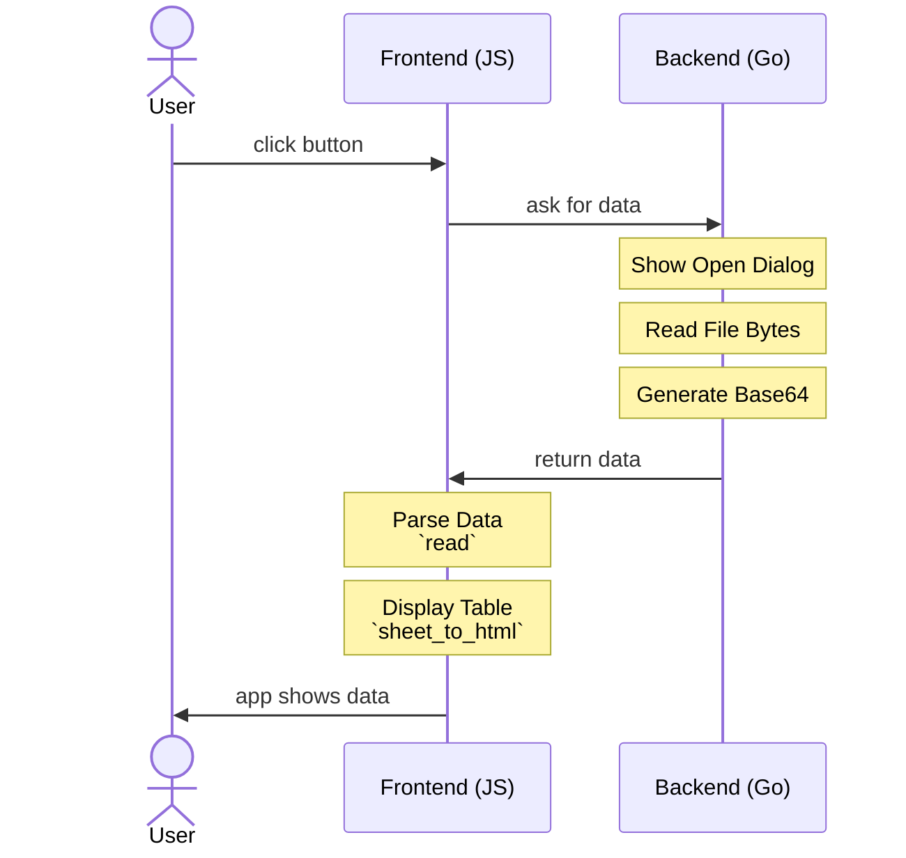
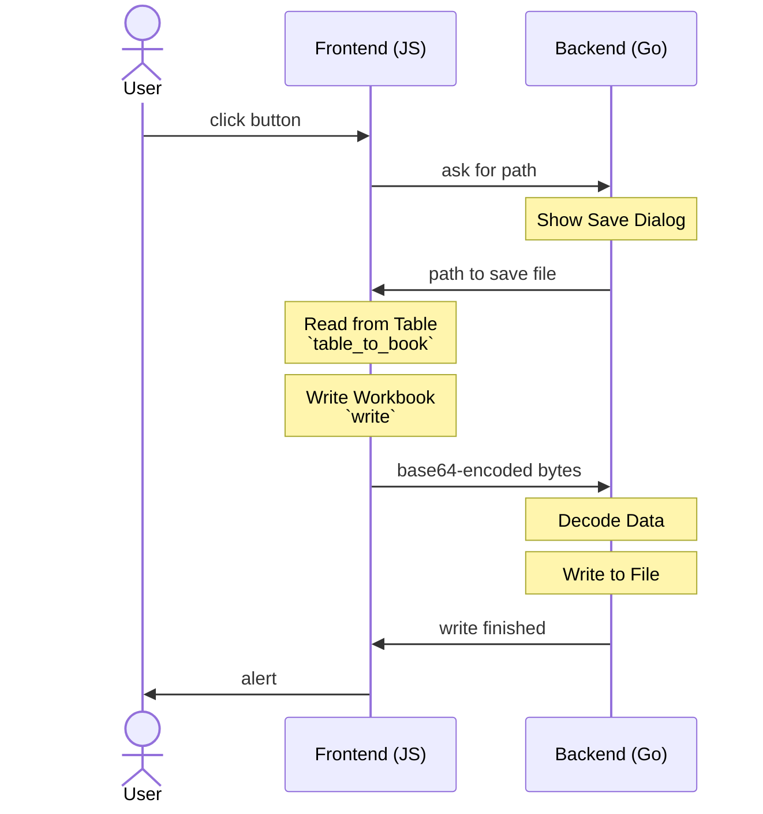

import current from '/version.js';
import Tabs from '@theme/Tabs';
import TabItem from '@theme/TabItem';
import CodeBlock from '@theme/CodeBlock';

[Wails](https://wails.io/) is a modern toolkit for building desktop apps. Wails
apps pair a Go-powered backend with a JavaScript-powered frontend[^1].

[SheetJS](https://sheetjs.com) is a JavaScript library for reading and writing
data from spreadsheets.

This demo uses Wails and SheetJS to pull data from a spreadsheet and display the
data in the app. We'll explore how to load SheetJS in a Wails app and exchange
file data between the JavaScript frontend and Go backend.

The ["Complete Example"](#complete-example) section covers a complete desktop
app to read and write workbooks. The app will look like the screenshots below:

<table><thead><tr>
  <th><a href="#complete-example">Windows</a></th>
  <th><a href="#complete-example">macOS</a></th>
  <th><a href="#complete-example">Linux</a></th>
</tr></thead><tbody><tr><td>


</td><td>


</td><td>


</td></tr></tbody></table>

:::tip pass

This demo assumes familiarity with the Go programming language.

For a pure JavaScript solution, the [Electron](/docs/demos/desktop/electron)
platform provides many native features out of the box.

:::

## Integration Details

The [SheetJS NodeJS Module](/docs/getting-started/installation/nodejs) can be
installed in the `frontend` folder and imported in frontend scripts.

:::caution pass

Wails currently does not provide the equivalent of NodeJS `fs` module.

**Reading and writing raw file data must be implemented in native Go code.**

:::

This demo includes native Go code for showing dialogs and reading and writing
files. When sending data between Go and JavaScript code, the raw files are
encoded as Base64 strings.

### Reading Files

When the user clicks the "Import File" button, the frontend tells the Go backend
to read data. The user will be presented with a file picker to select a file to
read. The Go backend will read the data, encode as a Base64 string, and send the
result to the frontend.

The frontend will parse the data using the SheetJS `read` method[^2], generate
HTML tables with `sheet_to_html`[^3], and display the tables on the frontend.

The following diagram summarizes the steps:



#### Go

The Wails runtime provides the cross-platform `OpenFileDialog` function[^4] to
show a file picker. The Go standard library provides methods for reading data
from the selected file[^5] and encoding in a Base64 string[^6]

```go
import (
  "context"
// highlight-start
  "encoding/base64"
  "os"
  "github.com/wailsapp/wails/v2/pkg/runtime"
// highlight-end
)

type App struct {
  ctx context.Context
}

// ReadFile shows an open file dialog and returns the data as Base64 string
func (a *App) ReadFile() string {
  // highlight-next-line
  selection, err := runtime.OpenFileDialog(a.ctx, runtime.OpenDialogOptions{
    Title: "Select File",
    Filters: []runtime.FileFilter{
      { DisplayName: "Excel Workbooks (*.xlsx)", Pattern: "*.xlsx", },
      // ... more filters for more file types
    },
  })
  if err != nil { return "" } // The demo app shows an error message
  // highlight-next-line
  data, err := os.ReadFile(selection)
  if err != nil { return "" } // The demo app shows an error message
  // highlight-next-line
  return base64.StdEncoding.EncodeToString(data)
}
```

#### JS

Wails will automatically create bindings for use in JS. The `App` binding module
will export the function `ReadFile`.

The following example uses the [SvelteJS](/docs/demos/frontend/svelte) framework:

```js title="frontend/src/App.svelte"
import { read, utils } from 'xlsx';
import { ReadFile } from '../wailsjs/go/main/App';

async function importFile(evt) {
// highlight-start
  /* call the native Go function and receive a base64 string */
  const b64 = await ReadFile();
  /* parse the base64 string with SheetJS */
  const wb = read(b64, { type: "base64" });
// highlight-end

  const ws = wb.Sheets[wb.SheetNames[0]]; // get the first worksheet
  return utils.sheet_to_html(ws); // generate HTML table
}
```

### Writing Files

:::info pass

The SheetJS `write` method[^7] can write spreadsheets in a number of formats[^8]
including XLSX, XLSB, XLS, and NUMBERS. It expects a `bookType` option. This
means the frontend needs to know the output file name before creating the file.

:::

When the user clicks the "Export File" button, the frontend asks the Go backend
for the output filename and path. The user will be presented with a file picker
to select the output folder and workbook type. The backend will send the name
to the frontend.

The frontend will generate a workbook object from the table using the SheetJS
`table_to_book` method[^9]. The SheetJS `write` method[^10] will generate a
Base64 string from the data.

The frontend will send the Base64 string to the backend. The backend will write
the data to a file in the selected folder.



##### Go

Two Go functions will be exposed.

- `SaveFile` will show the file picker and return the path. It will use the
  cross-platform `SaveFileDialog` function[^11].

```go
import (
  "context"
// highlight-next-line
  "github.com/wailsapp/wails/v2/pkg/runtime"
)

type App struct {
  ctx context.Context
}

func (a *App) SaveFile() string {
// highlight-next-line
  selection, err := runtime.SaveFileDialog(a.ctx, runtime.SaveDialogOptions{
    Title: "Select File",
    DefaultFilename: "SheetJSWails.xlsx",
    Filters: []runtime.FileFilter{
      { DisplayName: "Excel Workbooks (*.xlsx)", Pattern: "*.xlsx", },
      // ... more filters for more file types
    },
  })
  if err != nil { return "" } // The demo app shows an error message
  return selection
}
```

- `WriteFile` performs the file write given a Base64 string and file path. The
  Go standard library provides methods for decoding Base64 strings[^12] and
  writing data to the filesystem[^13]

```go
import (
  "context"
// highlight-start
  "encoding/base64"
  "os"
// highlight-end
)

type App struct {
  ctx context.Context
}

func (a *App) WriteFile(b64 string, path string) {
  // highlight-start
  buf, _ := base64.StdEncoding.DecodeString(b64);
  _ = os.WriteFile(path, buf, 0644);
  // highlight-end
}
```

#### JS

Wails will automatically create bindings for use in JS. The `App` binding module
will export the functions `SaveFile` and `WriteFile`.

The following example uses the [SvelteJS](/docs/demos/frontend/svelte) framework:

```js title="frontend/src/App.svelte"
import { utils, write } from 'xlsx';
import { SaveFile, WriteFile } from '../wailsjs/go/main/App';

async function exportFile(table_element) {
  /* generate workbook */
  const wb = utils.table_to_book(table_element);

  /* show save picker and get path */
  const path = await SaveFile();

  /* get the file extension -> bookType */
  const bookType = path.slice(path.lastIndexOf(".")+1);

  /* generate base64 string */
  const b64 = write(wb, { bookType: bookType, type: "base64" });

  /* write to file */
  await WriteFile(b64, path);
}
```

## Complete Example

:::note Tested Deployments

This demo was tested in the following environments:

| OS and Version | Architecture | Wails    | Date       |
|:---------------|:-------------|:---------|:-----------|
| macOS 14.4     | `darwin-x64` | `v2.8.0` | 2024-03-15 |
| macOS 14.5     | `darwin-arm` | `v2.8.2` | 2024-05-28 |
| Windows 10     | `win10-x64`  | `v2.8.0` | 2024-03-24 |
| Windows 11     | `win11-arm`  | `v2.8.2` | 2024-05-28 |
| Linux (HoloOS) | `linux-x64`  | `v2.8.0` | 2024-03-21 |
| Linux (Debian) | `linux-arm`  | `v2.8.2` | 2024-05-28 |

:::

0) Read the Wails "Getting Started" guide[^14] and install dependencies.

<details>
  <summary><b>Installation Notes</b> (click to show)</summary>

Wails will require:

- A recent version of [Go](https://go.dev/doc/install).
- The "LTS" version of [NodeJS](https://nodejs.org/en/download).

After installing both, run the following command to install Wails:

```bash
go install github.com/wailsapp/wails/v2/cmd/wails@latest
```

Once that finishes, run the following command in a new terminal window:

```bash
wails doctor
```

:::note pass

On macOS and Linux, the `PATH` environment variable must include `~/go/bin`. If
`wails` cannot be found, run the following command in the terminal session:

```bash
export PATH="$PATH":~/go/bin
```

:::

The output will include a `# Diagnosis` section. It should display:

```
 SUCCESS  Your system is ready for Wails development!
```

If a required dependency is missing, it will be displayed.

:::note pass

None of the optional packages are required for building and running this demo.

:::

:::info pass

On the Steam Deck (HoloOS), some dependencies must be reinstalled:

```bash
sudo pacman -Syu base-devel gtk3 glib2 pango harfbuzz cairo gdk-pixbuf2 atk libsoup
```

:::

</details>

1) Create a new Wails app:

```bash
wails init -n sheetjs-wails -t svelte-ts
cd sheetjs-wails
```

2) Install front-end dependencies:

<CodeBlock language="bash">{`\
cd frontend
curl -o src/assets/logo.png https://sheetjs.com/sketch1024.png
npm i --save https://cdn.sheetjs.com/xlsx-${current}/xlsx-${current}.tgz
cd ..`}
</CodeBlock>

3) Download source files:

- Download [`app.go`](pathname:///wails/app.go) and replace `app.go`
- Download [`App.svelte`](pathname:///wails/App.svelte) and replace
  `frontend/src/App.svelte`

```bash
curl -o app.go https://docs.sheetjs.com/wails/app.go
curl -o frontend/src/App.svelte https://docs.sheetjs.com/wails/App.svelte
```

4) Build the app:

```bash
wails build
```

It will print the path to the generated program (typically in `build/bin/`).

5) Run the generated application.

**Testing**

The program will download [`pres.xlsx`](https://docs.sheetjs.com/pres.xlsx) and
display the contents of the first worksheet in a table.

To test export features, click "Export XLSX". The app will ask for a file name
and location. After clicking Save, the app will export to XLSX. This file can be
opened in a spreadsheet editor such as Excel.

[^1]: See ["How does it Work?"](https://wails.io/docs/howdoesitwork) in the Wails documentation.
[^2]: See [`read` in "Reading Files"](/docs/api/parse-options)
[^3]: See [`sheet_to_html` in "Utilities"](/docs/api/utilities/html#html-table-output)
[^4]: See [`OpenFileDialog`](https://wails.io/docs/reference/runtime/dialog#openfiledialog) in the Wails documentation.
[^5]: See [`ReadFile`](https://pkg.go.dev/os#ReadFile) in the Go documentation
[^6]: See [`EncodeToString`](https://pkg.go.dev/encoding/base64#Encoding.EncodeToString) in the Go documentation
[^7]: See [`write` in "Writing Files"](/docs/api/write-options)
[^8]: See ["Supported Output Formats" type in "Writing Files"](/docs/api/write-options#supported-output-formats)
[^9]: See ["HTML Table Input" in "Utilities"](/docs/api/utilities/html#create-new-sheet)
[^10]: See [`write` in "Writing Files"](/docs/api/write-options)
[^11]: See [`SaveFileDialog`](https://wails.io/docs/reference/runtime/dialog#savefiledialog) in the Wails documentation.
[^12]: See [`DecodeString`](https://pkg.go.dev/encoding/base64#Encoding.DecodeString) in the Go documentation
[^13]: See [`WriteFile`](https://pkg.go.dev/os#WriteFile) in the Go documentation
[^14]: See ["Installation"](https://wails.io/docs/gettingstarted/installation) in the Wails documentation.