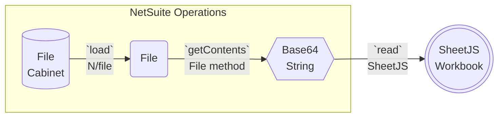
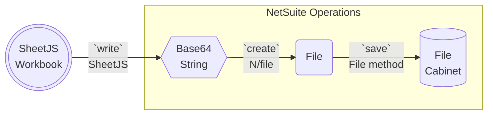
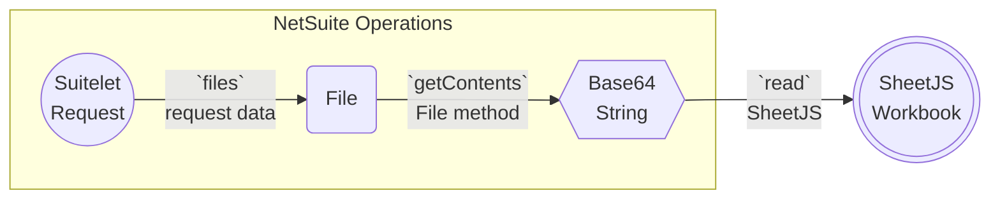
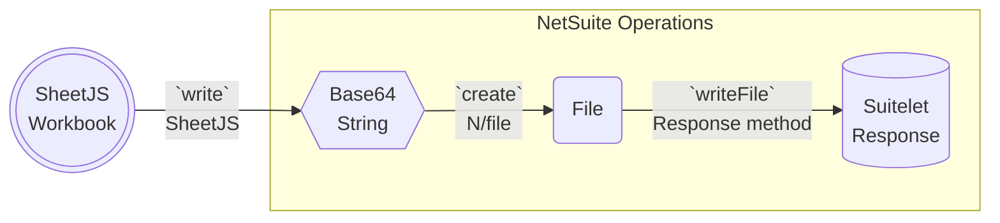

import current from '/version.js';
import CodeBlock from '@theme/CodeBlock';

[NetSuite](https://www.netsuite.com/) is a suite of cloud-based software systems
for Enterprise Resource Planning (ERP). It has a robust scripting interface.[^1]

[SheetJS](https://sheetjs.com) is a JavaScript library for reading and writing
data from spreadsheets.

This demo explores the SuiteScript scripting features in NetSuite. We'll explore
how to use SheetJS in SuiteScripts for reading and writing files in NetSuite.

:::note Tested Deployments

This demo was verified by NetSuite consultants in the following deployments:

| `@NScriptType`  | `@NApiVersion` | Date       |
|:----------------|:---------------|:-----------|
| ScheduledScript | 2.1            | 2024-05-01 |
| Restlet         | 2.1            | 2024-05-01 |
| Suitelet        | 2.1            | 2024-05-01 |
| MapReduceScript | 2.1            | 2024-05-01 |

:::

:::info pass

[See issue #3058](https://git.sheetjs.com/sheetjs/sheetjs/issues/3058) in the
issue tracker for more examples submitted by NetSuite consultants.

:::

## Installation

In SuiteScript parlance, third-party scripts are "Custom Modules"[^2].

The [SheetJS AMD script](/docs/getting-started/installation/amd) can be uploaded
to the file cabinet and referenced in the `define` call in SuiteScripts.

:::info pass

SheetJS scripts have been tested against the Rhino JavaScript engine[^3] and
work in both SuiteScript 2.0 and SuiteScript 2.1 deployments.

:::

#### Adding SheetJS Scripts

<p><a href={`https://cdn.sheetjs.com/xlsx-${current}/package/dist/xlsx.full.min.js`}>The
SheetJS standalone script</a> should be uploaded to the File Cabinet.</p>

:::note pass

It is strongly recommended to keep the original filename `xlsx.full.min.js`.

:::

#### JSON Configuration

Assuming the uploaded file was named `xlsx.full.min.js`, the `paths` object in
the JSON configuration should reference `xlsx.full.min`. The reference can be
absolute or relative[^4].

For example, if the script `xlsx.full.min.js` was placed in the `SuiteScripts`
top-level directory, the config should use `"/SuiteScripts/xlsx.full.min"`:

```json title="JsLibraryConfig.json"
{
  "paths": {
    // highlight-next-line
    "xlsx": "/SuiteScripts/xlsx.full.min"
  }
}
```

Relative references are also supported. If the entire project is stored in one
folder, the config can use `"./xlsx.full.min"`:

```json title="JsLibraryConfig.json"
{
  "paths": {
    // highlight-next-line
    "xlsx": "./xlsx.full.min"
  }
}
```

#### SuiteScript Usage

The JSON configuration file should be referenced in SuiteScripts using
`@NAmdConfig`. The path alias `"xlsx"` should be passed to `define`:

```js
/**
* @NApiVersion 2.x
// highlight-next-line
* @NAmdConfig  ./JsLibraryConfig.json
* ... more options ...
*/
// highlight-next-line
define(['N/file', 'xlsx'], function(file, XLSX) {
  // ... use XLSX here ...
});
```

## Sheets in the File Cabinet

The NetSuite File Cabinet[^5] is the primary feature for storing documents.

`N/file` is the primary module for interacting with the File Cabinet[^6].
This section assumes that `N/file` is bound to the variable `file`:

```js
define(
  ['N/file', 'xlsx'],
  function(
    // highlight-next-line
    file, // 'N/file'
    XLSX  // 'xlsx'
  ) {
    // ...
  }
);
```

### Reading Files



There are three steps to reading files:

1) Pull files from the file cabinet using `file.load`[^7]. The method returns a
   `file.File` object which represents the file metadata.

2) Read raw data from the file using `File#getContents`[^8]. The method returns
   the data as a Base64-encoded string.

3) Parse the data with the SheetJS `read` method[^9]. This method returns a
   SheetJS workbook object.

`file.load` expects an `id` property, which can be the internal ID (displayed in
the File Cabinet web interface) or an absolute or relative path string.

```js
/* file ID or path */
var id_of_file = 7262; // Internal ID 7262
/* load file */
var f = file.load({ id: id_of_file });
/* read file */
var b64 = f.getContents();
/* parse */
var workbook = XLSX.read(b64, { type: "base64" });
```

At this point, standard SheetJS utility functions[^10] can extract data from the
workbook object.

### Writing Files



There are three steps to writing files:

1) Write the data with the SheetJS `write` method[^11]. Using the `base64` output
   type[^12], the method will return a Base64 string.

2) Create a new file using `file.create`[^13]. The recommended file type is
   `file.Type.EXCEL`. The method returns a `file.File` object.

3) Upload data to the File Cabinet with `File#save`[^14]

```js
/* write XLSX workbook as Base64 string */
var out = XLSX.write(workbook, { bookType: "xlsx", type: "base64" });
/* create file */
var newfile = file.create({
  name: 'SheetJSCabinetExport.xlsx', // replace with desired name
  fileType: file.Type.EXCEL,
  contents: out
});
/* save */
newfile.save();
```

## Sheets in Suitelet Requests

Suitelets are driven by an exported `onRequest` method[^15].

The `request` property of the argument is a `ServerRequest` object[^16]. The
`files` property of the request[^17] is an object whose values are `file` objects.

The `response` property of the argument is a `ServerResponse` object[^18]. The
`writeFile` method[^19] of the response can respond with a `file` object.
For the examples in this section, the argument will be named `context`:

```js
/**
 * @NApiVersion 2.1
 * @NAmdConfig ./JsLibraryConfig.json
 * @NScriptType Suitelet
 */
define(['N/file', 'xlsx'], function (file, XLSX) {
  function onRequest(context) {
    /* ServerRequest object */
    var request = context.request;

    /* ServerResponse object */
    var response = context.response;

    // ... do work here ...
  }

  return { onRequest: onRequest };
});
```

### Importing Sheet Data



There are three steps to importing data from Suitelet requests:

1) Pull files from the `request.files` object.[^20]. Each value in the object is
   a `file.File` object which represents the file metadata.

2) Read raw data from the file using `File#getContents`[^21]. The method returns
   the data as a Base64-encoded string.

3) Parse the data with the SheetJS `read` method[^22]. This method returns a
   SheetJS workbook object.

```js
/* form element ID or field name */
var id_of_file = "uploaded_file"
/* get file from request */
var f = context.request.files[id_of_file];
/* read file */
var b64 = f.getContents();
/* parse */
var workbook = XLSX.read(b64, { type: "base64" });
```

At this point, standard SheetJS utility functions[^23] can extract data from the
workbook object.

:::note pass

When programmatically creating a form with `N/ui/serverWidget`, the keys of the
`files` object are determined by the `id` properties of the field.

```js
var form = serverWidget.createForm({ title: "Upload Spreadsheet" });
var field = form.addField({
// highlight-next-line
  id: "uploaded_file",
  label: "Choose Spreadsheet",
  type: serverWidget.FieldType.FILE
});
```

Since the `id` of the file field is `uploaded_file`, the request handler can
access the file at at `context.request.files["uploaded_file"]`

:::

### Exporting Files



There are three steps to generating downloadable files:

1) Write the data with the SheetJS `write` method[^24]. Using the `base64` output
   type[^25], the method will return a Base64 string.

2) Create a new file using `file.create`[^26]. The recommended file type is
   `file.Type.EXCEL`. The method returns a `file.File` object.

3) Initiate download with `response.writeFile`[^27].

```js
/* write XLSX workbook as Base64 string */
var out = XLSX.write(workbook, { bookType: "xlsx", type: "base64" });
/* create file */
var newfile = file.create({
  name: 'SheetJSSuiteletExport.xlsx', // replace with desired name
  fileType: file.Type.EXCEL,
  contents: out
});
/* initiate download */
context.response.writeFile(newfile);
```

## Troubleshooting

[NetSuite users reported](https://git.sheetjs.com/sheetjs/sheetjs/issues/3097)
errors using SheetJS scripts:

```
Fail to evaluate script: com.netsuite.suitescript.scriptobject.GraalValueAdapter@68d0f09d
```

NetSuite is incorrectly treating `xlsx` as a reserved word. As this behavior is
not documented, it is believed to be a NetSuite bug.

[Exasperated](https://git.sheetjs.com/sheetjs/sheetjs/issues/3097#issue-3378)
users concluded that Oracle will not be addressing this bug:

> Oracle is not going to do anything with this

The ["Oracle Bugs"](/docs/getting-started/installation/amd#netsuite) warning in
the NetSuite installation page includes a workaround that involves manually
patching the library.

[^1]: See ["SuiteScript 2.x API Introduction"](https://docs.oracle.com/en/cloud/saas/netsuite/ns-online-help/chapter_4387172221.html) in the NetSuite documentation.
[^2]: See ["SuiteScript 2.x Custom Modules"](https://docs.oracle.com/en/cloud/saas/netsuite/ns-online-help/chapter_4704097697.html) in the NetSuite documentation.
[^3]: See ["Java + Rhino" demo](/docs/demos/engines/rhino)
[^4]: See ["Module Dependency Paths"](https://docs.oracle.com/en/cloud/saas/netsuite/ns-online-help/section_4430268304.html#Module-Dependency-Paths) in the NetSuite documentation.
[^5]: See ["File Cabinet Overview"](https://docs.oracle.com/en/cloud/saas/netsuite/ns-online-help/chapter_N541319.html) in the NetSuite documentation.
[^6]: See [`N/file` Module](https://docs.oracle.com/en/cloud/saas/netsuite/ns-online-help/section_4205693274.html) in the NetSuite documentation.
[^7]: See [`file.load`](https://docs.oracle.com/en/cloud/saas/netsuite/ns-online-help/section_4226574300.html) in the NetSuite documentation.
[^8]: See [`File.getContents()`](https://docs.oracle.com/en/cloud/saas/netsuite/ns-online-help/section_4229269811.html) in the NetSuite documentation.
[^9]: See [`read` in "Reading Files"](/docs/api/parse-options)
[^10]: See ["Utility Functions"](/docs/api/utilities/)
[^11]: See [`write` in "Writing Files"](/docs/api/write-options)
[^12]: See ["Supported Output Formats"](/docs/api/write-options#supported-output-formats)
[^13]: See [`file.create(options)`](https://docs.oracle.com/en/cloud/saas/netsuite/ns-online-help/section_4223861820.html) in the NetSuite documentation.
[^14]: See [`File.save()`](https://docs.oracle.com/en/cloud/saas/netsuite/ns-online-help/section_4229271179.html) in the NetSuite documentation.
[^15]: See [`onRequest(params)`](https://docs.oracle.com/en/cloud/saas/netsuite/ns-online-help/section_4407987288.html) in the NetSuite documentation.
[^16]: See [`http.ServerRequest`](https://docs.oracle.com/en/cloud/saas/netsuite/ns-online-help/section_4314608702.html) in the NetSuite documentation.
[^17]: See [`ServerRequest.files`](https://docs.oracle.com/en/cloud/saas/netsuite/ns-online-help/section_4314805947.html) in the NetSuite documentation.
[^18]: See [`http.ServerResponse`](https://docs.oracle.com/en/cloud/saas/netsuite/ns-online-help/section_4314609319.html) in the NetSuite documentation.
[^19]: See [`ServerResponse.writeFile(options)`](https://docs.oracle.com/en/cloud/saas/netsuite/ns-online-help/section_4426015540.html) in the NetSuite documentation.
[^20]: See [`ServerRequest.files`](https://docs.oracle.com/en/cloud/saas/netsuite/ns-online-help/section_4314805947.html) in the NetSuite documentation.
[^21]: See [`File.getContents()`](https://docs.oracle.com/en/cloud/saas/netsuite/ns-online-help/section_4229269811.html) in the NetSuite documentation.
[^22]: See [`read` in "Reading Files"](/docs/api/parse-options)
[^23]: See ["Utility Functions"](/docs/api/utilities/)
[^24]: See [`write` in "Writing Files"](/docs/api/write-options)
[^25]: See ["Supported Output Formats"](/docs/api/write-options#supported-output-formats)
[^26]: See [`file.create(options)`](https://docs.oracle.com/en/cloud/saas/netsuite/ns-online-help/section_4223861820.html) in the NetSuite documentation.
[^27]: See [`ServerResponse.writeFile(options)`](https://docs.oracle.com/en/cloud/saas/netsuite/ns-online-help/section_4426015540.html) in the NetSuite documentation.
