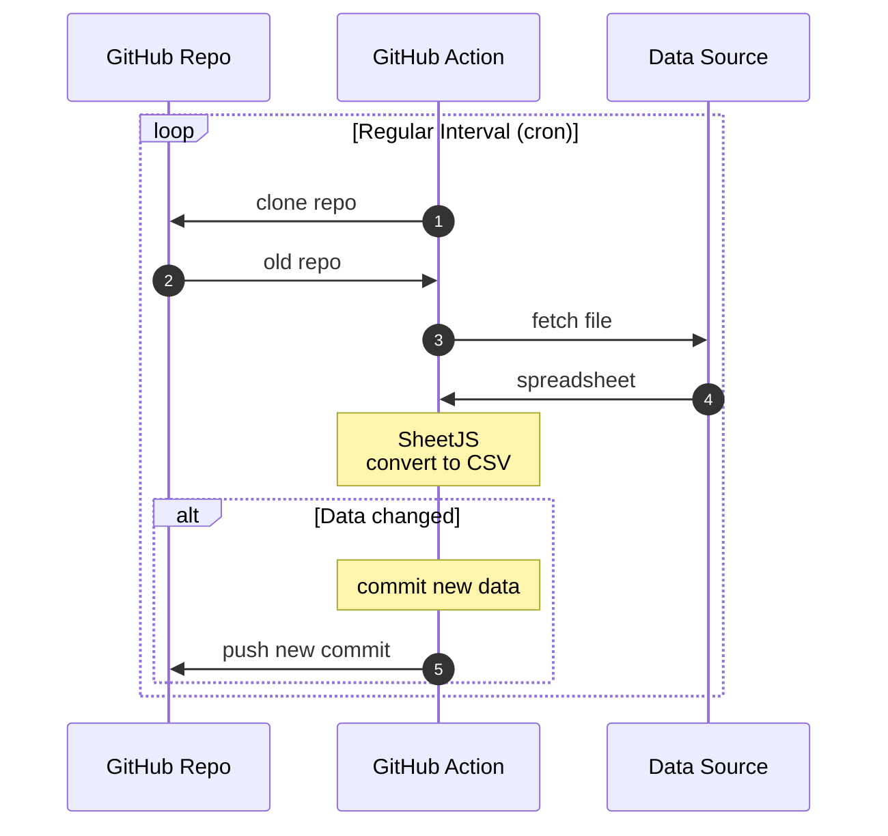

import current from '/version.js';
import CodeBlock from '@theme/CodeBlock';

[Git](https://git-scm.com/) is a popular system for organizing a historical
record of text files and changes. Git can also store and track spreadsheets.

GitHub hosts Git repositories and provides infrastructure to execute workflows.
The ["Flat Data" project](https://octo.github.com/projects/flat-data) explores
storing and comparing versions of structured data using GitHub infrastructure.

[SheetJS](https://sheetjs.com) is a JavaScript library for reading and writing
data from spreadsheets.

This demo uses SheetJS in GitHub to process spreadsheets. We'll explore how to
fetch and process spreadsheets at regular intervals, and how to keep track of
changes over time.

:::info pass

["Excel to CSV"](https://octo.github.com/projects/flat-data#:~:text=Excel) is an
official example that pulls XLSX workbooks from an endpoint and uses SheetJS to
parse the workbooks and generate CSV files.

:::

The following diagram depicts the data dance:



## Flat Data

Many official data releases by governments and organizations include XLSX or
XLS files. Unfortunately some data sources do not retain older versions.

Software developers typically use version control systems such as Git to track
changes in source code.

The "Flat Data" project starts from the idea that the same version control
systems can be used to track changes in data. Third-party data sources can be
snapshotted at regular intervals and stored in Git repositories.

### Components

As a project from the company, the entire lifecycle uses GitHub offerings:

- GitHub.com[^1] offers free hosting for Git repositories
- GitHub Actions[^2] infrastructure runs tasks at regular intervals
- `githubocto/flat`[^3] library helps fetch data and automate post-processing
- `flat-postprocessing`[^4] library provides post-processing helper functions
- "Flat Viewer"[^5] displays structured CSV and JSON data from Git repositories

:::caution pass

A GitHub account is required. When the demo was last tested, "GitHub Free"
accounts had no Actions usage limits for public repositories[^6].

Private GitHub repositories can be used for processing data, but the Flat Viewer
will not be able to display private data.

:::


### Data Source

Any publicly available spreadsheet can be a valid data source. The process will
fetch the data on specified intervals or events.

For this demo, https://docs.sheetjs.com/pres.xlsx will be used.


### Action

The `githubocto/flat` action can be added as a step in a workflow:

```yaml
      - name: Fetch data
        uses: githubocto/flat@v3
        with:
          http_url: https://docs.sheetjs.com/pres.xlsx
          downloaded_filename: data.xlsx
          postprocess: ./postprocess.ts
```

This action performs the following steps:

1) `http_url` will be fetched and saved to `downloaded_filename` in the repo.
This can be approximated with the following command:

```bash
curl -L -o data.xlsx https://docs.sheetjs.com/pres.xlsx
```

2) After saving, the `postprocess` script will be run. When a `.ts` file is the
script, it will run the script in the Deno runtime. The `postprocess` script is
expected to read the downloaded file and create or overwrite files in the repo.
This can be approximated with the following command:

```bash
deno run -A ./postprocess.ts data.xlsx
```

3) The action will compare the contents of the repo, creating a new commit if
the source data or artifacts from the `postprocess` script changed.


### Post-Processing Data

:::danger pass

The `flat-postprocessing` library includes a number of utilities for different
data formats.  The `readXLSX` helper uses SheetJS under the hood.

The library uses an older version of the SheetJS library. To use the latest
releases, the examples import from the SheetJS CDN:

<CodeBlock language="ts">{`\
// @deno-types="https://cdn.sheetjs.com/xlsx-${current}/package/types/index.d.ts"
import * as XLSX from 'https://cdn.sheetjs.com/xlsx-${current}/package/xlsx.mjs';`}
</CodeBlock>


See [the "Deno" installation section](/docs/getting-started/installation/deno)
for more details.

:::

#### Post-Process Script

The first argument to the post-processing script is the filename.

The SheetJS `readFile` method[^7] will read the file and generate a SheetJS
workbook object[^8]. After extracting the first worksheet, `sheet_to_csv`[^9]
generates a CSV string.

After generating a CSV string, the string should be written to the filesystem
using `Deno.writeFileSync`[^10]. By convention, the CSV should preserve the file
name stem and replace the extension with `.csv`:

<CodeBlock title="postprocess.ts" language="ts">{`\
// @deno-types="https://cdn.sheetjs.com/xlsx-${current}/package/types/index.d.ts"
import * as XLSX from 'https://cdn.sheetjs.com/xlsx-${current}/package/xlsx.mjs';
/* load the codepage support library for extended support with older formats  */
import * as cptable from 'https://cdn.sheetjs.com/xlsx-${current}/package/dist/cpexcel.full.mjs';
XLSX.set_cptable(cptable);
\n\
/* get the file path for the downloaded file and generate the CSV path */
const in_file = Deno.args[0];
const out_file = in_file.replace(/.xlsx$/, ".csv");
\n\
/* read file */
// highlight-next-line
const workbook = XLSX.readFile(in_file);
\n\
/* generate CSV from first worksheet */
const first_sheet = workbook.Sheets[workbook.SheetNames[0]];
// highlight-next-line
const csv = XLSX.utils.sheet_to_csv(first_sheet);
\n\
/* write CSV */
// highlight-next-line
Deno.writeFileSync(out_file, new TextEncoder().encode(csv));`}
</CodeBlock>


## Complete Example

:::note Tested Deployments

This was last tested by SheetJS users on 2024 June 07.

:::

:::info pass

https://github.com/SheetJS/flat-sheet is an example from a previous test. The
Flat Viewer URL for the repo is https://flatgithub.com/SheetJS/flat-sheet/

:::

### Create Project

0) Create a free GitHub account or sign into the GitHub web interface.

1) Create a new repository (click the "+" icon in the upper-right corner).

- When prompted, enter a repository name of your choosing.
- Ensure "Public" is selected
- Check "Add a README file"
- Click "Create repository" at the bottom.

You will be redirected to the new project.

### Add Code

2) In the browser URL bar, change "github.com" to "github.dev". For example, if
   the URL was originally `https://github.com/SheetJS/flat-sheet` , the new URL
   should be `https://github.dev/SheetJS/flat-sheet` . Press Enter.

3) In the left "EXPLORER" panel, double-click just below README.md.  A text box
   will appear just above README.  Type `postprocess.ts` and press Enter.

   The main panel will show a `postprocess.ts` tab.  Copy the following code to
   the main editor window:

<CodeBlock title="postprocess.ts" language="ts">{`\
// @deno-types="https://cdn.sheetjs.com/xlsx-${current}/package/types/index.d.ts"
import * as XLSX from 'https://cdn.sheetjs.com/xlsx-${current}/package/xlsx.mjs';
/* load the codepage support library for extended support with older formats  */
import * as cptable from 'https://cdn.sheetjs.com/xlsx-${current}/package/dist/cpexcel.full.mjs';
XLSX.set_cptable(cptable);
\n\
/* get the file path for the downloaded file and generate the CSV path */
const in_file = Deno.args[0];
const out_file = in_file.replace(/.xlsx$/, ".csv");
\n\
/* read file */
const workbook = XLSX.readFile(in_file);
\n\
/* generate CSV */
const first_sheet = workbook.Sheets[workbook.SheetNames[0]];
const csv = XLSX.utils.sheet_to_csv(first_sheet);
\n\
/* write CSV */
// highlight-next-line
Deno.writeFileSync(out_file, new TextEncoder().encode(csv));`}
</CodeBlock>


4) In the left "EXPLORER" panel, double-click just below README.md.  A text box
   will appear.  Type `.github/workflows/data.yaml` and press Enter.

   Copy the following code into the main area.  It will create an action that
   runs roughly once an hour:

```yaml title=".github/workflows/data.yaml"
name: flatsheet

on:
  workflow_dispatch:
  schedule:
    - cron: '0 * * * *'

jobs:
  scheduled:
    runs-on: ubuntu-latest
    steps:
      - name: Setup deno
        uses: denoland/setup-deno@main
        with:
          deno-version: v1.x
      - name: Check out repo
        uses: actions/checkout@v2
      - name: Fetch data
        uses: githubocto/flat@v3
        with:
          http_url: https://docs.sheetjs.com/pres.xlsx
          downloaded_filename: data.xlsx
          postprocess: ./postprocess.ts
```

5) Click on the source control icon (a little blue circle with the number 2).
   In the left panel, select Message box, type `init` and press <kbd>CTRL</kbd>
   +<kbd>Enter</kbd> on Windows (<kbd>Command</kbd>+<kbd>Enter</kbd> on MacOS).

6) Click the `☰` icon and click "Go to Repository" to return to the repo page.

### Test Action

7) Click "Settings" to see the repository settings. In the left column, click
   "Actions" to expand the submenu and click "General".

   Scroll down to "Workflow permissions" and select "Read and write permissions"
   if it is not selected.  Click "Save".

8) Click "Actions" to see the workflows. In the left column, click `flatsheet`.

   This is the page for the action.  Every time the action is run, a new entry
   will be added to the list.

   Click "Run workflow", then click the "Run workflow" button in the popup.
   This will start a new run.  After about 30 seconds, a new row should show up
   in the main area.  The icon should be a white `✓` in a green circle.

9) Click "Code" to return to the main view.  It should have a file listing that
   includes `data.xlsx` (downloaded file) and `data.csv` (generated data)

10) Repeat step 8 to run the action a second time.  Click "Code" again.

### Viewer

11) Go to the URL bar and change "github.com" to "flatgithub.com".  For example,
   if the URL was originally `https://github.com/SheetJS/flat-sheet` , the new
   URL should be `https://flatgithub.com/SheetJS/flat-sheet` . Press Enter.

   You will see the "Flat Viewer".  In the top bar, the "Commit" option allows
   for switching to an older version of the data.

   The following screenshot shows the viewer in action:


   The column chart in the Index column is a histogram.

[^1]: See ["Repositories documentation"](https://docs.github.com/en/repositories) in the GitHub documentation.
[^2]: See ["GitHub Actions documentation"](https://docs.github.com/en/actions) in the GitHub documentation.
[^3]: See [`githubocto/flat`](https://github.com/githubocto/flat) repo on GitHub.
[^4]: See [`githubocto/flat-postprocessing`](https://github.com/githubocto/flat-postprocessing) repo on GitHub.
[^5]: The hosted version is available at https://flatgithub.com/
[^6]: See ["About billing for GitHub Actions"](https://docs.github.com/en/billing/managing-billing-for-github-actions/about-billing-for-github-actions) in the GitHub documentation.
[^7]: See [`readFile` in "Reading Files"](/docs/api/parse-options)
[^8]: See ["Workbook Object"](/docs/csf/book)
[^9]: See [`sheet_to_csv` in "CSV and Text"](/docs/api/utilities/csv#delimiter-separated-output)
[^10]: See [`Deno.writeFileSync`](https://deno.land/api?s=Deno.writeFileSync) in the Deno Runtime APIs documentation.