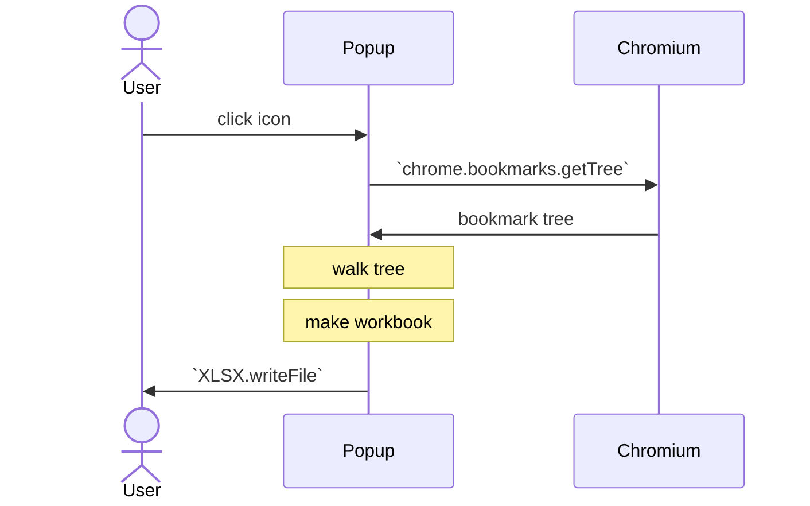
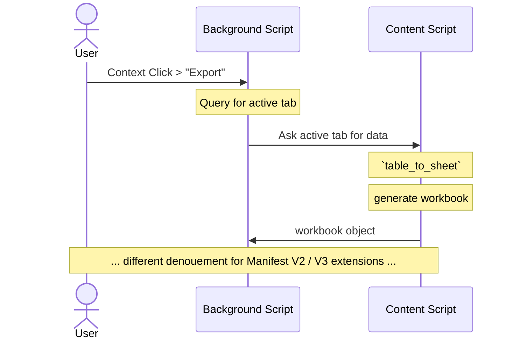
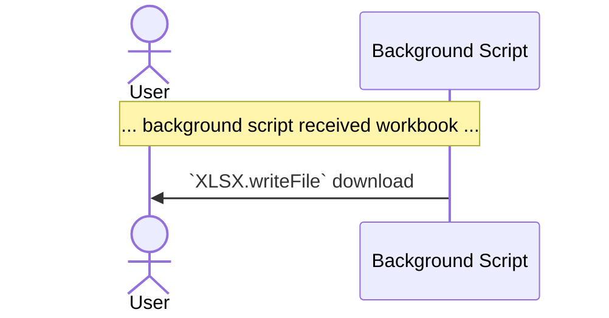
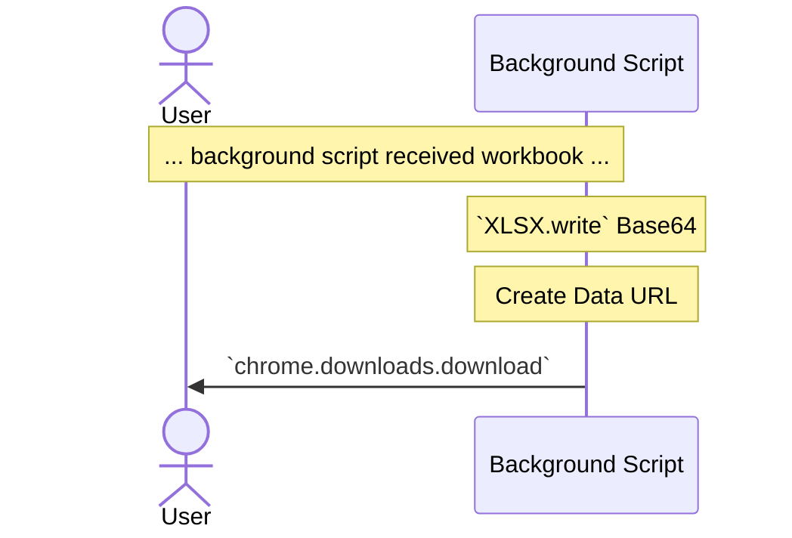

import current from '/version.js';
import Tabs from '@theme/Tabs';
import TabItem from '@theme/TabItem';
import CodeBlock from '@theme/CodeBlock';

The [SheetJS Standalone scripts](/docs/getting-started/installation/standalone)
can be integrated in a Chromium extension.

This demo includes examples for exporting bookmarks from a popup and scraping
tables with a content script and a background script.

[The demo](#demo) includes unpacked extensions for Manifest V2 and Manifest V3.

:::note Tested Deployments

This demo was last tested on 2024 March 30 against Chrome 122.

:::

:::caution pass

This demo showcases Manifest V2 and Manifest V3 extensions.

Chrome Web Store will not accept new V2 extensions, but these can be sideloaded
using the "Load unpacked" extension option in Developer mode.

**New Chrome and Chromium Extensions should use Manifest V3!**

:::

## Loading SheetJS Scripts

SheetJS libraries should be bundled in the extension. For path purposes, it is
strongly recommended to place `xlsx.full.min.js` in the root folder.

#### Popup Pages

In Manifest V2 and Manifest V3 extensions, popup pages can load the standalone
script using a normal `<script>` tag:

```html
<script type="text/javascript" src="xlsx.full.min.js"></script>
```

#### Content Scripts

In Manifest V2 and Manifest V3 extensions, the standalone script can be loaded
through the `content_scripts` field:

```js
  /* in manifest.json v2 or v3 */
  "content_scripts": [{
    "matches": ["<all_urls>"],
    "js": ["xlsx.full.min.js", "content.js"],
    "run_at": "document_end"
  }],
```

The `XLSX` global will be visible to other content scripts.

#### Background Scripts

In Manifest V2 extensions, if the standalone script is added as a background
script, other background scripts will be able to access the `XLSX` global!

```js
  /* in manifest.json v2 only! */
  "background": {
    "scripts": ["xlsx.full.min.js", "table.js"],
    "persistent": false
  },
```

In Manifest V3 extensions, background service workers can load the standalone
script through `importScripts`:

```js
/* assuming background script is in the same folder as xlsx.full.min.js */
importScripts("./xlsx.full.min.js");
// now XLSX will be available
```

## Relevant Operations

The official documentation covers details including required permissions.

### Generating Downloads

#### Manifest V2

The `writeFile` function works in a Chrome or Chromium extension:

```js
XLSX.writeFile(wb, "export.xlsx");
```

Under the hood, it uses the `chrome.downloads` API.  `"downloads"` permission
should be set in `manifest.json`.

#### Manifest V3

In a background service worker, `URL.createObjectURL` is unavailable. Instead,
`XLSX.write` can generate a Base64 string for a synthetic URL:

```js
/* generate Base64 string */
const b64 = XLSX.write(wb, {bookType: "xlsx", type: "base64"});
chrome.downloads.download({
  /* make a base64 url manually */
  url: `data:application/octet-stream;base64,${b64}`,
  filename: `SheetJSTables.xlsx`
});
```

### Content Script Table Scraping

`table_to_book` and `table_to_sheet` can help build workbooks from DOM tables:

```js
var tables = document.getElementsByTagName("table");
var wb = XLSX.utils.book_new();
for(var i = 0; i < tables.length; ++i) {
  var ws = XLSX.utils.table_to_sheet(tables[i]);
  XLSX.utils.book_append_sheet(wb, ws, "Table" + i);
}
```

## Demo

The demo extension includes multiple features to demonstrate sample usage.
Production extensions should include proper error handling.

<Tabs>
  <TabItem name="zip" value="Prepared Extension">

1) Download the zip for the desired Manifest version:

- [Manifest V2](pathname:///chromium/SheetJSChromiumUnpackedV2.zip)
- [Manifest V3](pathname:///chromium/SheetJSChromiumUnpackedV3.zip)

2) Open `chrome://extensions/` in the browser and enable Developer mode

3) Drag and drop the downloaded zip file into the window.

  </TabItem>
  <TabItem name="crx" value="Extension from Scratch">

1) Create a new extension using `create-chrome-ext`[^1]:

```bash
npm create chrome-ext@latest sheetjs-crx -- --template vanilla-ts
cd sheetjs-crx
npm install
```

2) Edit the highlighted lines in `package.json`:

```js title="package.json" (edit highlighted lines)
{
  "name": "sheetjs-crx",
  // highlight-next-line
  "displayName": "SheetJS Demo",
  "version": "0.0.0",
  "author": "**",
  // highlight-next-line
  "description": "Sample Extension using SheetJS to interact with Chrome",
```

3) Edit `manifest.ts` and add to the `permissions` array:

```ts title="manifest.ts"
  permissions: ['sidePanel', 'storage',
    "activeTab",
    "bookmarks",
    "contextMenus",
    "downloads",
    "tabs"
  ],
```

4) Install the SheetJS dependency and start the dev server:

<CodeBlock language="bash">{`\
curl -o ./public/img/logo-48.png https://docs.sheetjs.com/logo.png
npm i --save https://cdn.sheetjs.com/xlsx-${current}/xlsx-${current}.tgz
npm run dev`}
</CodeBlock>

The build step will create a `build` subfolder.

5) Replace `src/popup/index.ts` with the following codeblock:

```ts title="src/popup/index.ts"
import { version, utils, writeFileXLSX } from 'xlsx';
import './index.css'

/* recursively walk the bookmark tree */
const recurse_bookmarks = (data, tree, path) => {
  if(tree.url) data.push({Name: tree.title, Location: tree.url, Path:path});
  var T = path ? (path + "::" + tree.title) : tree.title;
  (tree.children||[]).forEach(function(C) { recurse_bookmarks(data, C, T); });
};

const export_bookmarks = () => {
  chrome.bookmarks.getTree(function(res) {
    var data = [];
    res.forEach(function(t) { recurse_bookmarks(data, t, ""); });

    /* create worksheet */
    var ws = utils.json_to_sheet(data, { header: ['Name', 'Location', 'Path'] });

    /* create workbook and export */
    var wb = utils.book_new();
    utils.book_append_sheet(wb, ws, 'Bookmarks');
    writeFileXLSX(wb, "bookmarks.xlsx");
  });
};

document.addEventListener('DOMContentLoaded', () => {
  const root = document.getElementById('app')!

  const xprt = document.createElement("button"); // sjsdownload
  xprt.type = "button"; xprt.innerHTML = "Export Bookmarks";
  root.appendChild(xprt);
  xprt.addEventListener("click", export_bookmarks);

  const vers = document.createElement("a");
  vers.innerHTML = "SheetJS " + version;
  root.appendChild(vers);
  vers.addEventListener("click", () => { chrome.tabs.create({url: "https://sheetjs.com/"}); });
});
```

6) Replace `src/background/index.ts` with the following codeblock:

```ts title="src/background/index.ts"
chrome.runtime.onInstalled.addListener(function() {
  chrome.contextMenus.create({
    type: "normal",
    id: "sjsexport",
    title: "Export Table to XLSX",
    contexts: ["page", "selection"]
  });
  chrome.contextMenus.create({
    type: "normal",
    id: "sj5export",
    title: "Export All Tables in Page",
    contexts: ["page", "selection"]
  });
  chrome.contextMenus.onClicked.addListener(function(info/*, tab*/) {
    var mode = "";
    switch(info.menuItemId) {
      case 'sjsexport': mode = "JS"; break;
      case 'sj5export': mode = "J5"; break;
      default: return;
    }
    chrome.tabs.query({active: true, currentWindow: true}, function(tabs){
      chrome.tabs.sendMessage(tabs[0].id, {Sheet:mode}, sjsexport_cb);
    });
  });

  chrome.contextMenus.create({
    id: "sjsabout",
    title: "About",
    contexts: ["browser_action"]
  });
  chrome.contextMenus.onClicked.addListener(function(info/*, tab*/) {
    if(info.menuItemId !== "sjsabout") return;
    chrome.tabs.create({url: "https://sheetjs.com/"});
  });
});

function sjsexport_cb(wb) {
  if(!wb || !wb.SheetNames || !wb.Sheets) { return alert("Error in exporting table"); }
  const b64 = XLSX.write(wb, {bookType: "xlsx", type: "base64"});
  chrome.downloads.download({
    url: `data:application/octet-stream;base64,${b64}`,
    filename: `SheetJSTables.xlsx`
  })
}
```

7) Replace `src/contentScript/index.ts` with the following codeblock:

```ts title="src/contentScript/index.ts"
import { utils } from 'xlsx';
var coords = [0,0];
document.addEventListener('mousedown', function(mouse) {
  if(mouse && mouse.button == 2) coords = [mouse.clientX, mouse.clientY];
});

chrome.runtime.onMessage.addListener(function(msg, sender, cb) {
  if(!msg || !msg['Sheet']) return;
  if(msg.Sheet == "JS") {
    var elt = document.elementFromPoint(coords[0], coords[1]);
    while(elt != null) {
      if(elt.tagName.toLowerCase() == "table") return cb(utils.table_to_book(elt));
      elt = elt.parentElement;
    }
  } else if(msg.Sheet == "J5") {
    var tables = document.getElementsByTagName("table");
    var wb = utils.book_new();
    for(var i = 0; i < tables.length; ++i) {
      var ws = utils.table_to_sheet(tables[i]);
      utils.book_append_sheet(wb, ws, "Table" + i);
    }
    return cb(wb);
  }
  cb(coords);
});
```

8) Open `chrome://extensions/` in the browser and enable Developer mode

9) Click "Load unpacked" and select the `build` folder within the project.

  </TabItem>
</Tabs>

### Bookmark Exporter

<details open>
  <summary><b>Testing</b> (click to hide)</summary>

0) Open https://sheetjs.com in the browser and create a bookmark.

1) Click the Extensions icon (puzzle icon to the right of the address bar) and
select "SheetJS Demo".

2) If a small popup is not displayed, click on the SheetJS icon

3) Click "Export Bookmarks" and click "Save". Open the downloaded file!

</details>



`chrome.bookmarks` API enables bookmark tree traversal.  The "Export Bookmarks"
button in the extension pop-up recursively walks the bookmark tree, pushes the
bookmark URLs into a data array, and exports into a simple spreadsheet.

```js
/* walk the bookmark tree */
function recurse_bookmarks(data, tree) {
  if(tree.url) data.push({Name: tree.title, Location: tree.url});
  (tree.children||[]).forEach(function(child) { recurse_bookmarks(data, child); });
}

/* get bookmark data */
chrome.bookmarks.getTree(function(res) {
  /* load into an array */
  var data = [];
  res.forEach(function(t) { recurse_bookmarks(data, t); });

  /* create worksheet */
  var ws = XLSX.utils.json_to_sheet(data, { header: ['Name', 'Location'] });

  /* create workbook and export */
  var wb = XLSX.utils.book_new();
  XLSX.utils.book_append_sheet(wb, ws, 'Bookmarks');
  XLSX.writeFile(wb, "bookmarks.xlsx");
});
```

### Table Exporter

<details open>
  <summary><b>Testing</b> (click to hide)</summary>

1) Open https://sheetjs.com/demo/table in the browser.

2) Right-click anywhere in the page and select "SheetJS Demo" > "Export All Tables in Page"

3) Save and open the downloaded file!

</details>

The background script configures a context menu with the option to export data.
The flow diagrams show the data flow when the user chooses to export. They
differ in the denouement



#### Manifest V2

For Manifest V2 extensions, `XLSX.writeFile` just works:



#### Manifest V3

For Manifest V3 extensions, since `URL.createObjectURL` is not available in
background service workers, a synthetic URL is created:



[^1]: See the [`create-chrome-ext` package](https://github.com/guocaoyi/create-chrome-ext) for more details.