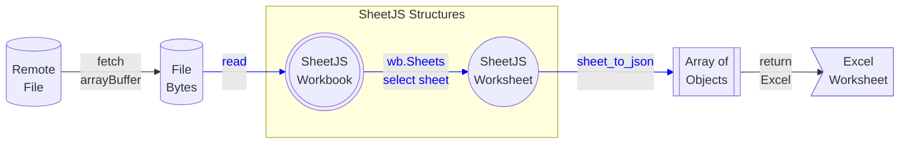

import current from '/version.js';
import CodeBlock from '@theme/CodeBlock';

:::info pass

This demo focuses on the Excel JavaScript API.

For reading and writing Excel spreadsheets, [other demos](/docs/demos/) cover a
wide variety of use cases and deployments.

:::

[SheetJS](https://sheetjs.com) is a JavaScript library for reading and writing
data from spreadsheets.

Office 2016 introduced a JavaScript API for interacting with the application.
It offers solutions for custom functions as well as task panes.

Excel currently does not provide support for working with Apple Numbers files
and some legacy file formats. SheetJS fills the gap.

In the ["Complete Demo"](#complete-demo), we'll create a new custom function
`SHEETJS.EXTERN()` which tries to fetch an external spreadsheet and insert the
data into the worksheet.


:::note Tested Deployments

This demo was last tested on 2024 August 11 against Excel 365 (version 2407).

:::

:::caution Excel Bugs

There was a binary data bug affecting `fetch` and Excel.  It was resolved in
version 2303. It is strongly encouraged to upgrade to the latest version of
Excel 365 before running the demo.

:::

:::danger Telemetry

The Office Add-in CLI collects telemetry by default. It can be disabled:

```js
npx office-addin-usage-data off
```

The setting can be verified by running:

```js
npx office-addin-usage-data list
```

:::

## Integration Details

The [SheetJS NodeJS module](/docs/getting-started/installation/nodejs) can be
imported from scripts in an Excel Custom Functions project.

The [`sheet_to_json`](/docs/api/utilities/array#array-output) helper function
can generate arrays of arrays of values based on the worksheet data. Excel
custom functions transparently treat arrays of arrays as Dynamic Arrays.

This example fetches a file using the `fetch` API, parses the binary data using
the SheetJS `read`[^1] method and returns data from the first worksheet.



```js title="src\functions\functions.js"
const XLSX = require("xlsx");

/**
 * Download file and write data
 * @customfunction
 * @param {string} url URL to fetch and parse
 * @returns {any[][]} Worksheet data
 */
export async function extern(url) {
  try {
    /* Fetch Data */
    const res = await fetch(url);

    /* Get Data */
    const ab = await res.arrayBuffer();

    /* Parse Data */
    const wb = XLSX.read(ab);

    /* Translate Data */
    const ws = wb.Sheets[wb.SheetNames[0]]; // get first worksheet
    const aoa = XLSX.utils.sheet_to_json(ws, { header: 1 }); // array of arrays

    /* Return Data */
    return aoa;
  } catch(e) { return [[e.message || e]]; } // pass error back to Excel
}
```

## Complete Demo

0) Clear the functions cache.  For the tested version of Excel:

- Open File Explorer
- Select the address bar and enter `%LOCALAPPDATA%\Microsoft\Office\16.0\Wef`
- Delete the `CustomFunctions` folder (if it exists) and empty Recycle Bin.

:::caution pass

**This will delete all custom functions associated with the user account!**

To preserve the custom functions on the user account, rename the existing folder
to `CustomFunctionsBackup` before testing and rename back to `CustomFunctions`
after testing is finished.

:::

1) Install [NodeJS LTS](https://nodejs.org/en/download/).

2) After installing NodeJS, launch a new PowerShell window.

3) Disable telemetry:

```bash
npx office-addin-usage-data off
```

4) Install dependencies:

```bash
npm i -g yo bower generator-office
```

### Creating a new Add-in

5) Run the generator:

```bash
npx yo office
```

The generator will ask a few questions:

- "Choose a project type": "Excel Custom Functions using a Shared Runtime"

- "Choose a script type": "JavaScript",

- "What do you want to name your add-in?": "SheetJSImport"

The generator will create the project and install dependencies.

6) Start the development process:

```bash
cd SheetJSImport
npm run build
npm start
```

If prompted to `Allow localhost loopback for Microsoft Edge WebView`, type
<kbd>N</kbd> and press Enter.

If prompted to install "Developer CA for Microsoft Office Add-ins" certificate,
select "Yes"

If Windows Firewall prompts to allow Node.js on private networks, select "Yes"
A new terminal window running NodeJS will be created. Keep the window open.

A new Excel window with the loaded add-in will launch.

:::caution pass

In some tests, the taskpane showed an error:

```
Script error.
```

[Webview2](https://developer.microsoft.com/en-us/microsoft-edge/webview2/)
should be installed manually.

:::

7) In `manifest.xml` , search for `Functions.Namespace` . There will be an XML
element with name `bt:String`. Change the `DefaultValue` attribute to `SHEETJS`:

```xml title="manifest.xml (change highlighted line)"
      <bt:ShortStrings>
// highlight-next-line
        <bt:String id="Functions.Namespace" DefaultValue="SHEETJS"/>
        <bt:String id="GetStarted.Title" DefaultValue="Get started with your sample add-in!" />
```


8) Close the Excel window and the terminal window. Do not save the XLSX file.

9) In the PowerShell window, start the development process again:

```bash
npm start
```

### Integrating the SheetJS Library

10) Install the SheetJS library in the project

<CodeBlock language="bash">{`\
npm i --save https://cdn.sheetjs.com/xlsx-${current}/xlsx-${current}.tgz`}
</CodeBlock>

11) Replace `src\functions\functions.js` with the following:

```js title="src\functions\functions.js"
var XLSX = require("xlsx");

/**
 * Print SheetJS Library Version
 * @customfunction
 * @returns {string[][]} The SheetJS Library Version.
 */
export function version() {
  return [[XLSX.version]];
}
```

12) Close the terminal window and the Excel window. Do not save the Excel file.

13) In the PowerShell window, start the development process again:

```bash
npm start
```

14) In the new Excel window, enter the formula `=SHEETJS.VERSION()` in cell
`E1`. You should see something similar to the following screenshot:


This indicates that the SheetJS library has been loaded.

### Fetching Files from the Internet

15) Add the following code snippet to `src\functions\functions.js` and save:

```js title="src\functions\functions.js (add to end)"
/**
 * Download file and write data
 * @customfunction
 * @param {string} url URL to fetch and parse
 * @returns {any[][]} Worksheet data
 */
export async function extern(url) {
  try {
    /* Fetch Data */
    const res = await fetch(url);

    /* Get Data */
    const ab = await res.arrayBuffer();

    /* Parse Data */
    var wb = XLSX.read(ab);

    /* get and return data */
    var ws = wb.Sheets[wb.SheetNames[0]]; // get first worksheet
    var aoa = XLSX.utils.sheet_to_json(ws, { header: 1 }); // get data as array of arrays
    return aoa;
  } catch(e) { return [[e.message || e]]; } // pass error back to Excel
}
```

16) Close the terminal window and the Excel window (do not save the Excel file).

17) In the PowerShell window, start the development process again:

```bash
npm start
```

18) Enter the text `https://docs.sheetjs.com/pres.numbers` in cell `D1`. Enter
the formula `=SHEETJS.EXTERN(D1)` in cell `D2` and press Enter.

Excel should pull in the data and generate a dynamic array. The worksheet should
match the screenshot at the top of this page.

:::tip pass

[SheetJS Pro](https://sheetjs.com/pro) offers additional features that can be
used in Excel Custom Functions and Add-ins.

:::

[^1]: See [`read` in "Reading Files"](/docs/api/parse-options)
