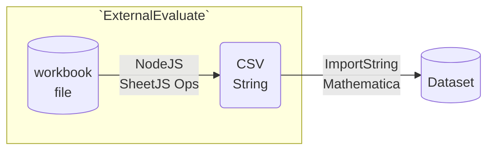
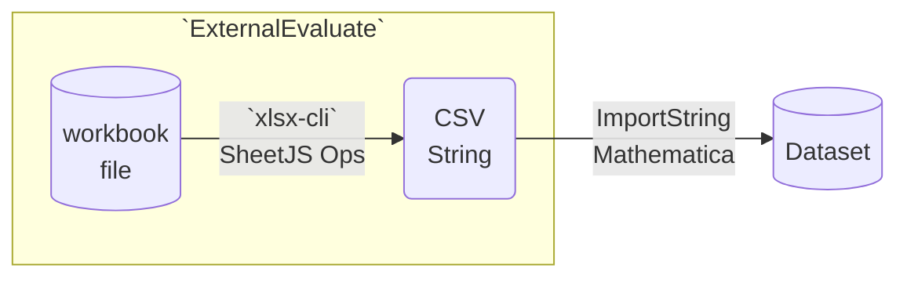

import current from '/version.js';
import Tabs from '@theme/Tabs';
import TabItem from '@theme/TabItem';
import CodeBlock from '@theme/CodeBlock';

[Mathematica](https://mathematica.com) is a software system for mathematics and
scientific computing. It supports command-line tools and JavaScript extensions.

[SheetJS](https://sheetjs.com) is a JavaScript library for reading and writing
data from spreadsheets.

This demo uses SheetJS to pull data from a spreadsheet for further analysis
within Mathematica. We'll explore how to run an external tool to generate CSV
data from opaque spreadsheets and parse the data from Mathematica.

:::note Tested Deployments

This demo was tested by SheetJS users in the following deployments:

| Architecture | Version | Date       |
|:-------------|:--------|:-----------|
| `darwin-x64` | `14.0`  | 2024-06-05 |
| `win10-x64`  | `14.0`  | 2024-06-05 |

:::

## Integration Details

The [SheetJS NodeJS module](/docs/getting-started/installation/nodejs) can be
loaded in NodeJS scripts, including scripts invoked using the `"NodeJS"` mode
of the `ExternalEvaluate`[^1] Mathematica function.

However, the current cross-platform recommendation involves a dedicated command
line tool that leverages SheetJS libraries to to perform spreadsheet processing.

### External Engines

The following diagram depicts the workbook waltz:



_Mathematica_

NodeJS can be activated from Mathematica using `RegisterExternalEvaluator`[^2].
Once activated, JavaScript code can be run using `ExternalEvaluate`[^3]. If the
NodeJS code returns CSV data, `ImportString`[^4] can generate a `Dataset`[^5].

_SheetJS_

For a file residing on the filesystem, the SheetJS `readFile` function[^6] can
generate a workbook object. The exact location can be determined by printing
`require("process").cwd()`[^7] in `ExternalEvaluate`:

```mathematica
In[1]:= ExternalEvaluate["NodeJS", "require('process').cwd()"]
Out[1]= "C:\Users\Me\Documents"
```

After pulling the first worksheet[^8], the SheetJS `sheet_to_csv` function[^9]
generates a CSV string.

_Complete Function_

The following function reads a file, parses the first worksheet and returns a
Dataset object assuming one header row.

<Tabs groupId="os">
  <TabItem value="unix" label="Linux/MacOS">

```mathematica title="SheetJSImportFileEE"
(* Import file stored in the Documents folder (e.g. C:\Users\Me\Documents) *)
SheetJSImportFileEE[filename_]:=Module[{csv}, (
  (* This was required in local testing *)
  RegisterExternalEvaluator["NodeJS","/usr/local/bin/node"];

  (* Generate CSV from first sheet *)
  csv:=ExternalEvaluate["NodeJS", StringJoin[
    (* module installed in home directory *)
    "var XLSX = require('xlsx');",
    (* read specified filename *)
    "var wb = XLSX.readFile('",filename,"');",
    (* grab first worksheet *)
    "var ws = wb.Sheets[wb.SheetNames[0]];",
    (* convert to CSV *)
    "XLSX.utils.sheet_to_csv(ws)"
  ]];

  (* Parse CSV into a dataset *)
  Return[ImportString[csv, "Dataset", "HeaderLines"->1]];
)]
```

  </TabItem>
  <TabItem value="win" label="Windows">

```mathematica title="SheetJSImportFileEE"
(* Import file stored in the Documents folder (e.g. C:\Users\Me\Documents) *)
SheetJSImportFileEE[filename_]:=Module[{csv}, (
  (* This was required in local testing *)
  RegisterExternalEvaluator["NodeJS","C:\\Program Files\\nodejs\\node.exe"];

  (* Generate CSV from first sheet *)
  csv:=ExternalEvaluate["NodeJS", StringJoin[
    (* module installed in home directory *)
    "var XLSX = require('xlsx');",
    (* read specified filename *)
    "var wb = XLSX.readFile('",filename,"');",
    (* grab first worksheet *)
    "var ws = wb.Sheets[wb.SheetNames[0]];",
    (* convert to CSV *)
    "XLSX.utils.sheet_to_csv(ws)"
  ]];

  (* Parse CSV into a dataset *)
  Return[ImportString[csv, "Dataset", "HeaderLines"->1]];
)]
```

  </TabItem>
</Tabs>


### Command-Line Tools

The ["Command-Line Tools" demo](/docs/demos/cli) creates `xlsx-cli`, a
command-line tool that reads a spreadsheet file and generates CSV rows from the
first worksheet.

`ExternalEvaluate`[^10] can run command-line tools and capture standard output.
The following snippet processes `~/Downloads/pres.numbers` and pulls CSV data
into a variable in Mathematica:

```mathematica
cmd = "/usr/local/bin/xlsx-cli ~/Downloads/pres.numbers"
csvdata = ExternalEvaluate["Shell" -> "StandardOutput", cmd];
```

`ImportString`[^11] can interpret the CSV data as a `Dataset`[^12]. Typically the
first row of the CSV output is the header row. The `HeaderLines`[^13] option
controls how Mathematica parses the data:

```mathematica
data = ImportString[csvdata, "Dataset", "HeaderLines" -> 1]
```

The following diagram depicts the workbook waltz:



## Complete Demo

This demo tests the NodeJS external engine and dedicated command line tools.

### NodeJS Engine

0) Install NodeJS. When the demo was tested, version `20.14.0` was installed.

1) Install dependencies in the Home folder (`~` or `$HOME` or `%HOMEPATH%`):

<CodeBlock language="bash">{`\
npm i --save https://cdn.sheetjs.com/xlsx-${current}/xlsx-${current}.tgz zeromq@6.0.0-beta.19`}
</CodeBlock>

2) Open a new Mathematica Notebook and register NodeJS. When the example was
tested in Windows, the commands were:

<Tabs groupId="os">
  <TabItem value="unix" label="Linux/MacOS">

```mathematica
RegisterExternalEvaluator["NodeJS","/usr/local/bin/node"]
FindExternalEvaluators["NodeJS"]
```

The second argument to `RegisterExternalEvaluator` should be the path to the
`node` program, which can be found by running the following command in a new
terminal window:

```bash
which node
```

  </TabItem>
  <TabItem value="win" label="Windows">

```mathematica
RegisterExternalEvaluator["NodeJS","C:\\Program Files\\nodejs\\node.exe"]
FindExternalEvaluators["NodeJS"]
```

The second argument to `RegisterExternalEvaluator` should be the path to the
`node.exe` program, which can be found by running the following command in a new
PowerShell window:

```powershell
Get-Command node.exe
```

  </TabItem>
</Tabs>

If NodeJS is registered, the value in the "Registered" column will be "True".

4) To determine the base folder, run `require("process").cwd()` from NodeJS:

```mathematica
ExternalEvaluate["NodeJS", "require('process').cwd()"]
```

5) Download [`pres.numbers`](https://docs.sheetjs.com/pres.numbers) and move
the file to the base folder as shown in the previous step.

3) Copy, but do not run, the following snippet into the running notebook:

<Tabs groupId="os">
  <TabItem value="unix" label="Linux/MacOS">

```mathematica title="SheetJSImportFileEE"
(* Import file stored in the Documents folder (e.g. C:\Users\Me\Documents) *)
SheetJSImportFileEE[filename_]:=Module[{csv}, (
  (* This was required in local testing *)
  /* highlight-next-line */
  RegisterExternalEvaluator["NodeJS","/usr/local/bin/node"];

  (* Generate CSV from first sheet *)
  csv:=ExternalEvaluate["NodeJS", StringJoin[
    (* module installed in home directory *)
    "var XLSX = require('xlsx');",
    (* read specified filename *)
    "var wb = XLSX.readFile('",filename,"');",
    (* grab first worksheet *)
    "var ws = wb.Sheets[wb.SheetNames[0]];",
    (* convert to CSV *)
    "XLSX.utils.sheet_to_csv(ws)"
  ]];

  (* Parse CSV into a dataset *)
  Return[ImportString[csv, "Dataset", "HeaderLines"->1]];
)]
```

  </TabItem>
  <TabItem value="win" label="Windows">

```mathematica title="SheetJSImportFileEE"
(* Import file stored in the Documents folder (e.g. C:\Users\Me\Documents) *)
SheetJSImportFileEE[filename_]:=Module[{csv}, (
  (* This was required in local testing *)
  /* highlight-next-line */
  RegisterExternalEvaluator["NodeJS","C:\\Program Files\\nodejs\\node.exe"];

  (* Generate CSV from first sheet *)
  csv:=ExternalEvaluate["NodeJS", StringJoin[
    (* module installed in home directory *)
    "var XLSX = require('xlsx');",
    (* read specified filename *)
    "var wb = XLSX.readFile('",filename,"');",
    (* grab first worksheet *)
    "var ws = wb.Sheets[wb.SheetNames[0]];",
    (* convert to CSV *)
    "XLSX.utils.sheet_to_csv(ws)"
  ]];

  (* Parse CSV into a dataset *)
  Return[ImportString[csv, "Dataset", "HeaderLines"->1]];
)]
```

  </TabItem>
</Tabs>

After pasting, edit the highlighted line to reflect the path of the `node` or
`node.exe` binary. This path was discovered in Step 2.

After editing the snippet, run the expression.

7) Run the function and confirm the result is a proper Dataset:

```mathematica
SheetJSImportFileEE["pres.numbers"]
```


### Standalone Binary

8) Create the standalone `xlsx-cli` binary[^14]. The commands should be run in a
Terminal or PowerShell window:

<CodeBlock language="bash">{`\
npm i --save https://cdn.sheetjs.com/xlsx-${current}/xlsx-${current}.tgz exit-on-epipe commander@2
curl -LO https://docs.sheetjs.com/cli/xlsx-cli.js
npx -y nexe -t 14.15.3 xlsx-cli.js`}
</CodeBlock>

<Tabs groupId="os">
  <TabItem value="unix" label="Linux/MacOS">

9) Move the generated `xlsx-cli` to a fixed location in `/usr/local/bin`:

```bash
mkdir -p /usr/local/bin
mv xlsx-cli /usr/local/bin/
```

:::note pass

If there are permission errors, the command should be run with the root user:

```bash
sudo mv xlsx-cli /usr/local/bin/
```

:::

  </TabItem>
  <TabItem value="win" label="Windows">

9) Find the current directory:

```bash
pwd
```

The generated binary will be `xlsx-cli.exe` in the displayed path.

  </TabItem>
</Tabs>

### Reading a Local File

<Tabs groupId="os">
  <TabItem value="unix" label="Linux/MacOS">

10) In a new Mathematica notebook, run the following snippet:

```mathematica title="SheetJSImportFile"
SheetJSImportFile[x_] := ImportString[Block[{Print}, ExternalEvaluate[
  "Shell" -> "StandardOutput",
  // highlight-next-line
  "/usr/local/bin/xlsx-cli " <> x
]], "Dataset", "HeaderLines" -> 1]
```

  </TabItem>
  <TabItem value="win" label="Windows">

10) In a new Mathematica notebook, copy but do not run the following snippet:

```mathematica title="SheetJSImportFile"
SheetJSImportFile[x_] := ImportString[Block[{Print}, ExternalEvaluate[
  "Shell" -> "StandardOutput",
  // highlight-next-line
  "/usr/local/bin/xlsx-cli " <> x
]], "Dataset", "HeaderLines" -> 1]
```

Change `/usr/local/bin/xlsx-cli` in the string to the path to the generated
`xlsx-cli.exe` binary. For example, if the path in step 2 was
`C:\Users\Me\Documents\`, then the code should be:

```mathematica title="SheetJSImportFile"
SheetJSImportFile[x_] := ImportString[Block[{Print}, ExternalEvaluate[
  "Shell" -> "StandardOutput",
  // highlight-next-line
  "C:\\Users\\Me\\Documents\\xlsx-cli.exe " <> x
]], "Dataset", "HeaderLines" -> 1]
```

:::info pass

Mathematica requires the `\` characters must be doubled.

:::

After making the change, run the snippet.

  </TabItem>
</Tabs>

11) Download https://docs.sheetjs.com/pres.numbers and save to Downloads folder:

```bash
cd ~/Downloads/
curl -LO https://docs.sheetjs.com/pres.numbers
```

12) In the Mathematica notebook, run the new function. If the file was saved to
the Downloads folder, the path will be `"~/Downloads/pres.numbers"` in macOS:

<Tabs groupId="os">
  <TabItem value="unix" label="Linux/MacOS">

```mathematica
data = SheetJSImportFile["~/Downloads/pres.numbers"]
```

  </TabItem>
  <TabItem value="win" label="Windows">

On Windows, the absolute path to the file must be used. To find this path, run
the following commands in PowerShell:

```powershell
cd $HOME\Downloads
pwd
```

Append `\\pres.numbers` to the displayed path. For example, if the path was
`C:\Users\Me\Downloads`, the command will be

```mathematica
data = SheetJSImportFile["C:\\Users\\Me\\Downloads\\pres.numbers"]
```

The `\` characters must be doubled.

  </TabItem>
</Tabs>


The result should be displayed in a concise table.


### Reading from a URL

`FetchURL`[^15] downloads a file from a specified URL and returns a path to the
file. This function will be wrapped in a new function called `SheetJSImportURL`.

13) In the same notebook, run the following:

```mathematica title="SheetJSImportURL"
Needs["Utilities`URLTools`"];
SheetJSImportURL[x_] := Module[{path},(
  path = FetchURL[x];
  SheetJSImportFile[path]
)];
```

14) Test by downloading the test file in the notebook:

```mathematica
data = SheetJSImportURL["https://docs.sheetjs.com/pres.numbers"]
```


[^1]: See [the `ExternalEvaluate` Node.js example](https://reference.wolfram.com/language/ref/ExternalEvaluate.html#:~:text=Evaluate%20a%20basic%20math%20function%20in%20JavaScript%20using%20Node.js%3A) in the Mathematica documentation.
[^2]: See [`RegisterExternalEvaluator`](https://reference.wolfram.com/language/ref/RegisterExternalEvaluator.html) in the Mathematica documentation.
[^3]: See [`ExternalEvaluate`](https://reference.wolfram.com/language/ref/ExternalEvaluate.html) in the Mathematica documentation.
[^4]: See [`ImportString`](https://reference.wolfram.com/language/ref/ImportString.html) in the Mathematica documentation.
[^5]: A [`Dataset`](https://reference.wolfram.com/language/ref/Dataset.html) will be created when using the [`"Dataset"` element in `ImportString`](https://reference.wolfram.com/language/ref/format/CSV.html)
[^6]: See [`readFile` in "Reading Files"](/docs/api/parse-options)
[^7]: See [`process.cwd()`](https://nodejs.org/api/process.html#processcwd) in the NodeJS documentation.
[^8]: The `Sheets` and `SheetNames` properties of workbook objects are described in ["Workbook Object"](/docs/csf/book)
[^9]: See [`sheet_to_csv` in "CSV and Text"](/docs/api/utilities/csv#delimiter-separated-output)
[^10]: See [`ExternalEvaluate`](https://reference.wolfram.com/language/ref/ExternalEvaluate.html) in the Mathematica documentation.
[^11]: See [`ImportString`](https://reference.wolfram.com/language/ref/ImportString.html) in the Mathematica documentation.
[^12]: A [`Dataset`](https://reference.wolfram.com/language/ref/Dataset.html) will be created when using the [`"Dataset"` element in `ImportString`](https://reference.wolfram.com/language/ref/format/CSV.html)
[^13]: See [`HeaderLines`](https://reference.wolfram.com/language/ref/HeaderLines.html) in the Mathematica documentation.
[^14]: See ["Command-line Tools"](/docs/demos/cli) for more details.
[^15]: Mathematica 11 introduced new methods including [`URLRead`](https://reference.wolfram.com/language/ref/URLRead.html).