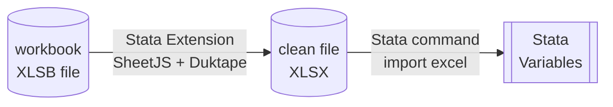
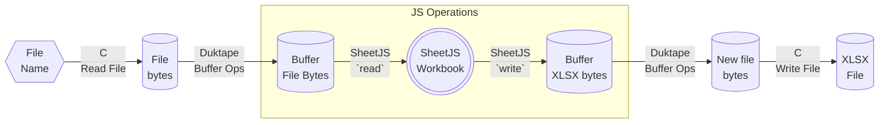

import current from '/version.js';
import Tabs from '@theme/Tabs';
import TabItem from '@theme/TabItem';
import CodeBlock from '@theme/CodeBlock';

export const b = {style: {color:"blue"}};

[Stata](https://www.stata.com/) is a statistical software package. It offers a
robust C-based extension system.

[SheetJS](https://sheetjs.com) is a JavaScript library for reading and writing
data from spreadsheets.

This demo uses SheetJS to pull data from a spreadsheet for further analysis
within Stata. We'll create a Stata native extension that loads the
[Duktape](/docs/demos/engines/duktape) JavaScript engine and uses the SheetJS
library to read data from spreadsheets and converts to a Stata-friendly format.



The demo will read [a Numbers workbook](https://docs.sheetjs.com/pres.numbers) and
generate variables for each column. A sample Stata session is shown below:


:::info pass

This demo covers Stata extensions. For directly processing Stata DTA files, the
["Stata DTA Codec"](/docs/constellation/dta) works in the browser or NodeJS.

:::

:::note Tested Deployments

This demo was tested by SheetJS users in the following deployments:

| Architecture | Date       |
|:-------------|:-----------|
| `darwin-x64` | 2024-04-10 |
| `win10-x64`  | 2024-04-10 |
| `linux-x64`  | 2024-04-25 |

:::

:::info pass

Stata has limited support for processing spreadsheets through the `import excel`
command[^1]. At the time of writing, it lacked support for XLSB, NUMBERS, and
other common spreadsheet formats.

SheetJS libraries help fill the gap by normalizing spreadsheets to a form that
Stata can understand.

:::

## Integration Details

The current recommendation involves a native plugin that reads arbitrary files
and generates clean XLSX files that Stata can import.

The extension function ultimately pairs the SheetJS `read`[^2] and `write`[^3]
methods to read data from the old file and write a new file:

```js
var wb = XLSX.read(original_file_data, {type: "buffer"});
var new_file_data = XLSX.write(wb, {type: "array", bookType: "xlsx"});
```

The extension function `cleanfile` will take one or two arguments:

`plugin call cleanfile, "pres.numbers"` will generate `sheetjs.tmp.xlsx` from
the first argument (`"pres.numbers"`) and print instructions to load the file.

`plugin call cleanfile, "pres.numbers" verbose` will additionally print CSV
contents of each worksheet in the workbook.



### C Extensions

Stata C extensions are shared libraries or DLLs that use special Stata methods
for parsing arguments and returning values.

#### Structure

Arguments are passed to the `stata_call` function in the plugin.[^4] The
function receives the argument count and an array of C strings:

```c title="stata_call declaration"
STDLL stata_call(int argc, char *argv[]);
```

For example, `argc` is 2 and `argv` has two C strings in the following command:

```stata
plugin call cleanfile, "pres.numbers" verbose
* arguments start
* argv[0]               ^^^^^^^^^^^^
* argv[1]                             ^^^^^^^
* argc = 2
```

#### Communication

`SF_display` and `SF_error` display text and error messages respectively.

Message text follows the "Stata Markup and Control Language"[^5].

`{stata ...}` is a special directive that displays the arguments and creates a
clickable link. Clicking the link will run the string.

For example, a plugin may attempt to print a link:

```c title="SF_display C plugin example"
SF_display("{stata import excel \"sheetjs.tmp.xlsx\", firstrow} will read the first sheet and use headers\n");
```

The function will print the following text to the terminal:

<pre>
<span {...b}>import excel "sheetjs.tmp.xlsx", firstrow</span> will read the first sheet and use headers
</pre>

The blue text is clickable. When a user clicks the text, the command
`import excel "sheetjs.tmp.xlsx", firstrow` will be executed.

### Duktape JS Engine

This demo uses the [Duktape JavaScript engine](/docs/demos/engines/duktape). The
SheetJS + Duktape demo covers engine integration details in more detail.

The [SheetJS Standalone scripts](/docs/getting-started/installation/standalone)
can be loaded in Duktape by reading the source from the filesystem.

## Complete Demo

:::info pass

This demo was tested in Windows x64 and macOS x64. The path names and build
commands will differ in other platforms and operating systems.

:::

The [`cleanfile.c`](pathname:///stata/cleanfile.c) extension defines one plugin
function. It can be chained with `import excel`:

```stata
program cleanfile, plugin
plugin call cleanfile, "pres.numbers" verbose
program drop cleanfile
import excel "sheetjs.tmp.xlsx", firstrow
```

### Create Plugin

<Tabs groupId="os">
  <TabItem value="unix" label="Linux/MacOS">

0) Ensure a compatible C compiler (Xcode on macOS) is installed.

1) Open Stata and run the following command:

```stata
pwd
```

The output will be the default data directory. On macOS this is typically
`~/Documents/Stata`

2) Open a terminal window and create a project folder `sheetjs-stata` within the
Stata data directory:

```bash
# `cd` to the Stata data directory
cd ~/Documents/Stata
mkdir sheetjs-stata
cd sheetjs-stata
```

  </TabItem>
  <TabItem value="win" label="Windows">

0) Ensure "Windows Subsystem for Linux" (WSL) and Visual Studio are installed.

1) Open a new "x64 Native Tools Command Prompt" window and create a project
folder `c:\sheetjs-stata`:

```powershell
cd c:\
mkdir sheetjs-stata
cd sheetjs-stata
```

2) Enter WSL:

```powershell
bash
```

  </TabItem>
</Tabs>

3) Download [`stplugin.c`](https://www.stata.com/plugins/stplugin.c) and
[`stplugin.h`](https://www.stata.com/plugins/stplugin.h) from the Stata website:

```bash
curl -LO https://www.stata.com/plugins/stplugin.c
curl -LO https://www.stata.com/plugins/stplugin.h
```

4) Download Duktape. In Windows, the following commands should be run in WSL. In
macOS, the commands should be run in the same Terminal session.

```bash
curl -LO https://duktape.org/duktape-2.7.0.tar.xz
tar -xJf duktape-2.7.0.tar.xz
mv duktape-2.7.0/src/*.{c,h} .
```

5) Download [`cleanfile.c`](https://docs.sheetjs.com/stata/cleanfile.c).

In Windows, the following commands should be run in WSL. In macOS, the commands
should be run in the same Terminal session.

```bash
curl -LO https://docs.sheetjs.com/stata/cleanfile.c
```

<Tabs groupId="os">
  <TabItem value="unix" label="Linux/MacOS">

6) Observe that macOS does not need a "Linux Subsystem" and move to Step 7.

7) Build the plugin:

```bash
gcc -shared -fPIC -DSYSTEM=APPLEMAC stplugin.c duktape.c cleanfile.c -lm -std=c99 -Wall -ocleanfile.plugin
```

  </TabItem>
  <TabItem value="win" label="Windows">

6) Exit WSL:

```bash
exit
```

The window will return to the command prompt.

7) Build the DLL:

```powershell
cl /LD cleanfile.c stplugin.c duktape.c
```

  </TabItem>
</Tabs>

### Install Plugin

<Tabs groupId="os">
  <TabItem value="unix" label="Linux/MacOS">

8) Copy the plugin to the Stata data directory:

```bash
cp cleanfile.plugin ../
```

  </TabItem>
  <TabItem value="win" label="Windows">

8) Copy the DLL to `cleanfile.plugin` in the Stata data directory. For example,
with a shared data directory `c:\data`:

```powershell
mkdir c:\data
copy cleanfile.dll c:\data\cleanfile.plugin
```

  </TabItem>
</Tabs>

### Download SheetJS Scripts

<Tabs groupId="os">
  <TabItem value="unix" label="Linux/MacOS">

9) Move to the Stata data directory:

```bash
cd ..
```

10) Observe that macOS does not need a "Linux Subsystem" and move to Step 11.

  </TabItem>
  <TabItem value="win" label="Windows">

9) Move to the `c:\data` directory:

```powershell
cd c:\data
```

10) Enter WSL

```powershell
bash
```

  </TabItem>
</Tabs>

11) Download SheetJS scripts and the test file.

In Windows, the following commands should be run in WSL. In macOS, the commands
should be run in the same Terminal session.

<CodeBlock language="bash">{`\
curl -LO https://cdn.sheetjs.com/xlsx-${current}/package/dist/shim.min.js
curl -LO https://cdn.sheetjs.com/xlsx-${current}/package/dist/xlsx.full.min.js
curl -LO https://docs.sheetjs.com/pres.numbers`}
</CodeBlock>

### Stata Test

:::note pass

The screenshot in the introduction shows the result of steps 13 - 19

:::

12) If it is not currently running, start the Stata application.

<Tabs groupId="os">
  <TabItem value="unix" label="Linux/MacOS">

13) Run the following command in Stata:

```stata
dir
```

Inspect the output and confirm that `cleanfile.plugin` is listed.

  </TabItem>
  <TabItem value="win" label="Windows">

13) Move to the `c:\data` directory in Stata:

```stata
cd c:\data
```

  </TabItem>
</Tabs>

14) Load the `cleanfile` plugin:

```stata
program cleanfile, plugin
```

16) Read the `pres.numbers` test file:

```stata
plugin call cleanfile, "pres.numbers" verbose
```

The result will show the data from `pres.numbers`:

<pre>
<b>. plugin call cleanfile, "pres.numbers" verbose</b>
Worksheet 0 Name: Sheet1
Name,Index
Bill Clinton,42
GeorgeW Bush,43
Barack Obama,44
Donald Trump,45
Joseph Biden,46

Saved to `sheetjs.tmp.xlsx`
<span {...b}>import excel "sheetjs.tmp.xlsx", firstrow</span> will read the first sheet and use headers
for more help, see <span {...b}>import excel</span>
</pre>

17) Close the plugin:

```stata
program drop cleanfile
```

18) Clear the current session:

```stata
clear
```

<ol start="19"><li><p>In the result of Step 16, click the link on <code><span {...b}>import
excel "sheetjs.tmp.xlsx", firstrow</span></code></p></li></ol>

Alternatively, manually type the command:

```stata
import excel "sheetjs.tmp.xlsx", firstrow
```

The output will show the import result:

<pre>
<b>. import excel "sheetjs.tmp.xlsx", firstrow</b>
(2 vars, 5 obs)
</pre>

20) Open the Data Editor (in Browse or Edit mode) and compare to the screenshot:

```stata
browse Name Index
```


:::info pass

In the terminal version of Stata, `browse` does not work:

```
. browse Name Index
command browse is unrecognized
r(199);
```

The `codebook` command will display details.

<details>
  <summary><b>Expected Output</b> (click to show)</summary>

```
-------------------------------------------------------------------------------
Name                                                                       Name
-------------------------------------------------------------------------------

                  Type: String (str12)

         Unique values: 5                         Missing "": 0/5

            Tabulation: Freq.  Value
                            1  "Barack Obama"
                            1  "Bill Clinton"
                            1  "Donald Trump"
                            1  "GeorgeW Bush"
                            1  "Joseph Biden"

               Warning: Variable has embedded blanks.

-------------------------------------------------------------------------------
Index                                                                     Index
-------------------------------------------------------------------------------

                  Type: Numeric (byte)

                 Range: [42,46]                       Units: 1
         Unique values: 5                         Missing .: 0/5

            Tabulation: Freq.  Value
                            1  42
                            1  43
                            1  44
                            1  45
                            1  46
```

</details>

:::

[^1]: Run `help import excel` in Stata or see ["import excel"](https://www.stata.com/manuals/dimportexcel.pdf) in the Stata documentation.
[^2]: See [`read` in "Reading Files"](/docs/api/parse-options)
[^3]: See [`write` in "Writing Files"](/docs/api/write-options)
[^4]: See ["Creating and using Stata plugins"](https://www.stata.com/plugins/#sect8) in the Stata website
[^5]: run `help smcl` in Stata or see ["smcl"](https://www.stata.com/manuals/psmcl.pdf) in the Stata documentation.