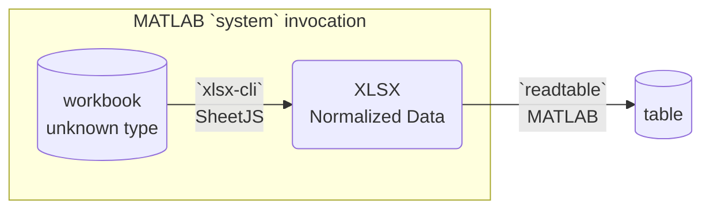
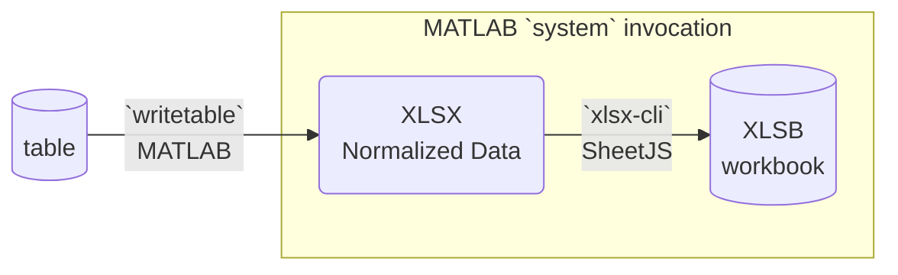
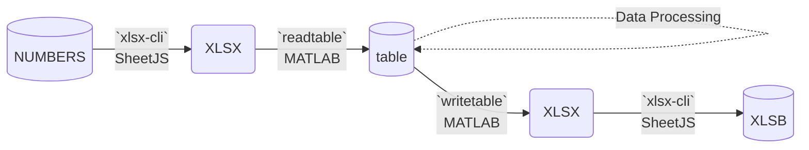

import current from '/version.js';
import CodeBlock from '@theme/CodeBlock';

[MATLAB](https://www.mathworks.com/products/matlab.html) is a numeric computing
platform. It has a native `table` type with limited support for spreadsheets.

[SheetJS](https://sheetjs.com) is a JavaScript library for reading and writing
data from spreadsheets.

This demo uses SheetJS to pull data from a spreadsheet for further analysis
within MATLAB. We'll explore how to run an external tool to convert complex
spreadsheets into simple XLSX files for MATLAB.

:::note Tested Deployments

This demo was tested by SheetJS users in the following deployments:

| Architecture | Version | Date       |
|:-------------|:--------|:-----------|
| `darwin-x64` | R2024a  | 2024-06-09 |
| `win10-x64`  | R2024a  | 2024-06-09 |

:::

:::info pass

MATLAB has limited support for processing spreadsheets through `readtable`[^1]
and `writetable`[^2]. At the time of writing, it lacked support for XLSB,
NUMBERS, and other common spreadsheet formats.

SheetJS libraries help fill the gap by normalizing spreadsheets to a form that
MATLAB can understand.

:::

## Integration Details

:::note pass

MATLAB does not currently provide a way to parse a CSV string or a character
array representing file data. `readtable`, `writetable`, `csvread`, and
`csvwrite` work with the file system directly. `strread` and `textscan` are
designed specifically for reading numbers.

:::

The current recommendation involves a dedicated command-line tool that leverages
SheetJS libraries to to perform spreadsheet processing.

The [SheetJS NodeJS module](/docs/getting-started/installation/nodejs) can be
loaded in NodeJS scripts and bundled in standalone command-line tools.

### Command-Line Tools

The ["Command-Line Tools" demo](/docs/demos/cli) creates `xlsx-cli`, a
command-line tool that reads a spreadsheet file and generates output. The
examples in the "NodeJS" section are able to generate XLSX spreadsheets using
the `--xlsx` command line flag:

```bash
$ xlsx-cli --xlsx ./pres.numbers ## generates pres.numbers.xlsx
```

:::note pass

The command-line tool supports a number of formats including XLSB (`--xlsb`).

:::

The tools pair the SheetJS `readFile`[^3] and `writeFile`[^4] methods to read
data from arbitrary spreadsheet files and convert to XLSX:

```js
const XLSX = require("xlsx"); // load the SheetJS library
const wb = XLSX.readFile("input.xlsb"); // read input.xlsb
XLSX.writeFile(wb, "output.xlsx"); // export to output.xlsx
```

### MATLAB commands

The MATLAB `system` command[^5] can run command-line tools in M-files. For
example, if the `xlsx-cli` tool is placed in the workspace folder and the
test file `pres.numbers` is in the Downloads folder, the following command
generates the XLSX file `pres.numbers.xlsx` :

```matlab
% generate ~/Downloads/pres.numbers.xlsx from ~/Downloads/pres.numbers
system("./xlsx-cli --xlsx ~/Downloads/pres.numbers");
```

:::note pass

In an interactive session, the exclamation point operator `!`[^6] can be used:

```matlab
% generate ~/Downloads/pres.numbers.xlsx from ~/Downloads/pres.numbers
!./xlsx-cli --xlsx ~/Downloads/pres.numbers
```

:::

### Reading Files

Starting from an arbitrary spreadsheet, `xlsx-cli` can generate a XLSX workbook.
Once the workbook is written, the XLSX file can be parsed with `readtable`:

```matlab
% `filename` points to the file to be parsed
filename = "~/Downloads/pres.numbers";
% generate filename+".xlsx"
system("./xlsx-cli --xlsx " + filename)
% read using `readtable`
tbl = readtable(filename + ".xlsx");
```

The following diagram depicts the workbook waltz:



### Write Files

Starting from an MATLAB table, `writetable` can generate a XLSX workbook. Once
the workbook is written, `xlsx-cli` can translate to NUMBERS or other formats:

```matlab
% tbl is the table
tbl = table({"Sheet";"JS"}, [72;62], 'VariableNames', ["Name", "Index"])
% `filename` points to the file to be written
filename = "~/Downloads/sorted.xlsx";
% write using `writetable`
writetable(tbl, filename);
% generate filename+".xlsb"
system("./xlsx-cli --xlsb " + filename);
```

The following diagram depicts the workbook waltz:



## Complete Demo

:::info pass

This demo was tested in macOS.  The path names will differ in other platforms.

:::

This demo processes [`pres.numbers`](https://docs.sheetjs.com/pres.numbers).
There are 3 parts to the demo:

A) "Import": SheetJS tooling will read the test file and generate a clean XLSX
file. MATLAB will read the file using `readtable`.

B) "Process": Using `sortrows`, MATLAB will reverse the table order.

C) "Export": The modified table will be exported to XLSX using `writetable`.
SheetJS tooling will convert the file to XLSB.



1) Create the standalone `xlsx-cli` binary[^7]:

<CodeBlock language="bash">{`\
cd /tmp
npm i --save https://cdn.sheetjs.com/xlsx-${current}/xlsx-${current}.tgz exit-on-epipe commander@2
curl -LO https://docs.sheetjs.com/cli/xlsx-cli.js
npx nexe -t 14.15.3 xlsx-cli.js`}
</CodeBlock>

2) Move the generated `xlsx-cli` to the MATLAB workspace folder. On macOS, this
folder is typically `~/Documents/MATLAB/`:

```bash
mkdir -p ~/Documents/MATLAB/
mv xlsx-cli ~/Documents/MATLAB/
```

3) Download https://docs.sheetjs.com/pres.numbers and save to Downloads folder:

```bash
cd ~/Downloads/
curl -LO https://docs.sheetjs.com/pres.numbers
```

4) Save the following to `SheetJSMATLAB.m` in the workspace folder:

```matlab title="SheetJSMATLAB.m"
% Import data from NUMBERS file
system("./xlsx-cli --xlsx ~/Downloads/pres.numbers");
tbl = readtable("~/Downloads/pres.numbers.xlsx");
% Process data (reverse sort)
sorted = sortrows(tbl,"Index", "descend");
% Export data to XLSB workbook
writetable(sorted,"~/Downloads/sorted.xlsx");
system("./xlsx-cli --xlsb ~/Downloads/sorted.xlsx");
```

5) In a MATLAB desktop session, run the `SheetJSMATLAB` command:

```matlab
>> SheetJSMATLAB
```

It will create the file `sorted.xlsx.xlsb` in the `~/Downloads` folder. Open the
file and confirm that the table is sorted by Index in descending order:

```
Name           Index
Joseph Biden      46
Donald Trump      45
Barack Obama      44
GeorgeW Bush      43
Bill Clinton      42
```

:::tip pass

If the `matlab` command is available on the system `PATH`, the "headless"
version of the command is:

```bash
cd ~/Documents/MATLAB
matlab -batch SheetJSMATLAB
```

:::

[^1]: See [`readtable`](https://www.mathworks.com/help/matlab/ref/readtable.html) in the MATLAB documentation.
[^2]: See [`writetable`](https://www.mathworks.com/help/matlab/ref/writetable.html) in the MATLAB documentation.
[^3]: See [`readFile` in "Reading Files"](/docs/api/parse-options)
[^4]: See [`writeFile` in "Writing Files"](/docs/api/write-options)
[^5]: See [`system`](https://www.mathworks.com/help/matlab/ref/system.html) in the MATLAB documentation.
[^6]: See ["MATLAB Operators and Special Characters](https://www.mathworks.com/help/matlab/matlab_prog/matlab-operators-and-special-characters.html) in the MATLAB documentation.
[^7]: See ["Command-line Tools"](/docs/demos/cli) for more details.

