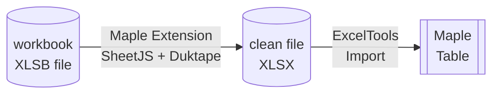
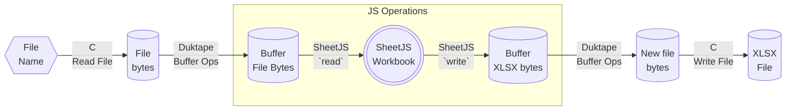

import current from '/version.js';
import CodeBlock from '@theme/CodeBlock';

[Maple](https://www.maplesoft.com/products/Maple/) is a numeric computing
platform. It offers a robust C-based extension system.

[SheetJS](https://sheetjs.com) is a JavaScript library for reading and writing
data from spreadsheets.

This demo uses SheetJS to pull data from a spreadsheet for further analysis
within Maple. We'll create a Maple native extension that loads the
[Duktape](/docs/demos/engines/duktape) JavaScript engine and uses the SheetJS
library to read data from spreadsheets and converts to a Maple-friendly format.



:::note Tested Deployments

This demo was tested by SheetJS users in the following deployments:

| Architecture | Version | Date       |
|:-------------|:--------|:-----------|
| `darwin-x64` | 2024    | 2024-04-25 |
| `win10-x64`  | 2024    | 2024-04-25 |

:::

:::info pass

Maple has limited support for processing spreadsheets through the `ExcelTools`
package[^1]. At the time of writing, it lacked support for XLSB, NUMBERS, and
other common spreadsheet formats.

SheetJS libraries help fill the gap by normalizing spreadsheets to a form that
Maple can understand.

:::

## Integration Details

The current recommendation involves a native plugin that reads arbitrary files
and generates clean XLSX files that Maple can import.

The extension function ultimately pairs the SheetJS `read`[^2] and `write`[^3]
methods to read data from the old file and write a new file:

```js
var workbook = XLSX.read(original_file_data, { type: "buffer" });
var new_file_data = XLSX.write(workbook, { type: "array", bookType: "xlsx" });
```

The extension function will receive a file name and perform the following steps:



### C Extensions

Maple extensions are shared libraries or DLLs that use special Maple methods for
parsing arguments and returning values. They are typically written in the C
programming language.

To simplify the flow, the new function will take one argument (the original file
name) and return one value (the new file name).

The official documentation has a comprehensive list[^4] of methods. For this
demo, the following methods are used:

- `MapleNumArgs` and `IsMapleString` are used in argument validation. The demo
function will raise a Maple exception if no file name is specified.

- `MapleRaiseError` and `MapleRaiseError2` programmatically raise errors.

- `MapleToString` and `ToMapleString` convert between Maple and C strings.

### Duktape JS Engine

This demo uses the [Duktape JavaScript engine](/docs/demos/engines/duktape). The
SheetJS + Duktape demo covers engine integration details in more detail.

The [SheetJS Standalone scripts](/docs/getting-started/installation/standalone)
can be loaded in Duktape by reading the source from the filesystem.

## Complete Demo

:::info pass

This demo was tested in Windows x64. The path names and build commands will
differ in other platforms and operating systems.

:::

The [`sheetjs-maple.c`](pathname:///maple/sheetjs-maple.c) extension exports the
`SheetToXLSX` Maple method. It takes a file name argument, parses the specified
file, exports data to `sheetjsw.xlsx` and returns the string `"sheetjsw.xlsx"`.

This can be chained with `Import` from `ExcelTools`:

```maple
with(ExcelTools);
Import(SheetToXLSX("pres.numbers"))
```

0) Install "Windows Subsystem for Linux" (WSL)[^5] and Visual Studio[^6].

1) Open a new "x64 Native Tools Command Prompt" window and create a project
folder `c:\sheetjs-maple`:

```powershell
cd c:\
mkdir sheetjs-maple
cd sheetjs-maple
```

2) Copy the headers and `lib` files from the Maple folder to the project folder.
For example, using Maple 2024 on Windows x64:

```powershell
copy "C:\Program Files\Maple 2024\extern\include\"*.h .
copy "c:\Program Files\Maple 2024\bin.x86_64_WINDOWS"\*.lib .
```

3) Run `bash` to enter WSL

4) Within WSL, install Duktape:

```bash
curl -LO https://duktape.org/duktape-2.7.0.tar.xz
tar -xJf duktape-2.7.0.tar.xz
mv duktape-2.7.0/src/*.{c,h} .
```

5) Still within WSL, download SheetJS scripts and the test file.

<CodeBlock language="bash">{`\
curl -LO https://cdn.sheetjs.com/xlsx-${current}/package/dist/shim.min.js
curl -LO https://cdn.sheetjs.com/xlsx-${current}/package/dist/xlsx.full.min.js
curl -LO https://docs.sheetjs.com/pres.numbers`}
</CodeBlock>

6) Still within WSL, download the extension C code

```bash
curl -LO https://docs.sheetjs.com/maple/sheetjs-maple.c
```

7) Exit WSL by running `exit`. The window will return to the command prompt.

8) Build the extension DLL:

```powershell
cl -Gz sheetjs-maple.c duktape.c /EHsc -link -dll -out:sheetjs-maple.dll maplec.lib
```

9) Close and re-open Maple, then create a new Maple Worksheet or Document

10) Run the following command in Maple to change the working directory:

```maple
currentdir("c:\\sheetjs-maple");
```

11) Load the `SheetToXLSX` method from the extension:

```maple
with(ExternalCalling):
dll:=ExternalLibraryName("sheetjs-maple"):
SheetToXLSX:=DefineExternal("SheetToXLSX",dll):
```

12) Read the `pres.numbers` test file:

```maple
with(ExcelTools);
Import(SheetToXLSX("pres.numbers"))
```

The result will show the data from `pres.numbers`


[^1]: See ["ExcelTools"](https://www.maplesoft.com/support/help/Maple/view.aspx?path=ExcelTools) in the Maple documentation.
[^2]: See [`read` in "Reading Files"](/docs/api/parse-options)
[^3]: See [`write` in "Writing Files"](/docs/api/write-options)
[^4]: See ["C OpenMaple and ExternalCalling Application Program Interface (API)"](https://www.maplesoft.com/support/help/maple/view.aspx?path=OpenMaple%2FC%2FAPI) in the Maple documentation.
[^5]: In a PowerShell terminal window, run `wsl --install Ubuntu`
[^6]: See [the Visual Studio website](https://visualstudio.microsoft.com/#vs-section) for download links. In the Visual Studio Installer, install the "Desktop development with C++" workflow.