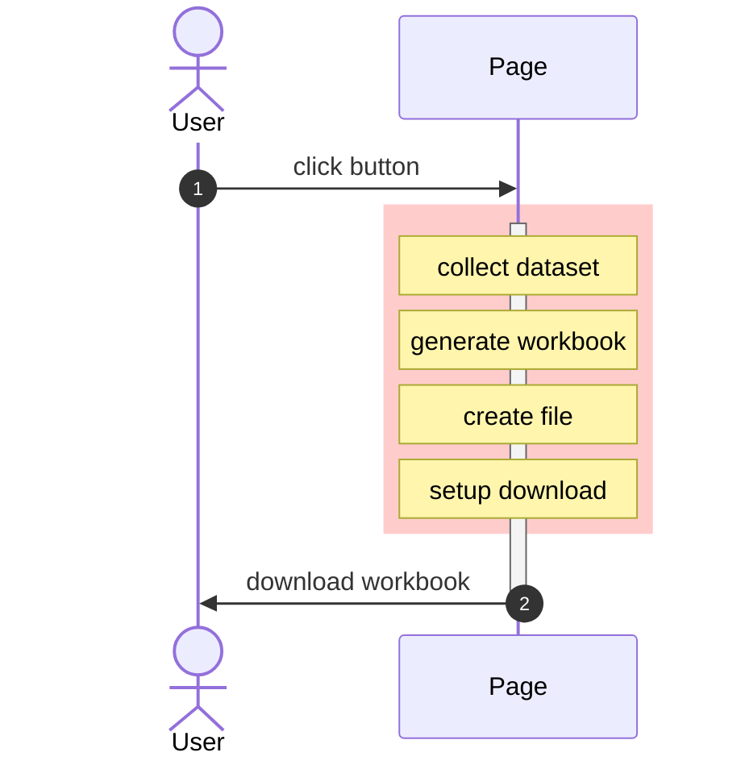
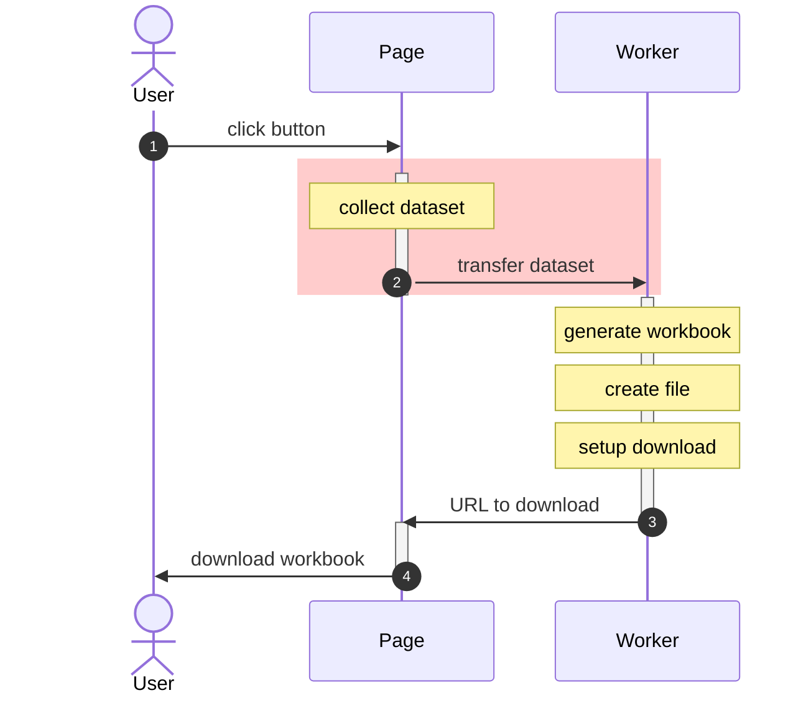
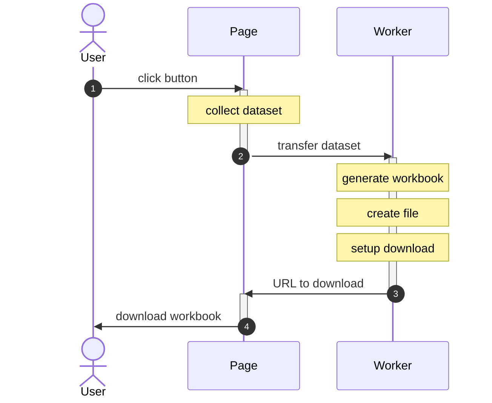
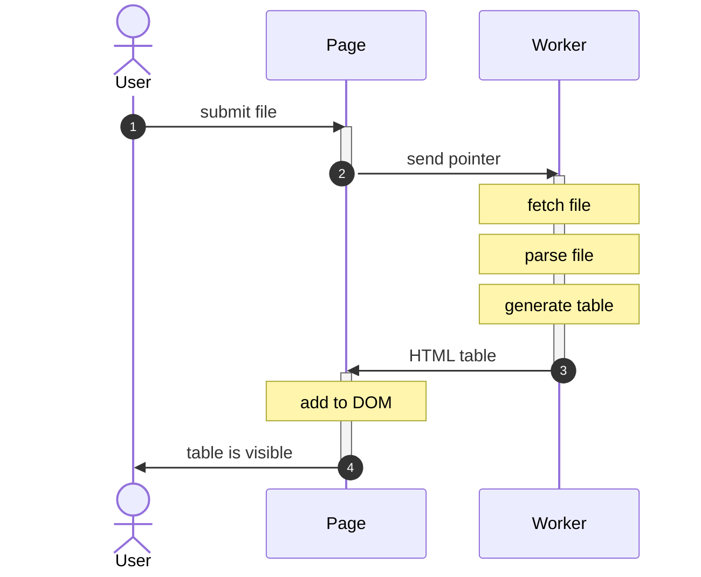
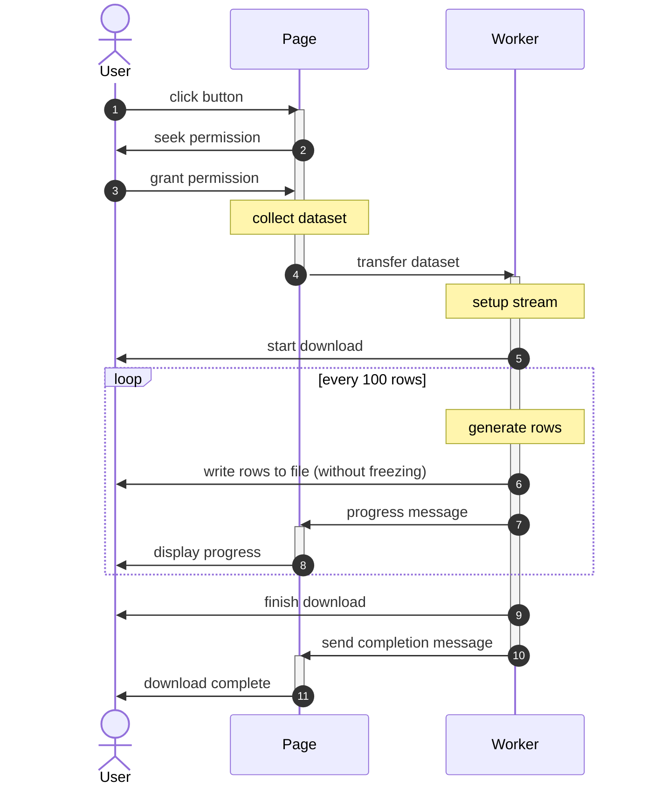

import current from '/version.js';
import CodeBlock from '@theme/CodeBlock';

Parsing and writing large spreadsheets takes time. During the process, if the
SheetJS library is running in the web browser, the website may freeze.

Workers provide a way to off-load the hard work so that the website does not
freeze during processing. The work is still performed locally. No data is sent
to a remote server.

The following diagrams show the normal and Web Worker flows when exporting a
dataset. The regions with a red background mark when the browser is frozen.

<table>
  <thead><tr><th>Normal Export</th><th>Web Worker Export</th></tr></thead>
  <tbody><tr><td>



</td><td>



</td></tr></tbody></table>


:::note Browser Compatibility

IE10+ and modern browsers support basic Web Workers. Some APIs like `fetch` were
added later. Feature testing is strongly recommended.

:::

:::info Inline Workers

Due to limitations of the live code blocks, all of the workers in this section
are in-line. The code is embedded in template literals. For production sites,
typically workers are written in separate JS files.

<details>
  <summary><b>Example</b> (click to show)</summary>

For example, an in-line worker like

<CodeBlock language="js">{`\
  const worker = new Worker(URL.createObjectURL(new Blob([\`\\
/* load standalone script from CDN */
importScripts("https://cdn.sheetjs.com/xlsx-${current}/package/dist/xlsx.full.min.js");
\n\
/* this callback will run once the main context sends a message */
self.addEventListener('message', (e) => {
  /* Pass the version string back  */
  postMessage({ version: XLSX.version });
}, false);
  \`])));`}
</CodeBlock>

would typically be stored in a separate JS file like "worker.js":

<CodeBlock language="js" title="worker.js">{`\
/* load standalone script from CDN */
importScripts("https://cdn.sheetjs.com/xlsx-${current}/package/dist/xlsx.full.min.js");
\n\
/* this callback will run once the main context sends a message */
self.addEventListener('message', (e) => {
  /* Pass the version string back  */
  postMessage({ version: XLSX.version });
}, false);`}
</CodeBlock>

and the main script would pass a URL to the `Worker` constructor:

```js
const worker = new Worker("./worker.js");
```

</details>

:::

## Installation

In all cases, `importScripts` in a Worker can load the
[SheetJS Standalone scripts](/docs/getting-started/installation/standalone)

<CodeBlock language="js">{`\
importScripts("https://cdn.sheetjs.com/xlsx-${current}/package/dist/xlsx.full.min.js");`}
</CodeBlock>

For production use, it is highly encouraged to download and host the script.

<details open>
  <summary><b>ECMAScript Module Support</b> (click to hide)</summary>

:::note Browser Compatibility

ESM is supported in Web Workers in the Chromium family of browsers (including
Chrome and Edge) as well as in browsers powered by WebKit (including Safari).

For legacy browsers including Firefox and IE, `importScripts` should be used.

:::

Browser ESM imports require a complete URL including the `.mjs` extension:

<CodeBlock language="js">{`\
import * as XLSX from "https://cdn.sheetjs.com/xlsx-${current}/package/xlsx.mjs";`}
</CodeBlock>

When using Worker ESM, the Worker constructor must set the `type` option:

```js
const worker = new Worker(
  url_to_worker_script,
  // highlight-next-line
  { type: "module" } // second argument to Worker constructor
);
```

Inline workers additionally require the Blob MIME type `text/javascript`:

<CodeBlock language="js">{`\
const worker_code = \`\\
/* load standalone script from CDN */
import * as XLSX from "https://cdn.sheetjs.com/xlsx-${current}/package/xlsx.mjs";
// ... do something with XLSX here ...
\`;
const worker = new Worker(
  URL.createObjectURL(
    new Blob(
      [ worker_code ],
      // highlight-next-line
      { type: "text/javascript" } // second argument to the Blob constructor
    )
  ),
  // highlight-next-line
  { type: "module" } // second argument to Worker constructor
);`}
</CodeBlock>

</details>

## Live Demos

:::note Tested Deployments

Each browser demo was tested in the following environments:

| Browser     | Date       | Comments                                |
|:------------|:-----------|:----------------------------------------|
| Chrome 122  | 2024-04-25 |                                         |
| Edge 122    | 2024-03-12 |                                         |
| Safari 17.3 | 2024-03-12 | File System Access API is not supported |
| Brave 1.59  | 2024-03-12 | File System Access API is not supported |
| Firefox 122 | 2024-03-12 | File System Access API is not supported |

:::

### Downloading a Remote File

:::note fetch in Web Workers

`fetch` was enabled in Web Workers in Chrome 42 and Safari 10.3

:::

Typically the Web Worker performs the `fetch` operation, processes the workbook,
and sends a final result (HTML table or raw data) to the main browser context:


<details>
  <summary><b>Live Demo</b> (click to show)</summary>

In the following example, the script:

- downloads https://docs.sheetjs.com/pres.numbers in a Web Worker
- loads the SheetJS library and parses the file in the Worker
- generates an HTML string of the first table in the Worker
- sends the string to the main browser context
- adds the HTML to the page in the main browser context

<CodeBlock language="jsx" live>{`\
function SheetJSFetchDLWorker() {
  const [__html, setHTML] = React.useState("");
\n\
  return ( <>
    <button onClick={() => {
      /* this mantra embeds the worker source in the function */
      const worker = new Worker(URL.createObjectURL(new Blob([\`\\
/* load standalone script from CDN */
importScripts("https://cdn.sheetjs.com/xlsx-${current}/package/dist/xlsx.full.min.js");
\n\
/* this callback will run once the main context sends a message */
self.addEventListener('message', async(e) => {
  try {
    /* Fetch file */
    const res = await fetch("https://docs.sheetjs.com/pres.numbers");
    const ab = await res.arrayBuffer();
\n\
    /* Parse file */
    const wb = XLSX.read(ab, {dense: true});
    const ws = wb.Sheets[wb.SheetNames[0]];
\n\
    /* Generate HTML */
    const html = XLSX.utils.sheet_to_html(ws);
\n\
    /* Reply with result */
    postMessage({ html });
  } catch(e) {
    /* Pass the error message back */
    postMessage({html: String(e.message || e).bold() });
  }
}, false);
      \`])));
\n\
      /* when the worker sends back the HTML, add it to the DOM */
      worker.onmessage = function(e) { setHTML(e.data.html); };
      /* post a message to the worker */
      worker.postMessage({});
    }}><b>Click to Start</b></button>
    <div dangerouslySetInnerHTML={{ __html }}/>
  </> );
}`}
</CodeBlock>

</details>

### Creating a Local File

:::caution Writing files from Web Workers

`XLSX.writeFile` will not work in Web Workers!  Raw file data can be passed from
the Web Worker to the main browser context for downloading.

:::

Typically the Web Worker receives an array of JS objects, generates a workbook,
and sends a URL to the main browser context for download:



<details>
  <summary><b>Live Demo</b> (click to show)</summary>

In the following example, the script:

- sends a dataset (array of JS objects) to the Web Worker
- generates a workbook object in the Web Worker
- generates a XLSB file using `XLSX.write` in the Web Worker
- generates an object URL in the Web Worker
- sends the object URL to the main browser context
- performs a download action in the main browser context

<CodeBlock language="jsx" live>{`\
function SheetJSWriteFileWorker() {
  const [__html, setHTML] = React.useState("");
\n\
  const data = [
    { "SheetJS": "வணக்கம்", "in": "สวัสดี", "Web": "你好", "Workers": "가지마" },
    { "SheetJS": 1, "in": 2, "Web": 3, "Workers": 4 },
  ];
\n\
  return ( <>
    <button onClick={() => { setHTML("");
      /* this mantra embeds the worker source in the function */
      const worker = new Worker(URL.createObjectURL(new Blob([\`\\
/* load standalone script from CDN */
importScripts("https://cdn.sheetjs.com/xlsx-${current}/package/dist/xlsx.full.min.js");
\n\
/* this callback will run once the main context sends a message */
self.addEventListener('message', async(e) => {
  try {
    /* Create a new workbook from the data */
    const ws = XLSX.utils.json_to_sheet(e.data.data);
    const wb = XLSX.utils.book_new();
    XLSX.utils.book_append_sheet(wb, ws, "Data");
\n\
    /* Write XLSB data (Uint8Array) */
    const u8 = XLSX.write(wb, { bookType: "xlsb", type: "buffer" });
\n\
    /* Generate URL */
    const url = URL.createObjectURL(new Blob([u8]));
\n\
    /* Reply with result */
    postMessage({ url });
  } catch(e) {
    /* Pass the error message back */
    postMessage({error: String(e.message || e).bold() });
  }
}, false);
      \`])));
      /* when the worker sends back the data, create a download */
      worker.onmessage = function(e) {
        if(e.data.error) return setHTML(e.data.error);
\n\
        /* this mantra is the standard HTML5 download attribute technique */
        const a = document.createElement("a");
        a.download = "SheetJSWriteFileWorker.xlsb";
        a.href = e.data.url;
        document.body.appendChild(a);
        a.click();
        document.body.removeChild(a);
      };
      /* post a message to the worker */
      worker.postMessage({ data });
    }}><b>Click to Start</b></button>
    <div dangerouslySetInnerHTML={{ __html }}/>
  </> );
}`}
</CodeBlock>

</details>

### User-Submitted File

:::note FileReaderSync

Typically `FileReader` is used in the main browser context. In Web Workers, the
synchronous version `FileReaderSync` is more efficient.

:::

Typically the Web Worker receives a file pointer, reads and parses the file,
and sends a final result (HTML table or raw data) to the main browser context:



<details>
  <summary><b>Live Demo</b> (click to show)</summary>

In the following example, when a file is dropped over the DIV or when the INPUT
element is used to select a file, the script:

- sends the `File` object to the Web Worker
- loads the SheetJS library and parses the file in the Worker
- generates an HTML string of the first table in the Worker
- sends the string to the main browser context
- adds the HTML to the page in the main browser context

<CodeBlock language="jsx" live>{`\
function SheetJSDragDropWorker() {
  const [__html, setHTML] = React.useState("");
  /* suppress default behavior for drag and drop */
  function suppress(e) { e.stopPropagation(); e.preventDefault(); }
\n\
  /* this worker is shared between drag-drop and file input element */
  const worker = new Worker(URL.createObjectURL(new Blob([\`\\
/* load standalone script from CDN */
importScripts("https://cdn.sheetjs.com/xlsx-${current}/package/dist/xlsx.full.min.js");
\n\
/* this callback will run once the main context sends a message */
self.addEventListener('message', (e) => {
  try {
    /* Read file data */
    const ab = new FileReaderSync().readAsArrayBuffer(e.data.file);
\n\
    /* Parse file */
    const wb = XLSX.read(ab, {dense: true});
    const ws = wb.Sheets[wb.SheetNames[0]];
\n\
    /* Generate HTML */
    const html = XLSX.utils.sheet_to_html(ws);
\n\
    /* Reply with result */
    postMessage({ html });
  } catch(e) {
    /* Pass the error message back */
    postMessage({html: String(e.message || e).bold() });
  }
}, false);
  \`])));
    /* when the worker sends back the HTML, add it to the DOM */
    worker.onmessage = function(e) { setHTML(e.data.html); };
  return ( <>
    <div onDragOver={suppress} onDragEnter={suppress} onDrop={(e) => {
      suppress(e);
      /* post a message with the first File to the worker */
      worker.postMessage({ file: e.dataTransfer.files[0] });
    }}>Drag a file to this DIV to process! (or use the file input)</div>
    <input type="file" onChange={(e) => {
      suppress(e);
      /* post a message with the first File to the worker */
      worker.postMessage({ file: e.target.files[0] });
    }}/>
    <div dangerouslySetInnerHTML={{ __html }}/>
  </> );
}`}
</CodeBlock>

</details>

### Streaming Write

The ["Stream Export"](/docs/api/stream) section covers the streaming write
methods in more detail.

The ["Large Datasets"](/docs/demos/bigdata/stream#browser) demo includes browser
live examples.

#### File System Access API

:::danger Browser Compatibility

At the time of writing, the File System Access API is only available in Chromium
and Chromium-based browsers like Chrome and Edge.

:::

:::caution Performance

In local testing, committing each CSV row as it is generated is significantly
slower than accumulating and writing once at the end.

When the target CSV is known to be less than 500MB, it is preferable to batch.
Larger files may hit browser length limits.

:::




<details>
  <summary><b>Live Demo</b> (click to show)</summary>

The following live demo fetches and parses a file in a Web Worker.  The script:

- prompts user to save file (`window.showSaveFilePicker` in the main thread)
- passes the URL and the file object to the Web Worker
- loads the SheetJS library in the Web Worker
- fetches the requested URL and parses the workbook from the Worker
- creates a Writable Stream from the file object.
- uses `XLSX.stream.to_csv` to generate CSV rows of the first worksheet
  + every 100th row, a progress message is sent back to the main thread
  + at the end, a completion message is sent back to the main thread

The demo has a checkbox.  If it is not checked (default), the Worker will
collect each CSV row and write once at the end. If it is checked, the Worker
will try to commit each row as it is generated.

The demo also has a URL input box.  Feel free to change the URL.  For example:

`https://raw.githubusercontent.com/SheetJS/test_files/master/large_strings.xls`
is an XLS file over 50 MB.  The generated CSV file is about 55 MB.

`https://raw.githubusercontent.com/SheetJS/libreoffice_test-files/master/calc/xlsx-import/perf/8-by-300000-cells.xlsx`
is an XLSX file with 300000 rows (approximately 20 MB) yielding a CSV of 10 MB.

<CodeBlock language="jsx" live>{`\
function SheetJSFetchCSVStreamFile() {
  const [state, setState] = React.useState("");
  const [__html, setHTML] = React.useState("");
  const [cnt, setCnt] = React.useState(0);
  const [hz, setHz] = React.useState(0);
  const [url, setUrl] = React.useState("https://docs.sheetjs.com/test_files/large_strings.xlsx");
  const ref = React.useRef(null);
\n\
  return ( <>
    <b>URL: </b><input type="text" value={url} onChange={(e) => setUrl(e.target.value)} size="80"/><br/>
    <b>Commit each row: </b><input type="checkbox" ref={ref}/><br/>
    <button onClick={async() => {
      /* this mantra embeds the worker source in the function */
      const worker = new Worker(URL.createObjectURL(new Blob([\`\\
/* load standalone script from CDN */
importScripts("https://cdn.sheetjs.com/xlsx-${current}/package/dist/xlsx.full.min.js");
\n\
function sheet_to_csv_cb(ws, cb, opts, batch = 1000) {
  XLSX.stream.set_readable(() => ({
    __done: false,
    // this function will be assigned by the SheetJS stream methods
    _read: function() { this.__done = true; },
    // this function is called by the stream methods
    push: function(d) {
      if(!this.__done) cb(d);
      if(d == null) this.__done = true; },
    resume: function pump() {
      for(var i = 0; i < batch && !this.__done; ++i) this._read();
      if(!this.__done) setTimeout(pump.bind(this), 0); }
  }));
  return XLSX.stream.to_csv(ws, opts);
}
\n\
/* this callback will run once the main context sends a message */
self.addEventListener('message', async(e) => {
  try {
    /* Fetch file */
    postMessage({state: "fetching"});
    var t = Date.now();
    const res = await fetch(e.data.url);
    const ab = await res.arrayBuffer();
    postMessage({time: "fetch", ts: Date.now() - t});
\n\
    /* Parse file */
    postMessage({state: "parsing"});
    t = Date.now();
    const wb = XLSX.read(ab, {dense: true});
    const ws = wb.Sheets[wb.SheetNames[0]];
    postMessage({time: "parse", ts: Date.now() - t});
\n\
    /* Generate CSV rows */
    postMessage({state: "begin"});
    t = Date.now();
    const wstream = await e.data.wFile.createWritable();
    let c = 0, buf = "", each = !!e.data.each;
    const strm = sheet_to_csv_cb(ws, async(csv) => {
      if(csv != null) {
        if(each) await wstream.write(csv);
        else buf += csv;
        if(!(++c % 100)) postMessage({ state: "writing", c, ts: Date.now() - t });
      } else {
        if(buf) await wstream.write(buf);
        await wstream.close();
        postMessage({state: "done", c, ts: Date.now() - t });
      }
    });
    strm.resume();
  } catch(e) {
    /* Pass the error message back */
    postMessage({error: String(e.message || e) });
  }
}, false);
      \`])));
      /* when the worker sends back data, add it to the DOM */
      const log = (s, t) => setHTML(h => h + \`\${s}: \${(t/1000).toFixed(3).padStart(8)} sec\\n\`);
      worker.onmessage = function(e) {
        if(e.data.error) return setState(\`Processing Error: \${e.data.error}\`);
        else if(e.data.state) {
          setState(e.data.state);
          if(e.data.c) setCnt(e.data.c);
          if(e.data.ts) setHz((e.data.c || cnt) * 1000 / e.data.ts);
          if(e.data.state == "done") log("write", e.data.ts);
        } else if(e.data.time) log(e.data.time, e.data.ts);
      };
      setCnt(0); setHz(0); setState(""); setHTML("");
      if(!window.showSaveFilePicker) setState("Browser missing API support!");
      else try {
        /* Show picker and get handle to file */
        const wFile = await window.showSaveFilePicker({
          suggestedName: "SheetJSStream.csv",
          types: [ { description: 'csv', accept: { 'text/csv': ['.csv'] } } ]
        });
\n\
        /* post a message to the worker with the URL to fetch */
        worker.postMessage({url, wFile, each: !!ref.current.checked});
      } catch(e) { setState(\`Selection Error: \${e && e.message || e}\`); }
    }}><b>Click to Start</b></button>
    <pre>State: <b>{state}</b><br/>Count: <b>{cnt}</b> <b>({hz|0} Hz)</b></pre>
    <pre dangerouslySetInnerHTML={{__html}}/>
  </> );
}`}
</CodeBlock>

</details>
