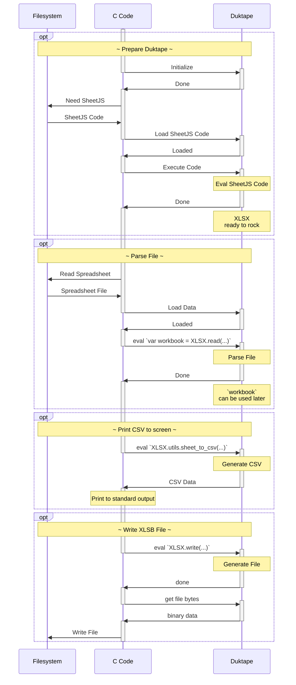

import current from '/version.js';
import Tabs from '@theme/Tabs';
import TabItem from '@theme/TabItem';
import CodeBlock from '@theme/CodeBlock';

[Duktape](https://duktape.org) is an embeddable JS engine written in C. It has
been ported to a number of exotic architectures and operating systems.

[SheetJS](https://sheetjs.com) is a JavaScript library for reading and writing
data from spreadsheets.

The ["Complete Example"](#complete-example) section includes a complete
command-line tool for reading data from spreadsheets and exporting to Excel XLSB
workbooks. ["Bindings"](#bindings) covers bindings for other ecosystems.

## Integration Details

### Initialize Duktape

Duktape does not provide a `global` variable. It can be created in one line:

```c
/* initialize */
duk_context *ctx = duk_create_heap_default();

/* duktape does not expose a standard "global" by default */
// highlight-next-line
duk_eval_string_noresult(ctx, "var global = (function(){ return this; }).call(null);");
```

### Load SheetJS Scripts

The [SheetJS Standalone scripts](/docs/getting-started/installation/standalone)
can be parsed and evaluated in a Duktape context.

The shim and main libraries can be loaded by reading the scripts from the file
system and evaluating in the Duktape context:

```c
/* simple wrapper to read the entire script file */
static duk_int_t eval_file(duk_context *ctx, const char *filename) {
  size_t len;
  /* read script from filesystem */
  FILE *f = fopen(filename, "rb");
  if(!f) { duk_push_undefined(ctx); perror("fopen"); return 1; }
  long fsize; { fseek(f, 0, SEEK_END); fsize = ftell(f); fseek(f, 0, SEEK_SET); }
  char *buf = (char *)malloc(fsize * sizeof(char));
  len = fread((void *) buf, 1, fsize, f);
  fclose(f);
  if(!buf) { duk_push_undefined(ctx); perror("fread"); return 1; }

  // highlight-start
  /* load script into the context */
  duk_push_lstring(ctx, (const char *)buf, (duk_size_t)len);
  /* eval script */
  duk_int_t retval = duk_peval(ctx);
  /* cleanup */
  duk_pop(ctx);
  // highlight-end
  return retval;
}

// ...
  duk_int_t res = 0;

  if((res = eval_file(ctx, "shim.min.js")) != 0) { /* error handler */ }
  if((res = eval_file(ctx, "xlsx.full.min.js")) != 0) { /* error handler */ }
```

To confirm the library is loaded, `XLSX.version` can be inspected:

```c
  /* get version string */
  duk_eval_string(ctx, "XLSX.version");
  printf("SheetJS library version %s\n", duk_get_string(ctx, -1));
  duk_pop(ctx);
```

### Reading Files

Duktape supports `Buffer` natively but should be sliced before processing.
Assuming `buf` is a C byte array, with length `len`, this snippet parses data:

```c
/* load C char array and save to a Buffer */
duk_push_external_buffer(ctx);
duk_config_buffer(ctx, -1, buf, len);
duk_put_global_string(ctx, "buf");

/* parse with SheetJS */
duk_eval_string_noresult(ctx, "workbook = XLSX.read(buf.slice(0, buf.length), {type:'buffer'});");
```

`workbook` will be a variable in the JS environment that can be inspected using
the various SheetJS API functions.

### Writing Files

`duk_get_buffer_data` can pull `Buffer` object data into the C code:

```c
/* write with SheetJS using type: "array" */
duk_eval_string(ctx, "XLSX.write(workbook, {type:'array', bookType:'xlsx'})");

/* pull result back to C */
duk_size_t sz;
char *buf = (char *)duk_get_buffer_data(ctx, -1, sz);

/* discard result in duktape */
duk_pop(ctx);
```

The resulting `buf` can be written to file with `fwrite`.

## Complete Example

:::note Tested Deployments

This demo was tested in the following deployments:

| Architecture | Version | Date       |
|:-------------|:--------|:-----------|
| `darwin-x64` | `2.7.0` | 2024-04-04 |
| `darwin-arm` | `2.7.0` | 2024-05-23 |
| `win10-x64`  | `2.7.0` | 2024-03-27 |
| `win11-arm`  | `2.7.0` | 2024-05-25 |
| `linux-x64`  | `2.7.0` | 2024-03-21 |
| `linux-arm`  | `2.7.0` | 2024-05-23 |

:::

This program parses a file and prints CSV data from the first worksheet. It also
generates an XLSB file and writes to the filesystem.

The [flow diagram is displayed after the example steps](#flow-diagram)

:::info pass

On Windows, the Visual Studio "Native Tools Command Prompt" must be used.

:::

0) Create a project folder:

```bash
mkdir sheetjs-duk
cd sheetjs-duk
```

1) Download and extract Duktape:

<Tabs groupId="os">
  <TabItem value="unix" label="Linux/MacOS">

  </TabItem>
  <TabItem value="win" label="Windows">

:::caution pass

The Windows built-in `tar` does not support `xz` archives.

**The commands must be run within WSL `bash`.**

After the `mv` command, exit WSL.

:::

  </TabItem>
</Tabs>

```bash
curl -LO https://duktape.org/duktape-2.7.0.tar.xz
tar -xJf duktape-2.7.0.tar.xz
mv duktape-2.7.0/src/*.{c,h} .
```

2) Download the SheetJS Standalone script, shim script and test file. Move all
three files to the project directory:

<ul>
<li><a href={`https://cdn.sheetjs.com/xlsx-${current}/package/dist/shim.min.js`}>shim.min.js</a></li>
<li><a href={`https://cdn.sheetjs.com/xlsx-${current}/package/dist/xlsx.full.min.js`}>xlsx.full.min.js</a></li>
<li><a href="https://docs.sheetjs.com/pres.numbers">pres.numbers</a></li>
</ul>

<Tabs groupId="os">
  <TabItem value="unix" label="Linux/MacOS">

  </TabItem>
  <TabItem value="win" label="Windows">

:::caution pass

If the `curl` command fails, run the commands within WSL `bash`.

:::

  </TabItem>
</Tabs>

<CodeBlock language="bash">{`\
curl -LO https://cdn.sheetjs.com/xlsx-${current}/package/dist/shim.min.js
curl -LO https://cdn.sheetjs.com/xlsx-${current}/package/dist/xlsx.full.min.js
curl -LO https://docs.sheetjs.com/pres.numbers`}
</CodeBlock>

3) Download [`sheetjs.duk.c`](pathname:///duk/sheetjs.duk.c):

```bash
curl -LO https://docs.sheetjs.com/duk/sheetjs.duk.c
```

4) Compile standalone `sheetjs.duk` binary

<Tabs groupId="os">
  <TabItem value="unix" label="Linux/MacOS">

```bash
gcc -std=c99 -Wall -osheetjs.duk sheetjs.duk.c duktape.c -lm
```

:::note pass

GCC may generate a warning:

```
duk_js_compiler.c:5628:13: warning: variable 'num_stmts' set but not used [-Wunused-but-set-variable]
                duk_int_t num_stmts;
                          ^
```

This warning can be ignored.

:::

  </TabItem>
  <TabItem value="win" label="Windows">

```powershell
cl sheetjs.duk.c duktape.c /I .\
```

  </TabItem>
</Tabs>

5) Run the demo:

<Tabs groupId="os">
  <TabItem value="unix" label="Linux/MacOS">

```bash
./sheetjs.duk pres.numbers
```

  </TabItem>
  <TabItem value="win" label="Windows">

```bash
.\sheetjs.duk.exe pres.numbers
```

  </TabItem>
</Tabs>

If the program succeeded, the CSV contents will be printed to console and the
file `sheetjsw.xlsb` will be created.  That file can be opened with Excel.

### Flow Diagram



## Bindings

Bindings exist for many languages. As these bindings require "native" code, they
may not work on every platform.

The Duktape source distribution includes a separate Makefile for building a
shared library. This library can be loaded in other programs.

#### Blingos

Duktape includes a number of "blingos" (function-like macros) which will not be
included in the shared library. The macros must be manually expanded.

For example, `duk_create_heap_default` is defined as follows:

```c
#define duk_create_heap_default() \
  duk_create_heap(NULL, NULL, NULL, NULL, NULL)
```

The `duk_create_heap_default` blingo will not be defined in the shared library.
Instead, `duk_create_heap` must be called directly. Using PHP FFI:

```php
/* create new FFI object */
$ffi = FFI::cdef(/* ... arguments */);

/* call duk_create_heap directly */
// highlight-next-line
$context =  $ffi->duk_create_heap(null, null, null, null, null);
```

#### Null Pointers

The C `NULL` pointer must be used in some functions. Some FFI implementations
have special values distinct from the language-native null value. Using Python,
return type hints are specified with the `restype` property:

```py
from ctypes import CDLL, c_void_p

duk = CDLL("libduktape.so")

# highlight-next-line
duk.duk_create_heap.restype = c_void_p
context = duk.duk_create_heap(None, None, None, None, None)
```

### PHP

There is no official PHP binding to the Duktape library. Instead, this demo uses
the raw `FFI` interface[^1] to the Duktape shared library.

The [`SheetJSDuk.php`](pathname:///duk/SheetJSDuk.php) demo script parses a
file, prints CSV rows from the first worksheet, and creates a XLSB workbook.

#### PHP Demo

:::note Tested Deployments

This demo was tested in the following deployments:

| Architecture | Version | PHP      | Date       |
|:-------------|:--------|:---------|:-----------|
| `darwin-x64` | `2.7.0` | `8.3.4`  | 2024-03-15 |
| `darwin-arm` | `2.7.0` | `8.3.8`  | 2024-06-30 |
| `linux-x64`  | `2.7.0` | `8.2.7`  | 2024-03-21 |
| `linux-arm`  | `2.7.0` | `8.2.18` | 2024-05-25 |

:::

0) Ensure `php` is installed and available on the system path

1) Find the `php.ini` file:

```bash
php --ini
```

The following output is from the last macOS test:

```text pass
Configuration File (php.ini) Path: /usr/local/etc/php/8.3
// highlight-next-line
Loaded Configuration File:         /usr/local/etc/php/8.3/php.ini
Scan for additional .ini files in: /usr/local/etc/php/8.3/conf.d
Additional .ini files parsed:      /usr/local/etc/php/8.3/conf.d/ext-opcache.ini
```

2) Edit the `php.ini` configuration file.

The following line should appear in the configuration:

```ini title="php.ini (add to end)"
extension=ffi
```

If this line is prefixed with a `;`, remove the semicolon. If this line does not
appear in the file, add it to the end.

:::note pass

On Linux and macOS, the file may be owned by the `root` user. If writing the
file fails with a normal user account, use `sudo` to launch the text editor.

:::

3) Build the Duktape shared library:

```bash
curl -LO https://duktape.org/duktape-2.7.0.tar.xz
tar -xJf duktape-2.7.0.tar.xz
cd duktape-2.7.0
make -f Makefile.sharedlibrary
cd ..
```

4) Copy the shared library to the current folder. When the demo was last tested,
the shared library file name differed by platform:

| OS     | name                      |
|:-------|:--------------------------|
| Darwin | `libduktape.207.20700.so` |
| Linux  | `libduktape.so.207.20700` |

```bash
cp duktape-*/libduktape.* .
```

5) Download the SheetJS Standalone script, shim script and test file. Move all
three files to the project directory:

<ul>
<li><a href={`https://cdn.sheetjs.com/xlsx-${current}/package/dist/shim.min.js`}>shim.min.js</a></li>
<li><a href={`https://cdn.sheetjs.com/xlsx-${current}/package/dist/xlsx.full.min.js`}>xlsx.full.min.js</a></li>
<li><a href="https://docs.sheetjs.com/pres.numbers">pres.numbers</a></li>
</ul>

<CodeBlock language="bash">{`\
curl -LO https://cdn.sheetjs.com/xlsx-${current}/package/dist/shim.min.js
curl -LO https://cdn.sheetjs.com/xlsx-${current}/package/dist/xlsx.full.min.js
curl -LO https://docs.sheetjs.com/pres.numbers`}
</CodeBlock>

6) Download [`SheetJSDuk.php`](pathname:///duk/SheetJSDuk.php):

```bash
curl -LO https://docs.sheetjs.com/duk/SheetJSDuk.php
```

7) Edit the `SheetJSDuk.php` script.

The `$sofile` variable declares the path to the library:

```php title="SheetJSDuk.php (edit highlighted line)"
<?php

// highlight-next-line
$sofile = './libduktape.207.20700.so';
```

<Tabs groupId="triple">
  <TabItem value="darwin-x64" label="MacOS">

The name of the library is `libduktape.207.20700.so`:

```php title="SheetJSDuk.php (change highlighted line)"
// highlight-next-line
$sofile = './libduktape.207.20700.so';
```

  </TabItem>
  <TabItem value="linux-x64" label="Linux">

The name of the library is `libduktape.so.207.20700`:

```php title="SheetJSDuk.php (change highlighted line)"
// highlight-next-line
$sofile = './libduktape.so.207.20700';
```

  </TabItem>
</Tabs>

8) Run the script:

```bash
php SheetJSDuk.php pres.numbers
```

If the program succeeded, the CSV contents will be printed to console and the
file `sheetjsw.xlsb` will be created.  That file can be opened with Excel.

### Python

There is no official Python binding to the Duktape library. Instead, this demo
uses the raw `ctypes` interface[^2] to the Duktape shared library.

#### Python Demo

:::note Tested Deployments

This demo was tested in the following deployments:

| Architecture | Version | Python   | Date       |
|:-------------|:--------|:---------|:-----------|
| `darwin-x64` | `2.7.0` | `3.12.2` | 2024-03-15 |
| `darwin-arm` | `2.7.0` | `3.12.3` | 2024-06-30 |
| `linux-x64`  | `2.7.0` | `3.11.3` | 2024-03-21 |
| `linux-arm`  | `2.7.0` | `3.11.2` | 2024-05-25 |

:::

0) Ensure `python` is installed and available on the system path.

1) Build the Duktape shared library:

```bash
curl -LO https://duktape.org/duktape-2.7.0.tar.xz
tar -xJf duktape-2.7.0.tar.xz
cd duktape-2.7.0
make -f Makefile.sharedlibrary
cd ..
```

2) Copy the shared library to the current folder. When the demo was last tested,
the shared library file name differed by platform:

| OS     | name                      |
|:-------|:--------------------------|
| Darwin | `libduktape.207.20700.so` |
| Linux  | `libduktape.so.207.20700` |

```bash
cp duktape-*/libduktape.* .
```

3) Download the SheetJS Standalone script, shim script and test file. Move all
three files to the project directory:

<ul>
<li><a href={`https://cdn.sheetjs.com/xlsx-${current}/package/dist/shim.min.js`}>shim.min.js</a></li>
<li><a href={`https://cdn.sheetjs.com/xlsx-${current}/package/dist/xlsx.full.min.js`}>xlsx.full.min.js</a></li>
<li><a href="https://docs.sheetjs.com/pres.numbers">pres.numbers</a></li>
</ul>

<CodeBlock language="bash">{`\
curl -LO https://cdn.sheetjs.com/xlsx-${current}/package/dist/shim.min.js
curl -LO https://cdn.sheetjs.com/xlsx-${current}/package/dist/xlsx.full.min.js
curl -LO https://docs.sheetjs.com/pres.numbers`}
</CodeBlock>

4) Download [`SheetJSDuk.py`](pathname:///duk/SheetJSDuk.py):

```bash
curl -LO https://docs.sheetjs.com/duk/SheetJSDuk.py
```

5) Edit the `SheetJSDuk.py` script.

The `lib` variable declares the path to the library:

```python title="SheetJSDuk.py (edit highlighted line)"
#!/usr/bin/env python3

# highlight-next-line
lib = "libduktape.207.20700.so"
```

<Tabs groupId="triple">
  <TabItem value="darwin-x64" label="MacOS">

The name of the library is `libduktape.207.20700.so`:

```python title="SheetJSDuk.py (change highlighted line)"
# highlight-next-line
lib = "libduktape.207.20700.so"
```

  </TabItem>
  <TabItem value="linux-x64" label="Linux">

The name of the library is `libduktape.so.207.20700`:

```python title="SheetJSDuk.py (change highlighted line)"
# highlight-next-line
lib = "libduktape.so.207.20700"
```

  </TabItem>
</Tabs>

6) Run the script:

```bash
python3 SheetJSDuk.py pres.numbers
```

If the program succeeded, the CSV contents will be printed to console and the
file `sheetjsw.xlsb` will be created.  That file can be opened with Excel.

:::caution pass

In some tests, the command failed with an `OSError` message.

The fix is to explicitly add `./` to the `lib` variable in `SheetJSDuk.py`:

<Tabs groupId="triple">
  <TabItem value="darwin-x64" label="MacOS">

The name of the library is `libduktape.207.20700.so`:

```python title="SheetJSDuk.py (change highlighted line)"
# highlight-next-line
lib = "./libduktape.207.20700.so"
```

  </TabItem>
  <TabItem value="linux-x64" label="Linux">

The name of the library is `libduktape.so.207.20700`:

```python title="SheetJSDuk.py (change highlighted line)"
# highlight-next-line
lib = "./libduktape.so.207.20700"
```

  </TabItem>
</Tabs>

:::

### Zig

:::caution Zig support is considered experimental.

Great open source software grows with user tests and reports. Any issues should
be reported to the Zig project for further diagnosis.

:::

#### Zig Compilation

The main Duktape code can be added to the Zig build pipeline.

:::note pass

The following explanation was verified against Zig 0.12.0.

:::

Due to restrictions in the Zig C integration, the path to the Duktape `src`
folder must be added to the include path list:

```zig title="build.zig"
    const exe = b.addExecutable(.{
      // ...
    });
    // highlight-start
    // this line is required to make @cInclude("duktape.h") work
    exe.addIncludePath(.{ .path = "duktape-2.7.0/src" });
    // highlight-end
```

The `duktape.c` source file must be added to the build sequence. For Zig version
0.12.0, Duktape must be compiled with flags `-std=c99 -fno-sanitize=undefined`
and linked against `libc` and `libm`:

```zig title="build.zig"
    const exe = b.addExecutable(.{
      // ...
    });
// highlight-start
    exe.addCSourceFile(.{:
      .file = .{ .path = "duktape-2.7.0/src/duktape.c" },
      .flags = &.{ "-std=c99", "-fno-sanitize=undefined" }
    });
    exe.linkSystemLibrary("c");
    exe.linkSystemLibrary("m");
// highlight-end
```

#### Zig Import

`duktape.h` can be imported using the `@cImport` directive:

```zig title="main.zig"
const duktape = @cImport({
    @cInclude("duktape.h");
});
```

Once imported, many API functions can be referenced from the `duktape` scope.
For example, `duk_peval_string` in the C interface will be available to Zig code
using the name `duktape.duk_peval_string`.

It is strongly recommended to colocate allocations and cleanup methods using
`defer`. For example, a Duktape context is created with `duk_create_heap` and
destroyed with `duk_destroy_heap`. The latter call can be deferred:

```zig
    const ctx = duktape.duk_create_heap(null, null, null, null, null);
    defer _ = duktape.duk_destroy_heap(ctx);
```

#### Zig Translator Caveats

The Zig translator does not properly handle blingo `void` casts. For example,
`duk_eval_string_noresult` is a function-like macro defined in `duktape.h`:

```c title="duk_eval_string_noresult blingo"
#define duk_eval_string_noresult(ctx,src)  \
  ((void) duk_eval_raw((ctx), (src), 0, 0 /*args*/ | DUK_COMPILE_EVAL | DUK_COMPILE_NOSOURCE | DUK_COMPILE_STRLEN | DUK_COMPILE_NORESULT | DUK_COMPILE_NOFILENAME))
```

The compiler will throw an error involving `anyopaque` (C `void`):

```
error: opaque return type 'anyopaque' not allowed
```

The blingo performs a `void` cast to suppress certain C compiler warnings. The
spiritual equivalent in Zig is to assign to `_`.

The `duk_eval_raw` method and each compile-time constant are available in the
`duktape` scope. A manual translation is shown below:

```zig
_ = duktape.duk_eval_raw(ctx, src, 0, 0 | duktape.DUK_COMPILE_EVAL | duktape.DUK_COMPILE_NOSOURCE | duktape.DUK_COMPILE_STRLEN | duktape.DUK_COMPILE_NORESULT | duktape.DUK_COMPILE_NOFILENAME);
```

#### Zig Demo

:::note Tested Deployments

This demo was tested in the following deployments:

| Architecture | Version | Zig      | Date       |
|:-------------|:--------|:---------|:-----------|
| `darwin-x64` | `2.7.0` | `0.11.0` | 2024-03-10 |
| `darwin-arm` | `2.7.0` | `0.12.0` | 2024-05-23 |
| `win10-x64`  | `2.7.0` | `0.11.0` | 2024-03-10 |
| `win11-arm`  | `2.7.0` | `0.12.0` | 2024-05-25 |
| `linux-x64`  | `2.7.0` | `0.12.0` | 2024-04-25 |
| `linux-arm`  | `2.7.0` | `0.12.0` | 2024-05-25 |

On Windows, due to incompatibilities between WSL and PowerShell, some commands
must be run in WSL Bash.

:::

0) Create a new project folder:

```bash
mkdir sheetjs-zig
cd sheetjs-zig
```

1) Download Zig 0.12.0 from https://ziglang.org/download/ and extract to the
project folder.

<Tabs groupId="triple">
  <TabItem value="darwin-x64" label="MacOS">

For X64 Mac:

```bash
curl -LO https://ziglang.org/download/0.12.0/zig-macos-x86_64-0.12.0.tar.xz
tar -xzf zig-macos-*.tar.xz
```

For ARM64 Mac:

```bash
curl -LO https://ziglang.org/download/0.12.0/zig-macos-aarch64-0.12.0.tar.xz
tar -xzf zig-macos-*.tar.xz
```


  </TabItem>
  <TabItem value="linux-x64" label="Linux">

For X64 Linux:

```bash
curl -LO https://ziglang.org/download/0.12.0/zig-linux-x86_64-0.12.0.tar.xz
xz -d zig-linux-*.tar.xz
tar -xf zig-linux-*.tar
```

For AArch64 Linux:

```bash
curl -LO https://ziglang.org/download/0.12.0/zig-linux-aarch64-0.12.0.tar.xz
xz -d zig-linux-*.tar.xz
tar -xf zig-linux-*.tar
```

  </TabItem>
  <TabItem value="win10-x64" label="Windows">

:::note pass

The following commands should be run within WSL bash.

:::

For X64 Windows:

```bash
curl -LO https://ziglang.org/download/0.12.0/zig-windows-x86_64-0.12.0.zip
unzip zig-windows-x86_64-0.12.0.zip
```

For ARM64 Windows:

```bash
curl -LO https://ziglang.org/download/0.12.0/zig-windows-aarch64-0.12.0.zip
unzip zig-windows-aarch64-0.12.0.zip
```

  </TabItem>
</Tabs>

2) Initialize a project:

<Tabs groupId="triple">
  <TabItem value="darwin-x64" label="MacOS">

```bash
./zig-*/zig init
```

  </TabItem>
  <TabItem value="linux-x64" label="Linux">

```bash
./zig-*/zig init
```

  </TabItem>
  <TabItem value="win10-x64" label="Windows">

:::note pass

The following command should be run within Powershell.

:::

```bash
.\zig-windows-*\zig.exe init
```

  </TabItem>
</Tabs>


3) Download the Duktape source and extract in the current directory. On Windows,
the commands should be run within WSL:

```bash
curl -LO https://duktape.org/duktape-2.7.0.tar.xz
tar -xJf duktape-2.7.0.tar.xz
```

4) Download the SheetJS Standalone script, shim script and test file. Move all
three files to the `src` subdirectory:

<ul>
<li><a href={`https://cdn.sheetjs.com/xlsx-${current}/package/dist/shim.min.js`}>shim.min.js</a></li>
<li><a href={`https://cdn.sheetjs.com/xlsx-${current}/package/dist/xlsx.full.min.js`}>xlsx.full.min.js</a></li>
<li><a href="https://docs.sheetjs.com/pres.numbers">pres.numbers</a></li>
</ul>

The following commands can be run within a shell on macOS and Linux. On Windows,
the commands should be run within WSL bash:

<CodeBlock language="bash">{`\
curl -LO https://cdn.sheetjs.com/xlsx-${current}/package/dist/shim.min.js
curl -LO https://cdn.sheetjs.com/xlsx-${current}/package/dist/xlsx.full.min.js
curl -LO https://docs.sheetjs.com/pres.numbers
mv *.js src`}
</CodeBlock>

5) Add the highlighted lines to `build.zig` just after the `exe` definition:

```zig title="build.zig (add highlighted lines)"
    const exe = b.addExecutable(.{
        .name = "sheetjs-zig",
        .root_source_file = .{ .path = "src/main.zig" },
        .target = target,
        .optimize = optimize,
    });
// highlight-start
    exe.addCSourceFile(.{ .file = .{ .path = "duktape-2.7.0/src/duktape.c" }, .flags = &.{ "-std=c99", "-fno-sanitize=undefined" } });
    exe.addIncludePath(.{ .path = "duktape-2.7.0/src" });
    exe.linkSystemLibrary("c");
    exe.linkSystemLibrary("m");
// highlight-end
```

6) Download [`main.zig`](pathname:///duk/main.zig) and replace `src/main.zig`.
The following command should be run in WSL bash or the macOS or Linux terminal:

```bash
curl -L -o src/main.zig https://docs.sheetjs.com/duk/main.zig
```

7) Build and run the program:

<Tabs groupId="triple">
  <TabItem value="darwin-x64" label="MacOS">

```bash
./zig-*/zig build run -- pres.numbers
```

  </TabItem>
  <TabItem value="linux-x64" label="Linux">

```bash
./zig-*/zig build run -- pres.numbers
```

:::caution pass

On Arch Linux and HoloOS (Steam Deck), compilation may fail:

```
zig build-exe sheetjs-zig Debug native: error: error: unable to create compilation: LibCStdLibHeaderNotFound
```

`glibc` and `linux-api-headers` must be installed:

```bash
sudo pacman -Syu glibc linux-api-headers
```

:::

  </TabItem>
  <TabItem value="win10-x64" label="Windows">

This command should be run in PowerShell:

```bash
.\zig-windows-*\zig.exe build run -- pres.numbers
```

  </TabItem>
</Tabs>

This step builds and runs the program. The generated program will be placed in
the `zig-out/bin/` subdirectory.

It should display some metadata along with CSV rows from the first worksheet.
It will also generate `sheetjs.zig.xlsx`, which can be opened with a spreadsheet
editor such as Excel.


### Perl

The Perl binding for Duktape is available as `JavaScript::Duktape::XS` on CPAN.

The Perl binding does not have raw `Buffer` ops, so Base64 strings are used.

#### Perl Demo

:::note Tested Deployments

This demo was tested in the following deployments:

| Architecture | Version | Date       |
|:-------------|:--------|:-----------|
| `darwin-x64` | `2.2.0` | 2024-03-15 |
| `darwin-arm` | `2.2.0` | 2024-06-30 |
| `linux-x64`  | `2.2.0` | 2024-03-21 |
| `linux-arm`  | `2.2.0` | 2024-05-25 |

:::

0) Ensure `perl` and `cpan` are installed and available on the system path.

1) Install the `JavaScript::Duktape::XS` library:

```bash
cpan install JavaScript::Duktape::XS
```

:::note pass

On some systems, the command must be run as the root user:

```bash
sudo cpan install JavaScript::Duktape::XS
```

:::

2) Download [`SheetJSDuk.pl`](pathname:///duk/SheetJSDuk.pl):

```bash
curl -LO https://docs.sheetjs.com/duk/SheetJSDuk.pl
```

3) Download the SheetJS ExtendScript build and test file:

<CodeBlock language="bash">{`\
curl -LO https://cdn.sheetjs.com/xlsx-${current}/package/dist/xlsx.extendscript.js
curl -LO https://docs.sheetjs.com/pres.xlsx`}
</CodeBlock>

4) Run the script:

```bash
perl SheetJSDuk.pl pres.xlsx
```

If the script succeeded, the data in the test file will be printed in CSV rows.
The script will also export `SheetJSDuk.xlsb`.

:::note pass

In some test runs, the command failed due to missing `File::Slurp`:

```
Can't locate File/Slurp.pm in @INC (you may need to install the File::Slurp module)
```

The fix is to install `File::Slurp` with `cpan`:

```bash
sudo cpan install File::Slurp
```

:::

[^1]: See [Foreign Function Interface](https://www.php.net/manual/en/book.ffi.php) in the PHP documentation.
[^2]: See [`ctypes`](https://docs.python.org/3/library/ctypes.html) in the Python documentation.