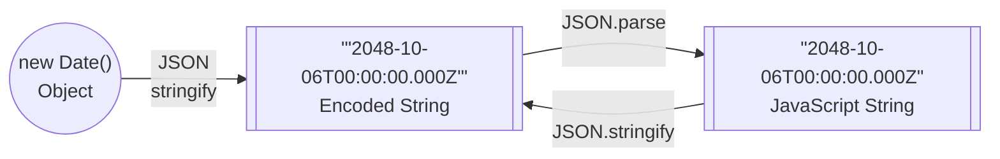

import Tabs from '@theme/Tabs';
import TabItem from '@theme/TabItem';

<details>
  <summary><b>File Format Support</b> (click to show)</summary>

Dates are a core concept in nearly every spreadsheet application in existence.
Some legacy spreadsheet apps only supported dates.  Others supported times as a
distinct concept from dates.

Some file formats store dates in a textual format, while others store dates with
[numbers representing a difference from an epoch](#relative-epochs).

Many spreadsheet apps use special number formats to signal that values are dates
or times.  Quattro Pro for DOS had a distinct set of Date number formats and
Time number formats, but did not have a mixed Date + Time format. OpenOffice
uses ISO 8601 duration strings for pure time data.

Lotus 1-2-3 used a ["1900" date system](#1904-and-1900-date-systems), while
Numbers exclusively supports 1904 under the hood. Excel file formats typically
include options for specifying the date system. OpenOffice can support arbitrary
starting dates.

| Formats           | Date | Time | D+T | Date Storage         | Date System |
|:------------------|:----:|:----:|:---:|:--------------------:|:------------|
| NUMBERS           |   ✔  |   ✔  |  ✔  | Number               | 1904 Only   |
| XLSX / XLSM       |   ✔  |   ✔  |  ✔  | Number               | 1900 + 1904 |
| XLSX (Strict ISO) |   ✔  |   ✔  |  ✔  | Relative Date        | 1900 + 1904 |
| XLSB              |   ✔  |   ✔  |  ✔  | Number               | 1900 + 1904 |
| XLML              |   ✔  |   ✔  |  ✔  | Relative Date        | 1900 + 1904 |
| XLS (BIFF5/8)     |   ✔  |   ✔  |  ✔  | Number               | 1900 + 1904 |
| XLS (BIFF2/3/4)   |   ✔  |   ✔  |  ✔  | Number               | 1900 + 1904 |
| XLR (Works)       |   ✔  |   ✔  |  ✔  | Number               | 1900 + 1904 |
| ET (WPS 电子表格)  |   ✔  |   ✔  |  ✔  | Number               | 1900 + 1904 |
| ODS / FODS / UOS  |   ✔  |   ✔  |  ✔  | ISO Duration or Date | Arbitrary   |
| HTML              |   ✔  |   ✔  |  ✔  | Plaintext            | Calendar    |
| CSV / TSV / Text  |   ✔  |   ✔  |  ✔  | Plaintext            | Calendar    |
| DBF               |   ✔  |   *  |  *  | Number or Plaintext  | Calendar    |
| DIF               |   ✔  |   ✔  |  ✔  | Plaintext            | Calendar    |
| WK1               |   ✔  |   ✔  |  ✕  | Number               | 1900        |
| WKS (Works)       |   ✔  |   ✔  |  ✕  | Number               | 1900        |
| WQ1               |   ✔  |      |  ✕  | Number               | 1900        |
| QPW               |   ✔  |   ✔  |  *  | Number               | 1900        |

X (✕) marks features that are not supported by the file formats. For example,
the WK1 file format had date-only formats and time-only formats but no mixed
date-time formats.

Newer DBF levels support a special `T` field type that represents date + time.

The QPW file format supports mixed date + time formats in custom number formats.

</details>

Lotus 1-2-3, Excel, and other spreadsheet software do not have a true concept
of date or time.  Instead, dates and times are stored as offsets from an epoch.
The magic behind date interpretations is hidden in functions or number formats.

SheetJS attempts to create a friendly JS date experience while also exposing
options to use the traditional date codes.

:::tip pass

Date and time handling was overhauled in version `0.20.0`. It is strongly
recommended to [upgrade](/docs/getting-started/installation/).

:::

The following example exports the current time to XLSX spreadsheet. The time
shown on this page will be the time displayed in Excel.

<Tabs groupId="live">
  <TabItem value="react" label="React (Live Demo)">

```jsx live
function SheetJSNow() {
  const [date, setDate] = React.useState(new Date());
  const xport = React.useCallback(() => {
    /* generate array of arrays */
    const aoa = [[date]];
    /* to avoid confusion, set milliseconds to 0 */
    aoa[0][0].setMilliseconds(0);
    /* generate workbook */
    const ws = XLSX.utils.aoa_to_sheet(aoa, {dense: true});
    /* set cell A1 number format */
    ws["!data"][0][0].z = "yyyy-mm-dd hh:mm:ss"
    ws["!cols"] = [{wch: 20}];

    /* generate workbook and export */
    const wb = XLSX.utils.book_new(ws, "Sheet1");
    XLSX.writeFile(wb, "SheetJSNow.xlsx");
  }, []);
  return ( <>
    <p>
      <b>Local Time:</b>{date.toString()}
      <button onClick={()=>setDate(new Date())}>Refresh</button>
    </p>
    <button onClick={xport}>Export XLSX</button>
  </> );
}
```

  </TabItem>
  <TabItem value="js" label="JavaScript (Explanation)">

:::note pass

1) Create a new Date object and set milliseconds to 0 (to avoid date rounding):

```js
/* starting date */
const date = new Date();
/* to avoid confusion, set milliseconds to 0 */
date.setMilliseconds(0);
```

2) Construct an array of arrays to store the date. It will be placed in cell A1:

```js
/* generate array of arrays */
const aoa = [[date]];
```

3) [Create a worksheet](/docs/api/utilities/array#array-of-arrays-input):

```js
/* generate workbook */
const ws = XLSX.utils.aoa_to_sheet(aoa, {dense: true});
```

4) Adjust the date format using a [custom number format](/docs/csf/features/nf):

```js
/* set cell A1 number format */
ws["!data"][0][0].z = "yyyy-mm-dd hh:mm:ss"
```

5) Adjust the [column width](/docs/csf/features/colprops)

```js
/* adjust column width */
ws["!cols"] = [{wch: 20}];
```

6) [Create a workbook](/docs/api/utilities/wb):

```js
/* create workbook object */
const wb = XLSX.utils.book_new(ws, "Sheet1");
```

7) [Write XLSX file](/docs/api/write-options):

```js
/* generate XLSX workbook and attempt to download */
XLSX.writeFile(wb, "SheetJSNow.xlsx");
```

:::

  </TabItem>
</Tabs>

## How Spreadsheets Understand Time

Excel stores dates as numbers.  When displaying dates, the format code should
include special date and time tokens like `yyyy` for long year. `EDATE` and
other date functions operate on and return date numbers.

For date formats like `yyyy-mm-dd`, the integer part represents the number of
days from a starting epoch.  For example, the date `19-Feb-17` is stored as the
number `42785` with a number format of `d-mmm-yy`.

The fractional part of the date code serves as the time marker.  Excel assumes
each day has exactly 86400 seconds.  For example, the date code `0.25` has a
time component corresponding to 6:00 AM.

For absolute time formats like `[hh]:mm`, the integer part represents a whole
number of 24-hour (or 1440 minute) intervals.  The value `1.5` in the format
`[hh]:mm` is interpreted as 36 hours 0 minutes.

### Date and Time Number Formats

Assuming a cell has a formatted date, re-formatting as "General" will reveal
the underlying value.  Alternatively, the `TEXT` function can be used to return
the date code.

The following table covers some common formats:

<details>
  <summary><b>Common Date-Time Formats</b> (click to show)</summary>

| Fragment | Interpretation               |
|:---------|:-----------------------------|
| `yy`     | Short (2-digit) year         |
| `yyyy`   | Long (4-digit) year          |
| `m`      | Short (1-digit) month        |
| `mm`     | Long (2-digit) month         |
| `mmm`    | Short (3-letter) month name  |
| `mmmm`   | Full month name              |
| `mmmmm`  | First letter of month name   |
| `d`      | Short (1-digit) day of month |
| `dd`     | Long (2-digit) day of month  |
| `ddd`    | Short (3-letter) day of week |
| `dddd`   | Full day of week             |
| `h`      | Short (1-digit) hours        |
| `hh`     | Long (2-digit) hours         |
| `m`      | Short (1-digit) minutes      |
| `mm`     | Long (2-digit) minutes       |
| `s`      | Short (1-digit) seconds      |
| `ss`     | Long (2-digit) seconds       |
| `A/P`    | Meridiem ("A" or "P")        |
| `AM/PM`  | Meridiem ("AM" or "PM")      |

:::note pass

`m` and `mm` are context-dependent.  It is interpreted as "minutes" when the
previous or next date token represents a time (hours or seconds):

```
yyyy-mm-dd hh:mm:ss
     ^^       ^^
    month    minutes
```

`mmm`, `mmmm`, and `mmmmm` always represent months.

:::

</details>

### 1904 and 1900 Date Systems

The interpretation of date codes requires a shared understanding of date code
`0`, otherwise known as the "epoch".  Excel supports two epochs:

- The default epoch is "January 0 1900". The `0` value is 00:00 on December 31
  of the year 1899, but it is formatted as January 0 1900.

- Enabling "1904 Date System" sets the default epoch to "January 1 1904".  The
  `0` value is 00:00 on January 1 of the year 1904.

The workbook's epoch can be determined by examining the workbook's `wb.Workbook.WBProps.date1904` property:

```js
if(!(wb?.Workbook?.WBProps?.date1904)) {
  /* uses 1904 date system */
} else {
  /* uses 1900 date system */
}
```

<details>
  <summary><b>Why does the 1904 date system exist?</b> (click to show) </summary>

1900 was not a leap year.  For the Gregorian calendar, the general rules are:
- every multiple of 400 is a leap year
- every multiple of 100 that is not a multiple of 400 is not a leap year
- every multiple of 4 that is not a multiple of 100 is a leap year
- all other years are not leap years.

Lotus 1-2-3 erroneously treated 1900 as a leap year. This can be verified with
the `@date` function:

```
@date(0,2,28) -> 59    // Lotus accepts 2/28/1900
@date(0,2,29) -> 60    // <--2/29/1900 was not a real date
@date(0,2,30) -> ERR   // Lotus rejects 2/30/1900
```

Excel extends the tradition in the default date system.  The 1904 date system
starts the count in 1904, skipping the bad date.

</details>

### Relative Epochs

The epoch is based on the system timezone.  The epoch in New York is midnight
in Eastern time, while the epoch in Seattle is midnight in Pacific time.

This design has the advantage of uniform time display: "12 PM" is 12 PM
irrespective of the timezone of the viewer.  However, this design precludes any
international coordination (there is no way to create a value that represents
an absolute time) and makes JavaScript processing somewhat ambiguous (since
JavaScript Date objects are timezone-aware)

This is a deficiency of the spreadsheet software. Excel has no native concept
of universal time.

## How Files Store Dates and Times

<details>
  <summary><b>Technical Details</b> (click to show)</summary>

XLS, XLSB, and most binary formats store the raw date codes.  Special number
formats are used to indicate that the values are intended to be dates/times.

CSV and other text formats typically store actual formatted date values.  They
are interpreted as dates and times in the user timezone.

XLSX actually supports both!  Typically dates are stored as `n` numeric cells,
but the format supports a special type `d` where the data is an ISO 8601 date
string. This is not used in the default Excel XLSX export and third-party
support is poor.

ODS does support absolute time values but drops the actual timezone indicator
when parsing.  In that sense, LibreOffice follows the same behavior as Excel.

Numbers uses a calendar date system, but records pure time values as if they are
absolute times in 1904 January 01. It is spiritually equivalent to the 1904 mode
in Excel and other spreadsheet applications.

</details>

## How JavaScript Engines Understand Time

JavaScript provides a `Date` object which represents an *absolute* time. Under
the hood, `Date` uses the "UNIX" epoch of 1970 January 01 midnight in UTC. This
means the actual zero date is different in different timezones!

| Location    | IANA Timezone         | `new Date(0)` in local time |
|:------------|:----------------------|:----------------------------|
| Honolulu    | `Pacific/Honolulu`    | `1969-12-31 02:00 PM`       |
| Los Angeles | `America/Los_Angeles` | `1969-12-31 04:00 PM`       |
| New York    | `America/New_York`    | `1969-12-31 07:00 PM`       |
| Sao Paulo   | `America/Sao_Paulo`   | `1969-12-31 09:00 PM`       |
| London      | `Europe/London`       | `1970-01-01 01:00 AM`       |
| Cairo       | `Africa/Cairo`        | `1970-01-01 02:00 AM`       |
| Djibouti    | `Africa/Djibouti`     | `1970-01-01 03:00 AM`       |
| Chennai     | `Asia/Kolkata`        | `1970-01-01 05:30 AM`       |
| Shanghai    | `Asia/Shanghai`       | `1970-01-01 08:00 AM`       |
| Seoul       | `Asia/Seoul`          | `1970-01-01 09:00 AM`       |
| Sydney      | `Australia/Sydney`    | `1970-01-01 10:00 AM`       |

In modern environments, the IANA Timezone and timezone offset can be discovered
through the `Intl` and `Date` objects:

```jsx live
function LocalInfo() {
  const date = new Date();
  return ( <>
  <b>Local Time</b>: {date.toString()}<br/>
  <b>Time offset (relative to UTC)</b>: {-date.getTimezoneOffset()/60} hours <br/>
  <b>IANA Timezone</b>: {Intl.DateTimeFormat().resolvedOptions().timeZone}
</>)}
```

:::caution pass

The timezone information is provided by the JavaScript engine and local settings.
There are outstanding Google Chrome and V8 bugs related to rounded offsets for
timezones under a lunar calendar. The last timezone to switch to the Gregorian
calendar was `Africa/Monrovia` (in 1972).

SheetJS utilities attempt to work around the browser bugs.

:::

### UTC and Local Time

The `Date` object has a number of prototype methods for inspecting the object.
Some methods interact with the true value, while others convert to the local
timezone.  Some methods are listed in the table below:

| Feature          | Local Time method | UTC method       |
|:-----------------|:------------------|:-----------------|
| Year             | `getFullYear`     | `getUTCFullYear` |
| Month (0-11)     | `getMonth`        | `getUTCMonth`    |
| Day of the month | `getDate`         | `getUTCDate`     |
| Hours            | `getHours`        | `getUTCHours`    |
| Minutes          | `getMinutes`      | `getUTCMinutes`  |
| Seconds          | `getSeconds`      | `getUTCSeconds`  |
| Entire date      | `toString`        | `toUTCString`    |

It is typical for websites and other applications to present data in local time.
To serve an international audience, backend servers typically use UTC time.

The following example shows the time when the page was loaded. The same absolute
time will appear to be different under local and UTC interpretations:

```jsx live
function LocalUTC() {
  const d = new Date();
  /* display number with 2 digits, prepending `0` if necessary */
  const f = (n) => n.toString().padStart(2, "0");
  /* HH:MM:SS using local interpretation */
  const local = `${f(d.getHours())}:${f(d.getMinutes())}:${f(d.getSeconds())}`;
  /* HH:MM:SS using UTC interpretation */
  const utc = `${f(d.getUTCHours())}:${f(d.getUTCMinutes())}:${f(d.getUTCSeconds())}`;
  return ( <>
    <b>Local Interpretation</b><br/>
    <code>toString</code>: {d.toString()}<br/>
    24-hour time: {local}<br/>
    <br/>
    <b>UTC Interpretation</b><br/>
    <code>toUTCString</code>: {d.toUTCString()}<br/>
    24-hour time: {utc}<br/>
</>)}
```

## How SheetJS handles Dates and Times

SheetJS attempts to reconcile the spreadsheet and JavaScript date concepts.

The default behavior for all parsers is to generate number cells. Setting
`cellDates` to true will force the parsers to store dates.

```jsx live
function SheetJSCellDates() {
  var csv = "Date,10/6/2048";

  // cell B1 will be { t: 'n', v: 54337 }
  var wb_sans_date = XLSX.read(csv, {type:"binary"});
  var ws_sans_date = wb_sans_date.Sheets.Sheet1;

  // cell B1 will be { t: 'd', v: <Date: 2048-10-06 00:00:00 UTC> }
  var wb_with_date = XLSX.read(csv, {type:"binary", cellDates: true});
  var ws_with_date = wb_with_date.Sheets.Sheet1;

  return (<>
  <b>CSV:</b><pre>{csv}</pre>
  <b>Cell B1:</b><br/><br/>
  <table><tr><th>cellDates</th><th>type</th><th>value</th></tr>
    <tr><td>(unspecified)</td>
      <td><code>{ws_sans_date["B1"].t}</code></td>
      <td><code>{ws_sans_date["B1"].v}</code></td>
    </tr>
    <tr><td>true</td>
      <td><code>{ws_with_date["B1"].t}</code></td>
      <td><code>{ws_with_date["B1"].v.toISOString()}</code> (Date object)</td>
    </tr>
  </table>
  </>);
}
```

When writing, date cells are automatically translated back to numeric cells
with an appropriate number format.

The value formatting logic understands date formats and converts when relevant.
It always uses the UTC interpretation of Date objects.

### Date Objects

The actual values stored in cells are intended to be correct when interpreted
using UTC date methods.

For example, [`DateTime.xlsx`](pathname:///DateTime.xlsx) is a test file with the following data:

| Type     | Value                 |
|:---------|----------------------:|
| Date     |          `2048-10-06` |
| Time     |               `15:00` |
| DateTime | `2048-10-06 15:00:00` |

The raw data values are shown in the live demo.  The UTC date string will show
the same value as Excel irrespective of the local timezone.

```jsx live
function SheetJSDateTimeXlsxValues() {
  const [data, setData] = React.useState([[]]);
  React.useEffect(() => { (async() => {
    const ab = await (await fetch("/DateTime.xlsx")).arrayBuffer();
    const wb = XLSX.read(ab, {cellDates: true, dense: true});
    setData(wb.Sheets.Sheet1["!data"]);
  })(); });
  return ( <table><thead>
    <th>Excel Date</th><th>UTC Date</th><th>Local Date</th>
  </thead><tbody>
    {data.slice(1).map((row,R) => ( <tr key={R}>
      <td>{row[1].w}</td>
      <td>{row[1].v.toUTCString()}</td>
      <td>{row[1].v.toString()}</td>
    </tr> ))}
  </tbody></table> );
}
```

### Utility Functions

Utility functions that deal with JS data accept a `cellDates` argument which
dictates how dates should be handled.

Functions that create a worksheet will adjust date cells and use a number
format like `m/d/yy` to mark dates:

```js
// Cell A1 will be a numeric cell whose value is the date code
var ws = XLSX.utils.aoa_to_sheet([[new Date()]]);

// Cell A1 will be a date cell
var ws = XLSX.utils.aoa_to_sheet([[new Date()]], { cellDates: true });
```

Functions that create an array of JS objects with raw values will keep the
native representation:

```js
// Cell A1 is numeric -> output is a number
var ws = XLSX.utils.aoa_to_sheet([[new Date()]]);
var A1 = XLSX.utils.sheet_to_json(ws, { header: 1 })[0][0];

// Cell A1 is a date -> output is a date
var ws = XLSX.utils.aoa_to_sheet([[new Date()]], { cellDates: true });
var A1 = XLSX.utils.sheet_to_json(ws, { header: 1 })[0][0];
```

### UTC Option

Some API functions support the `UTC` option to control how dates are handled.

**[`sheet_to_json`](/docs/api/utilities/array#array-output)**

If `UTC` is true, the dates will be correct when interpreted in UTC. By default,
the dates will be correct when interpreted in local time.

Typically `UTC` is used for data from an API endpoint, as servers typically emit
UTC dates and expect scripts to localize. The local interpretation is sensible
when users submit data, as they will be providing times in their local timezone.

**[`aoa_to_sheet` / `sheet_add_aoa`](/docs/api/utilities/array#array-of-arrays-input)** / **[`json_to_sheet` / `sheet_add_json`](/docs/api/utilities/array#array-of-objects-input)**

If `UTC` is true, the UTC interpretation of dates will be used.

Typically `UTC` is used for data from an API endpoint, as servers typically emit
UTC dates and expect scripts to localize. The local interpretation is sensible
when date objects are generated in the browser.


**[`table_to_book` / `table_to_sheet` / `sheet_add_dom`](/docs/api/utilities/html#html-table-input)**

If `UTC` is true, potential dates are interpreted as if they represent UTC times.
By default, potential dates are interpreted in local time.

Typically `UTC` is used for data exported from Excel or other spreadsheet apps.
If the table is programmatically generated in the frontend, the dates and times
will be in the local timezone and the local interpretation is preferable.

### Number Formats

By default, the number formats are not emitted.  For Excel-based file formats,
passing the option `cellNF: true` adds the `z` field.

The helper function `XLSX.SSF.is_date` parses formats and returns `true` if the
format represents a date or time:

```js
XLSX.SSF.is_date("yyyy-mm-dd"); // true

XLSX.SSF.is_date("0.00"); // false
```

<details>
  <summary><b>Live Demo</b> (click to show)</summary>

```jsx live
function SSFIsDate() {
  const [format, setFormat] = React.useState("yyyy-mm-dd");
  const cb = React.useCallback((evt) => {
    setFormat(evt.target.value);
  });
  const is_date = XLSX.SSF.is_date(format);
  return ( <>
    <div>Format <b>|{format}|</b> is {is_date ? "" : "not"} a date/time</div>
    <input type="text" onChange={cb}/>
  </> );
}
```

</details>

## How JSON and APIs Understand Time

JSON does not have a native representation for JavaScript Date objects.

Starting from a Date object, the `JSON.stringify` method will encode the object
as a ISO 8601 date string. Applying `JSON.parse` to the result will return the
string rather than a proper Date object.



SheetJS utility functions will not try to interpret those strings as dates.
Instead, the strings will be translated to text.

In the following example, the "ISO Text" data will be converted to a string cell
while the "Date Obj" data will be converted to a spreadsheet date.

```jsx live
function SheetJSONDates() { return ( <button onClick={() => {
  const aoa = [
    ["ISO Text", "2048-10-06T00:00:00.000Z"],          // B1 will be text
    ["Date Obj", new Date("2048-10-06T00:00:00.000Z")] // B2 will be a date
  ];
  const ws = XLSX.utils.aoa_to_sheet(aoa);
  const wb = XLSX.utils.book_new(ws, "Data");
  XLSX.writeFile(wb, "SheetJSONDates.xlsx");
}}>Click to Export Sample Data</button> ); }
```

:::caution pass

Many API wrapper libraries return dates as strings instead of Date objects.

If the SheetJS operations generate string cells, review the documentation for
the wrapper library to ensure the other library is properly handling dates.

:::

### Fixing Arrays of Objects

Many APIs will return data as JSON objects. When particular fields are known to
contain date strings, they can be manually fixed.

For example, the [Export Tutorial](/docs/getting-started/examples/export) makes
a final array of objects with birthdays stored as strings:

```js
const rows = [
  { name: "George Washington", birthday: "1732-02-22" },
  { name: "John Adams", birthday: "1735-10-19" },
  // ... one row per President
];
```

If this dataset is exported, the `birthday` column will contain raw text values.
A single `Array#map` operation can create a fixed dataset:

```js
const new_rows = rows.map(({birthday, ...rest}) => ({birthday: new Date(birthday), ...rest}))
```

The `Date` constructor interprets the dates in local time.

:::caution pass

Excel and other spreadsheet software do not typically support dates before 1900.
If there are dates before the threshold, it is strongly recommended to pass
strings instead of `Date` objects.

:::

:::danger pass

JavaScript string to `Date` conversion is "implementation-dependent" and may
misinterpret some date formats. When designing APIs, it is strongly recommended
to pass ISO 8601 strings when possible.

:::
