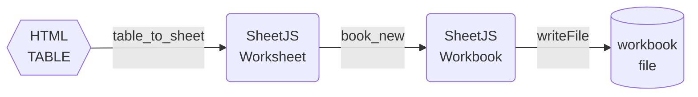
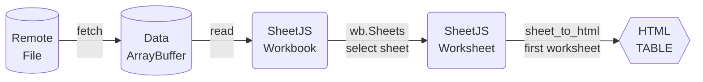

The utility functions in this section fall into two categories:

**Data Packaging**

The "Input" functions create SheetJS data structures (worksheets or workbooks)
from rows of data or other common JS data representations

These functions are paired with `write` or `writeFile` to create exports. For
example, the following diagram shows the steps to export an HTML TABLE to XLSX:



**Data Extraction**

The "Output" functions extract data from worksheets to friendlier structures.

These functions are paired with `read` or `readFile` to process data from files.
The following diagram shows the steps to generate an HTML TABLE from a URL:




## Array Output

**Generate rows of data from a worksheet**

```js
var arr = XLSX.utils.sheet_to_json(ws, opts);
```

[**This function is described in a dedicated page**](/docs/api/utilities/array#array-of-objects-input)

## Array of Arrays Input

**Create a worksheet from an array of arrays**

```js
var ws = XLSX.utils.aoa_to_sheet(aoa, opts);
```

**Add data from an array of arrays to an existing worksheet**

```js
XLSX.utils.sheet_add_aoa(ws, aoa, opts);
```

[**These functions are described in a dedicated page**](/docs/api/utilities/array#array-of-arrays-input)

## Array of Objects Input

**Create a worksheet from an array of objects**

```js
var ws = XLSX.utils.json_to_sheet(aoo, opts);
```

**Add data from an array of objects to an existing worksheet**

```js
XLSX.utils.sheet_add_json(ws, aoo, opts);
```

[**These functions are described in a dedicated page**](/docs/api/utilities/array#array-of-objects-input)

## HTML Table Input

**Create a worksheet or workbook from a TABLE element**

```js
var ws = XLSX.utils.table_to_sheet(elt, opts);
var wb = XLSX.utils.table_to_book(elt, opts);
```

**Add data from a TABLE element to an existing worksheet**

```js
XLSX.utils.sheet_add_dom(ws, elt, opts);
```

[**These functions are described in a dedicated page**](/docs/api/utilities/html#html-table-input)

## HTML Output

**Display worksheet data in a HTML table**

```js
var html = XLSX.utils.sheet_to_html(ws, opts);
```

[**This function are described in a dedicated page**](/docs/api/utilities/html#html-table-output)

## Delimiter-Separated Output

**Generate CSV from a Worksheet**

```js
var csv = XLSX.utils.sheet_to_csv(ws, opts);
```

**Export worksheet data in "UTF-16 Text" or Tab-Separated Values (TSV)**

```js
var txt = XLSX.utils.sheet_to_txt(ws, opts);
```

[**These functions are described in a dedicated page**](/docs/api/utilities/csv)

## Formulae Output

**Extract all formulae from a worksheet**

```js
var fmla_arr = XLSX.utils.sheet_to_formulae(ws);
```

[**This function is described in a dedicated page**](/docs/api/utilities/formulae)